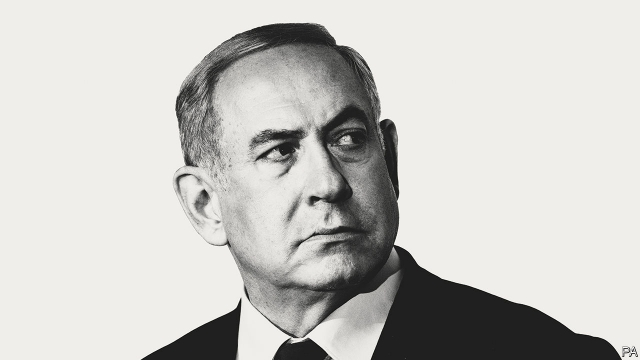

###### King Bibi

# Binyamin Netanyahu: a parable of modern populism 

##### In Israel, as elsewhere, politics is a perplexing mix of sound policy and the cynical erosion of institutions 

 

> Mar 30th 2019 

HIS DEVOTEES call him “The Magician”, “The Winner” and—the ultimate accolade—melekh yisrael, “King of Israel”. Binyamin Netanyahu is Israel’s most gifted politician in a generation. He is his country’s second-longest-serving prime minister and, if he wins his fifth election on April 9th, may beat the record of the country’s founding father, David Ben Gurion. 

“Bibi”, as he is known by all, is important beyond Israel, too, and not only because he speaks in perfect soundbites in both Hebrew and English and stands tall in today’s chaotic Middle East. He matters because he embodied the politics of muscular nationalism, chauvinism and the resentment of elites long before such populism became a global force. Mr Netanyahu counts among his friends and allies such nationalists as Donald Trump and Narendra Modi, not to mention European ones from Viktor Orban in Hungary to Matteo Salvini in Italy. 

The reign of King Bibi is thus a parable of modern politics: the rise of a talented politician and a long success based on a perplexing mixture of carrying out sound policy and cynically sowing division. As his power is threatened, he has turned to railing more loudly against the free press, the judiciary and shadowy forces. Now Bibi faces his greatest danger, in the form of criminal charges for corruption. In a different age he would have had to resign, and would now be defending himself as an ordinary citizen. But he is intent on remaining in office, and hopes that voters will yet save him from the policemen, prosecutors and judges. Israeli politics is turning into a contest between genuine achievement and demagoguery on one side and the rule of law on the other. All who care about democracy should watch closely. 

Little Israel commands attention because it has a big history: biblical romance and technological talent; the slaughter of the Holocaust and military prowess; energetic democracy and the long occupation of land claimed and inhabited by Palestinians. That said, Mr Netanyahu is a big figure in his own right (see article). He is more intelligent and capable than many populists, and can claim plenty of successes. By shrinking the bloated state he has helped Israel’s economy flourish, particularly its tech startups. With deft use of diplomacy and the mostly cautious use of military force, he has boosted security without being sucked into disastrous wars. Thanks to that and a shared hostility to Iran, relations with many Arab rulers are better than at any time in Israel’s history. 

Yet Mr Netanyahu is also worryingly dogmatic. He has paid lip service to peace with Palestinians but has taken no meaningful steps towards it. He has denounced any Western co-operation with Iran, even if it served to limit Iran’s nuclear programme. In Bibi’s pessimistic view, Israel is surrounded by wolves in sheep’s clothing and wolves in wolves’ clothing. Israel can only manage conflicts, not solve them, he believes, so it must rely on an iron wall and the passage of time. 

Such “anti-solutionism” risks storing trouble for the future. It increases the danger of war with Iran, or of its hardliners making a dash for nukes. The more Israel entrenches itself in the West Bank, the more its “temporary” military occupation looks like the permanent subjugation of Palestinians under a separate law, even apartheid. This is made worse by the absence of America’s restraining influence. Mr Netanyahu has warmly embraced Mr Trump, who in turn has showered him with gifts, most recently his endorsement of Israel’s annexation of the Golan Heights. Might Mr Trump also back Israel’s annexation of bits of the West Bank, so denying Palestinians the hope of statehood? In the long run Bibi’s overt alignment with America’s Republicans and the evangelical right endangers the bipartisan pro-Israeli consensus in Washington that is the foundation of Israel’s security. 

But the greatest threat from Bibi’s reign has been at home. He has kept power not just on the strength of his record but also by seeking political advantage at the cost of eroding Israel’s democratic norms. In claiming that no peace with Palestinians is possible (or desirable), members of his right-wing coalition outbid each other to pass measures asserting Jewish supremacy. Mr Netanyahu pushed for an electoral pact with the hitherto untouchable far-right Jewish Power group, which wants to annex all the occupied territories and “encourage” Arabs, including Israeli citizens, to leave. He has played us-and-them politics for so long that he has exacerbated the country’s many schisms—between Jews and Arabs, diaspora Jews and Israelis, western Ashkenazi and eastern Mizrahi Jews, and secular and religious ones. By casting himself as uniquely able to protect Israel against its enemies, he often treats those who say otherwise as wimps or traitors. 

Mr Netanyahu and his friends denounce as backstabbers any Jews who stand in their way. The free press peddles fake news. Political opponents, even the generals who pack the new Blue and White opposition party, are in cahoots with the Arabs. Bibi has flirted with the conspiracy theory beloved of anti-Semites that George Soros, a Jewish billionaire, is plotting to undermine nationalist governments around the world. 

The corruption charges against him, says Mr Netanyahu, amount to a “blood libel”—a vile medieval canard that accused Jews of mixing the blood of murdered Christian children in their Passover bread. Yet the police chief who investigated the charges, and the attorney-general who ordered his indictment, were both hand-picked by Mr Netanyahu. His allies want a law that would grant a prime minister immunity from prosecution. 

Israel is an outlier among Western democracies. It was born as the state of the Jews; Zionism and Palestinian nationalism claim the same land. Israel must contend with a genuine “other” and existential threats, not the bogeymen invented by populists elsewhere. The left, in disarray in many countries, suffered a body-blow in Israel because its attempt to negotiate a land-for-peace deal with Palestinians collapsed into bloodshed. 

Yet precisely because of these pressures, Israel offers an important test of the resilience of democracy. On April 9th Israeli voters face a fateful choice. Re-elect Mr Netanyahu and reward him for subverting the independence of Israel’s institutions. Or turf him out in the hope of rebuilding trust in democracy—and aspiring to be “a light unto the nations”. 

-- 

 单词注释:

1.bibi[]:n. 周笔畅 

2.binyamin[]:本雅明 

3.parable['pærәbl]:n. 寓言, 隐晦的比较 

4.Populism['pɒpjulizm]:n. 平民主义, 民粹主义 

5.Israel['izreil]:n. 以色列, 以色列后裔, 犹太人 

6.politic['pɒlitik]:a. 精明的, 明智的, 策略的 

7.perplex[pә'pleks]:vt. 使困惑, 使复杂化, 使为难 [法] 困惑, 使复杂化, 使纠缠不清 

8.cynical['sinikәl]:a. 愤世嫉俗的, 讽刺的, 冷嘲的 

9.erosion[i'rәuʒәn]:n. 腐蚀, 冲蚀, 侵蚀 [化] 磨耗; 侵蚀 

10.devotee[.devә'ti:]:n. 爱好者, 献身者, 虔诚的宗教信徒 

11.magician[mә'dʒiʃәn]:n. 魔术家, 幻术家, 术士 

12.Yisrael[]:[网络] 以色列；以色列人 

13.Netanyahu[]:n. 内塔尼亚胡（人名） 

14.david['deivid]:n. 大卫；戴维（男子名） 

15.ben[ben]:n. 内室 [医] 贝昂(俗名,一般指辣木Moringa oleifera,有时也指一些不同属的植物) 

16.gurion[]:n. (Gurion)人名；(以)古里安 

17.soundbite['saʊndbaɪt]:n. （通常指新闻节目中引自政客演讲的）简短引述, 原话片段 

18.Hebrew['hi:bru:]:n. 希伯来人, 希伯来语, 犹太人 a. 希伯来人的, 希伯来语的 

19.chaotic[kei'ɒtik]:a. 混乱的, 无秩序的 [法] 混乱的, 混沌的 

20.embody[im'bɒdi]:vt. 具体表达, 使具体化 [经] 合并, 具体化, 具体表现 

21.muscular['mʌskjulә]:a. 强壮的, 肌肉发达的, 有力的 [医] 肌的; 肌肉发达的 

22.nationalism['næʃәnәlizm]:n. 民族主义, 民族特性 

23.chauvinism['ʃәuvinizm]:n. 盲目的爱国主义, 沙文主义 [法] 沙文主义 

24.resentment[ri'zentmәnt]:n. 怨恨, 愤恨 

25.elite[ei'li:t]:n. 精华, 精锐, 中坚分子 

26.ally['ælai. ә'lai]:n. 同盟者, 同盟国, 助手 vt. 使联盟, 使联合, 使有关系 vi. 结盟 

27.nationalist['næʃәnәlist]:n. 国家主义者, 民族主义者 

28.narendra[]:[网络] 纳伦德拉；纳兰德；纳然陀 

29.MODI['mәudai]:[计] 模块化光学数字接口 

30.Viktor[]:维克托（人名） 

31.orban[]: [人名] 奥尔班 

32.Hungary['hʌŋgәri]:n. 匈牙利 

33.matteo[]:马泰奥（人名） 

34.salvini[]:[网络] 索氏丽体鱼；萨尔维尼 

35.talented['tælәntid]:a. 天资高的, 有才能的 

36.cynically[]:adv. 爱嘲笑地；冷笑地 

37.railing['reiliŋ]:n. 扶手, 栏杆, 抱怨 [电] 高重回率的雷达脉冲排挤 

38.judiciary[dʒu:'diʃiәri]:a. 司法的, 法院的, 法官的 n. 司法部, 司法系统, 法官 

39.shadowy['ʃædәui]:a. 有影的, 暗黑的, 朦胧的, 虚幻的 

40.corruption[kә'rʌpʃәn]:n. 腐败, 堕落, 贪污 [计] 论误 

41.intent[in'tent]:n. 意图, 含义, 故意 a. 专心的, 决心的, 热心的 

42.voter['vәutә]:n. 选民, 投票人 [法] 选民, 选举人, 投票人 

43.prosecutor['prɒsikju:tә]:n. 实行者, 告发者, 公诉人 [法] 原告, 起诉人, 检举人 

44.Israeli[iz'reili]:a. 以色列的, 以色列人(语)的 n. 以色列人 

45.demagoguery['demәgɒgәri]:n. 煽动, 煽动行为, 散布谣言 

46.biblical['biblikәl]:a. 圣经的 

47.romance[rәu'mæns]:n. 冒险故事, 浪漫史, 传奇文学 vi. 写传奇, 作空想, 虚构 

48.technological[.teknә'lɒdʒikl]:a. 技术的 [经] 工艺的, 技术的 

49.slaughter['slɒ:tә]:n. 残杀, 屠杀, 杀戮 vt. 残杀, 屠杀, 亏本出售 

50.holocaust['hɔlәkɔ:st]:n. 大屠杀, 大火灾, 毁灭, 大规模烧杀 

51.prowess['prauis]:n. 英勇, 勇敢, 超凡技术 

52.Palestinian[,pælis'tiniәn]:[经] 巴勒斯坦的 

53.Populist['pɔpjulist]:n. 民粹派的成员 

54.bloat[blәut]:vt. 使膨胀, 腌制, 使自大 vi. 膨胀, 肿起 n. 肿胀病人 

55.tech[tek]:n. 技术学院或学校 

56.startup[]:[计] 启动 

57.deft[deft]:a. 敏捷熟练的, 灵巧的 

58.diplomacy[di'plәumәsi]:n. 外交, 外交手腕, 交际手段 [法] 外交, 外交手腕, 权谋 

59.disastrous[di'zɑ:strәs]:a. 损失惨重的, 悲伤的 

60.hostility[hɒs'tiliti]:n. 敌意, 敌对, 反对 

61.Iran[i'rɑ:n]:n. 伊朗 

62.worryingly['wʌrɪɪŋlɪ]:adv. 焦虑地, 烦恼地 

63.dogmatic[dɒg'mætik]:a. 教条的, 武断的 

64.meaningful['mi:niŋful]:a. 意味深长的 

65.denounce[di'nauns]:vt. 告发, 抨击, 谴责 [法] 谴责, 斥责, 告发 

66.hardliner[ˌhɑ:d'laɪnə(r)]:n. 强硬路线者 

67.nuke[nju:k]:n. 核武器, 核电厂, 原子核 vt. 以核武器攻击, 把...打垮 a. 核武器的 

68.entrench[in'trentʃ]:vt. 围以壕沟, 防护, 保卫, 使处于牢固地位 vi. 掘壕, 侵犯 

69.subjugation[.sʌbdʒu'geiʃәn]:n. 征服, 镇压, 平息 [法] 征服, 镇压, 克制 

70.apartheid[ә'pɑ:theit]:n. 种族隔离 

71.warmly['wɒ:mli]:adv. 亲切地, 温暖地, 热心地 

72.endorsement[in'dɒ:smәnt]:n. 支持, 认可, 背书 [经] 背书, 担保, 保证 

73.annexation[ænek'seiʃәn]:n. 合并, 附加, 附加物 [法] 兼并, 侵吞, 附加物 

74.golan['^әj'lɑ:n]:Heights戈兰高地[叙利亚西南部](1967年被以色列占领) 

75.overt['әuvә:t]:a. 明显的, 公然的, 蓄意的 [法] 明显的, 公开的 

76.alignment[ә'lainmәnt]:n. 队列, 结盟, 校正 [计] 校准; 对齐; 对准 

77.evangelical[,i:væn'dʒelikәl]:a. 福音派教会的 n. 福音派信徒 

78.endanger[in'deindʒә]:vt. 危及 [法] 使危险, 危及 

79.bipartisan[bai,pɑ:ti'zæn]:a. 两党连立的 

80.Washington['wɒʃiŋtn]:n. 华盛顿 

81.erode[i'rәud]:vt. 腐蚀, 侵蚀 vi. 受腐蚀 

82.norm[nɒ:m]:n. 基准, 模范, 标准, 准则, 平均数 [化] 定额 

83.coalition[.kәuә'liʃәn]:n. 结合体, 结合, 联合 [经] 联合, 联盟 

84.outbid[.aut'bid]:vt. 出高于...的价钱 

85.assert[ә'sә:t]:vt. 主张, 坚称, 断言 [法] 宣称, 断言, 维护 

86.supremacy[sju'premәsi]:n. 至高无上, 霸权地位, 优势, 至上 [法] 至高权力, 无上权力, 霸权 

87.electoral[i'lektәrәl]:a. 选举人的, 选举的, (有关)选举的 [法] 选举的, 选举人的, 由选举人组成的 

88.pact[pækt]:n. 契约, 协定, 条约 [化] 合同 

89.hitherto[.hiðә'tu:]:adv. 迄今, 至今 

90.untouchable[ʌn'tʌtʃәbl]:a. 达不到的, 碰不着的, 管不到的, 不可批评的, 碰不得的, 不可捉摸的, 无形的 

91.annex[ә'neks]:n. 附加物, 附属建筑物 vt. 附加, 盖(印), 并吞 

92.exacerbate[ek'sæsәbeit]:vt. 使恶化, 使增剧, 激怒, 使加剧 

93.Jew[dʒu:]:n. 犹太人, 守财奴, 犹太教信徒 vt. 欺骗, 杀价 

94.Diaspora[dai'æspәrә]:n. 犹太人的离散, 离散的犹太人 

95.Israeli[iz'reili]:a. 以色列的, 以色列人(语)的 n. 以色列人 

96.Ashkenazi['æʃkə'næzi]:n. 德系犹太人 

97.mizrahi[]: [人名] 米兹拉希 

98.secular['sekjulә]:n. 修道院外的教士 a. 世俗的, 现世的, 长期的 

99.uniquely[]:adv. 独特地；珍奇地 

100.wimp[wimp]:n. 懦弱的人；无能的人 

101.backstabbers['bæk,stæbə]:n. 阴谋暗算他人者，背后中伤者 

102.peddle['pedl]:vi. 挑卖, 沿街叫卖, 游荡, 闲混 vt. 叫卖, 兜售, 散播 

103.fake[feik]:n. 假货, 欺骗, 诡计 a. 假的 vt. 假造, 仿造 vi. 伪装 

104.opposition[.ɒpә'ziʃәn]:n. 反对, 敌对, 相反, 在野党 [医] 对生, 对向, 反抗, 反对症 

105.cahoot[kә'hu:t]:n. 合谋, 同伙 

106.flirt[flә:t]:n. 卖弄风骚的人, 急动, 急扔 vt. 忽然弹出, 轻快摆动, 挥动 vi. 调情, 玩弄, 摆动, 轻率地对待 

107.conspiracy[kәn'spirәsi]:n. 同谋, 阴谋, 阴谋集团 [法] 阴谋, 通谋, 共谋 

108.george[dʒɔ:dʒ]:n. 乔治（男子名）；自动操纵装置；英国最高勋爵勋章上的圣乔治诛龙图 

109.Soros[]:n. 索罗斯（投资专家）；索罗斯基金 

110.billionaire[.biljә'nєә]:n. 亿万富翁 

111.undermine[.ʌndә'main]:vt. 在...下面挖, 渐渐破坏, 暗地里破坏 [法] 暗中破坏, 以阴谋中伤伤害 

112.vile[vail]:a. 恶劣的, 肮脏的, 低廉的, 卑鄙的 [法] 极坏的, 恶劣的, 卑鄙的 

113.medieval[.medi'i:vl]:a. 中古的, 中世纪的 

114.canard[kæ'nɑ:d]:n. 谣言, 误传 

115.Passover['pæs.әuvә]:n. 逾越节 

116.indictment[in'daitmәnt]:n. 起诉, 控告, 起诉状 [经] 起诉书 

117.immunity[i'mju:niti]:n. 免疫, 免疫性, 免除 [化] 免疫性 

118.prosecution[.prɒsi'kju:ʃәn]:n. 执行, 经营, 起诉 

119.outly[]:[网络] 欧特利 

120.Zionism['zaiәniz(ә)m]:n. 犹太复国主义 

121.Palestinian[,pælis'tiniәn]:[经] 巴勒斯坦的 

122.contend[kәn'tend]:vi. 奋斗, 斗争, 竞争 vt. 为...斗争 

123.existential[.egzis'tenʃәl]:a. 有关存在的 

124.bogeyman['bәj^imæn]:n. 可怕(或可憎)的人或物,妖怪,精灵 

125.disarray[.disә'rei]:vt. 弄乱, 使混乱, 使脱去衣服 n. 无秩序, 杂乱, 不整齐的衣着 

126.bloodshed['blʌdʃed]:n. 流血 

127.precisely[pri'saisli]:adv. 精确地, 明确地, 刻板地, 拘泥地, 正好, 恰恰, 对, 正是如此, 确实如此, 不错 

128.resilience[ri'ziliәns]:n. 弹回, 有弹力, 恢复力 [化] 回弹; 弹性; 弹回性; 回能; 弹能 

129.fateful['feitful]:a. 宿命的, 重大的, 决定性的 

130.subvert[sәb'vә:t]:vt. 推翻, 颠覆, 毁灭 [法] 颠覆, 推翻, 减亡 

131.turf[tә:f]:n. 草皮, 泥炭, 跑马场 vt. 覆草皮于 

132.aspire[ә'spaiә]:vi. 渴望, 立志于 

133.unto['ʌntu, 'ʌntә, 'ʌntu:]:prep. 到, 对, 直到 

