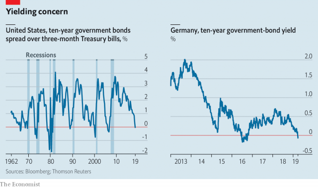

###### Inversions and aversions

# Europe’s economy is more worrying than America’s yield-curve inversion 

##### Bond markets are sounding warnings on both sides of the Atlantic. But the message is much worse in Europe 

 

> Mar 28th 2019 

ON MARCH 22ND  Germany’s worst manufacturing survey in seven years sent investors rushing to buy bonds. For the first time in three years yields on German ten-year government debt fell below zero, meaning that investors are willing to pay to hold it. And later that day in America the yield on ten-year Treasury bonds fell beneath that on the three-month variety. The last time that happened was 2007, one of the “inversions” in bond-market yields that preceded each of the past seven American recessions. 

These bond-market blues are fuelling concern that the global upswing in 2017 and 2018 is making way for a slump. There are reasons to worry. Tax cuts have boosted demand in America but will not be repeated; China has slowed; the trade war grinds on. However, indiscriminate global gloom is a mistake. America and Europe are in vastly different positions. Only Europe should be a cause of deep concern. 

America’s inverted yield curve suggests that the Federal Reserve’s interest-rate rise in December, its ninth in three years, will be its last for now. But that does not mean recession is imminent. The Fed has recognised—belatedly—that the risks to growth have risen, as Jerome Powell, its chairman, confirmed on March 20th. And America is in a position of relative strength. Unemployment is low; consumers are flush with cash; and underlying inflation is close to the Fed’s 2% target (see article). 

Europe is in a tighter spot. Although America may have finished raising rates, the euro zone has never got started. Growth this year could be little more than 1%. Wage growth is muted, inflation is below target and Italy is in recession. With rates close to zero, the response of the European Central Bank (ECB) has been to postpone monetary tightening and to provide more cheap funding for banks. Its willingness to do more may be limited. On March 27th Mario Draghi, its head, said that the ECB sees its inflation forecast as having been “delayed rather than derailed”. 

The primary cause of Europe’s slowdown—and particularly Germany’s—is falling global trade, notably China’s slackening demand for goods. The continent relies on Asian markets far more than America does and China slowed in late 2018. Policymakers there are now trying to stimulate the economy. A rebounding China could yet come to Europe’s rescue, especially if Donald Trump and Xi Jinping strike a trade deal. 

That the fate of the euro zone should depend on Beijing and Washington is a dereliction of duty. It is an economic superpower with its own fiscal and monetary levers. It should be countering downturns itself. More unconventional monetary stimulus will be hard thanks to northern Europe’s horror of appearing to create money to finance deficits. But the euro zone has room for fiscal stimulus. Its aggregate budget deficit was just 0.6% of GDP in 2018. Its net public debt was 69% of GDP. 

Because Europe lacks a centralised fiscal policy—itself a failure of politicians—the onus is on individual countries. Those with healthy finances, such as Germany and the Netherlands, could enact a co-ordinated budgetary loosening. They should focus on tax cuts and boosting public-sector infrastructure and defence spending. Unless they do, the euro zone risks falling back into stagnation—the trap it faced after the financial crisis. For the euro zone to tolerate that risk in the name of prudence is self-defeating. Astonishingly, the chances are that it will. 

-- 

 单词注释:

1.inversion[in'vә:ʃәn]:n. 倒转, 倒置, 倒装 [化] 反转; 倒反; 反演; 转化 

2.aversion[ә'vә:ʃәn]:n. 厌恶, 讨厌的事, 讨厌的人 [医] 厌恶, 移转, 移位 

3.manufacturing[.mænju'fæktʃәriŋ]:n. 制造业 a. 制造业的 

4.investor[in'vestә]:n. 投资者 [经] 投资者 

5.treasury['treʒәri]:n. 国库, 宝库, 财政部, 国库券 [经] 库存, 国库, 金库 

6.precede[.pri:'si:d]:vt. 在...之前, 优于, 较...优先 vi. 在前面 

7.recession[ri'seʃәn]:n. 后退, 凹处, 衰退, 归还 [医] 退缩 

8.upswing['ʌpswiŋ]:n. 回升时期, 上升, 向上摆动, 跃进 [经] 上升, 向上摆动 

9.slump[slʌmp]:n. 暴跌, 垂头弯腰的姿态 vi. 猛然掉落, 陷入, 衰落(经济等) 

10.indiscriminate[.indis'kriminit]:a. 无差别的, 任意的, 杂乱的 [医] 无差别的, 普遍的 

11.gloom[glu:m]:n. 忧郁, 暗处, 幽暗 vi. 变忧沉, 变黑暗 vt. 使忧郁, 使黑暗 

12.vastly['vɑ:stli]:adv. 广大地, 许多, 巨大 

13.invert[in'vә:t]:a. 转化的 vt. 使反转, 使颠倒, 使转化 n. 颠倒的事物 [计] 倒置; 反转 

14.imminent['iminәnt]:a. 即将来临的, 逼近的 

15.jerome[dʒә'rәum]:n. 杰罗姆（男子名） 

16.powell['pәuәl, 'pauәl]:n. 鲍威尔（英国物理学家） 

17.underlie[.ʌndә'lai]:vt. 位于...之下, 成为...的基础 

18.inflation[in'fleiʃәn]:n. 胀大, 夸张, 通货膨胀 [化] 充气吹胀; 膨胀 

19.euro['juәrәu]:n. 欧元（欧盟的统一货币单位） 

20.ECB[]:[计] 事件控制块 

21.monetary['mʌnitәri]:a. 货币的, 金钱的 [经] 货币的, 金融的 

22.tighten['taitn]:vt. 勒紧, 使变紧 vi. 变紧, 绷紧 

23.mario['mæriәj, 'mɑ:-]:n. 马里奥（男子名） 

24.Draghi[]:[网络] 行长德拉吉；总裁德拉吉；欧洲央行德拉吉 

25.derail[di'reil]:vt. 使出轨 n. 脱轨器 [计] 转移指令 

26.notably['nәjtbәli]:adv. 显著地, 著名地, 尤其, 特别 

27.slacken['slækәn]:vt. 使松弛, 放松, 放慢 vi. 变松弛, 减弱, 松劲 

28.policymaker['pɔlisi.meikә]:n. 政策制定者；决策人 

29.rebound[ri'baund]:vi. 弹回, 返回, 产生事与愿违的结果 vt. 使弹回, 使返回 n. 反弹, 返回, 篮板球, 振作 rebind的过去式和过去分词 

30.Washington['wɒʃiŋtn]:n. 华盛顿 

31.dereliction[.deri'likʃәn]:n. 玩忽职守, 抛弃物 [法] 抛弃, 遗弃, 放弃 

32.superpower[.sju:pә'pauә]:n. 超级强权, 超级大国 [经] 超级大国 

33.fiscal['fiskәl]:a. 财政的, 国库的 [经] 财政上的, 会计的, 国库的 

34.downturn['dauntә:n]:n. (尤指经济方面的)衰退, 下降趋势 [电] 低迷时期 

35.unconventional[.ʌnkәn'venʃәnl]:a. 不依惯例的, 非传统的, 非常规的 

36.stimulus['stimjulәs]:n. 刺激, 激励, 刺激品 [医] 刺激特, 刺激 

37.deficit['defisit]:n. 赤字, 不足额 [医] 短缺 

38.aggregate['ægrigәt]:n. 合计, 总计, 聚集体 a. 合计的, 聚集的 v. 聚集, 集合, 合计达 [计] 聚合体; 聚集 

39.centralise['sentrәlɑiz]:vt. 形成中心, 把统治权集中于中央, 把...集中起来, 成为...的中心, 集中 

40.onus['әunәs]:n. 负担, 责任, 义务, 过失, 耻辱 [法] 责任, 义务, 负担 

41.Netherlands['neðәlәndz]:n. 荷兰 

42.enact[i'nækt]:vt. 制定法律, 扮演, 颁布 [法] 法令, 法规, 条例 

43.budgetary['bʌdʒitәri]:a. 预算的 [法] 预算的 

44.infrastructure['infrәstrʌktʃә]:n. 基础结构, 基础设施 [经] 基础设施 

45.prudence['pru:dns]:n. 审慎, 慎重, 精明, 节俭 

46.astonishingly[ə'stɔniʃiŋli]:adv. 令人惊讶地 

