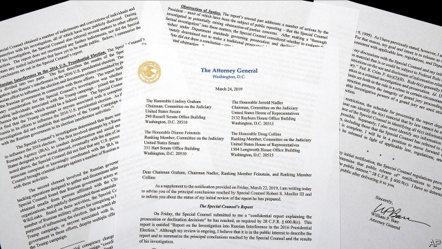

###### Trump resurgent

# Lessons of the Mueller report 

##### Every political scandal sets a precedent for the next 

 

> Mar 28th 2019 

ROBERT MUELLER toiled over his report for two years, slightly longer than it took Herman Melville to write “Moby Dick”. Going by a summary provided by the attorney-general, though, the endings are the same: the whale gets away. The special counsel did not find that members of the Trump campaign conspired with the Russian government when it interfered in the 2016 election. The president is crowing. Democrats in Congress point out that Mr Mueller did not exonerate the president over obstruction of justice, which is also true. But make no mistake: this is as good an outcome as Donald Trump could have wished for. 

For the rest of his first term, and perhaps long into his second, he will be able to point to an exhaustive investigation and say he was right all along. The president thrives on grievance—against the media, the federal bureaucracy, or anyone he suspects of feeling superior. The outcome of the Mueller report will feed that. As a result, the silver harpoon that some Americans hoped would finish off Mr Trump may in fact strengthen him. 

A few lessons can be drawn from this episode. The first is not to confuse a legal process with a political one. Ever since Mr Trump won power, those Americans who could not bear the idea of him as president have dreamed of some non-political way to erase the result—of a jurist who could simply declare it all over. Mr Mueller seemed the likeliest candidate for this role, just as Kenneth Starr did in the campaign to remove Bill Clinton. 

In fact the fate of Mr Trump’s presidency will depend on politics, probably through the ballot box in 2020. Even those Democrats who cling to the fantasy of using Congress to impeach and remove him need to understand just how political this process would be. The fevered speculation during the two years of the Mueller investigation has often masked that. 

The other lesson Democrats should heed is to keep quiet about a legal process until it is over. That is worth bearing in mind as House committees under Democratic control pursue their own investigations, and courts and prosecutors look into allegations about Mr Trump and his family. Some of his opponents have prejudged these investigations. If it turns out that he did not commit the crimes they expect, they risk not just having distracted voters from the real agenda, but also giving him a boost. They should not make the same mistake twice. 

The Mueller investigation also holds lessons for those Republicans emboldened to seek vengeance for what they say was treason against their president. Thanks to Mr Mueller, the president’s campaign manager and personal lawyer are both heading to prison. His national security adviser pleaded guilty to lying to the FBI about his conversations with the Russian ambassador. Since Watergate, nothing like this has happened in American politics. By revealing duplicitous and corrupt behaviour among Mr Trump’s team, and by bringing prosecutions, Mr Mueller has helped cleanse political campaigning. 

The investigation also revealed that the president misled voters about his business interests in Russia. While the candidate was rewriting orthodox Republican Party policy towards Vladimir Putin, his company was trying to build a skyscraper in Moscow. His retrospective justification was that he might have lost the election, in which case it would have been a shame to give up on a deal. This conflict of interest did not amount to criminal collusion or conspiracy, in the special counsel’s view. It is nevertheless the sort of transgression that America’s political system would not have tolerated before Mr Trump came along. 

There is a last reason to be thankful to Mr Mueller. Each time America’s political system goes through an upheaval, it sets a precedent for how its institutions will handle the next one. Mr Mueller’s conduct was exemplary. If widespread misconduct once again occurs in an American presidential election, the expectation will be that a special counsel will investigate. Though Mr Trump repeatedly denounced the investigation as a witch-hunt, he did not fire the witch-finder. Mr Mueller was able to finish his work. For that, at least, Mr Trump deserves credit. 

-- 

 单词注释:

1.resurgent[ri'sә:dʒәnt]:a. 复生的, 复活的 n. 复活者 

2.Mueller[]:米勒（人名） 

3.precedent['presidәnt]:n. 先例, 前例 a. 在先的, 在前的 

4.Robert['rɔbәt]:[法] 警察 

5.Mueller[]:米勒（人名） 

6.toil[tɒil]:n. 辛苦, 苦工, 网, 罗网, 圈套 vi. 苦干, 跋涉 

7.herman['hә:mәn]:n. 赫尔曼（男子名） 

8.melville['melvil]:n. 梅尔维尔（男子名）；梅尔维尔湖（位于加拿大东部） 

9.moby['mɔbi]:a. 大的, 巨大的 

10.dick[dik]:n. 家伙, 词典, 誓言(书) [医] 二氯乙胂(毒气) 

11.counsel['kaunsәl]:n. 商议, 忠告, 法律顾问 v. 商议, 劝告 

12.conspire[kәn'spaiә]:vi. 阴谋, 协力, 共谋 vt. 图谋 

13.democrat['demәkræt]:n. 民主人士, 民主主义者, 民主党党员 [经] 民主党 

14.exonerate[ig'zɒnәreit]:vt. 免除, 证明无罪 [法] 解放, 开释, 免罪 

15.obstruction[әb'strʌʃәn]:n. 障碍, 妨碍, 闭塞物 [医] 梗阻, 不通 

16.exhaustive[ig'zɒ:stiv]:a. 消耗的, 枯竭的, 彻底的, 详尽的 

17.bureaucracy[bjuә'rɒkrәsi]:n. 官僚, 官吏 [法] 官僚主义, 官僚政治, 官僚机构 

18.harpoon[hɑ:'pu:n]:n. 鱼叉 vt. 用鱼叉叉, 用鱼叉捕获 

19.erase[i'reis]:vt. 抹去, 擦掉 [计] 清洗; 擦除; 抹除; DOS内部命令:从磁盘上删除一个或多个文件 

20.jurist['dʒuәrist]:n. 法学家, 法律学者, 法律著作家 [法] 法学家, 律师, 法官 

21.kenneth[]:n. 肯尼思（男子名）；[古]英俊的领导者 

22.starr[]:n. 斯塔尔（姓氏） 

23.clinton['klintәn]:n. 克林顿（男子名） 

24.presidency['prezidәnsi]:n. 总统职权, 总裁职位 

25.politic['pɒlitik]:a. 精明的, 明智的, 策略的 

26.ballot['bælәt]:n. 投票, 投票用纸, 抽签 vi. 投票, 抽签 vt. 投票选出, 拉选票 

27.cling[kliŋ]:vi. 粘紧, 附着, 紧贴, 坚持 

28.impeach[im'pi:tʃ]:vt. 控告, 怀疑, 检举, 弹劾 [法] 控告, 检举, 弹劾 

29.speculation[.spekju'leiʃәn]:n. 沉思, 推测, 投机 [经] 投机交易, 买空卖空 

30.heed[hi:d]:n. 注意, 留心 v. 注意, 留心 

31.prosecutor['prɒsikju:tә]:n. 实行者, 告发者, 公诉人 [法] 原告, 起诉人, 检举人 

32.allegation[.æli'geiʃәn]:n. 断言, 主张, 申辩 [法] 声明, 事实陈述, 断言 

33.prejudge[pri:'dʒʌdʒ]:vt. 预先判断, 对...预先作出判决 

34.distract[dis'trækt]:vt. 转移, 分心, 使发狂 

35.voter['vәutә]:n. 选民, 投票人 [法] 选民, 选举人, 投票人 

36.embolden[im'bәuldn]:vt. 使大胆, 使有胆量 

37.vengeance['vendʒәns]:n. 复仇, 报仇 [法] 报仇, 复仇 

38.adviser[әd'vaizә]:n. 顾问, 劝告者, 指导教师 [法] 顾问, 劝告者 

39.plead[pli:d]:vi. 辩护, 恳求 vt. 为...辩护, 提出...借口, 托称, 恳求 

40.FBI[]:美国联邦调查局 [经] 美国联邦调查局 

41.watergate['wɔ:tәɡeit. 'wɔ-]:n. 水门, 水闸；水门事件 

42.duplicitous[dju:'plisitәs]:a. 奸诈的；双重的；搞两面派的 

43.prosecution[.prɒsi'kju:ʃәn]:n. 执行, 经营, 起诉 

44.cleanse[klenz]:vt. 使清洁, 净化, 使纯净 [建] 纯化, 净化, 精炼 

45.rewrit[]:[网络] 重写 

46.orthodox['ɒ:θәdɒks]:a. 正统的, 传统的, 惯常的 

47.Vladimir[vlɑ'dimɪr]:n. 弗拉基米尔（古罗斯弗拉基米尔-苏兹达里公国的古都） 

48.putin['putin]:n. 普京（人名） 

49.retrospective[.retrә'spektiv]:a. 回顾的, 怀旧的, 在后面的 n. 回顾展 

50.justification[.dʒʌstifi'keiʃәn]:n. 辩护, 证明正当, 释罪 [计] 调整 

51.collusion[kә'lu:ʃәn]:n. 共谋, 勾结 [经] 勾结, 串通, 串同舞弊 

52.conspiracy[kәn'spirәsi]:n. 同谋, 阴谋, 阴谋集团 [法] 阴谋, 通谋, 共谋 

53.transgression[træns'greʃәn]:n. 违反, 犯罪 [医] 亲和转移 

54.upheaval[ʌp'hi:vl]:n. 举起, 隆起, 大变动, 剧变 

55.exemplary[ig'zemplәri]:a. 可仿效的, 可做模范的, 惩戒性的, 示范的 [法] 惩罚性的, 警戒性的, 示范的 

56.misconduct[.mis'kɒndʌkt]:vt. 办错, 使行为不端 n. 办错, 渎职, 通奸 

57.presidential[.prezi'denʃәl]:a. 总统制的, 总统的, 首长的, 统辖的 [法] 总统的, 议长的, 总经理的 

58.denounce[di'nauns]:vt. 告发, 抨击, 谴责 [法] 谴责, 斥责, 告发 

