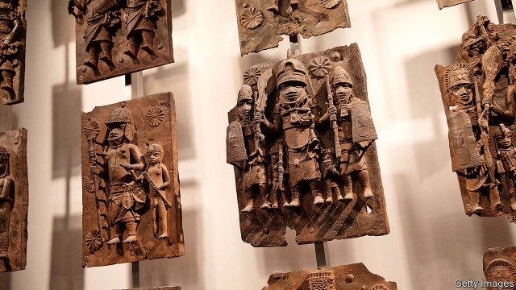

###### Culture vultures

# The moral maze of museum management 

##### The case for giving back stolen art is strong. For refusing tainted donations, less so 

 

> Mar 28th 2019 

IT DIDN’T TAKE much. A theatrical “die-in” at the New York Guggenheim Museum in February; a threat by Nan Goldin, a photographer, to pull her works from the National Portrait Gallery in London; a warning of unspecified “guerrilla actions” against British museums. Since mid-March the Guggenheim, the National Portrait Gallery and the Tate galleries have all cracked. None will accept future gifts from the Sackler family, prolific philanthropists who own Purdue Pharma, a firm that created an opioid, OxyContin, and claimed it was not terribly addictive. 

So Western museums will be a little poorer. They might also have less stuff to show, if another sort of campaign prevails. In November a report commissioned by Emmanuel Macron, France’s president, argued that museums should hand back to former colonies artworks that were acquired by force or “through inequitable conditions”. Since colonialism was inequitable, that implies France should hand back almost everything (see International section). 

To museums and their defenders, this is all silly—a thoughtless attack on cultural temples by a generation too easily outraged. But the campaigns ought to be distinguished from each other. The arguments for returning art acquired in dodgy ways are stronger than the arguments for giving back money. 

To take an egregious example of looted art, the Benin bronzes were stolen from a royal palace in what is now Nigeria during a punitive British expedition in 1897, then flogged off to finance the raid. They ended up in European and American museums. Because the raid cannot possibly be defended, and because the bronzes would make more sense as a group, they should go back. 

Some will argue that returned objects are likely to be poorly preserved, stolen or smashed by jihadists, as has sometimes happened. Besides, if you start giving things back, where do you stop? The first is a worry. The risk can be minimised, though not eradicated, by making copies and by returning objects only to reasonably stable countries. Nigeria just about qualifies. The Democratic Republic of Congo does not. 

The second argument is flawed. It is already accepted that recently stolen objects ought to be returned, as when, in February, the Metropolitan Museum of Art in New York relinquished to Egypt a gilded coffin that turned out to have been looted in 2011. It has become accepted that art taken from Jews by the Nazis should be returned to their descendants. This shows that a line between the intolerable and the just about tolerable, between the past and the distant past can be drawn—and moved—without a free-for-all in which vast amounts of art are suddenly up for grabs. Objects demonstrably stolen in the colonial era belong on the intolerable side of the line, and should be returned. 

The campaigns against tainted philanthropy are weaker, however. If money was legally earned, museums should in most cases feel free to accept it. Does it benefit humanity more to return a sack of cash to the Sacklers, or to spend it on bringing culture to multitudes? Museums should not accept stolen money, of course. And if they decide that the reputational risk of taking a particular donation is not worth it, fine. But they should remember that controversies can be fleeting, and that their successors may curse them for their squeamishness. 

Those who decry the laundering of corporate reputations through charity forget something: it does not work well. All their good works did not prevent Andrew Carnegie and John D. Rockefeller from being remembered as robber barons. The Sacklers are a target for protests partly because the family name appears on so many buildings, not in spite of that. So suspicious do big donors seem that Henry Tate, a sugar baron who established the London museum, is sometimes said to have profited from slavery, though he did not. (Indeed, he was an unusually kindly employer.) People give to museums in the hope that they will be remembered well. All they really achieve is to be remembered. 

-- 

 单词注释:

1.vulture['vʌltʃә]:n. 秃鹫, 贪婪的人 [法] 贪婪而残酷者, 劫掠成性者 

2.maze[meiz]:n. 迷宫, 迷惘 vt. 使迷惘, 使混乱, 迷失 

3.taint[teint]:n. 污点, 耻辱, 感染 vt. 污染, 使腐败, 沾染, 腐蚀 

4.donation[dәu'neiʃәn]:n. 捐赠物, 捐款, 捐赠 [经] 赠品, 捐款, 捐赠 

5.les[lei]:abbr. 发射脱离系统（Launch Escape System） 

6.theatrical[θi'ætrikl]:a. 剧场的, 夸张的, 戏剧性的 n. 戏剧演出 

7.york[jɔ:k]:n. 约克郡；约克王朝 

8.Guggenheim['^j^әnhaim]:n. <口> = Guggenheim fellowship 

9.nan[næn]:n. 奶奶（小孩儿语）；印度, 巴基斯坦式的微微发酵的面包 

10.goldin[]: [人名] 戈尔丁 

11.unspecified['ʌn'spesifaid]:a. 未特别指出的, 未特别提到的 

12.guerrilla[gә'rilә]:n. 游击队 

13.tate[teit]:n. 塔特（姓氏） 

14.sackler[]: [人名] 萨克勒 

15.prolific[prәu'lifik]:a. 有生殖力的, 多产的, 丰富的 [医] 多育的, 多产的, 繁殖的 

16.philanthropist[fi'lænθrәpist]:n. 慈善家, 博爱主义者, 乐善好施的人 [法] 慈善家, 博爱主义者 

17.purdue[]:n. 普杜大学（美国一所大学） 

18.pharma[]:n. 制药公司 

19.opioid[əʊ'pi:əʊɪd]:a. 类鸦片（引起）的 n. 类鸦片活性肽 

20.oxycontin[]: [医]盐酸羟考酮控释片剂<镇痛药> 

21.terribly['terәbli]:adv. 可怕地, 甚为, 非常 

22.addictive[ә'diktiv]:a. 上瘾的 

23.emmanuel[i'mænjuәl]:n. 以马内利（耶稣基督的别称）；伊曼纽尔（男子名, 等于Immanuel） 

24.macron['mækrәn]:n. 长音符号 

25.artwork['ɑ:twә:k]:n. 插图, 艺术作品 [计] 原图 

26.inequitable[in'ekwitәbl]:a. 不公平的, 不公正的 [法] 不公正的, 不公平的, 偏私的 

27.colonialism[kә'lәunjәlizm]:n. 殖民主义 

28.defender[di'fendә]:n. 防卫者, 防护者, 辩护者 [法] 辩护人, 保护人 

29.thoughtless['θɒ:tlis]:a. 欠考虑的, 无深虑的, 轻率的 

30.cultural['kʌltʃәrәl]:a. 文化的, 教养的, 修养的 [医] 培养的 

31.outrage['autreidʒ]:n. 暴行, 侮辱, 愤怒 vt. 凌辱, 虐待, 触犯 

32.dodgy['dɒdʒi]:a. 狡猾的, 逃避的, 难弄的 

33.egregious[i'gri:dʒiәs]:a. 异乎寻常的, 过分的, 惊人的 

34.loot[lu:t]:n. 赃物, 洗劫, 抢夺 v. 洗劫, 抢夺 

35.Benin[be'nin]:贝宁湾(几内亚湾一部分,靠西非的尼日利亚、贝宁和多哥等国) 

36.Nigeria[nai'dʒiriә]:n. 尼日利亚 

37.punitive['pju:nitiv]:a. 刑罚的, 惩罚性的 [法] 刑罚的, 惩罚性的, 结予惩处的 

38.expedition[.ekspi'diʃәn]:n. 远征, 探险队, 迅速 

39.flog[flɒg]:vt. 鞭打, 鞭策, 严厉的批评, 迫使 

40.cannot['kænɒt]:aux. 无法, 不能 

41.poorly['puәli]:adv. 贫穷地, 不充分地, 贫乏地 a. 身体不舒服的 

42.jihadist[]:n. 伊斯兰圣战士 

43.minimise[]:vt. 使减到最少/最小, 使降到最低限度, 使缩到最小, 极度轻视 

44.eradicate[i'rædikeit]:vt. 根除, 扑灭, 根绝, 消灭 

45.reasonably['ri:znәbli]:adv. 适度地, 相当地 

46.Congo['kɔŋ^әu]:n. 刚果, 刚果河, 工夫茶 [建] 刚果, 直接刚果红 

47.flaw[flɒ:]:n. 缺点, 裂纹, 瑕疵, 一阵狂风 [化] 划痕; 裂缝; 裂纹 

48.metropolitan[.metrә'pɒlitn]:n. 大都市居民, 都主教, 宗主国的公民 a. 大都市的, 都主教区的, 宗主国的 

49.relinquish[ri'liŋkwiʃ]:vt. 放弃, 撤回, 停止, 松开, 让与 [法] 让与, 把...交给, 放弃 

50.Egypt['i:dʒipt]:n. 埃及 

51.gild[gild]:vt. 镀金, 虚饰, 装饰, 供给钱 

52.coffin['kɒfin]:n. 棺材, 灵柩 vt. 把...装进棺材 

53.Jew[dʒu:]:n. 犹太人, 守财奴, 犹太教信徒 vt. 欺骗, 杀价 

54.Nazi['nɑ:tsi]:n. 纳粹党人 a. 纳粹党的 

55.descendant[di'sendәnt]:n. 后裔, 子孙 a. 传下的, 下降的 

56.intolerable[in'tɒlәrәbl]:a. 无法忍受的, 难耐的 

57.tolerable['tɒlәrәbl]:a. 可容忍的, 可以的 

58.grab[græb]:n. 抓握, 掠夺, 强占, 东方沿岸帆船 vi. 抓取, 抢去 vt. 攫取, 捕获, 霸占 

59.demonstrably['demәnstrәbli]:adv. 可论证地, 明确地, 凭论证 

60.colonial[kә'lәunjәl]:a. 殖民的, 殖民地的 [法] 殖民地居民 

61.philanthropy[fi'lænθrәpi]:n. 慈善, 仁慈, 博爱, 慈善事业, 慈善机构(团体) 

62.legally['li:gәli]:adv. 法律上, 合法地 [法] 法律上, 合法地, 法定地 

63.humanity[hju:'mæniti]:n. 人性, 人类, 博爱 

64.sackler[]: [人名] 萨克勒 

65.reputational[,repju'teiʃən]:a. reputation（名声, 声誉）的变形 

66.controversy['kɒntrәvә:si]:n. 论争, 辩论, 论战, 争论 [法] 论战, 争论, 争吵 

67.successor[sәk'sesә]:n. 继承者, 接任者 [计] 后继 

68.squeamishness[]:n. squeamish的变形 

69.decry[di'krai]:vt. 反对, 责难, 诽谤, 诋毁 

70.launder['lɒ:ndә]:n. 流水槽 v. 洗衣, 烫衣 

71.corporate['kɒ:pәrit]:a. 社团的, 合伙的, 公司的 [经] 团体的, 法人的, 社团的 

72.andrew['ændru:]:n. 安德鲁（男子名） 

73.carnegie[kɑ:'ne^i]:n. 卡内基（姓氏） 

74.john[dʒɔn]:n. 盥洗室, 厕所, 嫖客 

75.Rockefeller['rɔkifelә]:洛克菲勒(姓氏) 

76.baron['bærәn]:n. 男爵 [法] 男爵, 贵族, 大王 

77.donor['dәunә]:n. 捐赠人 [化] 给体; 供体 

78.henry['henri]:n. 亨利 [医] 亨[利](电感应单位) 

79.kindly['kaindli]:a. 和蔼的, 温和的, 爽快的 adv. 温和地, 亲切地 

