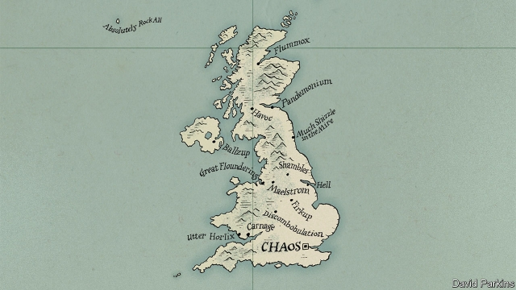

###### The Silly Isles

# The trouble with Theresa May’s promise to resign 

##### It does nothing to solve Britain’s Brexit mess 

 

> Mar 28th 2019 

THERESA MAY was supposed to be leading Britain out of the European Union this week. Instead, Britain stayed put and the prime minister found herself announcing her own departure. After weathering months of criticism over her handling of the Brexit negotiations, in which Britain was last week forced to ask for an extension of the March 29th deadline, Mrs May surrendered to calls for her to say that she would quit. She promised her Conservative MPs she would step down if Britain formally left the EU, handing the next, crucial phase of negotiations, on Britain’s future relationship with the continent, to her successor. 

After weeks of chaos, the past few days’ developments might make it look as if Britain is at last feeling its way towards a solution to its crisis. Mrs May’s supreme sacrifice is designed to persuade her rebellious Tory MPs to vote for her unpopular Brexit deal. More promisingly, Parliament is working on a backup plan of its own, beginning this week with a series of votes designed to winkle out what kind of Brexit deal could command a majority if Mrs May’s fails (see article). 

Yet in reality the prime minister’s promised departure does nothing to resolve the disagreements that are preventing Britain from settling on an exit deal. It may even exacerbate them. 

Mrs May’s announcement came after weeks of arm-twisting. A prime minister who two years ago looked almost invincible has been slowly bled dry of authority, starting with her calamitous loss of the Tories’ majority in 2017 in an election which they had been fancied to win with a landslide (see article). Her unpopular Brexit deal has twice been defeated in Parliament by record and near-record margins. She has no domestic achievements to speak of. And she is barely in control of her cabinet, let alone her party. Mrs May was dealt a bad hand in Brexit; she has played it extraordinarily badly. 

Such is the mess Britain finds itself in that even jettisoning a powerless prime minister is not really a step forward. Despite her offer, a last desperate plea for the backing of Tory rebels, her deal remains unchanged and unloved. There is a faint chance that this kamikaze gesture could succeed. Some hardline Brexiteers, including Boris Johnson and Jacob Rees-Mogg, who have long rubbished Mrs May’s deal, now see that the most likely alternative is something cooked up by Parliament which would keep Britain closer to the EU. Her promise to resign gives them an excuse to make their screeching U-turn. But the odds remain against her even now. The ten MPs of the Northern Irish Democratic Unionist Party along with dozens of “Spartan” Tory Brexiteers are doggedly holding out. There is a limit to the number of times Mrs May can be defeated on her deal before it dies. 

A more fundamental reason Mrs May’s offer does not solve Brexit is that it leaves Parliament’s divisions as wide as ever. Even if enough MPs were willing to hold their nose and vote for her deal, this would not be because they suddenly agreed on the way forward, but because each faction believed that, after Mrs May goes, it would have a chance to wrench away control of the next stage of the negotiations. Diehard Brexiteers dream of one of their own at last calling the shots in Brussels and showing the world how to out-negotiate the EU. Pro-Europeans, licking their wounds, would strive to salvage a soft Brexit. Both Leavers and Remainers still think they have a chance of winning if they push hard enough, and the removal of Mrs May the fence-straddler would only confirm their conviction. It is a fantasy that risks taking Britain back to square one of its debate on Brexit’s trade-offs. 

This week’s most promising news is that Parliament has begun the search for a way out of this delusion. After dramatically seizing control of the Commons agenda, Parliament has begun debating the various realistic Brexit options before holding votes on them. After two years indulging in all kinds of fantasies about what life outside the EU would be like—“no downside…only a considerable upside”, as the first of Britain’s three Brexit secretaries fatuously put it—Parliament has started to reconcile itself to Brexit’s harsh trade-offs. Restricting immigration from Europe means leaving the single market; regulatory divergence necessarily erects barriers to trade; maintaining open borders in Northern Ireland precludes an independent trade policy. This week’s indicative votes offer a way to find a compromise deal that has the genuine consent of MPs. It is a rebuke to Mrs May, who might be in a better position today had she sounded out opinion before the Brexit negotiations began. 

None of the votes this week produced a clear majority—despite a second attempt next week, they may never do so. But do not write them off just yet. A large number of MPs looked favourably on the idea that any deal approved by Parliament should be put to a confirmatory referendum. And a proposal for a customs union fell only eight votes short. The trouble is that, if she hangs on because her deal has not been passed, as Downing Street suggests, Mrs May could well stand in the way of a Brexit produced in Parliament. Yet, if she goes, a new prime minister might not feel bound by it at all. 

And that leads to the last reason Mrs May’s offer could complicate Brexit: the dubious mandate of her successor. A freshly installed leader will probably want to set his or her own course, rather than take orders from MPs. The new prime minister will have been selected by the 120,000 members of the Conservative Party, who are whiter, older and richer and much keener on a hard Brexit than the divided country that elects Parliament. The new leader’s mandate would not reflect the 17.4m who voted to leave, let alone the 16.1m Remainers. Why should Parliament suddenly feel bound to fall into line? 

Look at it any way and Mrs May’s departure leaves the course of Brexit as radically uncertain as it has ever been. All options—including crashing out, a long delay and the revocation of Brexit—are still feasible. 

That is why a better way—perhaps the only way—to agree on Brexit and to pass the dozens of bills it requires would be for Parliament to compromise on a plan and for the country to confirm it in a referendum. A stable, consenting majority in Parliament and the country is an essential foundation for the next stage. If Mrs May were to dig in her heels against such a plan, her departure would be necessary. Even then it would not be sufficient. 

-- 

 单词注释:

1.isle[ail]:n. 小岛, 群岛 vt. 使成为岛状 vi. 住在岛屿上 

2.theresa[ti'ri:zә]:n. 特丽萨（女子名） 

3.Brexit[]:[网络] 英国退出欧盟 

4.theresa[ti'ri:zә]:n. 特丽萨（女子名） 

5.negotiation[ni.gәuʃi'eiʃәn]:n. 谈判, 磋商, 交涉 [经] 谈判, 协商 

6.Mr['mistә(r)]:先生 [计] 存储器回收程序, 多重请求 

7.formally['fɒ:mәli]:adv. 正式地, 形式上 

8.successor[sәk'sesә]:n. 继承者, 接任者 [计] 后继 

9.chao[]:n. 钞（货币） 

10.rebellious[ri'beljәs]:a. 造反的, 反抗的 [法] 造反的, 反抗的, 反判的 

11.unpopular['ʌn'pɔpjulә]:a. 不得人心的, 不受欢迎的, 不流行的 

12.promisingly['prɒmɪsɪŋli]:adv. （通常只是开头）给人以希望地, 良好地 

13.backup['bækʌp]:n. 倒车, 后退, 后援, 支持, 阻塞 vt. 做备份 a. 候补的, 支持的 [计] 备份; DOS外部命令:通常使用于将硬磁盘上指定的文件复制到软盘上 

14.sery[]:n. (Sery)人名；(俄)谢雷；(科特)塞里 

15.winkle['wiŋkl]:n. 滨螺, 食用螺 vt. 剔出, 逐出 vi. 闪耀 

16.exacerbate[ek'sæsәbeit]:vt. 使恶化, 使增剧, 激怒, 使加剧 

17.invincible[in'vinsәbl]:a. 不能征服的, 无敌的 

18.calamitous[kә'læmitәs]:a. 灾难性的, 不幸的 

19.landslide['lændslaid]:n. 山崩 [化] 滑坡 

20.extraordinarily[ik'strɔ:dθnәrili]:adv. 非凡, 破例, 特别, 非常, 离奇, 使人惊奇, 惊人, 特命, 特派 

21.jettison['dʒetisәn]:n. 投弃, 投弃货物 [经] 抛弃, 船货投海 

22.powerless['pauәlis]:a. 无力的, 无权的, 无效能的 

23.plea[pli:]:n. 恳求, 辩解, 抗辩, 诉讼, 请愿, 托词 [法] 抗辩, 申诉案件, 答辩 

24.Tory['tɒ:ri]:n. 托利党党员, 保守党员, 亲英分子 a. 保守分子的 

25.unchanged[.ʌn'tʃeindʒd]:a. 无变化的 [经] 持稳的 

26.unloved[ʌn'lʌvd]:a. 不为人所爱的 

27.hardline[]:n. 强硬路线 [电] 硬线 

28.Brexiteers[]:支持英国退欧的人（Brexiteer的复数） 

29.boris['bɔris]:n. 鲍里斯（男子名） 

30.johnson['dʒɔnsn]:n. 约翰逊（姓氏） 

31.jacob['dʒeikәb]:n. [圣经]雅各（以色列人的祖先）；雅各布（男子名） 

32.odds[ɒdz]:n. 可能性, 几率, 机会, 胜算, 不平等 

33.unionist['ju:njәnist]:n. 工会会员, 工联主义者 [法] 工会会员, 工会主义者 

34.Spartan['spɑ:tәn]:a. 斯巴达的, 斯巴达式的, 刚强的, 勇敢的, 好战的, 严峻的, 简朴的, 艰苦的 n. 斯巴达人, 勇士, 坚韧不拔的人 

35.doggedly[]:adv. 顽强地；固执地 

36.faction['fækʃәn]:n. 小派系, 内讧 [法] 宗派, 派别, 小集团 

37.wrench['rentʃ]:n. 扳钳, 扳手, 扭伤, 歪曲, 痛苦 vt. 猛扭, 扭伤, 曲解, 折磨 vi. 猛扭, 猛绞 

38.diehard['daihɑ:d]:n. 顽固分子 [法] 顽固分子, 顽固派, 死不屈从者 

39.Brussel[]:n. 布鲁塞尔（比利时首都） 

40.strive[straiv]:vi. 努力, 奋斗, 斗争 

41.salvage['sælvidʒ]:n. 海上救助, 抢救, 打捞, 抢救出来的财物 vt. 海上救助, 抢救, 打捞, 营救 [计] 文件恢复程序 

42.leaver['li:vә]:n. 离开者（常指学校毕业生） 

43.remainers[]:[网络] 剩余物 

44.conviction[kәn'vikʃәn]:n. 定罪, 信服, 坚信 [法] 定罪, 证明有罪, 判罪 

45.delusion[di'lu:ʒәn]:n. 迷惑, 欺瞒, 错觉 [医] 妄想 

46.dramatically[drә'mætikli]:adv. 戏剧地, 引人注目地, 突然地 

47.realistic[riә'listik]:a. 现实的, 逼真的, 现实主义的, 实在论的 

48.indulge[in'dʌldʒ]:vt. 纵情于, 使高兴, 放任, 迁就 vi. 沉溺 

49.upside['ʌpsaid]:n. 上侧, 上段, 上部 [机] 上侧, 上部 

50.fatuously[]:adv. 愚昧地, 昏庸地, 蠢地 

51.reconcile['rekәnsail]:vt. 使和解, 调停, 使和谐, 使一致, 使听从 [经] 对帐, 使一致 

52.regulatory['regjulәtәri]:a. 受控制的, 统制的, 调整的 [经] 规则的 

53.divergence[dai'vә:dʒәns]:n. 分歧 [计] 分散度 

54.preclude[pri'klu:d]:vt. 预先排除, 预防, 阻止, 妨碍 [法] 预防, 排除, 消除 

55.indicative[in'dikәtiv]:a. 指示的, 象征的, 表示...的 [经] 指标的 

56.rebuke[ri'bju:k]:n. 指责, 谴责, 非难 vt. 斥责, 指责, 制止 

57.favourably[]:adv. 顺利地；有利地；好意地（等于favorably） 

58.confirmatory[kәn'f\\:mәtәri]:起确定作用的, 坚信礼的, 证实的 [计] 证实 

59.referendum[.refә'rendәm]:n. （就重大政治或社会问题进行的）全民公决，全民投票 

60.dubious['dju:biәs]:a. 可疑的, 不确定的 

61.mandate['mændeit]:n. 命令, 指令, 要求 vt. 委任统治 

62.freshly['freʃli]:adv. 新, 新近, 精神饱满 

63.radically['rædikәli]:adv. 根本地, 完全地 

64.revocation[.revә'keiʃәn]:n. 废止, 取消, 撤回 [经] 撤销 

