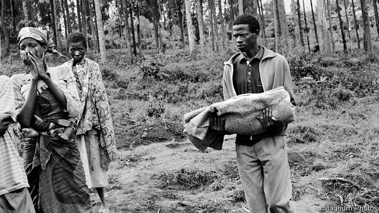

###### Half a million ghosts

# How well has Rwanda healed 25 years after the genocide? 

##### Not well enough, apparently, for President Paul Kagame to ease his grip 

 

> Mar 28th 2019 

TWENTY-FIVE YEARS after the genocide, Rwanda is still an enigma. Its recovery in economic, social and psychological terms is hotly debated. Almost every aspect of the past and present is still argued over. What exactly caused the genocide (which started after a plane carrying Rwanda’s president, Juvénal Habyarimana, was shot down by unknown assassins)? How many people died? Could outsiders, in particular the UN, have halted it? 

More recently, has President Paul Kagame, the Tutsi rebel commander who stopped the genocide at gunpoint and has ruled ever since, genuinely sought to heal the wounds? Or does he cynically exploit the horror to legitimise his ruthlessly authoritarian and predominantly Tutsi regime? Are the Hutus, still a large majority, quietly determined to take over again one day? Could democracy ever take root in Rwanda—or is a firm grip on government the least bad option? 

What is undisputed is that the killing that began on April 7th 1994 was genocide. Probably three-quarters of all Tutsis in Rwanda—men, women, children and babies—were murdered. The true number is unknown. The UN guesses 800,000: mostly Tutsis, but also 30,000 or so moderate Hutus. Mr Kagame prefers a round figure of a million. The meticulous Alison Des Forges of Human Rights Watch was able to substantiate 500,000 deaths. She was later barred from Rwanda for criticising Mr Kagame’s regime. 

The slaughter was shockingly swift, lasting only 100 days. Probably most adult Hutus took part or witnessed the killing without objection. Hutus were then 84% of Rwandans, so their Tutsi neighbours had nowhere to run. As Philip Gourevitch, a journalist, put it: “The entire Hutu population was called upon to kill the entire Tutsi population.” 

Hutus with babies on their backs hacked down Tutsi women similarly encumbered. Hutu priests oversaw massacres of Tutsis in their congregations. Hutu husbands killed Tutsi wives. Hutus were told that if they failed to kill, they would themselves be killed. Though the Rwandan army often lobbed grenades into churches and schools and fired on Tutsis cowering there, most murders were carried out by civilians wielding machetes and clubs. 

The issue of justice still reverberates and rankles. A year after the genocide about 120,000 suspected perpetrators were put in prisons built for 45,000. Another 300,000 were eventually incarcerated in appalling conditions. Some 46,000 Rwandans, most of them génocidaires, are still behind bars. 

Such was the scale of the genocide that from 2002 until 2012 a huge web of community courts known as gacaca (pronounced “gatchatcha”) was set up, under trees and in village courtyards, to dispense justice in a more traditional fashion, by asking witnesses to tell their stories before amateur judges. “No one claims that gacaca justice was perfect but very few here doubt that it saved Rwanda,” says Nick Johnson, a British law professor. With justice has come a measure of reconciliation. “No other country today has so many perpetrators of mass atrocities living in such proximity to their victims’ families,” writes Phil Clark of the School of Oriental and African Studies in London. 

Mr Kagame’s great claim is that there has been no large-scale violence inside Rwanda for the past 24 years. Mr Clark, who has conducted more than 1,000 interviews with Rwandans on both sides of the Hutu-Tutsi gap in the past 16 years, says his respondents nowadays describe “peaceful but uneasy community relations”. 

In part this has been achieved through a widely understood, if unspoken, contract whereby people have traded political freedom for peace and economic development. The economy has recovered rapidly. Infant mortality has halved since 2000, a feat UNICEF rates as “one of the most significant in human history”. In 1995, when the country lay in ruins, GDP per person was $125. Today it is around $800, though some economists question Rwanda’s rosy statistics. 

Few Rwandans have the nerve to dissent. A Rwandan journalist warns that “no one will ever tell you truly what they think.” A Western diplomat concurs. “People just won’t talk freely.” Mr Kagame may have slightly loosened his elaborate system of spies and social controls of late, yet there is precious little space for political competition. He won 99% of the vote in 2017. A compliant Green Party was allowed seats in parliament last year, but its members recall how, in 2010, unknown killers cut off its vice-president’s head. Last year two opposition leaders who had sought to run for president were freed from prison, including Victoire Ingabire, a Hutu who had been sentenced to 15 years on trumped-up charges of inciting “divisionist” (ie, Hutu v Tutsi) rebellion. Her spokesman was murdered this month. 

Mr Kagame has scaled back his military adventures abroad. Initially these were intended to hunt down génocidaires lurking mainly in the forests of neighbouring Congo, but they expanded into calamitous regional wars during which Congo’s minerals were looted and multitudes died. Recently, Mr Kagame has fallen out badly with Uganda’s president, Yoweri Museveni, once a close ally, whom he now accuses of harbouring Rwandan “traitors”. He particularly detests the Rwandan National Congress, a group of fellow Tutsis who were once his closest comrades. It has supporters across a wide diaspora, including in Belgium, South Africa, Uganda and America. Several have been assassinated on foreign soil. 

Twenty-five years after taking power, Mr Kagame faces two tests. The first is whether he will be able to hand over smoothly to a successor. The second is whether, when he does go, Rwanda’s terrible wounds will reopen. 

Mr Kagame’s boosters argue that only he has the authority to hold together so fragile a country. That argument loses force with each passing year. Under a fifth of the population is old enough to have been adults during the genocide. Most children have grown up with the idea of “Rwandaness”, inculcated into them in education camps, known as ingando, that try to minimise ethnic differences. More will begin to demand freedoms enjoyed elsewhere. Without the safety valve of democracy, protests and anger could again take on an ethnic tinge, awakening the demons that Mr Kagame claims to have banished. 

-- 

 单词注释:

1.rwanda[rj'ændә]:n. 卢旺达（东非国家）；卢旺达语 

2.apparently[ә'pærәntli]:adv. 表面上, 清楚地, 显然地 

3.paul[pɔ:l]:n. 保罗（男子名） 

4.kagame[]:[网络] 卡加梅；卡加梅总统；卡根 

5.genocide['dʒenәu,said]:n. 种族灭绝, 灭绝整个种族的大屠杀 [医] 种族灭绝(侵略军队加害居民的罪行) 

6.enigma[i'nigmә]:n. 谜, 费解的事物 

7.hotly['hɒtli]:adv. 暑热地, 激烈地, 热心地 

8.habyarimana[]:[网络] 哈比亚利马纳；哈比亚瑞马那；哈比亚里马纳 

9.outsider[' aut'saidә]:n. 外人, 局外人, 非会员, 外行, 门外汉, 比赛中获胜可能性不大的选手 [经] 外船公司 

10.Tutsi['tjtsi]:n. 图西人(卢旺达与布隆迪境内的少数民族人) 

11.gunpoint['^ʌnpɔint]:n. 枪口 

12.genuinely[]:adv. 真诚地；诚实地 

13.cynically[]:adv. 爱嘲笑地；冷笑地 

14.legitimise[li'dʒitimaiz]:vt.<主英> = legitimize 

15.ruthlessly['ru:θləslɪ]:adv. 无情地, 冷酷地, 残忍地 

16.authoritarian[ɒ:.θɒri'tєәriәn]:a. 独裁的, 独裁主义的 

17.predominantly[]:adv. 主要地, 显著地, 大多数地, 突出地 

18.hutu['hu:tu:]:n. 胡图族；胡图人（讲班图语的卢安达和蒲隆地民族） 

19.quietly['kwaiәtli]:adv. 安静地, 沉着地, 秘密地 

20.undisputed[.ʌndis'pju:tid]:a. 无可争辩的, 无异议的 [法] 无需争论的, 无疑问的, 确然无疑的 

21.Tutsi['tjtsi]:n. 图西人(卢旺达与布隆迪境内的少数民族人) 

22.meticulous[mә'tikjulәs]:a. 一丝不苟的, 精确的, 过细的 

23.alison['ælisn]:n. 艾莉森（女子名） 

24.de[di:]:[化] 非对映体过量 [医] 铥(69号元素铥的别名,1916年Eder离得的假想元素) 

25.forge[fɒ:dʒ]:n. 熔炉, 铁工厂 vt. 打制, 锻造, 伪造 vi. 锻造, 伪造 

26.substantiate[sәb'stænʃieit]:vt. 使实体化, 证实 [经] 确证 

27.criticise['kritisaiz]:v. 批评, 吹毛求疵, 非难 

28.regime[rei'ʒi:m]:n. 政权, 当权期间, 政体, 社会制度, 体制, 情态 [医] 制度, 生活制度 

29.slaughter['slɒ:tә]:n. 残杀, 屠杀, 杀戮 vt. 残杀, 屠杀, 亏本出售 

30.shockingly[]:adv. 令人震惊地, 极糟地, 极度地, 极厉害地 

31.Rwandan[rj'ɑ:ndәn, -'æn-]:a. 卢旺达的 

32.philip['filip]:n. 菲利普（男子名） 

33.gourevitch[]: [人名] 古雷维奇 

34.hutu['hu:tu:]:n. 胡图族；胡图人（讲班图语的卢安达和蒲隆地民族） 

35.hack[hæk]:n. 劈, 砍, 砍痕, 出租车, 干咳, 晒架, 鹤嘴锄 vt. 劈, 砍, 出租, 用旧 vi. 劈, 砍, 干咳, 驾驶出租车 a. 出租的 

36.encumber[in'kʌmbә]:vt. 妨害, 阻塞, 拖累 [经] 使负(债等), 负有义务 

37.oversee[.әuvә'si:]:vt. 向下看, 了望, 监督, 偷看到 [法] 监察, 监督, 俯瞰 

38.massacre['mæsәkә]:n. 大屠杀 vt. 大屠杀, 残杀 

39.congregation[.kɒŋgri'geiʃәn]:n. 集合, 聚集 [法] 集会, 人一, 红衣主教会议 

40.Rwandan[rj'ɑ:ndәn, -'æn-]:a. 卢旺达的 

41.lob[lɒb]:vt. 把球挑高 vi. 蹒跚地走 n. 笨人, 高球 

42.grenade[gri'neid]:n. 手榴弹 

43.cower['kauә]:vi. 畏缩, 退缩, 抖缩 

44.wield[wi:ld]:vt. 挥舞, 运用 

45.machete[mә'tʃeiti]:n. 大砍刀 [化] 马歇特; 丁草胺 

46.reverberate[ri'vә:bәreit]:vi. 回响, 反响, 被反射 vt. 使反响, 使回响, 反射 a. 回响的, 反射的 

47.rankle['ræŋkl]:vi. 化脓, 怨恨 vt. 使怨恨 

48.perpetrator[]:n. 作恶者, 犯罪者, 行凶者 [法] 作恶者, 行凶者, 犯罪者 

49.incarcerate[in'kɑ:sәreit]:vt. 下狱, 监禁, 禁闭 [法] 监禁, 使下狱, 禁闭 

50.appalling[ә'pɒ:liŋ]:a. 骇人的, 令人震惊的 

51.dispense[dis'pens]:vt. 分发, 分配 vi. 特许, 豁免 

52.nick[nik]:n. 刻痕, 缺口, 划痕 vt. 刻痕于, 弄缺, 擦伤 vi. 狙击 

53.johnson['dʒɔnsn]:n. 约翰逊（姓氏） 

54.reconciliation[,rekәnsili'eiʃәn]:n. 和解, 和好, 复交, 调解, 调停, 和谐, 一致, 甘愿, 顺从 [经] (银行往来)调节, 调和, 一致 

55.atrocity[ә'trɒsiti]:n. 残暴, 凶恶, 暴行 [法] 暴行, 残酷, 残忍 

56.proximity[prɒk'simiti]:n. 接近, 亲近 

57.phil[fil]:abbr. 哲学（philosophy） 

58.clark[]:n. 克拉克（男子名） 

59.respondent[ri'spɒndәnt]:a. 回答的, 应答的, 反射的 n. 应答者, 被告 

60.unspoken['ʌn'spәukәn]:unspeak的过去分词 

61.whereby[(h)weә'bai]:adv. 靠什么, 如何, 为何, 靠那个, 因此, 由此 [法] 因此, 由是 

62.mortality[mɒ:'tælәti]:n. 必死的命运, 死亡数目, 死亡率 [医] 必死性, 死亡率 

63.halve[hɑ:v]:vt. 二等分, 对半分享, 把...减半 

64.economist[i:'kɒnәmist]:n. 经济学者, 经济家 [经] 经济学家 

65.rosy['rәuzi]:a. 蔷薇色的, 玫瑰红色的 

66.statistic[stә'tistik]:n. 统计量 a. 统计的, 统计学的 

67.dissent[di'sent]:n. 异议 vi. 持异议, 不同意 

68.diplomat['diplәmæt]:n. 外交官, 有外交手腕的人 [法] 外交家, 外交官, 有权谋的人 

69.concur[kәn'kә:]:vi. 同意, 一致, 同时发生 [法] 同时发生, 并发, 同意 

70.compliant[kәm'plaiәnt]:a. 顺从的, 屈从的 [电] 适用于, 配合...使用 

71.killer['kilә]:n. (非正式)杀人者, 屠杀者, 猛兽, 致死(疾病), 杀手, 止痛药, 限制器, 瞄准器 [计] 删除程序; 断路器 

72.opposition[.ɒpә'ziʃәn]:n. 反对, 敌对, 相反, 在野党 [医] 对生, 对向, 反抗, 反对症 

73.Victoire[vi:k'twɑ:r]:n. 维克托瓦尔(Victoria的异体)(f.) 

74.incite[in'sait]:vt. 刺激, 激励, 引诱 [法] 鼓动, 煽动 

75.divisionist[-nist]:n. 反对统一者 a. 新印象画派的 

76.V[vi:]:[计] 溢出, 变量, 向量, 检验, 虚拟, 垂直 [医] 钒(23号元素) 

77.spokesman['spәuksmәn]:n. 发言人, 代言者 

78.initially[i'niʃәli]:adv. 最初, 开头 

79.Congo['kɔŋ^әu]:n. 刚果, 刚果河, 工夫茶 [建] 刚果, 直接刚果红 

80.calamitous[kә'læmitәs]:a. 灾难性的, 不幸的 

81.regional['ri:dʒәnәl]:a. 地方的, 地域性的 [医] 区的, 部位的 

82.loot[lu:t]:n. 赃物, 洗劫, 抢夺 v. 洗劫, 抢夺 

83.multitude['mʌltitju:d]:n. 多数, 群众 

84.yoweri[]:n. (Yoweri)人名；(乌干)约韦里 

85.museveni[]:un. 穆塞韦尼(Yoweri,1945—乌干达共和国总统,1986年1月任职) [网络] 乌干达总统穆塞韦尼；穆赛韦尼；总统慕塞维尼 

86.ally['ælai. ә'lai]:n. 同盟者, 同盟国, 助手 vt. 使联盟, 使联合, 使有关系 vi. 结盟 

87.detest[di'test]:vt. 厌恶, 憎恨 

88.supporter[sә'pɒ:tә]:n. 支持者, 后盾, 迫随者, 护身织物 [法] 支持者, 赡养者, 抚养者 

89.Diaspora[dai'æspәrә]:n. 犹太人的离散, 离散的犹太人 

90.Uganda[ju(:)'^ændә, u:'^ændә]:n. 乌干达 

91.assassinate[ә'sæsineit]:vt. 暗杀, 行刺 [法] 暗杀, 行刺, 中伤 

92.successor[sәk'sesә]:n. 继承者, 接任者 [计] 后继 

93.reopen[.ri:'әupәn]:v. 重开, 再开始, 再开 

94.booster['bu:stә]:n. 向前推的人, 支持者, 后援者, 升压器 [化] 爆管; 扩爆药; 传爆药; 升压机; 增压装置; 升压器; 助促进剂 

95.inculcate['inkʌlkeit]:vt. 反复灌输, 谆谆教诲 

96.minimise[]:vt. 使减到最少/最小, 使降到最低限度, 使缩到最小, 极度轻视 

97.ethnic['eθnik]:a. 人种的, 种族的 [医] 人种的 

98.valve[vælv]:n. 活瓣, 阀, 活门 v. 装阀, 用阀调节 

99.tinge[tindʒ]:n. 色调, 色彩, 气味, 气息 vt. 染, 使带气息 

100.awaken[ә'weikәn]:vt. 唤醒, 唤起, 使意识到 vi. 觉醒, 意识到 

101.demon['di:mәn]:n. 魔鬼 

102.banish['bæniʃ]:vt. 驱逐, 消除 [法] 驱逐, 流放 

