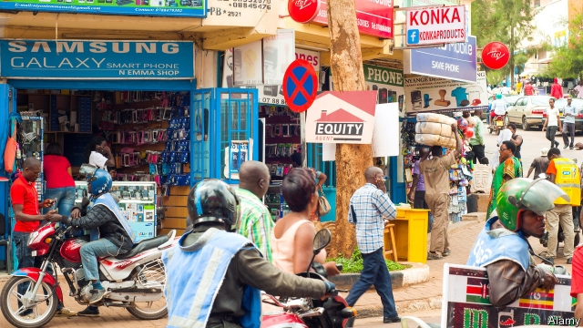

###### What’s in a name?

# Rwanda has banned talking about ethnicity 

##### But everyone knows who is who 

 

> Mar 28th 2019 

“IT’S THE nose, they always look at your nose,” says Peter (not his real name), an ebullient Tutsi former soldier mulling over how the majority Hutus still eye up, and in the old days would comment on, the supposedly sharper and longer noses of the stereotypically taller and thinner Tutsis. 

These days it is rude—and can even be deemed criminally “divisionist”—to use the labels Hutu and Tutsi in public. “We are all Rwandans now” is the strictly enforced official mantra. Yet virtually everyone is conscious of whether someone hails from a family of “victims” or “perpetrators”. 

One must be careful not to ask, or spell it out. “We know, we always know,” says Peter. “We can tell easily in the village; maybe it’s not always so easy in Kigali,” the capital, which is a melting pot. “But you always find it out, maybe in a roundabout way.” 

Hutus and Tutsis are not tribes but a complex mosaic of clan, caste and lineage, sharing language, religion and customs, with much social mixing and intermarriage. Some Hutus are tall and lean. Some Tutsis are short and stocky with flat noses. Many Rwandans are in-between. 

After a drink, Peter breezily flouts the official edict against ethnic labelling. “The Hutus still make excuses,” he complains. “They say, ‘We were told to kill or we would be killed ourselves’…But how can you kill children and babies? The trouble with Hutus is that they obey, that’s their mentality.” 

-- 

 单词注释:

1.rwanda[rj'ændә]:n. 卢旺达（东非国家）；卢旺达语 

2.ethnicity[eθ'nisәti]:n. 种族划分 

3.alway['ɔ:lwei]:adv. 永远；总是（等于always） 

4.peter['pi:tә]:vi. 逐渐消失, 逐渐减少 

5.ebullient[i'bʌljәnt]:a. 沸腾的, 热情的, 热情洋溢的 

6.Tutsi['tjtsi]:n. 图西人(卢旺达与布隆迪境内的少数民族人) 

7.mull[mʌl]:n. 软薄布, 混乱 vt. 研磨, 细想 vi. 深思熟虑 

8.hutu['hu:tu:]:n. 胡图族；胡图人（讲班图语的卢安达和蒲隆地民族） 

9.supposedly[sә'pәuzidli]:adv. 想象上, 看上去像, 被认为是, 恐怕, 按照推测 

10.Sharpe['ʃa:p]:n. 夏普指数；夏普指标；夏普（人名） 

11.stereotypically[]:adv. 带有成见地(stereotype的副词形式) 

12.Tutsi['tjtsi]:n. 图西人(卢旺达与布隆迪境内的少数民族人) 

13.deem[di:m]:v. 认为, 相信 

14.criminally[]:[法] 刑法上, 犯罪上 

15.hutu['hu:tu:]:n. 胡图族；胡图人（讲班图语的卢安达和蒲隆地民族） 

16.Rwandan[rj'ɑ:ndәn, -'æn-]:a. 卢旺达的 

17.mantra['mʌntrә, 'mæn-]:颂歌, 咒语(尤指四吠陀经典内作为咒文或祷告唱念的) 

18.hail[heil]:n. 冰雹, 致敬, 欢呼, 招呼 vt. 向...欢呼, 致敬, 招呼, 使象下雹样落下 vi. 招呼, 下雹 interj. 万岁, 欢迎 

19.perpetrator[]:n. 作恶者, 犯罪者, 行凶者 [法] 作恶者, 行凶者, 犯罪者 

20.kigali[ki'ɡɑ:li]:n. 基加利（卢旺达的首都） 

21.mosaic[mәu'zeiik]:n. 马赛克, 镶嵌细工, 镶嵌工艺 a. 马赛克的, 镶嵌细工的, 拼花的 vt. 用镶嵌细工装饰 [计] Mosaic浏览程序 

22.clan[klæn]:n. 氏族, 宗族, 集团 [医] 支 

23.caste[kæst. kɑ:st]:n. 印度的种姓制度, (排他的)社会团体 

24.lineage['liniidʒ]:n. 血统, 直系 [法] 血统, 世系 

25.intermarriage[.intә'mæridʒ]:n. 异族结婚, 近亲结婚 [医] 血族婚姻, 异种结婚 

26.stocky['stɒki]:a. 矮胖的, 健壮结实的 

27.breezily['bri:zili]:adv. 吹微风地, 活泼地, 轻松地 

28.flout[flaut]:vt. 嘲笑, 愚弄 vi. 表示轻蔑 n. 嘲笑, 愚弄, 轻视 

29.edict['i:dikt]:n. 布告, 法令 [经] 布告, 法令 

30.ethnic['eθnik]:a. 人种的, 种族的 [医] 人种的 

31.mentality[men'tæliti]:n. 精神力, 智力, 头脑作用, 心态 [医] 智力 

