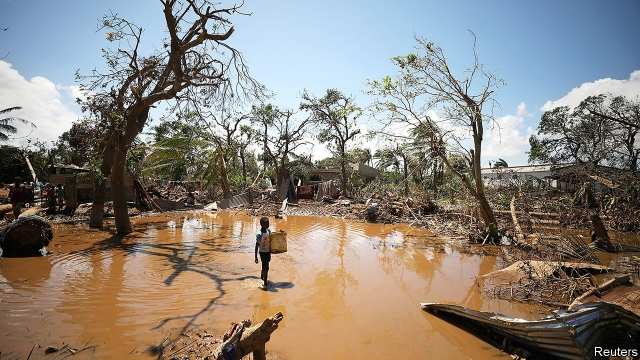

###### First the floods, then the pestilence

# The rush to avert a second disaster after floods in Mozambique 

##### Cholera and malaria are just two of the dangers 

 

> Mar 28th 2019 

JULIETA MUSSACA and her two children survived on coconuts knocked from trees by the storm and a bag of rice left soggy from the floods. After Tropical Cyclone Idai hurtled into Mozambique’s coast on March 14th, and a deluge of floodwaters followed, little was left of her village in Buzi district. “Even the trees are gone,” said Ms Mussaca, who is 29. “We lost everything.” After nearly two weeks of growing desperation, cut off from the outside world, she travelled by boat to the nearby city of Beira. “No one came to help us,” she said. “No one.” 

The cyclone, which the UN has called the worst weather-related disaster to hit the southern hemisphere, has directly claimed nearly 900 lives in Mozambique, Zimbabwe and Malawi, according to official estimates. Aid workers reckon the figure is very much higher. An exact count may never be known: many bodies have been washed out to sea. Yet the aftermath of the storm may prove even more deadly, in part because of the slow response of governments in the region. 

South Africa, which aspires to be the regional power, could spare just three helicopters to help. That is in stark contrast to its response to floods in Mozambique in 2000, when it immediately sent ten aircraft which rescued almost 15,000 people, plucking many from trees. 

Mozambique’s government, too, has been slow off the mark. Filipe Nyusi, the president, merrily went ahead with a state visit to the Kingdom of Eswatini (formerly Swaziland) the day after the storm hit. As it happens he was there to sign agreements on how the two countries could co-operate on car insurance and search-and-rescue operations. He cut the visit short a day later but has continued his missteps. On March 27th Mozambicans turned on their televisions for a live address, expecting their president to talk about the disaster. Instead he gave them the cheery news that the Pope would visit in September. 

Help is finally arriving. A main road to Beira, a port city of 500,000 people at the centre of the disaster, has been repaired, allowing lorries to deliver goods. Other supplies are coming by ship. Still, the pace is slow. Some 1.8m Mozambicans are thought to have been affected by the storm. Emergency workers fear a second disaster from the spread of waterborne disease. Cases of cholera and malaria have been reported. 

Even as rescuers try to deal with the effects of the storm, some are looking at the lessons it offers. Although Mozambique suffered large-scale flooding in 2000 that killed nearly 700 people, tropical storms in the region are typically less intense than they are further north. But this pattern appears to be changing as the climate warms. António Guterres, the UN’s secretary-general, warned that such “turbo-charged storms” are “becoming more frequent, more severe and more widespread”. 

Mozambique, with a long, low-lying coastal plain that is home to more than half its population, is particularly vulnerable. This storm flooded 2,515 square km (971 square miles), an area larger than Greater London and New York City combined. 

Protecting people in these areas will require a better early-warning system—although storm alerts went out, most people ignored them because they did not realise how much danger they were in—and better infrastructure, such as roads and bridges that will not wash away and buildings that do not get knocked down by strong winds. 

One question is who should pay to strengthen these defences. Mozambique has produced few of the greenhouse gases that may be fuelling the storms it faces. And it is so poor—annual per person income in 2017 was just $426—that there is not much it can do. “We put stones on the roof to weigh it down,” says 19-year-old Aunencia Pedro. His home was destroyed. 

-- 

 单词注释:

1.pestilence['pestilәns]:n. 瘟疫, 散布毒害的事物, 罪恶 [医] 疫病, 疫病流行 

2.avert[ә'vә:t]:vt. 转开, 避免, 防止 

3.Mozambique[.mәuzәm'bi:k]:n. 莫桑比克 

4.cholera['kɒlәrә]:n. 霍乱 [医] 霍乱 

5.malaria[mә'lєәriә]:n. 疟疾, 瘴气 [医] 疟[疾] 

6.julieta[]:n. (Julieta)人名；(西)胡列塔；(葡、罗)茹列塔 

7.coconut['kәukәnәt]:n. 椰子 [医] 椰子(实) 

8.soggy['sɒgi]:a. 浸水的, 沉闷的 [化] 欠硫; 硫化不足 

9.cyclone['saiklәun]:n. 龙卷风, 暴风 [化] 旋流(分离,除尘)器 

10.hurtle['hә:tl]:vi. 猛冲, 碰撞, 突进 vt. 猛撞, 猛投 n. 投掷, 碰撞, 碰撞声 

11.deluge['delju:dʒ]:n. 大洪水, 泛滥 vt. 使泛滥 

12.floodwater['flʌdwɒ:tә]:n. 洪水 

13.Buzi[]:布齐 

14.desperation[.despә'reiʃәn]:n. 绝望 

15.Beira['beirә]:贝拉[莫桑比克东南部港市] 

16.cyclone['saiklәun]:n. 龙卷风, 暴风 [化] 旋流(分离,除尘)器 

17.UN[ʌn]:pron. 家伙, 东西 [经] 联合国 

18.hemisphere['hemisfiә]:n. 半球, 地球的半面, 大脑半球 [医] 半球 

19.Zimbabwe[zim'bɑ:bwei]:n. 津巴布韦 

20.Malawi[mә'lɑ:wi]:n. 马拉维 

21.reckon['rekәn]:vt. 计算, 总计, 估计, 认为, 猜想 vi. 数, 计算, 估计, 依赖, 料想 

22.aftermath['ɑ:ftәmæθ]:n. 结果, 后果 [法] 后果, 结果 

23.aspire[ә'spaiә]:vi. 渴望, 立志于 

24.regional['ri:dʒәnәl]:a. 地方的, 地域性的 [医] 区的, 部位的 

25.stark[stɑ:k]:a. 僵硬的, 完全的, 刻板的, 明显的, 荒凉的, 结实的 adv. 突出地, 简直, 全然 

26.filipe[]:n. (Filipe)人名；(斐、葡)菲利佩 

27.merrily['merili]:adv. 愉快地, 高兴地 

28.formerly['fɒ:mәli]:adv. 从前, 以前 

29.Swaziland['swɑ:zilænd]:n. 斯威士兰 

30.misstep[.mis'step]:n. 踏错, 错误, 失策 [法] 失足, 过失, 失策 

31.Mozambican[,məuzəm'bi:kən]:a. 莫桑比克的；莫桑比克人的 

32.cheery['tʃiәri]:a. 愉快的 

33.pope[pәup]:n. 罗马教皇, 主教 

34.waterborne['wɒtәbɒ:n]:a. 浮起的, 水传播的, 水运的 

35.cholera['kɒlәrә]:n. 霍乱 [医] 霍乱 

36.rescuer['reskjuә]:n. 救助者 

37.typically['tipikәli]:adv. 代表性地；作为特色地 

38.les[lei]:abbr. 发射脱离系统（Launch Escape System） 

39.guterres[]:[网络] 古特雷斯 

40.coastal['kәustәl]:a. 海岸的, 沿海的, 沿岸的 [法] 海岸的, 沿海的 

41.vulnerable['vʌlnәrәbl]:a. 易受伤害的, 有弱点的, 易受影响的, 脆弱的, 成局的 [医] 易损的 

42.km[]:[医] 千米, 公里 

43.york[jɔ:k]:n. 约克郡；约克王朝 

44.infrastructure['infrәstrʌktʃә]:n. 基础结构, 基础设施 [经] 基础设施 

45.pedro['pi:drәu]:n. 彼得牌戏（一种纸牌戏） 

