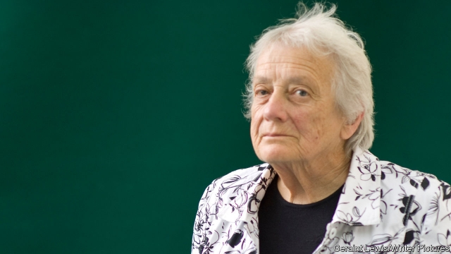

###### Seening things clear

# Obituary: Mary Warnock died on March 20th 

##### The philosopher and deviser of Britain’s rules on embryo experiments was 94 

 

> Mar 28th 2019 

A QUESTION Mary Warnock often asked herself was why she had become a philosopher at all. She was not much good at it. Her many books, written mostly for money, contained no original thinking. For a while, when she was first up at Oxford reading Mods and Greats, she thought she would be a historian of ancient Greece. But she was not scholarly in that way. In the end she embraced philosophy because she fell in love with a philosopher, Geoffrey Warnock, and it seemed a practical arrangement. They could share books, and swap learned aphorisms as they washed the dishes. And so they did. A drunken young man who climbed into their lodgings once, when Geoffrey was principal of Hertford, reported that he had found them in bed discussing Kant. That was fantasy, but whenever she took on yet another project Geoffrey would quote Hobbes at her, about the reckless pursuit of power. 

The second question that confronted her was what philosophy was for. The 1950s and 1960s were something of a golden age for it, not only at Oxbridge but on the BBC Third Programme, where she was the token goofy woman in a quartet of thinkers for regular radio debates. (“But surely there must be something deeper?” she would ask, only to be put down.) Philosophers were public figures, and their opinions sought. The one she most admired, J.L.Austin, had specialised in what people intended to do when they spoke words, an exercise often dismissed as logic-chopping. But it seemed extremely useful to her as a general exercise, because it unblocked things. It was an excellent way of digging down to what people really meant to say, and hence, she realised, fine training for chairing committees and public enquiries. 

So this was what she did, on top of all her writing and teaching and fellowships at Lady Margaret Hall and St Hugh’s; on top, too, of bringing up five children with properly cooked meals and improving books at suppertime. She became famous for enquiries into environmental pollution, withholding of evidence, animal testing and the running of the Royal Opera House. Two reports in particular, on the teaching of children with special needs in 1978 and on human fertility and embryology in 1984, changed British law in dramatic and lasting ways. Her education report recommended that children with disabilities should be taught for the first time in mainstream schools and given special support. The embryology report allowed human embryos to be used for scientific experiments, but under statutory authority and for a maximum lifespan of 14 days, the point at which the bundle of cells began to differentiate into an individual. (She was particularly pleased with that clear cut-off rule: everyone could count to 14.) It also paved the way for IVF, an advance she keenly wanted to see. 

Some said she was abrasive as a chairman. She thought she was generally fair. Her upbringing, in the care of a nanny in a fatherless house, had been heavy on good manners, and her loathing of Margaret Thatcher (who had appointed her to both her most important committees) stemmed from what she saw as the prime minister’s bullying behaviour, as well as her lower-middle-class philistinism and “odious suburban gentility”. In committee, in her slightly dishevelled philosopher’s clothes, she simply tried to induce public servants to think rationally. Private and public morality had to be disentangled. If anyone said they were “not happy” with some proposal, she would urge them to say what they meant. If she herself had incoherent thoughts, as she did about surrogacy, mixing up abhorrence of it with her own bliss at giving birth, she turned the same fierceness inwards. Evidence was required. 

She also could not help dominating debate because of the very questions raised. When did human life begin? When did that life become so intrinsically valuable that it must not be destroyed? When did it become so valueless that it ought to be ended? (Euthanasia was a passionate cause, even before morphine gently killed Geoffrey off.) In the case of special-needs children, what was the point of giving them something from which they could hardly benefit? Once these questions were seen in terms of right and wrong, conflict raged. A clear head like hers had to sort it out. 

Yet moral philosophy was not her field. At Oxford, where it was in poor shape and seen as a soft option, it hardly impinged on her at all. As a schoolgirl at the exceptionally holy St Swithun’s, in Winchester, she had desperately wanted to be good in thought, word and deed; at university she threw out moral absolutes, becoming an “atheist Anglican”, as she remained. Nonetheless, just as she still loved Winchester Cathedral and the language of the Book of Common Prayer, she was still inherently interested in the way human beings attached value, and moral weight, to what they did. 

In so far as she was linked to any “ism” it was the existentialism of Jean-Paul Sartre, the subject of three of her books. She found much that he wrote sheer gobbledygook and some of his beliefs ridiculous, but agreed with his premise that humans gave meaning to an essentially meaningless world. By the time of the embryology report she had also moved to consequentialism: it was the likely outcome of an action that made it right or wrong. The usual outcome of medical research was that disease was cured. Therefore it was good. To ban carefully restricted experiments in the name of mere hidebound metaphysics, as many of her critics tried, was outrageous. She could not bear those bigots, and was glad to be made a dame in spite of them. 

Consequentialism relied on trust that human beings mostly wanted to do good, not harm, and this was sometimes too optimistic. She was sorry that her recommendations for special-needs education made some children unhappy, and wanted to keep the rules on bioethics very tight. By and large, though, she was delighted to apply her brain in the public sphere. As the years passed, governments seemed increasingly to distrust and ignore intellectual elites, precisely because the great universities fostered freedom of thought which could not be controlled. She fiercely attacked that prejudice. A philosopher let loose was what democracy needed. Ergo, she was delighted she had become one. 

-- 

 单词注释:

1.mary['meәri]:n. 玛丽（女子名） 

2.Warnock[]:沃诺克（人名） 

3.deviser[di'vaizә]:n. 设计者, 计划者, 发明者 [法] 设计者, 发明者, 计划者 

4.embryo['embriәu]:n. 胚胎, 胎儿, 胚芽 [医] 胚, 胚胎 

5.Oxford['ɒksfәd]:n. 牛津, 牛津大学 

6.mod[]:a. 现代派的, 时髦的 [计] 模型, 修改, 调制, 模 

7.historian[hi'stɒ:riәn]:n. 历史学家, 记事者 

8.scholarly['skɔlәli]:a. 学者派头的, 学者风度的, 有学问的, 博学的, 好学的 

9.geoffrey[]:n. 杰弗里（男子名） 

10.aphorism['æfәrizm]:n. 格言, 警语 

11.drunken['drʌŋkәn]:a. 酒醉的 

12.lodging['lɒdʒiŋ]:n. 寄宿处, 寄宿 [法] 提起, 住所 

13.hertford[]:n. 哈特福郡（英国一座城市） 

14.kant[kænt]:n. 康德（德国哲学家） 

15.hobbes[hɔbz]:n. 霍布斯（姓氏, 特指英国哲学家托马斯·霍布斯） 

16.reckless['reklis]:a. 不介意的, 大意的, 鲁莽的, 不顾后果的 [法] 不注意的, 粗心大意的, 鲁莽的 

17.confront[kәn'frʌnt]:vt. 使面对, 对抗, 遭遇, 使对质, 比较 [法] 对证, 使对质, 比较 

18.Oxbridge['ɔksbridʒ]:n. 牛津和剑桥大学, 牛津或剑桥大学 

19.BBC[]:英国广播公司 

20.token['tәukәn]:n. 表征, 记号, 代币 a. 象征的, 表意的 [计] 记号 

21.goofy['gu:fi]:a. 愚笨的, 傻瓜的 

22.quartet[kwɒ:'tet]:n. 四重奏 [计] 四位字节 

23.thinker['θiŋkә]:n. 思想者, 思想家 

24.specialise['speʃә,laiz]:vt. 特加指明, 列举, 使专门化, 限定...的范围 vt.vi. (使)特化, (使)专化 vi. 成为专家, 专务, 专攻, 专门研究, 逐条详述 

25.unblocked[]:a. 非块式；畅通无阻的 

26.fellowship['felәuʃip]:n. 伙伴关系, 共同参与, 团体, 奖学金, 友谊 [经] 合伙关系, 研究员薪金, 研究员基金 

27.margaret['mɑ:^әrit]:n. 玛格利特（女子名） 

28.ST[]:[计] 段表, 状态, 系统测试, 直端连接器 [化] 磺胺噻唑 

29.suppertime['sʌpәtaim]:n. 晚饭时间 

30.environmental[in.vaiәrәn'mentәl]:a. 周围的, 环境的 [经] 环境的, 环保的 

31.withhold[wið'hәuld]:vt. 使停止, 扣留, 保留, 拒给 vi. 克制, 忍住 

32.fertility[fә'tiliti]:n. 肥沃, 丰饶, 生产力 [医] 生育力 

33.embryology[.embri'ɒlәdʒi]:n. 胚胎学 [医] 胚胎学 

34.mainstream['meinstri:m]:n. 主流 

35.statutory['stætjutәri]:a. 法令的, 法定的, 可依法惩处的 [经] 法定的 

36.lifespan['laifspæn]:n. 预期生命期限；寿命；预期使用期限 

37.differentiate[.difә'renʃieit]:v. 区别, 区分 

38.ivf[]:abbr. 试管受精（in-vitro fertilization） 

39.keenly['ki:nli]:adv. 锐利地, 敏捷地, 激烈地 

40.abrasive[ә'breisiv]:n. 研磨料 a. 有研磨作用的 

41.upbringing['ʌp.briŋiŋ]:n. 教养 

42.nanny['næni]:n. 保姆；母山羊 

43.fatherless['fɑ:ðәlis]:a. 无父的 [法] 没有父亲的, 生父不明的 

44.loathing['lәuðiŋ]:n. 非常讨厌, 嫌恶, 极不情愿 

45.thatcher[]:n. 盖屋顶者 

46.bully['buli]:n. 欺凌弱小者, 土霸 vt. 威胁, 恐吓, 欺负 vi. 欺负 a. 特好的, 第一流的 adv. 十分 

47.philistinism['filistinizәm, fi'lis-]:n. 市侩作风, 庸俗气味 

48.odious['әudiәs]:a. 可憎的, 可厌的, 丑恶的 

49.suburban[sә'bә:bәn]:a. 郊外的, 郊区的, (贬)偏狭的, 土气的, 见识不广的 n. 郊区居民 

50.gentility[dʒen'tiliti]:n. 出身高贵, 绅士们, 上流阶层, 斯文, 有教养, 彬彬有礼, 文雅, 装体面, 假斯文 

51.dishevel[di'ʃevl]:vt. 使蓬乱, 使头发凌乱 

52.induce[in'dju:s]:vt. 引诱, 招致, 归纳出, 感应 [医] 诱导, 感应 

53.rationally[]:adv. 理性地；讲道理地 

54.morality[mә'ræliti]:n. 道德, 教训, 品行 [法] 道德, 道义 

55.disentangle[.disin'tængl]:vi. 解开纠结, 松开, 解决 vt. 解开, 松开 

56.incoherent[.inkәu'hiәrәnt]:a. 不连贯的, 语无伦次的 [医] 不连贯的 

57.surrogacy[ˈsʌrəgəsi]:n. 代孕 

58.abhorrence[әb'hɒrәns]:n. 厌恶, 痛恨 

59.bliss[blis]:n. 福佑, 天赐的福 [计] 实现系统软件的基本语言 

60.fierceness[fɪəsnəs]:n. 凶猛, 猛烈 

61.inwards['inwәdz]:adv. 在内部, 向中心, 向内, 内里 [经] 进口税 

62.intrinsically[]:[计] 本质的 

63.valueless['væljulis]:a. 无价值的, 不值钱的 [法] 无价值的 

64.euthanasia[.ju:θә'neizjә]:n. 安乐死 [医] 安死术 

65.passionate['pæʃәnit]:a. 热情的, 热烈的, 易怒的, 热恋的 

66.morphine['mɒ:fi:n]:n. 吗啡 [化] 吗啡 

67.impinge[im'pindʒ]:vi. 撞击, 起作用, 侵犯 vt. 撞击 

68.schoolgirl['sku:lgә:l]:n. 女学生 

69.exceptionally[]:adv. 特殊地；异常地；例外地 

70.Winchester['wintʃistә]:[计] 温彻斯特 

71.desperately['despәrәtli]:adv. 拼命地；绝望地；极度地 

72.atheist['eiθiist]:n. 无神论者 

73.Anglican['æŋglikәn]:n. 盎格鲁人 a. 英语的, 英国的, 盎格鲁人方言的 

74.nonetheless[,nʌnðә'les]:conj. 然而, 尽管, 不过 adv. 不过, 仍然, 尽管如此, 然而 

75.inherently[in'hiәrәntli]:adv. 内在地, 生来地, 固有地 [计] 固有的 

76.ism['izm]:n. 主义, 学说, 制度 

77.existentialism[e^zi'stenʃәliz(ә)m]:n. 存在主义 

78.Sartre['sɑ:trә]:萨特 (①姓氏 ②Jean Paul, 1905-1980, 法国哲学家、小说家、剧作家, 存在主义的提倡者, 曾以“谢绝一切来自官方的荣誉”为由拒绝接受 1964年诺贝尔文学奖) 

79.sheer[ʃiә]:a. 绝对的, 全然的, 纯粹的, 透明的, 峻峭的 vi. 偏转, 偏航 vt. 使急转向, 使偏航 adv. 完全, 全然, 峻峭 n. 偏航 

80.gobbledygook['gɒbldi.guk]:n. 官样文章 

81.premise['premis]:n. 前提, 房屋连地基, 上述各项 vt. 预先提出, 引出, 作为...的前提 vi. 作出前提 

82.essentially[i'senʃәli]:adv. 本质上, 本来 

83.meaningless['mi:niŋlis]:a. 无意义的 

84.carefully['kєәfuli]:adv. 小心地, 谨慎地 

85.hidebound['haidbaund]:a. 思想偏狭顽固的, 死板的, 量小的 [医] 绷紧的, 包紧的(皮肤) 

86.metaphysic[,metә'fizik]:n. 形而上学, 玄学 

87.outrageous[aut'reidʒәs]:a. 暴虐的, 极无礼的, 可恶的 

88.bigot['bigәt]:n. 盲从者, 偏执的人 

89.dame[deim]:n. 夫人 

90.consequentialism[]: 效果论 

91.distrust[dis'trʌst]:n. 不信任 vt. 不信任 

92.elite[ei'li:t]:n. 精华, 精锐, 中坚分子 

93.precisely[pri'saisli]:adv. 精确地, 明确地, 刻板地, 拘泥地, 正好, 恰恰, 对, 正是如此, 确实如此, 不错 

94.foster['fɒstә]:a. 收养的, 养育的 vt. 养育, 抚育, 培养, 鼓励, 抱(希望) 

95.fiercely['fiәsli]:adv. 猛烈地, 厉害地 

96.ergo['ә:^әu]:adv. 所以, 因此 

