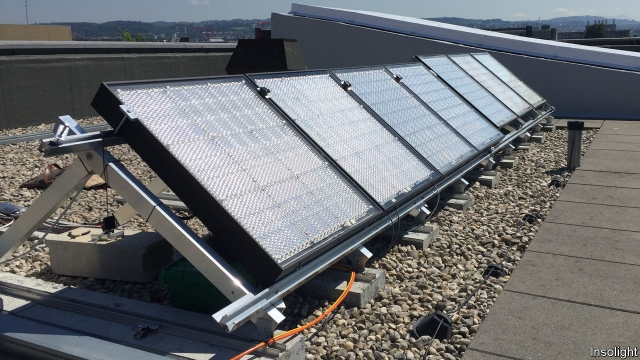

###### Gathering the rays

# A highly efficient rooftop solar panel based on space technology 

##### Turning more sunlight into electricity 

 

> Mar 28th 2019 

EVEN THOUGH solar panels have improved over the years they are still not very efficient at doing their job. Standard panels using silicon-based solar cells typically convert 17-19% of the sun’s energy into electricity. It is possible to use more exotic solar cells to make panels that are some 40% efficient, but these can cost around $300 a watt compared to just under $1 for some silicon versions. Hence the better panels are used in specialist roles, such as powering spacecraft. 

Now, a middle way seems to have been found. Insolight, a startup from the Swiss Institute of Technology in Lausanne, has developed a panel that uses expensive high-efficiency solar cells, but does so in such a fashion that should make its panels competitive with the standard silicon variety. The new panel has been confirmed in independent tests to be 29% efficient. 

Insolight employs so-called multi-junction solar cells, which are similar to those on spacecraft. These capture energy from a much broader spectrum of sunlight by using a stack of different materials, such as gallium arsenide and gallium indium phosphide. Fabricating such cells is complex and costly. 

Insolight, though, is extremely parsimonious in their use. Instead of spreading them across an entire panel, they are spaced well apart in a grid that covers just 0.5% of the surface. The panel is then covered with a protective glass layer that contains optical lenses above each cell. This way sunlight falling on the panel is concentrated onto the cells below. To ensure maximum exposure, a mechanism moves the position of the panel by a few millimetres horizontally, enough to follow the trajectory of the sun. 

Such panels would still cost a bit more than standard silicon ones, but as Laurent Coulet, Insolight’s chief executive, points out, what matters is the final cost of the electricity they produce. He reckons that in mass production his panels will work out cheaper, going well below silicon’s $1 a watt to 30-40 cents a watt. Moreover, a hybrid panel could be made using the Insolight system and silicon cells covering the remaining 99.5% of the panel’s surface. Such a panel would help harvest diffuse light in places where conditions are often cloudy. 

-- 

 单词注释:

1.rooftop['ru:ftɒp]:n. 屋顶 

2.typically['tipikәli]:adv. 代表性地；作为特色地 

3.exotic[ig'zɒtik]:a. 异国的, 外来的 n. 外来人, 外来物, 舶来品 

4.watt[wɒt]:n. 瓦(特) [化] 瓦; 瓦特 

5.silicon['silikәn]:n. 硅 [化] 硅Si 

6.startup[]:[计] 启动 

7.Lausanne[lәu'zæn]:洛桑[瑞士西部城市,在日内瓦湖北岸] 

8.spectrum['spektrәm]:n. 光谱, 范围, 系列 [化] 光谱 

9.gallium['gæliәm]:n. 镓 [化] 镓 

10.arsenide['ɑ:sәnaid]:[化] 砷化物 [医] 砷化物 

11.indium['indiәm]:n. 铟 [化] 铟In 

12.phosphide['fɒsfaid]:n. 磷化物 [化] 磷化物 

13.fabricate['fæbrikeit]:vt. 制造, 建造, 装配, 伪造 

14.parsimonious[,pɑ:si'mәunjәs, -niәs]:a. 过度节俭的, 吝啬小气的 

15.grid[grid]:n. 格子, 栅格 [计] 网格 

16.lense[]:n. (Lense)人名；(德)伦泽 

17.mechanism['mekәnizm]:n. 机械, 机构, 结构, 机理, 技巧 [化] 机理; 历程; 机构 

18.horizontally[]:[计] 水平置中 

19.trajectory[trә'dʒektri]:n. 轨道, 弹道, 轨线 [化] 轨道 

20.laurent['lɔrәnt]:n. 劳伦（法国数学家） 

21.coulet[]:[网络] 护身符 

22.reckon['rekәn]:vt. 计算, 总计, 估计, 认为, 猜想 vi. 数, 计算, 估计, 依赖, 料想 

23.hybrid['haibrid]:n. 混血儿, 杂种, 混合物 a. 混合的, 杂种的, 混合语的 [计] NetWare的主机实用程序, 双重用户建立程序 

24.diffuse[di'fju:z]:v. 散播, 传播 a. 散开的, 弥漫的 

