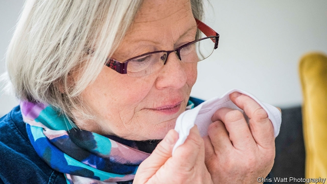

###### Biochemistry

# Scientists discover the chemicals behind the unique Parkinson’s smell 

##### Work could lead to a diagnostic device 

 

> Mar 28th 2019 

HIPPOCRATES, GALEN, Avicenna and other ancient physicians frequently used odour as a diagnostic tool. Although scent is not used nearly as often in modern medicine, it still has its place. Paramedics are routinely taught to spot the fruity smell on the breath of diabetics who have become hyperglycaemic and gastroenterologists are trained to detect the odour of digested blood. But there has been scant evidence of a smell associated with neurodegenerative disorders. Now one has been found for Parkinson’s disease. 

Frequently causing tremors, rigidity and dementia, Parkinson’s is both debilitating and substantially shortens life expectancy. The rate at which these symptoms appear and worsen cannot be stopped or slowed yet but its most harmful effects can be staved off with drugs. As with many diseases, the earlier the intervention, the better. Yet herein lies one of the greatest challenges—there are no tests that diagnose whether Parkinson’s is actually present. The best that neurologists can do is study the symptoms and theorise about whether someone actually has the disease. Hence the search is on for a better form of diagnosis. Unexpectedly, scientists are now literally following someone’s nose. 

Joy Milne, a retired nurse from Perth, Scotland has an extraordinary sense of smell. Known as hyperosmia, Mrs Milne’s condition allows her to detect odours that are imperceptible to most people. In 1974 Mrs Milne noticed an odd musky smell around her house that had not been present before. In 1986, her husband, Les Milne, was diagnosed with Parkinson’s. He lived with the disease for a number of years and while the symptoms were initially manageable with medication, this became harder over time. Eventually, he was forced to retire and, while attending Parkinson’s support groups, Mrs Milne noted something extraordinary. Everyone with the disease had the same distinctive odour that her husband had developed in 1974. It was shortly after that realisation that she started collaborating with researchers. 

By providing Mrs Milne with shirts worn by Parkinson’s patients, researchers found she was able to identify that the smell was concentrated along the upper back, and not in armpits as previously assumed. Most remarkably, of the control subjects without the disease, Mrs Milne found one to have the musky odour. Nine months later that person was diagnosed with the disease. 

All this led Perdita Barran of the University of Manchester, in Britain, to set out to discover what was producing the telltale odour that Mrs Milne could detect. 

Previous work found that patients with Parkinson’s had a tendency to overproduce a waxy compound on the skin of their upper backs. Known as sebum, Dr Barran speculated that something trapped within this compound was producing the odour. Keen to find out, Dr Barran and her colleagues set up an experiment. 

The team analysed sebum samples from 43 people suffering from Parkinson’s and 21 who were not. The sebum samples were collected on gauze and warmed to release any volatile compounds that might be found within them. Mass spectrometry and gas chromatography were then used to identify whether there were volatiles present and what they were. For a subset of the patient samples, Mrs Milne smelled the compounds before they entered the mass spectrometer and pressed a button when the distinctive odour was present. 

As Dr Barran reports in ACS Central Science, the mass spectrometer identified four compounds, perillic aldehyde, hippuric acid, eicosane and octadecanal, in the vaporised sebum of the Parkinson’s disease patients that were at entirely different levels to those in the healthy group. To test whether these different levels of compounds were generating the smell that Mrs Milne was detecting, Dr Barran presented them to her and confirmed that they were, indeed, responsible for the musky odour. 

While relatively small in size, Dr Barran’s experiment is the first to reveal the specific compounds that generate the unique smell of Parkinson’s. Assuming larger follow-up experiments replicate her findings, the work paves the way for the development of a device, a sort of electronic nose, that could sniff the upper backs of patients to quickly determine who has the disease and who does not. That would allow drugs to help mitigate the symptoms to be administered all the sooner. 

-- 

 单词注释:

1.diagnostic[daiәg'nɒstik]:a. 诊断的, 有助于诊断的, 特征的 n. 诊断, 病的征候, 诊断法 [计] 诊断的 

2.hippocrate[]:[网络] 依勃克拉特；希波克拉第；古希腊的名医西波克拉底 

3.galen['^eilәn, -lin]:n. 伽林（古希腊名医及有关医术的作家） 

4.Avicenna[]:[医] 阿维森纳(980-1037,中世纪卓越的医学家,生于中亚细亚的布哈尔) 

5.paramedic['pærәmedik]:n. 伞兵军医, 伞降急救人员 

6.routinely[]:adv. 日常, 乏味, 常规, 例行 

7.fruity['fru:ti]:a. 水果的, 有果味的, 有(低级)趣味的, 圆润的 

8.diabetic[daiә'betik]:a. 糖尿病的 n. 糖尿病患者 

9.hyperglycaemic[]:血糖过高的; 高血糖症的 

10.gastroenterologist[]:n. 胃肠病学家 [医] 胃肠病学家 

11.scant[skænt]:a. 不充分的, 不足的 vt. 减少, 吝啬, 限制, 藐视, 忽略 

12.neurodegenerative[]:[医] 神经变性的 

13.tremor['tremә]:n. 震动, 颤动 [医] 震颤 

14.rigidity[ri'dʒiditi]:n. 坚硬, 僵化, 坚硬, 刚性, 刚度 [化] 刚度系数 

15.dementia[di'menʃiә]:n. 痴呆 [医] 痴呆 

16.debilitate[di'biliteit]:vt. 使衰弱 

17.substantially[sәb'stænʃәli]:adv. 实质上, 本质上, 大体上 

18.shorten['ʃɒ:tn]:vt. 弄短, 缩短, 减少 vi. 缩小, 变短 

19.expectancy[ik'spektәnsi]:n. 期待, 期望的事物, 嘱望, 希望, 期望, 预期 [医] 预期 

20.worsen['wә:sn]:vt. 使更坏, 使恶化 vi. 变得更坏, 恶化 

21.cannot['kænɒt]:aux. 无法, 不能 

22.stave[steiv]:n. 狭板, 梯级, 棍棒, 诗句 vt. 击穿, 弄破, 敲打, 赶走 vi. 穿孔, 破碎 

23.intervention[.intә'venʃәn]:n. 插入, 介入, 调停 [经] 干预 

24.herein[.hiәr'in]:adv. 在此处, 如此 

25.diagnose['daiәgnәuz]:v. 诊断 

26.neurologist[nju'rɒlәdʒist]:n. 神经病学者, 神经科医师 [医] 神经病学家 

27.theorise['θiәraiz, 'θi:ә-]:vi. 建立理论, 讲理论, 推理 

28.diagnosis[.daiәg'nәusis]:n. 诊断 [计] 诊断 

29.unexpectedly[]:adv. 想不到的, 突然的, 意外的, 出乎意料的 

30.literally['litәrәli]:adv. 逐字地, 按照字面上地, 不夸张地 

31.Milne[miln]:米尔恩(姓氏) 

32.perth[pә:θ]:n. 珀斯, 佩斯（澳大利亚城市） 

33.hyperosmia[,haipә'rɔzmjә]:n. [医]嗅觉过敏 

34.Mr['mistә(r)]:先生 [计] 存储器回收程序, 多重请求 

35.imperceptible[.impә'septibl]:a. 不能感知的, 微细的 

36.musky['mʌski]:a. 麝香的, 产生麝香的, 麝香似的 

37.LE[]:[计] 小于或等于 

38.initially[i'niʃәli]:adv. 最初, 开头 

39.manageable['mænidʒәbl]:a. 易办的, 易管理的, 易控制的 

40.medication[.medi'keiʃәn]:n. 药物治疗, 药物处理, 医药 [医] 药疗法, 投药法 

41.distinctive[di'stiŋktiv]:a. 有特色的, 出众的 

42.realisation[.riәlai'zeiʃәn. ri:-. -li'z-]:n. 实现, 完成（等于realization） 

43.armpit['ɑ:mpit]:n. 腋窝 [医] 腋, 腋窝 

44.remarkably[ri'mɑ:kәbli]:adv. 显著地, 引人注目地, 非常地 

45.perdita[]: [女子名] 珀迪塔来源于拉丁语，含义是“迷途的”(stray) 

46.Barran[]:[地名] 巴朗 ( 法 ) 

47.Manchester['mæntʃestә]:n. 曼彻斯特 

48.telltale['telteil]:n. 搬弄是非者, 迹象, 指示器 a. 搬弄是非的, 泄露秘密的, 报警的 

49.overproduce[.әuvәprә'dju:s]:v. 过度地生产, 超额生产 

50.waxy['wæksi]:a. 蜡制的, 像蜡的, 蜡色的, 苍白的, 生气的, 柔软的, 光滑的 [医] 蜡状的, 蜡的 

51.sebum['si:bәm]:n. 皮脂 [医] 皮脂; 羊脂, 牛羊脂 

52.speculate['spekjuleit]:vi. 深思, 推测, 投机 [经] 投机 

53.gauze[gɒ:z]:n. 薄纱, 纱布, 金属网 [医] 纱布 

54.volatile['vɒlәtail]:a. 挥发性的, 可变的, 不稳定的, 飞行的, 轻快的, 爆炸性的 n. 有翅动物, 挥发物 [计] 易失的 

55.spectrometry[spek'trɔmitri]:[医] 分光术, 光谱测定法 

56.chromatography[.krәumә'tɒgrәfi]:n. 色谱法 [化] 色谱法; 层析法 

57.subset['sʌbset]:n. 子集 [计] 子集; 子设备 

58.spectrometer[spek'trɒmitә]:n. 分光计, 谱仪 [化] 分光计; 分光仪 

59.AC[]:公元前 [计] 存取周期, 累加器, 声耦合器, 交流, 应用控制, 自动检查, 自动计算机 

60.aldehyde['ældihaid]:n. 醛, 乙醛 [化] 醛; 乙醛 

61.hippuric[]:[医] 马尿的 

62.eicosane[]:[化] 二十烷; 二十碳烷 

63.octadecanal[]:十八醛 

64.vaporise['veipәraiz]:vi.vt. (使)蒸发, (使)汽化 

65.entirely[in'taiәli]:adv. 完全, 全然, 一概 

66.replicate['replikeit]:vt. 折叠, 折转, 复制 n. 复现试验, 复制品, 高八度音 a. 复现的, 复制的, 折转的, 弯回的 

67.quickly['kwikli]:adv. 很快地 

68.mitigate['mitigeit]:vt. 温和, 缓和, 减轻 [医] 缓和, 减轻 

69.administer[әd'ministә]:vt. 管理, 料理, 执行 vi. 执行遗产管理人的职责, 给予帮助 

