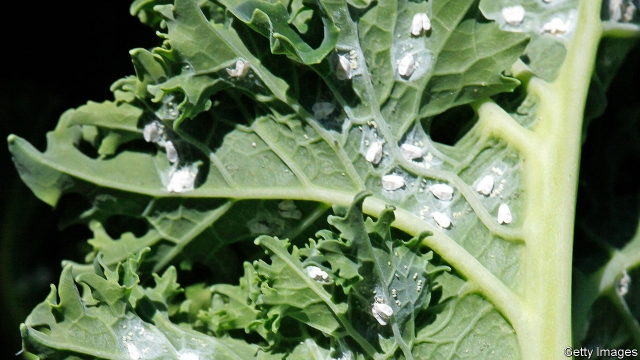

###### A bug in the system

# Whiteflies are such a pest because they hack the way plants communicate 

##### Spoofing a natural defence system 

 

> Mar 28th 2019 

WHEN SOME plants are attacked by herbivores they fight back by producing irritants and toxins as their leaves get chewed up. Certain insects, however, can resist these defences. Among the best at doing this, and hence one of the most troublesome crop pests, is the whitefly. Remarkably, as new research shows, whiteflies enhance their dastardly deeds by hacking a biological early-warning communications system used by plants. 

When whiteflies launch an attack, plants respond by producing jasmonic acid as a defence mechanism. This hormone triggers the production of compounds that interfere with an insect’s digestive enzymes, making it difficult for them to feed. But plants can produce a different substance, salicylic acid, to help ward off pathogens, such as a virus. Whiteflies trick the plant into behaving as if it was threatened with a disease rather than an insect infestation. This is possible because whiteflies have compounds in their saliva that dupe plants into producing more salicylic acid and less insect-repelling jasmonic acid. This ruse makes it much easier for them to infest the plant. 

Peng-Jun Zhang and Xiao-Ping Yu of Jiliang University in China, and their colleagues, wondered whether there might be more to it than that. In particular they decided to investigate what happened to the rallying cry plants make when they are under attack by insects or disease. 

That idea might appear to have been lifted from the film “Avatar”, set on a fictional moon where plants communicate. But in recent years researchers have found that plants do have the ability to raise an alarm when they are threatened. Sometimes this is sent in biochemical messages via root and symbiotic fungal connections in the soil, and sometimes through chemicals released into the air. 

The alarm signals give warning to nearby plants of an imminent threat so that they can prepare to defend themselves. When a pathogen is causing harm, the signals drive a population-wide production of salicylic acid. If insects are the problem, the plants make jasmonic acid as well as special compounds that summon predators to eat the insects. 

As they report in Proceedings of the National Academy of Sciences this week, Drs Zhang and Yu found that whiteflies not only deceive individual plants, making them respond as they would to a disease not an insect, but also spoof their alarm system making them spread the erroneous message. This makes neighbouring plants more vulnerable. 

To show this, the researchers set up an experiment growing tomato plants in glass chambers. Some plants were infested with whiteflies and some left alone. After several days, the air from each chamber was passed into similar chambers containing a healthy tomato plant and left for 24 hours. These new plants were then infested with whiteflies. Although the number of eggs laid on all the plants was much the same, on those exposed to the air of infested plants the new generation of whitefly nymphs developed much more quickly. 

The researchers ran the experiment again but this time looked closely at the compounds produced by plants exposed to the different air samples. They found that while jasmonic acid was produced at the expected high levels during a whitefly attack by plants contained in healthy air, plants exposed to air from infested plants only produced half those levels. Salicylic-acid production showed the reverse trend, with plants exposed to healthy air samples before a whitefly attack producing very little of it and those exposed to air samples from infested plants producing a lot. 

Given these findings, Drs Zhang and Yu argue that if the biochemical mechanism driving plants to send out incorrect warning signals can be found, it might be possible to come up with more effective agricultural countermeasures. That could help farmers protect their crops from a sneaky pest that worldwide costs hundreds of millions of dollars annually. 

-- 

 单词注释:

1.bug[bʌg]:n. 错误, 虫, 病菌, 缺陷, 窃听器, 癖好, 防盗报警器, 双座小汽车, 要人 vt. 装防盗报警器, 装窃听器, 激怒 vi. 捉虫, 暴突 [计] 缺点, 错误 

2.whitefly['hwaitflai]:n. [昆]粉虱 

3.hack[hæk]:n. 劈, 砍, 砍痕, 出租车, 干咳, 晒架, 鹤嘴锄 vt. 劈, 砍, 出租, 用旧 vi. 劈, 砍, 干咳, 驾驶出租车 a. 出租的 

4.spoof[spu:f]:n. 幽默的讽刺诗文, 愚弄, 戏弄 v. 对...作幽默讽刺, 戏弄, 哄骗 a. 哄骗认的 

5.herbivore['hә:bivɒ:]:n. 草食动物 

6.irritant['iritәnt]:a. 刺激的, 刺激性的 n. 刺激物, 刺激剂 

7.toxin['tɒksin]:n. 毒素 [化] 毒素 

8.remarkably[ri'mɑ:kәbli]:adv. 显著地, 引人注目地, 非常地 

9.dastardly['dæstәdli]:a. 卑怯的人, 懦夫, 怯懦 

10.biological[.baiәu'lɒdʒikәl]:a. 生物学的 [医] 生物学的 

11.jasmonic[dʒæs'mɒnɪk]: [医]茉莉酸 

12.mechanism['mekәnizm]:n. 机械, 机构, 结构, 机理, 技巧 [化] 机理; 历程; 机构 

13.hormone['hɒ:mәun]:n. 荷尔蒙 [化] 激素(旧称荷尔蒙) 

14.trigger['trigә]:n. 触发器, 扳机 vt. 触发, 发射, 引起 vi. 松开扳柄 [计] 切换开关 

15.digestive[di'dʒestiv]:a. 消化的, 助消化的 n. 助消化药 

16.enzyme['enzaim]:n. 酶 [化] 酶 

17.salicylic[.sæli'silik]:a. 得自水杨酸的, 水杨酸的 [医] 水杨酰的, 水杨酸基的 

18.pathogen['pæθәdʒ(ә)n]:n. 病原体 [医] 病原体 

19.infestation[.infe'steiʃәn]:n. 骚扰, 大批出没, 横行 [医] 侵染, 感染 

20.saliva[sә'laivә]:n. 唾液, 唾沫, 涎 [医] 涎, 唾液 

21.dupe[dju:p]:n. 傻瓜, 易受骗的人 vt. 欺骗, 愚弄 

22.les[lei]:abbr. 发射脱离系统（Launch Escape System） 

23.ruse[ru:z]:n. 计策, 谋略, 诡计 [法] 诡计, 计策 

24.infest[in'fest]:vt. 骚扰, 寄生于, 大批出没 [医] 传染, 感染 

25.zhang[]:n. 张, 章（中国姓氏） 

26.yu[ju]:n. 禹（传说的中国古代圣君） 

27.rally['ræli]:n. 重振旗鼓, 集合, 群众集会, 跌停回升 v. 重整旗鼓, 集合, 恢复精神, 团结, 挖苦, 嘲笑 

28.avatar[.ævә'tɑ:]:n. 天神下凡化作人形, 化身 

29.fictional['fikʃәnl]:a. 虚构的, 编造的, 小说式的 [法] 拟制的, 假定的, 虚构的 

30.biochemical[.baiәu'kemikl]:a. 生物化学的 [机] 生物化学的 

31.symbiotic[.simbai'ɒtik]:a. 共栖的, 共生的 [医] 共生的 

32.fungal['fʌŋ^әl]:a. 真菌, 突然发生而迅速生长的东西, 真菌类植物, 海绵肿, 真菌类病害 [医] 真菌的, 霉菌的 

33.imminent['iminәnt]:a. 即将来临的, 逼近的 

34.summon['sʌmәn]:vt. 召唤, 召集, 号召, 振奋, 唤起, 鼓起 [经] 传唤, 传讯 

35.predator['predәtә]:n. 食肉动物, 掠夺者 [医] 捕食者 

36.proceeding[prәu'si:diŋ]:n. 进行, 程序, 行动, 诉讼程序, 事项 [化] 会议论文集 

37.erroneous[i'rәuniәs]:a. 错误的, 不正确的 [法] 错误的, 不正确的 

38.vulnerable['vʌlnәrәbl]:a. 易受伤害的, 有弱点的, 易受影响的, 脆弱的, 成局的 [医] 易损的 

39.nymph[nimf]:n. 居于山林水泽的仙女, 蛹, 美丽的少女 [医] 稚虫, 若虫, 蝻 

40.quickly['kwikli]:adv. 很快地 

41.countermeasure['kauntә.meʒә]:n. 对策, 反抗手段, 反措施 [法] 对策, 反对手段, 抵制措施 

42.sneaky['sni:ki]:a. 鬼祟的, 卑微的 

43.annually['ænjuәli]:adv. 一年一次, 每年 [经] 年度的, 每年的 

