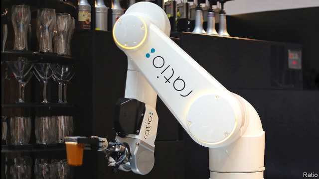

###### Coffee shops

# Will your next barista be a robot? 

##### Inhumanly good service coming soon to a café near you 

 

> Mar 28th 2019 

GAVIN PATHROSS likes his Americano at a particular strength, with exactly 2.8 shots of espresso, an order that human baristas struggle to get right. But the baristas at Ratio, his new coffee shop in Shanghai, are anything but human. Customers specify, order and pay for their coffee via their smartphones. A robot arm then grinds the beans, pumps shots of espresso and carries out the rest of the work. The robot can supply water and coffee in any ratio desired—hence the shop’s name. Once it has prepared the beverage, it passes the finished product to a human waiter for serving. 

Ratio’s robot baristas are part of a trend. Hamburger joints and other fast-food outlets are starting to be robotised in some places. Now it is the turn of cafés. Mr Pathross’s Shanghai shop is, at the moment, a one-off. But Coffee Haus is a commercial system intended for deployment in airports, offices and other high-volume locations. It is the brainchild of Chas Studor, founder of Briggo, a firm in Austin, Texas. Under his guidance Briggo’s engineers have developed a device that is a couple of metres tall, four metres across, and can turn out 100 cups an hour. 

Briggo has cut human beings out of the loop completely. A Coffee Haus machine lets you order and pay for your coffee via an app—and, if you have done so remotely, keeps your drink in a locked area, accessible via a code which it texts to you. For those present, the Coffee Haus robot provides a certain amount of theatrical appeal (a window lets you watch the coffee being made). But Mr Studor says the real aim is not theatre but to carry out the same processes as a standard coffee bar does, with robotic precision. For example, a big challenge for human baristas is that different types of coffee have different ideal “extraction parameters”—how many beans to how much water, brewed at what temperature and for how long. During busy spells, humans sometimes struggle to get all of these things right every time. The robot is inhumanly perfect. 

Café X in San Francisco takes advantage of the showy appeal of robots. Its computer arm, which is described as having “a quirky personality,” even waves to customers. Café X sells mostly from kiosks in streets and shopping malls. Orders can be made from an app or via touch screen at the kiosk itself. But it has not dispensed with human attendants and has someone on hand to talk to customers and provide a human touch. 

All developers of robot baristas stress the speed, reliability and consistency of their systems. They give the convenience of vending-machine coffee without the horror of it. And coffee is only the start. Soon, such devices will be making tea and other drinks at the tap of an app. Human servers, meanwhile, will be freed from the drudgery of preparing endless lattes, to concentrate on customer service. Whether the outcome is viewed as people and machines each playing to their strengths in a harmonious team, or a corporate techno-dystopia with a Starbucks twist, is perhaps—like preferences in coffee—a matter of taste. 

-- 

 单词注释:

1.barista[bə'rɪstə]:n. 咖啡师；咖啡吧员 

2.inhumanly[ɪnh'ju:mənlɪ]:adv. 无人情味地, 残忍地 

3.gavin[]:n. 加文（男子名） 

4.americano[ɑ:,meri'kɑ:nəu]:n. 美式咖啡；美国佬；阿美利加诺（人名） 

5.espresso[e'spresәu]:n. （用汽加压煮出的）浓咖啡 

6.smartphones[]: 智能手机（smartphone的复数） 

7.beverage['bevәridʒ]:n. 饮料 [化] 饮料(如牛奶、茶、咖啡、啤酒等) 

8.robotise['rəubətaiz]:vt. [主英国英语] = robotize 

9.hau[]:abbr. 自动暖气控制系统 n. (Hau)人名；(越)厚；(罗)哈乌；(法)奥；(中)郝(普通话·威妥玛)；(柬)华；(日)匐(姓)；(德、捷、缅)豪 

10.deployment[]:[计] 展开 

11.brainchild['breintʃaild]:n. 脑力劳动的产物 

12.cha[tʃɑ:]:n. （英俚）茶 

13.founder['faundә]:n. 创立者, 建立者 vt. 使沉没, 使摔倒, 弄跛, 浸水, 破坏 vi. 沉没, 摔到, 变跛, 倒塌, 失败 

14.austin['ɔ:stin]:n. 奥斯丁（人名）；英国制汽车牌名 

15.Texas['teksәs]:n. 德克萨斯 

16.remotely[]:adv. 极小地, 极细微地 

17.theatrical[θi'ætrikl]:a. 剧场的, 夸张的, 戏剧性的 n. 戏剧演出 

18.robotic[rәu'bɔtik]:a. 自动的；机器人的, 像机器人的 

19.extraction[ik'strækʃәn]:n. 抽出, 取出, 拔出术, 抽出物 [化] 萃取; 提取 

20.brew[bru:]:n. 酿造酒, 酝酿 v. 酿造, 酝酿 

21.inhumanly[ɪnh'ju:mənlɪ]:adv. 无人情味地, 残忍地 

22.x[eks]:n. 未知数 [计] 交换, 变址, 索引, 传输 

23.san[sɑ:n]:abbr. 存储区域网（Storage Area Networking） 

24.francisco[fræn'siskәu]:n. 弗朗西斯科（男子名, 等于Francis） 

25.showy['ʃәui]:a. 艳丽的, 炫耀的 

26.quirky['kw\\:ki]:a. 诡诈的, 突兀的, 古怪的, 离奇的 [法] 诡诈的, 颇为曲折的 

27.kiosk[ki'ɒsk]:n. 亭, 凉亭, 报摊 

28.mall[mɔ:l]:n. 林荫路 

29.APP[]:[计] 应用, 应用程序; 相联并行处理器 

30.dispense[dis'pens]:vt. 分发, 分配 vi. 特许, 豁免 

31.attendant[ә'tendәnt]:n. 随从, 侍者, 出席者 a. 侍候的, 伴随的, 出席的, 在场的 

32.developer[di'velәpә]:n. 开发者 [计] 显影器 

33.consistency[kәn'sistәnsi]:n. 坚硬性, 黏稠度, 一致性 [化] 稠度; 一致性 

34.server['sә:vә]:n. 服伺者, 上菜用具, 发球员 n. 服务器 [计] 服务器, 服务器启动程序, 服务台程序 

35.drudgery['drʌdʒәri]:n. 苦差事, 苦工 

36.latte[ˈlɑ:teɪ]:n. 拿铁咖啡; （意大利语）牛奶 

37.harmonious[hɑ:'mәuniәs]:a. 和睦的, 调和的, 和谐的, 协调的 

38.corporate['kɒ:pәrit]:a. 社团的, 合伙的, 公司的 [经] 团体的, 法人的, 社团的 

39.starbuck['sta:bʌk]:n. 星巴克（咖啡公司） 

