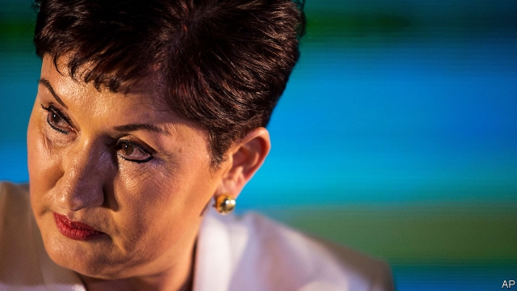

###### Enemies in high places

# Can Thelma Aldana, Guatemala’s corruption fighter, win the presidency? 

##### The establishment is fighting back 

 

> Mar 28th 2019 

THELMA ALDANA’S elevation to the status of heroine was sudden. The International Commission Against Impunity in Guatemala (CICIG), a UN-backed body that helps prosecutors with corruption cases, described as “unsuitable” her appointment to the supreme court in 2009. When she became attorney-general in 2014, many Guatemalans worried that she was too close to the government. Those doubts dissolved in 2015, when she worked with CICIG to uncover a scandal that led to the resignation of the president, Otto Pérez Molina. Ms Aldana jailed some 250 people before leaving office in 2018. She launched an investigation of the current president, Jimmy Morales, for campaign-finance violations in 2015, and of members of his family on other charges. (They deny wrongdoing.) 

That record has made Ms Aldana the de facto leader of a movement composed of activists, judges and friendly foreigners, which seeks to establish the rule of law in a country whose leading lights often have criminal connections. It has grown in confidence. Ms Aldana is a candidate in the presidential election, whose first round is scheduled for June 16th. Although she is second in the polls, she could win a run-off in August. She “would be the first president that [Guatemala’s oligarchs] can’t control,” says Edgar Ortíz Romero, a professor at Francisco Marroquín University.  

They may be trying to stop her. On March 19th a judge issued a warrant for her arrest on charges of embezzlement and tax fraud. Her supporters claim the charge is politically motivated. An electoral official told CNN that “a large majority” of political parties pressed him to keep Ms Aldana and her party, Semilla (Seed), off the ballot. 

Ms Aldana, who denies wrongdoing, fled to El Salvador. She is expected to return if the electoral court reaffirms her immunity, to which she is entitled as a candidate. 

The charges against her raise the stakes in an election that was already bound to be momentous. It pits her promise to renew Guatemala’s democracy against efforts by a worried ruling class to entrench its power. Much depends on whether Ms Aldana stays on the ballot. 

The roots of Guatemala’s dysfunction are in its 36-year civil war, one of Latin America’s bloodiest, which ended in the 1990s. Some 200,000 people died. Unlike in El Salvador, where a stalemate led to the creation of two post-war parties that have held each other (imperfectly) accountable, in Guatemala the left-wing guerrillas were beaten decisively. The parties that emerged from the war are numerous and weak, producing gridlock in congress. No party has won more than 5% of the vote in all of the past three presidential elections.  

In this jumble, corruption flourishes. During the war (but after the end of military rule) black-ops groups infiltrated the state. After the war they focused on profit. Congressmen and mayors team up to put in their pockets some of the money meant for local infrastructure projects. A corrupt network of officers, businessmen and politicians became the main nexus of power. Half of campaign donations come from firms with state contracts; 25% is from organised crime. 

In 2006 the government invited CICIG to Guatemala to break up the cabal. At first it just investigated drug-trafficking and atrocities committed during the civil war. Iván Velásquez, a Colombian who became its chief in 2013, took the “important leap” of taking on corruption cases, says Eduardo Stein, Guatemala’s vice-president from 2004 to 2008. The cause became popular. Mr Pérez was pushed out of the presidency with the help of 100,000 protesters.  

The establishment views CICIG as an unelected foreign agency that is taking over the state, and Ms Aldana as its tool. Mr Morales, a former comedian who has surrounded himself with ex-army officers, refused to renew its mandate, which expires in September. The Trump administration did not object loudly. In January Mr Morales tried to force CICIG out of the country. When judges from the constitutional court blocked that effort, congress tried to strip them of their immunity. Some observers fault Mr Velásquez and Ms Aldana for going after members of Mr Morales’s family for what is not clearly a serious crime. 

Some members of Guatemala’s elite regard the anti-graft campaign as part of a broader attack on peace and prosperity. Business complains that the state’s aggressive recent efforts to collect the taxes it is owed endanger growth and that courts are issuing rulings that damage enterprise. 

Guatemala’s reckoning with its past has also become part of the conflict between reformers and the right. Conservatives back a proposal in congress to give an amnesty to 30 former army officers jailed for human-rights abuses. That will encourage national reconciliation, they claim. Human-rights activists see it as part of a backlash by the establishment, intensified by Ms Aldana’s political rise. “We are in this crisis because we touched the heart of the deep state,” says Martín Rodríguez Pellecer, editor of Nómada, a news website. 

The charges against Ms Aldana concern a payment early in her tenure as attorney-general to a university dean for staff training that allegedly never took place. The 20,000-quetzal ($2,600) fee looks abnormally high for such work. Few people deny that the case raises questions. One local journalist suggests that the payment is “a remnant of her time on the dark side of the moon”, before she became an anti-corruption crusader.  

Both of Ms Aldana’s main rivals for the presidency have legal problems. Zury Ríos, the daughter of Efrain Ríos Montt, a dictator during the civil war, may be barred from running. The constitution bans relatives of putschists from seeking the presidency (never mind that Ms Ríos ran in 2015, and that Ríos Montt himself ran in 2003). Sandra Torres, a former first lady who is leading in the polls, frightens the elite less than does Ms Aldana. She faces questions over financing of her unsuccessful run in 2015, although she, too, has immunity for now. 

Ms Aldana no doubt hopes to emulate recently elected left-of-centre presidents in Mexico and El Salvador, who railed against corruption during their campaigns. She has described herself as “of the right, but with advanced thoughts” (ie, an advocate of human rights). Her problem is that just half of Guatemalans live in cities, where worry about corruption is strongest. Anti-graft hashtags do not go viral in villages, where other needs are more pressing. Ms Aldana may have to broaden her message for rural voters.  

Even if she wins, her corruption fight will face obstacles. She would not take office until January, four months after CICIG’s mandate expires. She may need to find a way to re-establish it. 

This would be the first of many battles. Congress still needs fixing. Child malnutrition and water shortages persist. But more Guatemalans are coming to believe that the state will not solve such problems until it deals with corruption. They just might pick Ms Aldana to do the job. 

-- 

 单词注释:

1.thelma['θelmә]:n. 西尔玛（女子名） 

2.aldana[]:[网络] 任峻；阿尔丹那 

3.corruption[kә'rʌpʃәn]:n. 腐败, 堕落, 贪污 [计] 论误 

4.thelma['θelmә]:n. 西尔玛（女子名） 

5.elevation[.eli'veiʃәn]:n. 海拔, 提高, 仰角 [计] 仰角 

6.statu[]:[网络] 状态查看；雕像；特级雪花白 

7.impunity[im'pju:niti]:n. 不受惩罚, 无事, 无患 [法] 不受刑罚, 免罚, 免罪 

8.Guatemala[.gwɑ:tә'mɑ:lә]:n. 危地马拉 

9.prosecutor['prɒsikju:tә]:n. 实行者, 告发者, 公诉人 [法] 原告, 起诉人, 检举人 

10.Guatemalan[,ɡwæti'mɑ:lən]:n. 危地马拉人 a. 危地马拉的（中美洲的一个国家） 

11.otto['ɒtәu]:n. 玫瑰油 

12.Pérez[]:[地名] 佩雷斯 ( 阿根、巴拉、智 ) 

13.MOLINA[]:莫利纳（人名） 

14.jimmy['dʒimi]:n. 铁撬 vt. 撬 

15.morale[mɒ'rɑ:l]:n. 士气, 道德 

16.violation[.vaiә'leiʃәn]:n. 违反, 违背, 妨碍 [法] 违犯, 违背, 违反 

17.wrongdoing['rɒŋ'du:iŋ]:n. 干坏事, 坏事 

18.de[di:]:[化] 非对映体过量 [医] 铥(69号元素铥的别名,1916年Eder离得的假想元素) 

19.facto[]:[法] 实际上, 事实上 

20.activist['æktivist]:n. 激进主义分子 

21.presidential[.prezi'denʃәl]:a. 总统制的, 总统的, 首长的, 统辖的 [法] 总统的, 议长的, 总经理的 

22.edgar['ed^ә]:n. 埃德加（男子名） 

23.Romero[]:罗梅罗（人名） 

24.francisco[fræn'siskәu]:n. 弗朗西斯科（男子名, 等于Francis） 

25.warrant['wɒ:rәnt]:n. 授权, 正当理由, 根据, 证明, 批准, 凭证, 令状, 委任状 vt. 授权给, 保证, 担保, 批准, 使有正当理由 

26.embezzlement[im'bezlmәnt]:n. 盗用, 挪用, 侵占 [经] 贪污, 盗用(公款), 监守自盗 

27.fraud[frɒ:d]:n. 欺骗, 欺诈, 诡计, 骗子 [经] 欺诈, 舞弊, 骗子 

28.supporter[sә'pɒ:tә]:n. 支持者, 后盾, 迫随者, 护身织物 [法] 支持者, 赡养者, 抚养者 

29.politically[]:adv. 政治上 

30.electoral[i'lektәrәl]:a. 选举人的, 选举的, (有关)选举的 [法] 选举的, 选举人的, 由选举人组成的 

31.cnn[]:abbr. 美国有线电视新闻网络（Cable News Network） 

32.semilla[]:[网络] 赛米亚；赛米亚佛拉明哥舞团；动画短片 

33.ballot['bælәt]:n. 投票, 投票用纸, 抽签 vi. 投票, 抽签 vt. 投票选出, 拉选票 

34.el[el]:abbr. 预期损失（Expected Loss） 

35.Salvador['sælvәdɔ:]:[经] 萨尔瓦多 

36.reaffirm[.ri:ә'fә:m]:vt. 重申, 再确认 

37.immunity[i'mju:niti]:n. 免疫, 免疫性, 免除 [化] 免疫性 

38.momentous[mәu'mentәs]:a. 重大的, 重要的 

39.entrench[in'trentʃ]:vt. 围以壕沟, 防护, 保卫, 使处于牢固地位 vi. 掘壕, 侵犯 

40.dysfunction[dis'fʌŋkʃәn]:n. 机能不良, 机能障碍 [医] 机能障碍, 机能不良 

41.bloody['blʌdi]:a. 血腥的, 嗜杀的, 有血的 

42.stalemate['steilmeit]:n. 僵持状态, 僵局, 陷于困境, 胶着状况 vt. 将...逼和, 使僵持, 使陷入困境 

43.creation[kri:'eiʃәn]:n. 创造, 创作物, 发明 [化] 产生 

44.imperfectly[im'pә:fiktli]:adv. 不完全地, 有缺点地, 不完备地 

45.accountable[ә'kauntәbl]:a. 负有责任的, 可说明的, 可解释的 [经] 负有责任的 

46.guerrilla[gә'rilә]:n. 游击队 

47.decisively[]:adv. 果断地；决然地 

48.gridlock[ˈgrɪdlɒk]:n. 交通全面大堵塞; 僵局 v. （交通等）堵塞 

49.jumble[dʒʌmbl]:vi. 搀杂, 混杂 vt. 搞乱, 使混乱 n. 混乱, 薄饼 

50.infiltrate[in'filtreit]:vt. 使浸润, 使潜入, 使渗入 vi. 渗入 n. 渗透物 

51.congressman['kɒŋgresmәn]:n. 国会议员, 众议院议员 [法] 国会议会 

52.infrastructure['infrәstrʌktʃә]:n. 基础结构, 基础设施 [经] 基础设施 

53.nexus['neksәs]:n. 连结, 关系 [化] 融合膜 

54.donation[dәu'neiʃәn]:n. 捐赠物, 捐款, 捐赠 [经] 赠品, 捐款, 捐赠 

55.cabal[kә'bæl]:n. 秘密结社, (尤指政治上的)阴谋 vi. 策划阴谋 

56.atrocity[ә'trɒsiti]:n. 残暴, 凶恶, 暴行 [法] 暴行, 残酷, 残忍 

57.Colombian[kә'læmbiәn]:n. 哥伦比亚人 a. 哥伦比亚的 

58.Eduardo[]:n. 爱德华多（姓氏） 

59.stein[stain]:n. 啤酒杯 

60.presidency['prezidәnsi]:n. 总统职权, 总裁职位 

61.unelected[ˌʌnɪˈlektɪd]:a. 未经选举的 

62.comedian[kә'mi:djәn]:n. 喜剧演员 

63.mandate['mændeit]:n. 命令, 指令, 要求 vt. 委任统治 

64.expire[ik'spaiә]:vi. 期满, 呼气, 断气 vt. 呼出 

65.constitutional[.kɒnsti'tju:ʃәnl]:a. 宪法的, 立宪的, 体质的 [医] 全身的; 体质的 

66.elite[ei'li:t]:n. 精华, 精锐, 中坚分子 

67.endanger[in'deindʒә]:vt. 危及 [法] 使危险, 危及 

68.ruling['ru:liŋ]:n. 判决, 裁定, 统治 a. 统治的, 支配的, 普遍的 

69.reckon['rekәn]:vt. 计算, 总计, 估计, 认为, 猜想 vi. 数, 计算, 估计, 依赖, 料想 

70.reformer[ri'fɒ:mә]:n. 改革家, 改革运动者 [化] 转化炉; 转化器; 重整器; 重整炉 

71.amnesty['æmnisti]:n. 大赦, 赦免 

72.reconciliation[,rekәnsili'eiʃәn]:n. 和解, 和好, 复交, 调解, 调停, 和谐, 一致, 甘愿, 顺从 [经] (银行往来)调节, 调和, 一致 

73.backlash['bæklæʃ]:n. 后冲, 强烈反对 [电] 反撞, 逆栅流 

74.intensify[in'tensifai]:vt. 加强 vi. 强化 

75.tenure['tenjuә]:n. 享有, 保有期 [经] (财产,职位等的)占有, 占有权 

76.dean[di:n]:n. 院长, 主持牧师 [法] 外交团长, 学院院长, 教务长 

77.allegedly[ә'ledʒidli]:adv. 依其申述 

78.abnormally[]:adv. 不正常, 异常, (贬)不同寻常, 不规则, 变态, 反常 

79.remnant['remnәnt]:n. 剩余, 零料, 遗迹 a. 剩余的, 残余的 

80.efrain[]:n. 【男名】男子名 [网络] 埃弗拉因；埃夫仁 

81.montt[]:[网络] 青岛-蒙特港；青岛到蒙特港 

82.dictator['dikteitә]:n. 命令者, 独裁者 

83.putschists[]:[网络] 凶手 

84.sandra[]:n. 桑德拉（女子名） 

85.Torre[]:n. (Torre)人名；(英、法)托尔；(德、西、意、葡、塞)托雷 托尔 托雷 

86.les[lei]:abbr. 发射脱离系统（Launch Escape System） 

87.emulate['emjuleit]:vt. 效法, 尽力赶上, 同...竞争 [计] 仿真 

88.hashtags[]:[网络] 标签；话题标签；标签运用 

89.viral['vairәl]:a. 病毒的, 病毒引起的 [医] 病毒的 

90.broaden['brɒ:dn]:vi. 变宽, 扩大 vt. 放宽, 使扩大 

91.malnutrition[.mælnju:'triʃәn]:n. 营养失调, 营养不良 [医] 营养不良 

