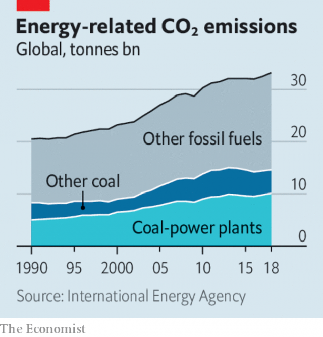

###### The Silly Isles

# Business this week 

> Mar 28th 2019 

At a product launch focused squarely on digital services (rather than a new device) Apple unveiled its video-streaming Apple  tv+ app. Featuring original programmes as well as content from cable channels, such as HBO, the app will be available on certain smart televisions and on Amazon Fire and Roku. The move into Netflix’s territory comes as Apple faces slowing demand for the iPhone. See article. 

Purdue Pharma, which makes OxyContin, an opioid painkiller blamed for a surge in addiction and overdose deaths in America, paid $270m to settle a civil lawsuit brought by the state of Oklahoma. Dozens of lawsuits have been lodged against Purdue and other drug companies in America. Oklahoma claimed that Purdue’s aggressive marketing of OxyContin drove the epidemic of opioid addiction. Charitable trusts funded by the Sackler family, which owns Purdue, are on the defensive; several museums say they will not accept further donations. See article. 

Donald Trump said he would nominate Stephen Moore to the board of the Federal Reserve. Mr Moore founded the Club for Growth, which backs politicians who pursue lower taxes and smaller government. He is a controversial choice, having called for the Fed to target commodity prices and described Jerome Powell, its chairman, as “totally incompetent” (he says he now regrets making the remark). See article. 

The board of Swedbank sacked its chief executive, shortly before a shareholders’ meeting that was going to discuss her fate. A day earlier Swedish authorities had raided the bank’s offices in Stockholm as part of a growing money-laundering investigation, amid allegations that €135bn ($152bn) of money from mostly Russian clients had passed through Swedbank’s branch in Estonia. A regulator in New York state has also reportedly opened inquiries into Swedbank on several fronts. 

After another plunge in the lira, Turkey’s central bank said it would use its “liquidity-management tools” to prop up the currency. The banking authority, meanwhile, began an investigation into JPMorgan Chase, because of what it described as the bank’s “manipulative” advice to sell the lira. Data showing a drop in Turkey’s foreign-currency reserves triggered more volatile trading. See article. 

Criticism of the relationship between Boeing and aviation regulators continued to mount following the crash of a second 737 MAX 8 aircraft. The acting head of the Federal Aviation Administration was hauled in front of Congress, where he defended the plane’s certification process. To add to the pressure on Boeing, Airbus sealed a huge order for 300 jets from China. 

The European Parliament voted in favour of a controversial digital copyright law. Two bits of the new directive have drawn the most ire from opponents: getting search engines and news aggregators to pay for links from news websites, and holding internet companies responsible for material published without permission. On the latter measure, websites such as YouTube worry they will need to implement pre-emptive blocking to avoid being sued. See article. 

 

Energy-related carbon emissions grew by 1.7% in 2018 to a historic high of 33bn tonnes, according to the International Energy Agency. That was in part because of adverse weather, which increased demand for heating and cooling. China’s emissions were up by 2.5%, and America’s by 3.1%. Emissions declined in Britain, France, Germany and Japan. See article. 

The British government said that telecoms gear made by Huawei remains riddled with bugs and security flaws, and that the Chinese firm shows little sign of addressing the problems. America has publicly warned its allies against using Huawei’s kit, citing espionage worries, though not all have followed its advice. 

Ahead of Lyft’s long-awaited IPO, Levi Strauss made a successful return to the stockmarket. The jeansmaker’s share price did a zippy trade on its first day, closing well above the offer price of $17. 

Uber, which is expected to make its stockmarket debut next month, struck a deal to buy Careem, a rival ride-hailing firm that operates in 15 countries in and around the Middle East. Valued at $3.1bn, it is Uber’s biggest acquisition. 

American boots might be back on the Moon sooner than had been thought. Mike Pence, America’s vice-president, said the administration aimed to put someone on the lunar surface by 2024, four years ahead of NASA’s estimate of 2028 (and before the end of a possible second term for Donald Trump). That is one giant leap in ambitions. A new launch system to propel crews into deep space has been plagued by delays. If Mr Pence wants to win what he said is a new “space race”, he might have to turn to SpaceX or other commercial rocket-providers. 

-- 

 单词注释:

1.isle[ail]:n. 小岛, 群岛 vt. 使成为岛状 vi. 住在岛屿上 

2.squarely['skwєәli]:adv. 干脆地, 正好, 直角地 

3.unveil[.ʌn'veil]:vt. 揭开, 揭幕, 除去...的面纱 vi. 显露, 除去面纱 

4.APP[]:[计] 应用, 应用程序; 相联并行处理器 

5.hbo[]:abbr. 家庭影院（Home Box Office）；美国家庭电影院 

6.amazon['æmәzɒn]:n. 亚马孙河 [医] 无乳腺者 

7.roku[]:n. (Roku)人名；(日)六(名) 

8.iphone[]:n. 苹果手机 

9.purdue[]:n. 普杜大学（美国一所大学） 

10.pharma[]:n. 制药公司 

11.oxycontin[]: [医]盐酸羟考酮控释片剂<镇痛药> 

12.opioid[əʊ'pi:əʊɪd]:a. 类鸦片（引起）的 n. 类鸦片活性肽 

13.painkiller['pein,kilә(r)]:n. 解痛药, 止痛片, 止痛药 

14.surge[sә:dʒ]:n. 巨涌, 汹涌, 澎湃 vi. 汹涌, 澎湃, 颠簸, 猛冲, 突然放松 vt. 使汹涌奔腾, 急放 [计] 电压尖峰 

15.addiction[ә'dikʃәn]:n. 入迷, 瘾 [医] 瘾, 癖嗜 

16.overdose['әuvәdәus]:n. 配药量过多 vt. 配药过量, 使过分沉溺 

17.lawsuit['lɒ:sju:t]:n. 诉讼 [法] 诉讼, 诉讼案件 

18.Oklahoma[.әuklә'hәumә]:n. 俄克拉何马 

19.marketing['mɑ:kitiŋ]:n. 行销, 买卖 [经] 推销, 在市场买卖, 销售 

20.epidemic[.epi'demik]:n. 传染病, 流行病 a. 流行的, 传染性的 

21.charitable['tʃæritәbl]:a. 大慈大悲的, 宽厚的, 慈善的 [法] 慈善的, 慷慨的, 宽恕的 

22.sackler[]: [人名] 萨克勒 

23.defensive[di'fensiv]:a. 防卫的, 防备用的, 自卫的 n. 守势, 防卫姿势, 防卫物 

24.donation[dәu'neiʃәn]:n. 捐赠物, 捐款, 捐赠 [经] 赠品, 捐款, 捐赠 

25.nominate['nɒmineit]:vt. 提名, 任命, 命名 [法] 提名...为候选人, 指定, 推荐 

26.stephen['sti:vn]:n. 斯蒂芬（男子名） 

27.moore['muә]:n. 摩尔（男子名） 

28.commodity[kә'mɒditi]:n. 农产品, 商品, 有用的物品 [经] 商品, 货物, 日用品 

29.jerome[dʒә'rәum]:n. 杰罗姆（男子名） 

30.powell['pәuәl, 'pauәl]:n. 鲍威尔（英国物理学家） 

31.incompetent[in'kɒmpitәnt]:a. 无能力的, 无资格的, 机能不全的, 不胜任的 n. 无能力者 

32.Swedish['swi:diʃ]:n. 瑞典人, 瑞典语 a. 瑞典的, 瑞典人的, 瑞典语的 

33.Stockholm['stɒkhәulm]:n. 斯德哥尔摩 

34.amid[ә'mid]:prep. 在其间, 在其中 [经] 在...中 

35.allegation[.æli'geiʃәn]:n. 断言, 主张, 申辩 [法] 声明, 事实陈述, 断言 

36.client['klaiәnt]:n. 客户, 顾客, 委托人 [计] 客户, 客户机, 客户机程序 

37.Estonia[es'tәuniә]:n. 爱沙尼亚 

38.regulator['regjuleitә]:n. 调整者, 校准者, 校准器, 调整器, 标准钟 [化] 调节剂; 调节器 

39.york[jɔ:k]:n. 约克郡；约克王朝 

40.reportedly[ri'pɒ:tidli]:adv. 根据传说, 根据传闻, 据报道 

41.lira['liәrә]:n. 里拉 

42.prop[prɒp]:n. 支柱, 支持者, 倚靠人, 道具, 螺旋桨 vt. 支撑, 维持 

43.jpmorgan[]:[网络] 摩根大通；摩根大通银行；摩根大通公司 

44.manipulative[mә'nipjulәtiv]:a. 处理的, 巧妙处理的, 操纵的 

45.datum['deitәm]:n. 论据, 材料, 资料, 已知数 [医] 材料, 资料, 论据 

46.trigger['trigә]:n. 触发器, 扳机 vt. 触发, 发射, 引起 vi. 松开扳柄 [计] 切换开关 

47.volatile['vɒlәtail]:a. 挥发性的, 可变的, 不稳定的, 飞行的, 轻快的, 爆炸性的 n. 有翅动物, 挥发物 [计] 易失的 

48.boe[bəu]:abbr. back outlet eccentric 后偏心（轮）出口 

49.MAX[mæks]:[计] 最大 

50.haul[hɒ:l]:n. 用力拖拉, 拖运, 强拉, 捕获量, 拖运距离 vi. 拖, 拉, 改变方向, 改变主意 vt. 拖拉, 拖运 

51.certification[.sә:tifi'keiʃәn]:n. 证明 [经] 证明 

52.airbus['eәbʌs]:空中客车 

53.copyright['kɒpirait]:n. 版权, 著作权 [法] 著作权 

54.directive[di'rektiv]:a. 指导的, 指挥的, 方向的 n. 指令 [计] 指令; 命令 

55.ire[aiә]:n. 忿怒 [电] 美国无线电工程师学会 

56.aggregator[ˈægrɪgeɪtə(r)]:n. 聚合器, 整合者; 汇集者, 聚合 

57.youtube[]:n. 视频网站（可以让用户免费上传、观赏、分享视频短片的热门视频共享网站） 

58.emission[i'miʃәn]:n. 发射, 射出, 发行 [医] 发射, 遗精 

59.historic[hi'stɒrik]:a. 历史上著名的, 有历史性的 

60.tonne[tʌn]:n. 吨, 公吨 [经] 吨 

61.adverse['ædvә:s]:a. 不利的, 敌对的, 相反的, 逆的 [法] 相反的, 敌对的, 逆的 

62.telecom['telәkɔm]:telecommunication 电信 

63.huawei[]: 华为 

64.bug[bʌg]:n. 错误, 虫, 病菌, 缺陷, 窃听器, 癖好, 防盗报警器, 双座小汽车, 要人 vt. 装防盗报警器, 装窃听器, 激怒 vi. 捉虫, 暴突 [计] 缺点, 错误 

65.flaw[flɒ:]:n. 缺点, 裂纹, 瑕疵, 一阵狂风 [化] 划痕; 裂缝; 裂纹 

66.ally['ælai. ә'lai]:n. 同盟者, 同盟国, 助手 vt. 使联盟, 使联合, 使有关系 vi. 结盟 

67.kit[kit]:n. 装备, 工具箱, 成套工具 [计] 成套部件; 成套零件 

68.cite[sait]:vt. 引用, 引证, 表彰 [建] 引证, 指引 

69.espionage[.espiә'nɑ:ʒ]:n. 间谍活动 [法] 间谍活动, 刺探, 间谍 

70.ipo[]:abbr. 首次公开募股（Initial Public Offerings）；初次公开发行（Initial Public Offering） 

71.levi['li:vai]:n. 利瓦伊（男子名） 

72.strauss[]:n. 施特劳斯（奥国作曲家） 

73.stockmarket[s'tɒkmɑ:kɪt]: 证券市场; 证券交易所; 证券行情 

74.zippy['zipi]:a. 元气旺盛的, 敏捷的, 活泼的 

75.uber['ju:bә]:[医] 乳房 

76.debut['deibju:]:n. 初次登台, 开张 v. 初次登台 

77.mike[maik]:vi. 偷懒, 游手好闲 n. 休息, 游手好闲, 扩音器, 话筒 

78.propel[prәu'pel]:vt. 推进, 驱使 [机] 推进 

79.plague[pleig]:n. 瘟疫, 天罚, 麻烦, 灾祸 vt. 折磨, 使苦恼, 使得灾祸 

80.spacex[]:[网络] 太空探索技术公司；美国太空探索技术公司；太空探索科技公司 

