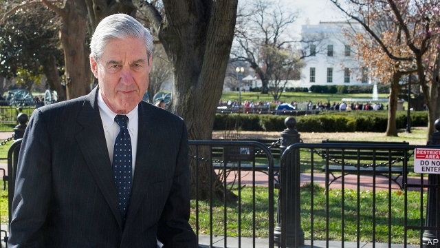

###### The Silly Isles

# Politics this week 

 

> Mar 28th 2019 

After almost two years investigating Russian interference in America’s presidential election of 2016, Robert Mueller presented his report to William Barr, the attorney-general, who released a summary. The special counsel found no collusion between anyone on Donald Trump’s campaign and the Russians who had meddled in the election. Questions about whether the president tried to obstruct justice were left “unresolved”. Democrats were not pleased; they want Mr Barr to release the full report to Congress. See article. 

In a sharp reversal of its earlier position, the Justice Department said it would now support striking down the whole of Obamacare, rather than certain aspects of it. The health-care act is going through a tortuous legal appeals process and will probably end up before the Supreme Court. 

Mr Trump caused confusion when he tweeted that he had overturned “additional large-scale sanctions” against North Korea. That led to much head-scratching, since no such sanctions had been announced. He may have been thinking of planned measures, or of penalties for Chinese firms involved in sanctions-busting. 

Mexico’s president, Andrés Manuel López Obrador, asked Spain to apologise for crimes committed against indigenous Mexicans by the conquistadors 500 years ago. He also asked the Vatican to say sorry. Spain refused to apologise, saying the conquest “cannot be judged in the light of contemporary considerations”. 

Two Russian military planes with some 100 troops and tonnes of equipment aboard arrived in Caracas, Venezuela’s capital. Russia backs Nicolás Maduro, the country’s left-wing dictator. America’s secretary of state, Mike Pompeo, told the Russian foreign minister, Sergei Lavrov, that “the United States and regional countries will not stand idly by as Russia exacerbates tensions in Venezuela.” 

Michel Temer, Brazil’s president until this year, was released from jail four days after being arrested at the request of prosecutors investigating corruption. He was not charged with a crime. 

Israel exchanged heavy fire with Palestinian militants in Gaza. The fighting started when a rocket from Gaza hit a house north of Tel Aviv. No deaths were reported. Binyamin Netanyahu, Israel’s prime minister, cut short a trip to America to deal with the crisis. See article. 

Donald Trump signed a proclamation recognising Israel’s control of the Golan Heights, which it captured from Syria in 1967. Arab countries rejected the move, which was seen as a political gift to Mr Netanyahu just weeks before Israel holds an election. 

An American-backed Kurdish and Arab militia ousted the jihadists of Islamic State from their last foothold in Syria. IS now resembles a more conventional terrorist group, with lots of money but no territory. 

After weeks of protests against the ailing president, Abdelaziz Bouteflika, Algeria’s army chief, Ahmed Gaid Salah, demanded that he be declared unfit to rule. Mr Salah had previously stood by Mr Bouteflika’s attempt to remain president while holding a national conference on Algeria’s political future. Many Algerians think Mr Salah should go, too. 

The UN investigated a massacre of Fulani villagers in central Mali in which perhaps 160 people were killed by militias from the Dogon ethnic group. Intercommunal violence has led to as many as 600 deaths in the region over the past year. 

Estimates of the number of deaths caused by a tropical cyclone in Mozambique increased to the thousands. Rescue workers believe that several thousand people have died and that their bodies have been washed out to sea. Another 180 are thought to have died in Zimbabwe. See article. 

Initial results from Thailand’s election suggested that parties opposed to the current military junta had won roughly half the seats in the lower house of parliament. Leaders of the biggest such party, Pheu Thai, claimed the right to form a government. But they also expressed fears that the Election Commission would find ways to deprive them of their victory. See article. 

India’s prime minister, Narendra Modi, announced that the armed forces had successfully tested an anti-satellite missile; he declared India to be a “space power”. Opposition politicians dismissed the test as an electoral stunt. See article. 

The ruling Liberal Party won a third term in government in Australia’s most populous state, New South Wales. The result defied the national polls, which show the Liberals trailing the opposition Labor Party, giving them hope ahead of the national election due in May. See article. 

An explosion at a pesticide factory in Xiangshui, a county in the Chinese province of Jiangsu, killed at least 78 people. It was China’s worst industrial accident since 2015. See article. 

The Chinese Communist Party expelled Meng Hongwei, a former president of Interpol and vice-minister of public security. The party accused Mr Meng of accepting “huge amounts” of money and gifts in exchange for appointments, and of using public money to fund his family’s “extravagant” lifestyle. He was detained last year, while still in office at Interpol’s headquarters in France, during a trip to Beijing.  

China’s Tsinghua University suspended a legal scholar, Xu Zhangrun, from his teaching posts and placed him under investigation because of articles he wrote criticising China’s president, Xi Jinping. 

After voting to wrest control of the Brexit process from the government, British MPs failed to come up with any alternative, rejecting eight amendments that attempted to find a path out of the chaos. This was after the EU granted the government a short extension to the date on which Britain will leave, which could be April 12th if the withdrawal agreement struck between Theresa May and the EU does not pass Parliament. In a bid to woo support for that deal, Mrs May offered to resign as prime minister before the next phase of the negotiations. See article. 

China’s president, Xi Jinping, visited Europe. In Rome, the Italian government signed an agreement to take part in China’s Belt and Road Initiative, the first G7 country to do so. Dozens of trade deals were signed with other European countries. Mr Xi also attended a summit with Emmanuel Macron and Angela Merkel. 

-- 

 单词注释:

1.isle[ail]:n. 小岛, 群岛 vt. 使成为岛状 vi. 住在岛屿上 

2.politic['pɒlitik]:a. 精明的, 明智的, 策略的 

3.presidential[.prezi'denʃәl]:a. 总统制的, 总统的, 首长的, 统辖的 [法] 总统的, 议长的, 总经理的 

4.Robert['rɔbәt]:[法] 警察 

5.Mueller[]:米勒（人名） 

6.william['wiljәm]:n. 威廉（男子名）；[常作W-][美俚]钞票, 纸币 

7.barr[]:abbr. 翻转形态（Bump and Run Reversal） 

8.counsel['kaunsәl]:n. 商议, 忠告, 法律顾问 v. 商议, 劝告 

9.collusion[kә'lu:ʃәn]:n. 共谋, 勾结 [经] 勾结, 串通, 串同舞弊 

10.meddle['medl]:vi. 干涉, 干预, 擅自摸弄 [法] 干预, 插手, 弄乱 

11.obstruct[әb'strʌkt]:vt. 阻隔, 妨碍, 阻塞, 遮没 vi. 设障碍 

12.unresolved['ʌnri'zɔlvd]:a. 无决断力的, 不果断的, 无决心的, 未解决的, 未澄清的, 未议决的, 未分解的 [计] 非分辩的 

13.democrat['demәkræt]:n. 民主人士, 民主主义者, 民主党党员 [经] 民主党 

14.reversal[ri'vә:sl]:n. 翻转, 颠倒, 反转 [医] 逆转, 颠倒 

15.obamacare[]: 奥巴马医改计划 

16.tortuous['tɒ:tʃuәs]:a. 扭曲的, 弯曲的, 转弯抹角的, 欺骗的 [医] 纡曲的, 弯曲的 

17.tweet[twi:t]:vi. 啁啾 n. 小鸟叫声 

18.overturn[.әuvә'tә:n]:n. 倾覆, 破灭, 革命 vt. 推翻, 颠倒 vi. 翻倒 

19.sanction['sæŋkʃәn]:n. 核准, 制裁, 处罚, 约束力 vt. 制定制裁规则, 认可, 核准, 同意 

20.Korea[kә'riә]:n. 朝鲜, 韩国 

21.penalty['penәlti]:n. 处罚, 刑罚, 罚款, 罚球, 报应, 不利结果, 妨碍 [经] 罚金(款), 违约金 

22.manuel['mænjuel]:n. 曼纽尔（男子名）；曼努埃尔二世（拜占庭皇帝约翰五世的次子） 

23.López[]:[地名] 洛佩斯 ( 阿根、厄 ) 

24.obrador[]:[网络] 布拉多 

25.Spain[spein]:n. 西班牙 

26.apologise[ә'pɔlәdʒaiz]:vi. 道歉（等于apologize） 

27.indigenous[in'didʒinәs]:a. 本土的, 国产的, 固有的 [医] 原产的, 本土的 

28.conquistador[kɒn'kwistәdɒ:]:n. 西班牙征服者, 征服者 

29.Vatican['vætikәn]:n. 梵蒂冈, 罗马教廷 [法] 梵蒂冈, 罗马教廷 

30.cannot['kænɒt]:aux. 无法, 不能 

31.tonne[tʌn]:n. 吨, 公吨 [经] 吨 

32.caracas[kә'rækәs]:n. 加拉加斯（委内瑞拉首都） 

33.maduro[mә'duәrәu]:a. 色深味浓的烟草做的, (雪茄)色深味浓的 

34.dictator['dikteitә]:n. 命令者, 独裁者 

35.mike[maik]:vi. 偷懒, 游手好闲 n. 休息, 游手好闲, 扩音器, 话筒 

36.pompeo[]:n. (Pompeo)人名；(意)蓬佩奥 

37.Sergei[]:塞奇（人名） 

38.lavrov[]:[网络] 拉夫罗夫；俄罗斯拉夫罗夫 

39.regional['ri:dʒәnәl]:a. 地方的, 地域性的 [医] 区的, 部位的 

40.idly['aidli]:adv. 懒惰地, 空闲地 

41.exacerbate[ek'sæsәbeit]:vt. 使恶化, 使增剧, 激怒, 使加剧 

42.Venezuela[,vene'zweilә]:n. 委内瑞拉 

43.michel[]:n. 米歇尔（男子名） 

44.Temer[]:[网络] 了不起；铁木耳 

45.prosecutor['prɒsikju:tә]:n. 实行者, 告发者, 公诉人 [法] 原告, 起诉人, 检举人 

46.corruption[kә'rʌpʃәn]:n. 腐败, 堕落, 贪污 [计] 论误 

47.Israel['izreil]:n. 以色列, 以色列后裔, 犹太人 

48.Palestinian[,pælis'tiniәn]:[经] 巴勒斯坦的 

49.militant['militәnt]:a. 好战的 

50.gaza['^ɑ:zә]:n. 加沙（地中海岸港市） 

51.tel[tel]:abbr. 试验仪器清单（Test Equipment List） 

52.Aviv[ɑ:'viv]:n. 大自然的重生 n. (Aviv)人名；(俄)阿维夫 

53.binyamin[]:本雅明 

54.Netanyahu[]:n. 内塔尼亚胡（人名） 

55.proclamation[.prɒklә'meiʃәn]:n. 宣言, 公布, 布告, 公告 [法] 宣告, 宣布, 布告 

56.golan['^әj'lɑ:n]:Heights戈兰高地[叙利亚西南部](1967年被以色列占领) 

57.Syria['siriә]:n. 叙利亚 [经] 叙利亚 

58.Kurdish['kә:diʃ]:a. 库尔德人的 n. 库尔德语 

59.militia[mi'liʃә]:n. 义勇军, 民兵组织, 国民军 

60.oust[aust]:vt. 逐出, 罢黜, 剥夺, 驱逐 [法] 驱逐, 剥夺, 免职 

61.jihadist[]:n. 伊斯兰圣战士 

62.Islamic[iz'læmik]:a. 伊斯兰教的, 穆斯林的 

63.foothold['futhәuld]:n. 立足处, 据点, 根据地 

64.terrorist['terәrist]:n. 恐怖分子 [法] 恐怖份子, 恐怖主义 

65.ailing['eiliŋ]:a. 生病的 [医] 患病的, 病痛的 

66.abdelaziz[]:n. (Abdelaziz)人名；(阿拉伯)阿卜杜勒-阿齐兹 

67.bouteflika[]:[网络] 布特弗利卡；阿尔及利亚总统布特弗利卡；布特佛里卡 

68.ahmed[]:n. 艾哈迈德（男子名） 

69.gaid[]:[网络] 通信技术促进发展全球联盟；通信技术与发展联盟；发展联盟 

70.Salah[sә'lɑ:]:n. = salat [变体] 

71.Algerian[æl'dʒiәriәn]:a. 阿尔及利亚的 n. 阿尔及利亚人 

72.UN[ʌn]:pron. 家伙, 东西 [经] 联合国 

73.massacre['mæsәkә]:n. 大屠杀 vt. 大屠杀, 残杀 

74.Fulani['fu:lɑ:ni]:富拉尼人(即富尔贝人) 

75.Mali['mɑ:li]:n. 马里 

76.dogon['dəuɡɔn]:n. 多贡（马里中部山区）；多贡人 

77.ethnic['eθnik]:a. 人种的, 种族的 [医] 人种的 

78.intercommunal[,intә'kɔmjunl]:a. 社区之间的 

79.cyclone['saiklәun]:n. 龙卷风, 暴风 [化] 旋流(分离,除尘)器 

80.Mozambique[.mәuzәm'bi:k]:n. 莫桑比克 

81.junta['dʒʌntә]:n. 以武力政变上台的(军)政府, 私党, 阴谋小集团, 政务会 

82.Thai[tai]:n. 泰国人, 泰语 

83.deprive[di'praiv]:vt. 剥夺, 使丧失 [法] 剥夺, 剥夺, 夺去 

84.narendra[]:[网络] 纳伦德拉；纳兰德；纳然陀 

85.MODI['mәudai]:[计] 模块化光学数字接口 

86.opposition[.ɒpә'ziʃәn]:n. 反对, 敌对, 相反, 在野党 [医] 对生, 对向, 反抗, 反对症 

87.electoral[i'lektәrәl]:a. 选举人的, 选举的, (有关)选举的 [法] 选举的, 选举人的, 由选举人组成的 

88.stunt[stʌnt]:n. 特技, 绝技, 花招, 噱头, 手腕, 发育不良 vt. 阻碍成长 vi. 表演特技 

89.populous['pɒpjulәs]:a. 人口多的, 人口稠密的 

90.wale[weil]:n. 隆起的伤痕, 鞭痕, 凸条纹, 精华, 选择 vt. 在...上留下鞭痕, 织成棱纹, 挑选, 撑住 vi. 挑选 

91.defy[di'fai]:vt. 藐视, 挑衅, 使落空 n. 挑战 

92.opposition[.ɒpә'ziʃәn]:n. 反对, 敌对, 相反, 在野党 [医] 对生, 对向, 反抗, 反对症 

93.labor['leibә]:n. 劳动, 努力, 工作, 劳工, 分娩 vi. 劳动, 努力, 苦干 vt. 详细分析, 使厌烦 

94.pesticide['pestisaid]:n. 杀虫剂 [化] 农药 

95.Jiangsu['dʒjɑ:ŋ'su:]:江苏(位于中国东部沿海、长江下游) 

96.meng[]:abbr. 工程硕士（Master of Engineering） 

97.Interpol['intә(:)pәul]:n. 国际刑警组织 [法] 国际刑警 

98.extravagant[ik'strævgәnt]:a. 奢侈的, 挥霍无度的, 浪费的 

99.lifestyle['laifstail]:n. 生活方式 

100.detain[di'tein]:vt. 扣留, 扣押, 耽搁 [法] 拘留, 扣押, 留住 

101.headquarter[,hed'kwɔ:tә]:vt. 将...的总部设在 

102.tsinghua[tsɪŋh'jʊə]: [医]清华 

103.xu[su:]:n. 北越货币单位；许（姓氏） 

104.criticise['kritisaiz]:v. 批评, 吹毛求疵, 非难 

105.wrest[rest]:n. 扭, 拧 vt. 夺取, 猛扭, 歪曲, 费力取得 

106.Brexit[]:[网络] 英国退出欧盟 

107.MP[]:国会议员, 下院议员 [计] 宏处理程序, 维护程序, 线性规划, 微程序, 多处理器 

108.amendment[ә'mendmәnt]:n. 修订, 改善, 改良, 改正 [化] 调理剂; 修正 

109.chao[]:n. 钞（货币） 

110.EU[]:[化] 富集铀; 浓缩铀 [医] 铕(63号元素) 

111.withdrawal[wið'drɒ:l]:n. 提款, 撤退, 退回, 撤消, 退隐, 戒毒过程 [医] 戒除, 脱瘾 

112.theresa[ti'ri:zә]:n. 特丽萨（女子名） 

113.Mr['mistә(r)]:先生 [计] 存储器回收程序, 多重请求 

114.Rome[rәum]:n. 罗马 

115.emmanuel[i'mænjuәl]:n. 以马内利（耶稣基督的别称）；伊曼纽尔（男子名, 等于Immanuel） 

116.macron['mækrәn]:n. 长音符号 

117.angela['ændʒilә]:n. 安吉拉（女子名） 

118.merkel[]: [人名] 默克尔; [地名] [美国] 默克尔 

