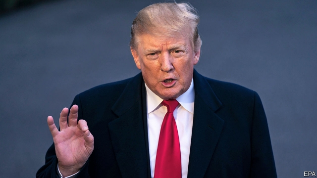
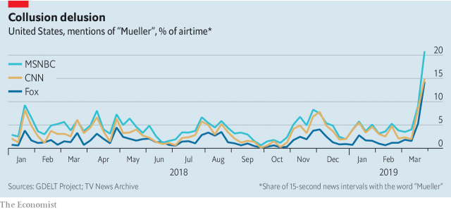

###### He told you so

# Donald Trump claims vindication over the Mueller report 

##### But it may not prove as deflating for Democrats as it seems 

 

> Mar 28th 2019 

FOR TWO years, Democrats have reminded voters about the federal investigators pursuing the president, while Republicans have considered that investigation to be a distraction from the vital work of making America great again. Now those roles are reversed. Robert Mueller’s investigation is over, and according to a summary prepared by William Barr, the attorney-general, Mr Mueller cleared Donald Trump of having conspired with Russia and did not recommend charging the president with obstruction of justice. Republicans want revenge: Rand Paul, a Republican senator from Kentucky, wants Congress to investigate Barack Obama. The White House wants Democrats and the media to apologise. Most Democrats themselves would now rather talk about jobs and health care. 

The conclusion of the investigation will not heal a divided country. Before the Mueller report landed, 44% of Americans thought the president should be impeached, according to a poll of 6,800 people by the Voter Study Group. That is almost identical to the proportion of Americans who approve of the job the president is doing in the Economist/YouGov poll. One rule of thumb in American politics in 2019 is that nobody changes their mind, and indeed post-Mueller the president’s approval rating has barely budged. The faction that wants Mr Trump canonised and the faction that wants him ejected from the White House immediately remain about equal in strength, and they still loathe each other. 

Mr Trump, at least, has cause to cheer. For 22 months, Mr Mueller’s investigation hung over his administration. Cable news offered daily speculation about just how damaging it would be for the president. He can now point to some of the pronouncements from former officials like John Brennan, a former head of the CIA turned cable-news talking-head, who called Mr Trump “treasonous” and “in the pocket of Putin”, as yet more evidence of an incompetent establishment set against him. In December Mr Brennan had warned the president to get ready for the “forthcoming exposure of your malfeasance & corruption.” After Mr Barr’s summary landed he sounded a bit sheepish. “I don’t know if I received bad information, but I think I suspected there was more than there actually was,” Mr Brennan told MSNBC. 

In the short term, then, Mr Barr’s summary is a boon to Mr Trump. The longer-term effects may be more equivocal. 

While the investigation was under way, two views of Mr Mueller’s work prevailed on opposite political poles. Mr Trump insisted it was a “witch hunt” that stemmed from Democrats’ inability to accept that he had defeated Hillary Clinton, and the Washington establishment’s disdain for his outsider status. His contacts with Russia were unusual, but he was an unorthodox politician, guilty of nothing more than trying to improve relations with a longtime adversary. That view was hard to square with the 37 indictments and seven guilty pleas or convictions produced by Mr Mueller’s digging, but those, Mr Trump insisted, had nothing to do with him. 

Conversely, some of Mr Trump’s opponents embraced Mr Mueller with a quasi-religious zeal (witness the Mueller-face earrings and Mueller devotional candles available on Etsy, the e-commerce equivalent of a hippie grandmother’s attic). Beto O’Rourke, a presidential candidate, said that Mr Trump “beyond a shadow of a doubt sought to...collude with the Russian government…to undermine and influence our elections.” Many hoped that Mr Mueller’s digging would provide the requisite proof for such sentiments. 

It did not. According to Mr Barr’s summary, Mr Mueller divided his report into two parts. The first concerns Russia’s interference in the 2016 election. Mr Mueller’s probe “did not establish that members of the Trump campaign conspired or co-ordinated with the Russian government in its election interference activities”—with co-ordination defined as an “agreement—tacit or express—between the Trump campaign and the Russian government on election interference.” That is good news not just for Mr Trump, but for America. Had Mr Mueller turned up evidence that the president owed his election to a conspiracy with a hostile foreign power, it would have plunged the country into crisis. 

Mr Mueller seems to have found no proof that Mr Trump or his staff worked with Russia in its hacking and disinformation efforts. He did, though, provide plenty of evidence that they welcomed Russia’s efforts. Paul Manafort, the campaign chairman, shared confidential polling data with a Ukrainian political consultant whom America’s intelligence agencies believe has links to Russian intelligence. Roger Stone, who worked on the initial stages of Mr Trump’s campaign, seemed to know that emails and documents stolen by Russian intelligence would be released at times favourable to Mr Trump. Donald Trump junior took a meeting with a Russian lawyer offering “dirt” on Mrs Clinton. And Mr Trump himself implored Russia to hack into Hillary Clinton’s server to “find the 30,000 emails that are missing.” Mr Mueller may have found more such instances, which is one reason Democrats want the full report to be released. 

 

Even if that fails, Congress will continue to investigate Mr Trump. Mr Mueller appeared to concern himself with whether members of the campaign broke criminal law. Congress has a broader remit: it can investigate behaviour it deems inimical to the national interest, even when such behaviour is not criminal. Congressional Democrats should not expect to find clear-cut evidence that Mr Mueller missed, but America has traditionally demanded more from its presidents than simply not being a criminal or an agent of a foreign power. 

The second part of Mr Mueller’s report concerns obstruction of justice. According to Mr Barr, Mr Mueller examined “a number of actions by the President…as potentially raising obstruction-of-justice concerns.” These might include Mr Trump firing James Comey, his FBI director, or his efforts to discredit the investigation, or publicly attacking Michael Cohen, his former lawyer, after he pled guilty and implicated Mr Trump in a hush-money scheme that may have violated federal campaign-finance law. In the end, for reasons that were foreseen, he felt that he could not recommend that Mr Trump be prosecuted for obstructing justice (see article). 

 

Republicans have treated Mr Barr’s conclusions as dispositive. Democrats, they say, misled America for two years. That is not quite right. Some in the fever swamps drew unsupported conclusions and made up elaborate theories that now appear silly. But Mr Trump’s fondness for Russia really is unusual, and he entered office under a counter-intelligence investigation for his links with Russia. That had to be completed, and had the roles been reversed, Republicans would certainly have made just as much noise about it as Democrats have. 

The investigation’s completion leaves Mr Trump emboldened, and the presidency more powerful. Mr Barr’s reasoning—that the president cannot obstruct justice through the lawful exercise of his power—is now precedent. Future presidents will be even less hesitant about using the power of their office to help themselves out of legal trouble. 

No sooner had Mr Barr issued his summary than a political battle over the complete release of Mr Mueller’s report began. Democrats want everything released except information redacted for national-security reasons. Hakeem Jeffries, a member of the House Democratic leadership, argues that “compelling public interest” can outweigh the need for grand-jury secrecy. Democrats may also want to see Mr Trump’s written answers to Mr Mueller’s questions, which will also be a battle: Jay Sekulow, one of Mr Trump’s lawyers, said those answers were “confidential”. 

Beyond the Mueller report, Mr Trump is not out of the woods. The Southern District of New York is investigating him for possible campaign-finance violations. New York’s attorney-general is probing allegations of bank and insurance fraud. Democratic-led congressional committees are looking into a range of misdeeds, including giving his son-in-law a security clearance despite serious vetting concerns, possible breaches of the constitution’s emoluments clause, accusations of money-laundering and entanglements with Russian and Saudi companies. 

At the same time, Democrats are eager to move on. Mr Mueller’s report may prove a blessing in disguise, because it relegates talk of impeachment to the party’s fringes. Voters did not much care about the Russia investigation, and now Democrats will not have to talk about it on the campaign trail. A poll from Navigator Research taken shortly after the 2018 mid-terms showed it was the seventh-most important issue for Democratic voters. The second-most important was government corruption, which those state, federal and congressional investigations will keep current. 

The most important was health care, toward which Democrats are again turning their attention. On March 26th they unveiled reforms designed to shore up the Affordable Care Act, including an expansion of tax credits, the creation of a national reinsurance programme, and an obligation for the White House to persuade people to sign up for health insurance. 

Mr Jeffries accused Republicans of “launching an assault on health care.” He has found an unlikely ally in Mr Trump. To the consternation and surprise of many in his own party, on March 25th the Justice Department asked a federal court to invalidate the Affordable Care Act. Mr Trump has long been determined to tear down the legacy of his predecessor, but the electoral benefits of trying to strip health insurance from millions of Americans one year before a national election are unclear. 

Democrats, conversely, are eager to fight on this ground. With Mr Mueller’s report finished, they no longer have to engage in a fruitless debate over whether Mr Trump is treasonous felon. Now they can simply ask voters to decide whether he is a good president. 

-- 

 单词注释:

1.vindication[.vindi'keiʃәn]:n. 辩护, 证明无辜, 辩明 [法] 辩明, 辩白, 辩护 

2.Mueller[]:米勒（人名） 

3.deflate[di'fleit]:vt. 放气, 抽出空气, 使缩小 vi. 缩小 

4.democrat['demәkræt]:n. 民主人士, 民主主义者, 民主党党员 [经] 民主党 

5.voter['vәutә]:n. 选民, 投票人 [法] 选民, 选举人, 投票人 

6.investigator[in'vestigeitә]:n. 调查者, 审查者 [法] 审查员, 侦查员, 调查员 

7.distraction[dis'trækʃәn]:n. 娱乐, 分心的事物, 分心 [医] 注意力分散, 内脱位, 牙弓过宽 

8.Robert['rɔbәt]:[法] 警察 

9.william['wiljәm]:n. 威廉（男子名）；[常作W-][美俚]钞票, 纸币 

10.barr[]:abbr. 翻转形态（Bump and Run Reversal） 

11.conspire[kәn'spaiә]:vi. 阴谋, 协力, 共谋 vt. 图谋 

12.obstruction[әb'strʌʃәn]:n. 障碍, 妨碍, 闭塞物 [医] 梗阻, 不通 

13.rand[rænd]:n. 兰特, (非正式)边, 田埂, 缘 [经] 兰特 

14.paul[pɔ:l]:n. 保罗（男子名） 

15.senator['senәtә]:n. 参议员, (某些大学的)理事 [法] 参议员, 上议员 

16.Kentucky[kәn'tʌki]:n. 肯塔基州 

17.barack[bɑ:'ræk]:n. 巴拉克（男子名） 

18.obama[]:n. 奥巴马(姓) 

19.apologise[ә'pɔlәdʒaiz]:vi. 道歉（等于apologize） 

20.impeach[im'pi:tʃ]:vt. 控告, 怀疑, 检举, 弹劾 [法] 控告, 检举, 弹劾 

21.voter['vәutә]:n. 选民, 投票人 [法] 选民, 选举人, 投票人 

22.politic['pɒlitik]:a. 精明的, 明智的, 策略的 

23.budge[bʌdʒ]:vi. 微微移动 vt. 推动 n. 羔羊皮 

24.faction['fækʃәn]:n. 小派系, 内讧 [法] 宗派, 派别, 小集团 

25.canonise['kænәnaiz]:vt.<主英>= canonize 

26.eject[i'dʒekt]:vt. 逐放, 放逐, 喷射 [化] 排出 

27.loathe[lәuð]:vt. 厌恶, 憎恶 

28.speculation[.spekju'leiʃәn]:n. 沉思, 推测, 投机 [经] 投机交易, 买空卖空 

29.pronouncement[prә'naunsmәnt]:n. 声明, 公告, 宣言, 宣告, 发表, 意见, 决定 [法] 宣判, 宣布, 宣告 

30.john[dʒɔn]:n. 盥洗室, 厕所, 嫖客 

31.brennan['brenәn]:n. 布伦南（姓氏） 

32.CIA[]:中央情报局 [计] 中国互联网络协会 

33.treasonous[]:a. 叛逆的, 谋反的, 犯叛国罪的, 涉及叛国罪的 

34.putin['putin]:n. 普京（人名） 

35.incompetent[in'kɒmpitәnt]:a. 无能力的, 无资格的, 机能不全的, 不胜任的 n. 无能力者 

36.forthcoming['fɒ:θ'kʌmɑŋ]:a. 即将来临的 n. 来临 

37.malfeasance[mæl'fi:zns]:n. 不正当, 不法行为, 坏事, 渎职 [经] 不法行为, 违法乱纪 

38.corruption[kә'rʌpʃәn]:n. 腐败, 堕落, 贪污 [计] 论误 

39.sheepish['ʃi:piʃ]:a. 懦弱的, 羞怯的 

40.msnbc[]:n. 微软全国有线广播电视公司 

41.boon[bu:n]:n. 恩惠 

42.equivocal[i'kwivәkl]:a. 意义不明确的, 模棱两可的 [医] 双关的, 两可的 

43.witch[witʃ]:n. 巫婆, 女巫 vt. 施巫术, 迷惑 

44.inability[.inә'biliti]:n. 无能, 无力 

45.Hillary['hiləri:]:n. 希拉里（美国现任国务卿） 

46.clinton['klintәn]:n. 克林顿（男子名） 

47.Washington['wɒʃiŋtn]:n. 华盛顿 

48.disdain[dis'dein]:n. 蔑视 vt. 蔑视, 鄙弃 

49.outsider[' aut'saidә]:n. 外人, 局外人, 非会员, 外行, 门外汉, 比赛中获胜可能性不大的选手 [经] 外船公司 

50.statu[]:[网络] 状态查看；雕像；特级雪花白 

51.unorthodox[.ʌn'ɒ:θәdɒks]:a. 非正统的, 异教的 

52.longtime['lɔŋtaim;'lɔ:ŋ-]:a. (已持续)长时间的,为时甚久的 adv. 长久 

53.adversary['ædvәsәri]:n. 敌手, 对手 a. 敌手的, 敌对的 

54.indictment[in'daitmәnt]:n. 起诉, 控告, 起诉状 [经] 起诉书 

55.plea[pli:]:n. 恳求, 辩解, 抗辩, 诉讼, 请愿, 托词 [法] 抗辩, 申诉案件, 答辩 

56.conviction[kәn'vikʃәn]:n. 定罪, 信服, 坚信 [法] 定罪, 证明有罪, 判罪 

57.earring['iәriŋ]:n. 耳环, 耳饰 

58.devotional[di'vәuʃәnl]:a. 忠诚的, 信仰的, 虔诚的, 祷告的 

59.etsy[]:[网络] 手工艺品销售网站；手工艺品在线买卖；手工艺品交易网站 

60.hippie['hipi:]:n. 嬉皮士 

61.attic['ætik]:n. 阁楼, 顶楼 [医] 鼓室上隐窝 

62.beto[]:n. (Beto)人名；(英)贝托 

63.presidential[.prezi'denʃәl]:a. 总统制的, 总统的, 首长的, 统辖的 [法] 总统的, 议长的, 总经理的 

64.undermine[.ʌndә'main]:vt. 在...下面挖, 渐渐破坏, 暗地里破坏 [法] 暗中破坏, 以阴谋中伤伤害 

65.requisite['rekwizit]:n. 必需品, 要素, 必要物品 a. 必要的, 需要的 

66.sentiment['sentimәnt]:n. 感情, 感伤, 情操, 情绪, 感想, 意见 [医] 情感, 情操 

67.probe[prәub]:n. 探索, 调查, 探针, 探测器 v. 用探针探测, 调查, 探索 

68.conspiracy[kәn'spirәsi]:n. 同谋, 阴谋, 阴谋集团 [法] 阴谋, 通谋, 共谋 

69.hack[hæk]:n. 劈, 砍, 砍痕, 出租车, 干咳, 晒架, 鹤嘴锄 vt. 劈, 砍, 出租, 用旧 vi. 劈, 砍, 干咳, 驾驶出租车 a. 出租的 

70.disinformation[.disinfә'meiʃәn]:n. 假情报 

71.manafort[]:[网络] 马纳福特 

72.datum['deitәm]:n. 论据, 材料, 资料, 已知数 [医] 材料, 资料, 论据 

73.ukrainian[ju(:)'kreinjәn]:a. 乌克兰的；乌克兰人的 

74.roger['rɔdʒә]:interj. 对!, 行!, 好! 

75.Mr['mistә(r)]:先生 [计] 存储器回收程序, 多重请求 

76.implore[im'plɒ:]:vt. 恳求, 哀求 

77.server['sә:vә]:n. 服伺者, 上菜用具, 发球员 n. 服务器 [计] 服务器, 服务器启动程序, 服务台程序 

78.deem[di:m]:v. 认为, 相信 

79.inimical[i'nimikәl]:a. 有敌意的, 有害的, 抵触的 

80.congressional[kәn'greʃәnl]:a. 会议的, 议会的, 国会的 [法] 代表大会的, 大会的, 议会的 

81.traditionally[]:adv. 传统上；传说上；习惯上 

82.potentially[pә'tenʃәli]:adv. 可能地, 潜在地 

83.jame[]: 灰岩井 

84.comey[]: [人名] 科米 

85.FBI[]:美国联邦调查局 [经] 美国联邦调查局 

86.discredit[dis'kredit]:n. 无信用, 丢脸, 不名誉 vt. 不信, 怀疑, 使丢脸 

87.michael['maikl]:n. 迈克尔（男子名） 

88.cohen['kәuin]:科恩（姓氏） 

89.ple[]:abbr. 个性化学习环境（Personal Learning Environment） 

90.implicate['implikeit]:vt. 涉及, 含意, 暗示, 牵连 n. 包含的东西 

91.prosecute['prɒsikju:t]:vt. 告发, 起诉, 彻底进行, 执行, 从事 vi. 告发, 起诉, 作检察官 

92.obstruct[әb'strʌkt]:vt. 阻隔, 妨碍, 阻塞, 遮没 vi. 设障碍 

93.dispositive[dis'pɔzәtiv]:a. (事件、行为等)决定性的 

94.unsupported['ʌnsә'pɔ:tid]:a. 未经证实的, 未得到支持的, 未得到赞助的, 未得到支援的, 无支撑的 [法] 无赞助的, 无支持的, 未经证实的 

95.fondness['fɔndnis]:n. 溺爱；爱好 

96.completion[kәm'pli:ʃәn]:n. 完成 [经] 完井, 结束, 完工 

97.embolden[im'bәuldn]:vt. 使大胆, 使有胆量 

98.presidency['prezidәnsi]:n. 总统职权, 总裁职位 

99.cannot['kænɒt]:aux. 无法, 不能 

100.lawful['lɒ:ful]:a. 法律许可的, 守法的, 合法的 [经] 合法的, 法定的 

101.precedent['presidәnt]:n. 先例, 前例 a. 在先的, 在前的 

102.les[lei]:abbr. 发射脱离系统（Launch Escape System） 

103.hesitant['hezitәnt]:a. 迟疑的, 踌躇的, 犹豫不定的 

104.redact[ri'dækt]:vt. 编辑, 编写 [计] 编校 

105.hakeem[hɑ:'ki:m]:n. (=hakim)(伊斯兰教国家的)学者, 医生 

106.Jeffries[]:n. (Jeffries)人名；(英、意)杰弗里斯 

107.outweigh[.aut'wei]:vt. 比...重, 比...重要, 比...有价值 

108.secrecy['si:krisi]:n. 秘密, 保密 [法] 秘密, 秘密状态, 保密 

109.jay[dʒei]:n. 鸟, 喋喋不休的人, 傻瓜 

110.york[jɔ:k]:n. 约克郡；约克王朝 

111.violation[.vaiә'leiʃәn]:n. 违反, 违背, 妨碍 [法] 违犯, 违背, 违反 

112.allegation[.æli'geiʃәn]:n. 断言, 主张, 申辩 [法] 声明, 事实陈述, 断言 

113.fraud[frɒ:d]:n. 欺骗, 欺诈, 诡计, 骗子 [经] 欺诈, 舞弊, 骗子 

114.congressional[kәn'greʃәnl]:a. 会议的, 议会的, 国会的 [法] 代表大会的, 大会的, 议会的 

115.misdeed['mis'di:d]:n. 罪行, 犯罪 [法] 不端行为, 犯罪, 恶性 

116.clearance['kliәrәns]:n. 清除, 间隙 [化] 间隙; 空隙 

117.vet[vet]:n. 兽医 vi. 当兽医 vt. 诊断, 检审 

118.breach[bri:tʃ]:n. 裂口, 违背, 破坏, 违反, 突破, 破裂 vt. 攻破, 突破 vi. 跳出水面 

119.emolument[i'mɒljumәnt]:n. 薪水, 报酬 

120.clause[klɒ:z]:n. 子句, 条款 [计] 子句 

121.accusation[ækju:'zeiʃәn]:n. 控告, 指控, 指责 [法] 控告, 起诉, 告发 

122.entanglement[in'tæŋglmәnt]:n. 纠缠, 卷入, 缠绕物 [化] 缠结 

123.saudi['sajdi]:a. 沙乌地阿拉伯（人或语）的 

124.relegate['religeit]:vt. 驱逐, 使降低地位, 把...归类, 把...委托给 [法] 流放, 判流放刑, 驱逐 

125.impeachment[im'pi:tʃmәnt]:[法] 控告, 检举, 弹劾 

126.fringe[frindʒ]:n. 边缘, 端, 流苏, 穗, 初步 vt. 加穗于, 加饰边于 a. 边缘的, 附加的 

127.navigator['nævigeitә]:n. 航海家 [法] 领航员, 驾驶员, 航海者 

128.unveil[.ʌn'veil]:vt. 揭开, 揭幕, 除去...的面纱 vi. 显露, 除去面纱 

129.affordable[]:[计] 普及型 

130.creation[kri:'eiʃәn]:n. 创造, 创作物, 发明 [化] 产生 

131.reinsurance[.ri:in'ʃurәns]:n. 再保险, 再保险金额 [医] 再保险 

132.assault[ә'sɒ:t]:n. 攻击, 袭击 vt. 袭击, 攻击 vi. 发动攻击 

133.ally['ælai. ә'lai]:n. 同盟者, 同盟国, 助手 vt. 使联盟, 使联合, 使有关系 vi. 结盟 

134.consternation[.kɒnstә'neiʃәn]:n. 惊愕, 恐怖, 惊惶失措 

135.invalidate[in'vælideit]:vt. 使无效 [法] 使无效, 使无效力, 使作废 

136.legacy['legәsi]:n. 祖先传下来之物, 遗赠物 [经] 遗产, 遗赠物 

137.predecessor[.predi'sesә]:n. 前任, 先辈, 前身 [医] 初牙, 前辈, 祖先 

138.electoral[i'lektәrәl]:a. 选举人的, 选举的, (有关)选举的 [法] 选举的, 选举人的, 由选举人组成的 

139.unclear[.ʌn'kliә]:a. 不易了解的, 不清楚的, 含混的 

140.fruitless['fru:tlis]:a. 不结果的, 不长果实的, 无子的 

141.felon['felәn]:n. 重罪犯, 恶棍, 瘭疽 [医] 瘭疽, 指头脓炎 

