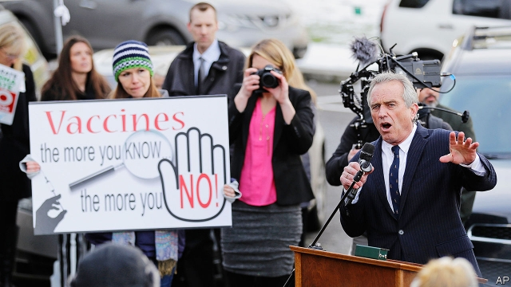

###### Sharp exchanges

# Hanging with the anti-vaxxers 

##### Scientists and public-health officials could learn something from them 

 

> Mar 28th 2019 

EVANSTON, A SUBURB of handsome homes north of Chicago, is prime territory for anti-vaxxers. The wealthy and well-educated drop into the Blind Faith Café for vegan meals. Nearby a paediatrician, Toni Bark, offers alternative medicine. She promotes homeopathy and the merits of ice-cold dips in Lake Michigan. She also rails against vaccines. 

Dr Bark, a forceful speaker, has made a vocation out of opposing vaccines. She testifies in courts and at summits of the like-minded, and is busy on social media. She helps produce anti-vaxxer films and books. Such emotionally manipulative tales of childhood maladies can race up Amazon bestseller lists, while spreading mistrust of medical science. 

She scoffs at the suggestion that vaccines are beneficial, denying that they wiped out smallpox or help battle tetanus and Ebola. The doctor sees little threat from measles (though the disease used to kill some 500 Americans a year). Instead she dwells on cases of childhood illness which she blames on vaccines. “I hear of one or two deaths every week,” she claims. Autism, she alleges (wrongly), is “absolutely” linked to vaccines. 

Such folk believe a conspiracy grips America: that jabs are promoted as a plot to dupe and impoverish a supposedly ever-sicker American public. Drugs firms actually run the Centres for Disease Control, claims Brian Hooker, who has long alleged cover-ups and fraudulent science in the federal agency. Dr Bark and Karen Kain, a campaigner in California, say vaccine-makers silence academics, doctors and journalists for merely meeting anti-vaxxers. Dr Bark thinks Big Pharma sponsors “70% of the news media”. The Economist is “paid for by pharmaceutical companies,” reckons Ms Kain, adding that they would somehow stop this article being printed. 

Anti-vaxxers are “more vociferous than ever,” says Saad Omer of Emory University in Atlanta. He sees a movement of two parts. More numerous are the vaccine-hesitant, including parents (often mothers) who are insufficiently educated, anxious about child health, perhaps worried by autism and swayed by a deluge of misleading claims online. Around 13% of Americans said in 2016 that they did not fully trust vaccines as safe. A smaller core of activists plus minor celebrities, such as Robert F. Kennedy junior, stokes their fears. 

They have an effect. Immunisation remains high overall, but the rate plunges where clusters of parents suddenly worry. After determined anti-vax activists visited Somalis in Minnesota to spread the idea that jabs caused autism, vaccine coverage fell and measles promptly infected 79 people. Measles was eradicated in America in 2000, but outbreaks are again appearing. Rockland County, in New York state, has banned unvaccinated children from public spaces for 30 days after a spate of cases. 

Anti-vaxxers’ views do not come out of the blue. Mr Omer says underlying values lead people in different ways to scepticism about science. Some aspire to live a more natural life, or may be religious, and fret over (untrue) rumours that tissue from aborted fetuses goes into vaccine doses. Some, like Dr Bark, say they are not anti-science, only anti-Big Pharma—she believes in climate change; “I’m not crazy,” she says. Others cherish liberty above all, objecting that government has no right to insist on vaccinations for schoolchildren. 

Robert Krakow, a lawyer in New York and prominent anti-vaxxer, agrees that the movement is diverse: “It cuts across all political ideologies, all demographics, you can’t pin it down.” But all share a deep mistrust of public-health bodies. Nor is it associated with one party. Although President Donald Trump and some other Republican politicians have been sympathetic, others, like Mr Kennedy, lean left. 

Meghan Moran, at Johns Hopkins University, says the biggest battle may prove to be online. Studying 263 avowedly anti-vaccine websites, she tracked how many made powerful use of anecdotes—a tragic story to stir fear and sympathy in a parent can be a more effective spur to action than any number of statistics. Many sites strive to spread mistrust in government or other authorities, she says. 

Tracking who funds online activity, or promotes sometimes shrill debate on social media, is harder. A few family foundations donate to anti-vaxxers, under the guise of promoting “vaccine choice” non-profit groups. The Children’s Medical Safety Research Institute has funded research into vaccines. The institute is backed by the Dwoskin Family Foundation, the charitable arm of a property developer and a regular donor to Democratic causes. The Dwoskins have paid for meetings and films on vaccines. Claire Dwoskin’s personal stance is clear: she once called vaccines “a holocaust of poison on our children’s brains.” 

Responding effectively to all this requires the pro-vaccine camp to learn to communicate with more warmth and fewer statistics. Peter Hotez, a renowned vaccine expert in Houston, says a feeble public response is partly to blame for anti-vaxxers creeping “from fringe to mainstream” in recent years. Adopting the anecdotal approach, he has published a moving book telling of his own daughter’s autism and how vaccines did not cause it. 

He sees anti-vaxxers making a concerted effort to break into party politics, for example in Texas, where a newish “vaccine-choice” political action committee backed candidates for state elections last year. Similar PACs have been formed in Oklahoma and Michigan. Despite that, it seems likelier that more states will tighten requirements that schoolchildren get their jabs. Mr Omer says the strongest lesson to take from anti-vaxxers is to stop being passive. “Most of us are pro-vaccine, but we are often silent bystanders.” Speaking up early for vaccines—say, by offering emotional stories of lives saved to parents-to-be—might be one way ahead. 

-- 

 单词注释:

1.evanston[]:n. 埃文斯顿（芝加哥市北郊城市） 

2.Chicago[ʃi'kɑ:gәu]:n. 芝加哥 

3.vegan['vegәn]:n. 严格的素食主义者 [医] 绝对素食者 

4.paediatrician[.pi:diә'triʃәn]:n. 儿科医师 

5.toni['tәuni]:n. 托妮（女子名） 

6.homeopathy[.hәumi'ɒpәθi]:n. 顺势疗法 [医] 顺势疗法 

7.Michigan['miʃigәn]:n. 密歇根州 

8.vaccine['væksi:n]:n. 牛痘苗, 疫苗 a. 疫苗的, 牛痘的 

9.forceful['fɒ:sful]:a. 有力的, 强烈的, 有说服力的 

10.vocation[vәu'keiʃәn]:n. 职业, 天命, 天职, 才能, 行业 [法] 行业, 职业, 职业上的才能 

11.testify['testifai]:v. 证明, 作证, 声明, 表明 

12.emotionally[i'mәuʃәnәli]:adv. 在情绪上 

13.manipulative[mә'nipjulәtiv]:a. 处理的, 巧妙处理的, 操纵的 

14.malady['mælәdi]:n. 病, 疾病, 弊病 [医] 病 

15.amazon['æmәzɒn]:n. 亚马孙河 [医] 无乳腺者 

16.bestseller[]:n. 畅销书 

17.mistrust[.mis'trʌst]:n. 不信任, 疑惑 v. 不信任, 疑惑 

18.scoff[skɒf]:n. 嘲笑, 愚弄, 笑柄, 食品 v. 嘲笑, 嘲弄, 贪吃, 狼吞虎咽地吃 

19.smallpox['smɒ:lpɒks]:n. 天花 [医] 天花, 痘疮 

20.tetanus['tetәnәs]:n. 破伤风 [医] 破伤风; 强直 

21.ebola[i'bəulə]:n. 埃博拉病毒 

22.measles['mi:zlz]:n. 麻疹, 风疹, 家畜囊尾蚴病, 米珠 [医] 麻疹, 囊尾蚴病(家畜) 

23.dwell[dwel]:vi. 居住, 居住(于), 存在(于) 

24.autism['ɒ:tizm]:n. 孤独症 [医] 孤独癖, 自我中心主义 

25.allege[ә'ledʒ]:vt. 宣称, 主张, 提出, 断言 [法] 断言, 指称, 指证 

26.wrongly[]:adv. 错误地, 不恰当地, 不正确地, 不正直地, 不公正地 

27.conspiracy[kәn'spirәsi]:n. 同谋, 阴谋, 阴谋集团 [法] 阴谋, 通谋, 共谋 

28.jab[dʒæb]:v. 刺, 戳, 猛击 n. 刺, 戳, 猛击 

29.dupe[dju:p]:n. 傻瓜, 易受骗的人 vt. 欺骗, 愚弄 

30.impoverish[im'pɒvәriʃ]:vt. 使贫穷, 耗尽...的力气 

31.supposedly[sә'pәuzidli]:adv. 想象上, 看上去像, 被认为是, 恐怕, 按照推测 

32.brian['braiәn]:n. 布莱恩（男子名） 

33.hooker['hukә]:n. 用钩子的人, 渔船 

34.fraudulent['frɒ:djulәnt]:a. 欺诈的, 不正的, 不诚实的 [法] 欺诈的, 欺骗的, 骗取的 

35.karen['kɑ:rәn]:n. 凯伦（人名）；克伦邦（缅甸邦名） 

36.kain[kein]:n. 实物租税,实物地租 

37.campaigner[kæm'peinә]:n. 从军者, 老兵, 竞选者 

38.California[.kæli'fɒ:njә]:n. 加利福尼亚 

39.pharma[]:n. 制药公司 

40.economist[i:'kɒnәmist]:n. 经济学者, 经济家 [经] 经济学家 

41.pharmaceutical[,fɑ:mә'sju:tikәl]:a. 药学的, 制药的, 药用的, 药物的, 药剂师的, 药师的 n. 药品, 成药, 药剂 

42.reckon['rekәn]:vt. 计算, 总计, 估计, 认为, 猜想 vi. 数, 计算, 估计, 依赖, 料想 

43.vociferous[vәu'sifәrәs]:a. 大声叫的, 喊叫的, 喧嚷的 

44.Saad[]:n. 萨阿德（巴格达的一名人道工作者）；萨德（体育明星） 

45.Omer['әumә]:欧麦(古希伯来的干量) 

46.emory['eməri]:n. 埃默里 

47.atlanta[әt'læntә]:n. 亚特兰大（美国城市） 

48.insufficiently[ˌɪnsə'fɪʃntlɪ]:adv. 不够地, 不能胜任地 

49.autism['ɒ:tizm]:n. 孤独症 [医] 孤独癖, 自我中心主义 

50.deluge['delju:dʒ]:n. 大洪水, 泛滥 vt. 使泛滥 

51.misleading[mis'li:diŋ]:a. 引入歧途的, 使人误解的, 骗人的 [法] 误写姓名的, 误称的, 令人误解的 

52.online[]:[计] 联机 

53.fully['fuli]:adv. 十分地, 完全地, 充分地 

54.activist['æktivist]:n. 激进主义分子 

55.celebrity[si'lebrti]:n. 名声, 名人 

56.Robert['rɔbәt]:[法] 警察 

57.kennedy['kenidi]:n. 肯尼迪（姓氏, 美国第35任总统） 

58.stoke[stәuk]:v. 司炉, (使)大吃 

59.immunisation[ˌɪmjʊnaɪ'zeɪʃən]:n. 免疫(immunization) 

60.cluster['klʌstә]:n. 串, 丛, 群, 簇 vi. 成串, 丛生 vt. 使聚集 [计] 簇 

61.Somali[sәu'mɑ:li]:n. 索马里人 

62.Minnesota[.mini'sәutә]:n. 明尼苏达州 

63.coverage['kʌvәridʒ]:n. 覆盖的范围, 保险总额, 新闻报导 [化] 可达范围; 覆盖度 

64.promptly['prɒmptli]:adv. 敏捷地, 迅速地 

65.measles['mi:zlz]:n. 麻疹, 风疹, 家畜囊尾蚴病, 米珠 [医] 麻疹, 囊尾蚴病(家畜) 

66.eradicate[i'rædikeit]:vt. 根除, 扑灭, 根绝, 消灭 

67.outbreak['autbreik]:n. 爆发, 暴动 [医] 暴发 

68.rockland[]:n. (Rockland)人名；(瑞典)罗克兰 罗克兰 

69.york[jɔ:k]:n. 约克郡；约克王朝 

70.unvaccinated[]:adj. 未注苗的；未接种的 

71.spate[speit]:n. 泛滥, 洪水, 大雨, 大量, 一阵 

72.underlie[.ʌndә'lai]:vt. 位于...之下, 成为...的基础 

73.scepticism['skeptisizm]:n. 怀疑论, 怀疑主义 [医] 多疑癖 

74.aspire[ә'spaiә]:vi. 渴望, 立志于 

75.fret[fret]:n. 烦躁, 磨损, 焦急, 网状饰物 vi. 烦恼, 不满, 磨损 vt. 使烦恼, 腐蚀, 使磨损, 使起波纹 

76.abort[ә'bɒ:t]:vi. 流产, 中途失败 vt. 使流产, 使失败, 使中止 

77.fetuse[]:胎儿的 

78.cherish['tʃeriʃ]:vt. 珍爱, 怀有, 爱护 

79.vaccination[.væksi'neiʃәn]:n. 接种疫苗, 种痘 [医] 接种; 种痘 

80.schoolchild['sku:ltʃaild]:n. 学童 

81.Krakow['krɑ:ku:f]:n. 克拉科夫(波兰城市) 

82.ideology[.aidi'ɒlәdʒi]:n. 思想体系, 意识形态, 观念学, 空论 [医] 观念学, 观念形态 

83.demographic[.demә'græfik]:a. 人口统计的 [法] 人口统计的, 人口学的 

84.meghan[]:梅根（人名） 

85.Moran[]:n. 莫兰（人名） 

86.john[dʒɔn]:n. 盥洗室, 厕所, 嫖客 

87.hopkins['hɔpkinz]:n. 霍普金（姓氏） 

88.avowedly[ә'vaudli]:adv. 公然地 

89.tragic['trædʒik]:a. 悲惨的, 悲剧的 

90.statistic[stә'tistik]:n. 统计量 a. 统计的, 统计学的 

91.strive[straiv]:vi. 努力, 奋斗, 斗争 

92.shrill[ʃril]:n. 尖声 a. 尖锐的, 刺耳的 vt. 尖声说出 vi. 发出刺耳声 

93.donate['dәuneit]:v. 捐赠 

94.guise[gaiz]:n. 相似, 外观, 伪装 v. 穿戴, 伪装 

95.charitable['tʃæritәbl]:a. 大慈大悲的, 宽厚的, 慈善的 [法] 慈善的, 慷慨的, 宽恕的 

96.developer[di'velәpә]:n. 开发者 [计] 显影器 

97.donor['dәunә]:n. 捐赠人 [化] 给体; 供体 

98.claire[kleә]:n. 克莱儿（女子名） 

99.stance[stæns]:n. 准备击球姿势, 站立的姿势, 位置, 姿态 [经] 地位, 形势 

100.holocaust['hɔlәkɔ:st]:n. 大屠杀, 大火灾, 毁灭, 大规模烧杀 

101.effectively[i'fektivli]:adv. 有效地, 有力地, 实际上 

102.peter['pi:tә]:vi. 逐渐消失, 逐渐减少 

103.renowned[ri'naund]:a. 有名的, 有声誉的 

104.Houston['hju:stәn]:n. 休斯敦 

105.fringe[frindʒ]:n. 边缘, 端, 流苏, 穗, 初步 vt. 加穗于, 加饰边于 a. 边缘的, 附加的 

106.mainstream['meinstri:m]:n. 主流 

107.anecdotal[,ænek'dәutl]:a. 轶事的, 爱谈奇闻轶事的, 多轶事的 

108.concerted[kәn'sә:tid]:a. 商定的, 协定的, 一致的 [法] 一致的, 协力的, 共同的 

109.politic['pɒlitik]:a. 精明的, 明智的, 策略的 

110.Texas['teksәs]:n. 德克萨斯 

111.newish['nju:iʃ]:a. 尚新的 

112.PAC[pæk]:[医] 一六零五, 二乙基对硝基苯硫代磷酸酯(有机磷杀虫药) 

113.Oklahoma[.әuklә'hәumә]:n. 俄克拉何马 

114.tighten['taitn]:vt. 勒紧, 使变紧 vi. 变紧, 绷紧 

115.bystander['baistændә(r)]:n. 旁观者, 目击者 [法] 候补陪审员, 旁观者 

