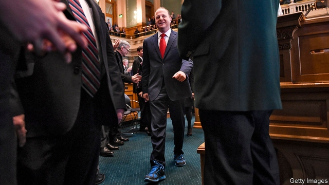

###### That’s the sound of the Polis

# Jared Polis, Colorado’s governor, is an unusual breed: a libertarian Democrat 

##### He must strike a difficult balance 

 

> Mar 30th 2019 

IF COLORADO WERE a piece of jewellery it would be a mood ring, changing with the country’s political temperature. Or at least that used to be the case. Today Colorado looks more like a sapphire, featuring varying shades of blue depending on one’s angle. After the 2018 election it became a Democratic trifecta, with the party controlling the governor’s office, statehouse and senate. One of the state’s two senators, Cory Gardner, is a Republican, but he has a low approval rating and may not win re-election in 2020. Last autumn’s election was the most significant for Colorado’s political realignment in more than 40 years, says Floyd Ciruli of Ciruli Associates, a political consulting firm. 

“The type of Republican who does well here is not a Trump Republican. Our suburban, swing electorate is more attracted to the Reagan version of Republicanism, the hopeful version of Republicanism,” says Jared Polis, the state’s new governor. In recent years Colorado’s economy has boomed, with the state attracting young and educated immigrants from other states, who tend to be more Democratic. 

Mr Polis, the first openly gay man to be elected as governor of any state, championed a progressive agenda on the campaign trail, but he does not sound like your average Democrat. He backs universal health care, an expansion of full-day kindergarten, paid parental leave and investments in renewable energy. But he also wants to lower the income-tax rate. He identifies as a libertarian. “The less government intervention in our private lives, the better. I think that’s a value many Coloradans have on the left and right,” he says. 

The legislature, which is now in full session, will not share that sense of moderation and is likely to pull Mr Polis further left than he wants, according to Mr Ciruli. Legislators are considering bills that could enrage conservative voters, including eliminating the death penalty and passing a “red flag” law that would make it possible to seize guns from someone who is deemed mentally ill after a judicial process. Lawmakers are unlikely to let Mr Polis lower income-tax rates, which he wants to do. 

For years Republicans have warned that Colorado could become like California if Democrats got too much power. That prediction sounded far-fetched. Since the start of this legislative session, however, the state stands to look more like Californian than it ever has before. National Democrats should watch what solutions Colorado adopts on questions facing all states, such as health care, parental leave, public education and the environment. 

Mr Polis himself deserves some credit for this political transformation. He is one of a group of liberal donors, called the “Gang of Four”, who helped Democrats flip the state assembly in 2004. Mr Polis, who is 43, spent his youth as an entrepreneur, building companies. He helped to transform his parents’ company, Blue Mountain Arts, into an online greeting-card firm that was sold for around $780m in 1999, and built up ProFlowers, an online florist, which was sold for nearly $480m in 2006. Today his net worth is estimated at several hundred million dollars, and he has freely used his fortune to pursue his political career. He won his first post in Colorado in 2000, after he reportedly spent $1.2m to win a seat on the Board of Education (his opponent spent $10,000). He went on to serve five terms in Congress before running for governor last year. He spent more than $23m of his own money on his campaign, or around 97% of the total raised. 

His predecessor in the governor’s mansion, John Hickenlooper, is now on the presidential campaign trail, hoping to win the Democratic nomination. Some wonder whether Mr Polis may also have higher aspirations, perhaps to be the country’s first openly gay president. That would be a Mount Elbert-sized peak to climb. Mr Polis has the credentials of a computer geek and the charisma of one, too. To think beyond Colorado is to rush ahead in the story. The state’s political transformation is still relatively new. Whether it lasts will depend in part on the success of Mr Polis’s reign. 

-- 

 单词注释:

1.polis['pәulis]:n. 城邦 

2.jare[]:abbr. Japanese Antarctic Research Expedition 日本南极科学考察队 

3.libertarian[.libә'tєәriәn]:n. 自由意志主义支持者, 行动自由者 a. 自由意志主义支持者的, 主张个人思想的 

4.democrat['demәkræt]:n. 民主人士, 民主主义者, 民主党党员 [经] 民主党 

5.Colorado[,kɔlә'rɑ:dәu]:n. 科罗拉多, 科罗拉多河 

6.jewellery['dʒu:әlri]:n. 宝石, 贵重饰物, 珠宝, 宝石饰物, 受珍视的人/物, 宝贝, 有价值的人/物 

7.Colorado[,kɔlә'rɑ:dәu]:n. 科罗拉多, 科罗拉多河 

8.sapphire['sæfaiә]:a. 天蓝色的 n. 蓝宝石, 刚玉宝石, 天蓝色 

9.trifecta[trai'fektә]:n. (赛马赌博的)三连胜式 

10.statehouse[s'teɪthaʊs]:n. 州议会的议场 

11.senator['senәtә]:n. 参议员, (某些大学的)理事 [法] 参议员, 上议员 

12.cory[]:n. 克里, 科里（人名） 

13.gardner['^ɑ:dnә(r)]:n. 加德纳（男子名） 

14.realignment[,ri:ә'lainmәnt]:n. 重新排列, 改组, 重新组合 [计] 重新调整 

15.Floyd[flɒid]:n. 弗洛伊德 

16.suburban[sә'bә:bәn]:a. 郊外的, 郊区的, (贬)偏狭的, 土气的, 见识不广的 n. 郊区居民 

17.electorate[i'lektәrit]:n. 选民, 有选举权者, 选区 [法] 选民, 选举团, 选区 

18.reagan[]:n. 里根（姓氏） 

19.republicanism[ri'pʌblikәnizm]:n. 共和主义 

20.openly['әjpәnli]:adv. 公开地, 坦率地, 直率地, 公然地 

21.parental[pә'rentәl]:a. 父母亲的, 做双亲的, 作为渊源的 [医] 父母的, 双亲的 

22.renewable[ri'nju(:)әbl]:a. 可更新的, 可恢复的, 可继续的, 可换新的, 可重复的, 可重说的 [计] 可更新, 可再生的 

23.les[lei]:abbr. 发射脱离系统（Launch Escape System） 

24.intervention[.intә'venʃәn]:n. 插入, 介入, 调停 [经] 干预 

25.Coloradan[,kɔlə'rɑ:dən]:a. , n. Colorado的变形 

26.legislature['ledʒisleitʃә]:n. 立法机关, 议会, 立法院 [法] 立法机构, 立法机关 

27.moderation[.mɒdә'reiʃәn]:n. 缓和, 适度, 温和 [化] 慢化 

28.legislator['ledʒisleitә]:n. 立法者, 立法官, 立法委员 [法] 立法者, 立法机关成员, 立法委员 

29.enrage[in'reidʒ]:vt. 激怒, 使暴怒 

30.voter['vәutә]:n. 选民, 投票人 [法] 选民, 选举人, 投票人 

31.penalty['penәlti]:n. 处罚, 刑罚, 罚款, 罚球, 报应, 不利结果, 妨碍 [经] 罚金(款), 违约金 

32.deem[di:m]:v. 认为, 相信 

33.judicial[dʒu:'diʃәl]:a. 法庭的, 公正的, 审判上的, 司法的 [法] 司法的, 审判上的, 法官的 

34.lawmaker[lɒ:'meikә]:n. 立法者 

35.California[.kæli'fɒ:njә]:n. 加利福尼亚 

36.democrat['demәkræt]:n. 民主人士, 民主主义者, 民主党党员 [经] 民主党 

37.prediction[pri'dikʃәn]:n. 预言, 预报 [化] 预测 

38.legislative['ledʒislәtiv]:n. 立法机构 a. 立法的, 有立法权的 

39.Californian[.kæli'fɒ:njәn]:n. 加利福尼亚州人 a. 加利福尼亚的 

40.donor['dәunә]:n. 捐赠人 [化] 给体; 供体 

41.flip[flip]:vt. 掷, 弹, 轻击, 空翻 vi. 用指轻弹, 抽打, 蹦跳 n. 抛, 弹, 筋斗 a. 无礼的 [计] 翻转 

42.entrepreneur[.ɒntrәprә'nә:]:n. 企业家, 主办人 [经] 承包商, 企业家 

43.online[]:[计] 联机 

44.ProFlowers[]:[网络] 华华；花网 

45.florist['flɒrist]:n. 花匠, 花商, 花卉研究者 

46.reportedly[ri'pɒ:tidli]:adv. 根据传说, 根据传闻, 据报道 

47.predecessor[.predi'sesә]:n. 前任, 先辈, 前身 [医] 初牙, 前辈, 祖先 

48.mansion['mænʃәn]:n. 大厦, 宅邸 

49.john[dʒɔn]:n. 盥洗室, 厕所, 嫖客 

50.hickenlooper[]: [人名] 希肯卢珀 

51.presidential[.prezi'denʃәl]:a. 总统制的, 总统的, 首长的, 统辖的 [法] 总统的, 议长的, 总经理的 

52.nomination[.nɒmi'neiʃәn]:n. 提名, 任命, 提名权 

53.aspiration[.æspә'reiʃәn]:n. 热望, 志向, 渴望 [医] 吸入; 吸[引], 吸引术 

54.credential[kri'denʃәl]:n. 国书, 凭据, 证明书 [经] 凭证, 证书 

55.geek[gi:k]:n. 做低级滑稽表演的人 

56.charisma[kә'rizmә]:n. 非凡的领导力, 神秘的个人魅力, 神授的能力 

