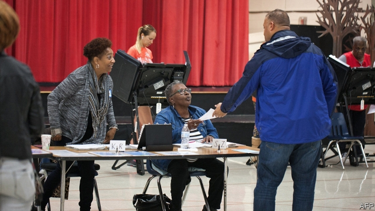
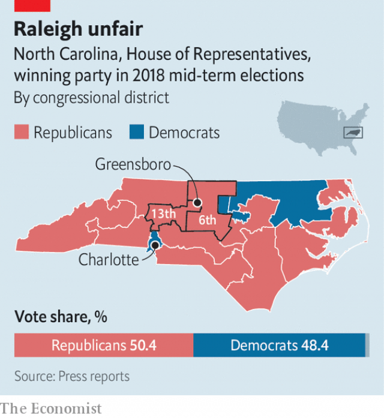

###### Election doping

# The Supreme Court does not like gerrymandering 

##### That does not mean the nine justices will stop it 

 

> Mar 28th 2019 

AN INVISIBLE LINE in Greensboro divides the campus of North Carolina A&T State, America’s largest historically black university. On one side of Laurel Street lies the state’s sixth congressional district; on the other is the 13th. For Love Caesar, who is studying political science and history, the school’s 12,000 mostly “liberal thinking” students are “cracked” in two, diluting their votes into a sea of Republicans on either side. Republican legislators in North Carolina are happy to admit that Ms Caesar is quite right. In 2016 David Lewis, an architect of the plan, said the electoral map was designed “to gain partisan advantage”. The statewide vote has been nearly tied in recent elections, but the Republican Party’s cartographic acumen—splitting some Democratic constituencies and stuffing others into as few districts as possible—helped to win the party ten of the state’s 13 congressional seats (see map). Mr Lewis lamented only that it wasn’t “possible to draw a map with 11 Republicans and two Democrats”. 

On March 26th, the Supreme Court scrutinised North Carolina’s map and another brazen gerrymander that turned a reliably Republican district in Maryland Democratic, boosting Democrats’ share of the state’s eight congressional seats from six to seven. No justices spoke up in favour of politicians warping district lines to entrench their own power. Justice Brett Kavanaugh, for one, said the practice is “a real problem for our democracy”. But it was uncertain, after more than two hours of oral arguments, whether a majority of the justices will decide that even ghastly gerrymanders violate America’s constitution. 

In 2018 the court also heard a pair of partisan redistricting cases—an earlier iteration of the same matter from Maryland, and a challenge from Wisconsin. Reformers had hoped Justice Anthony Kennedy might join the court’s liberal bloc to rein in gerrymandering, but both cases ended in a procedural fizzle. This time round, neither Rucho v Common Cause, the North Carolina case, nor Lamone v Benisek, out of Maryland, included more than a whisper about eligibility to sue, the matter on which the Wisconsin case foundered last June. Instead, the justices dwelt on the question of “justiciability”—whether gerrymandering is even something courts can tackle. 

 

The lawyer representing North Carolina’s legislators, Paul Clement, began by noting that the Supreme Court has never pinpointed “a justiciable standard for partisan gerrymandering claims”. That is true. In a case from 2004, Justice Kennedy held open the possibility that a workable standard might one day emerge to distinguish extreme from acceptable levels of partisanship in map-making. That the court has never arrived at one, Mr Clement said, is not for lack of judicial imagination, but because the framers entrusted districting to state legislatures, with Congress playing a supervisory role. All three authors of the “Federalist Papers” were concerned about gerrymandering, he said, but neither Alexander Hamilton, James Madison nor John Jay prescribed “a judicial solution”. 

Justice Stephen Breyer pressed Mr Clement to consider “a way to catch real outliers”. What if a party “wins a majority of the votes in a state”, he mused, “but the other party gets more than two-thirds of the seats?” Is that result extreme enough to warrant judicial intervention? Perhaps, Mr Clement replied, if the constitution had a “one-standard-deviation-from-proportional-representation clause” But it does not. There are no moorings for a judicial foray into the waters of partisan gerrymandering. Luckily, Mr Clement said, citing a suggestion from retired Justice Sandra Day O’Connor, the problem is “largely self-healing”, as voters will push for reforms and punish excessive gerrymanders by voting out governors who approve them. 

Justice Neil Gorsuch picked up on this in response to the claim that the Supreme Court “must act because nobody else can”. About 20 states, he noted, have “dealt with this problem through citizen initiatives” handing over map-drawing to bipartisan or independent commissions, and a “bunch more” will be on the ballot in 2020. Justice Kavanaugh agreed that “a fair amount of activity” in the states may free the Supreme Court from the “big lift” of policing partisan gerrymandering. 

But in the hearing on Maryland’s gerrymander, Justice Kavanaugh, who grew up in the state and lives in Chevy Chase, a suburb of Washington, DC, seemed to envision a role for the courts in checking legislators who “penalise [voters] because of their political affiliation”. Teaming up with Justice Elena Kagan, who said a ruling against extreme partisanship could weed out “the worst of the worst” gerrymanders by putting legislators on notice, Justice Kavanaugh appeared to think a line might be drawn. Whereas a mild partisan effect from an electoral map would not trigger judicial reprimand, he said, “something that’s really extreme…would not be okay.” 

Some justices fret that gerrymandering will only get worse with, as Justice Breyer put it, “computers in the future” drawing districts with increasing precision. But none of the nine seems hungry for an avalanche of challenges after electoral maps are redrawn with 2020 census data. The court’s decision will probably turn on its response to a warning from Mr Clement. “Once you get into the political thicket”, he cautioned, “you will not get out.” 

-- 

 单词注释:

1.dope[dәup]:n. 吸毒者, 笨蛋, 麻醉药物, 粘稠物 vt. 麻痹, 上涂料, 预测出 vi. 吸毒 

2.gerrymander['dʒerimændә]:vt. 为政党利益改划选区 vi. 不公正地划分选区 n. 改变选举区 

3.greensboro['^ri:nz,bʌrә]:n. 格林斯博罗（美国北卡罗来纳州中北部城市） 

4.Carolina[.kærә'lainә]:n. 北(或南)卡罗来纳州 

5.historically[his'tɔrikәli]:adv. 历史上地；从历史观点上说 

6.laurel['lɒ:rәl]:n. 月桂树, 荣誉 vt. 使戴桂冠, 授予荣誉 

7.congressional[kәn'greʃәnl]:a. 会议的, 议会的, 国会的 [法] 代表大会的, 大会的, 议会的 

8.Caesar['si:zә]:n. 恺撒, 暴君 

9.dilute[dai'lju:t]:vt. 冲淡, 稀释 a. 淡的, 稀释的 

10.legislator['ledʒisleitә]:n. 立法者, 立法官, 立法委员 [法] 立法者, 立法机关成员, 立法委员 

11.david['deivid]:n. 大卫；戴维（男子名） 

12.lewis['lu:is]:n. 吊楔 

13.electoral[i'lektәrәl]:a. 选举人的, 选举的, (有关)选举的 [法] 选举的, 选举人的, 由选举人组成的 

14.partisan['pɑ:tizn]:n. 党羽, 虔诚信徒, 同党, 游击队员 a. 党派的, 偏袒的, 效忠的, 献身的, 盲目推崇的 

15.statewide['steitwaid]:a. 全州的, 遍及全州的 

16.cartographic[]:[计] 制图的 

17.constituency[kәn'stitjuәnsi]:n. 选民, 顾客, 读者 [法] 选区, 全体选民, 选区内的选民 

18.lament[lә'ment]:n. 悲叹, 悔恨, 恸哭, 挽歌, 悼词 vt. 哀悼 vi. 悔恨, 悲叹 

19.democrat['demәkræt]:n. 民主人士, 民主主义者, 民主党党员 [经] 民主党 

20.scrutinise[]:vt.vi. 细看, 仔细检查, 审查, 细阅 [经] 详细检查, 细细地看 

21.brazen['breizn]:a. 黄铜制的, 厚颜无耻的 vt. 厚脸皮地对待 

22.reliably[ri'laiәbli]:adv. 可靠地, 可信赖地 

23.Maryland['merilәnd]:n. 马里兰州 

24.warp[wɒ:p]:n. 变形, 弯曲, 歪曲, 乖僻, 偏差, 偏见 vt. 使变形, 弄歪, 使翘曲, 使不正常, 歪曲, 使有偏见 vi. 变弯, 变歪 

25.entrench[in'trentʃ]:vt. 围以壕沟, 防护, 保卫, 使处于牢固地位 vi. 掘壕, 侵犯 

26.brett[bret]:n. 布雷特（男子名） 

27.kavanaugh[]: [人名] 卡瓦诺 

28.ghastly['gɑ:stli]:a. 可怕的, 惨白的, 极坏的 adv. 可怖地, 惨白地 

29.redistrict[ri:'distrikt]:vt. 把...重新区分, 重划选区 

30.iteration[.itә'reiʃәn]:n. 重复, 反复说的话 [计] 迭代 

31.Wisconsin[wis'kɒnsin]:n. 威斯康星 

32.reformer[ri'fɒ:mә]:n. 改革家, 改革运动者 [化] 转化炉; 转化器; 重整器; 重整炉 

33.anthony['æntәni]:n. 安东尼（人名） 

34.kennedy['kenidi]:n. 肯尼迪（姓氏, 美国第35任总统） 

35.bloc[blɒk]:n. 集团 

36.procedural[prә'si:dʒәrәl]:a. 程序上的 [经] 程序上的 

37.fizzle['fizl]:n. 嘶嘶声, 失败 vi. 发嘶嘶声, 失败 

38.V[vi:]:[计] 溢出, 变量, 向量, 检验, 虚拟, 垂直 [医] 钒(23号元素) 

39.eligibility[.elidʒә'biliti]:n. 适任, 合格 [法] 合格, 合格性 

40.sue[su:]:vt. 控告, 起诉, 请求 vi. 提出诉讼, 提出请求 

41.founder['faundә]:n. 创立者, 建立者 vt. 使沉没, 使摔倒, 弄跛, 浸水, 破坏 vi. 沉没, 摔到, 变跛, 倒塌, 失败 

42.dwell[dwel]:vi. 居住, 居住(于), 存在(于) 

43.tackle['tækl]:n. 工具, 复滑车, 滑车, 装备, 扭倒 vt. 固定, 处理, 抓住 vi. 扭倒 

44.paul[pɔ:l]:n. 保罗（男子名） 

45.clement['klemәnt]:a. 仁慈的, 宽厚的, 温和的 

46.pinpoint['pinpɒint]:n. 极小之物, 针尖, 立锥之地, 精确位置 vt. 精确地找到, 准确地轰炸, 刺穿, 准确描述, 使突出, 强调 a. 针尖的, 极微的, 精确的, 详尽的, 精确定位的 

47.justiciable[dʒʌs'tiʃiәbl]:a. 可在法庭裁决的 [法] 可受法院裁判的, 受法院管辖的 

48.workable['wә:kәbl]:a. 可经营的, 可使用的 [机] 能工作的, 机械等能使用的, 材料等可加工的 

49.partisanship['pɑ:tәznʃip]:n. 党派性, 党派偏见, 对党派的忠诚 

50.judicial[dʒu:'diʃәl]:a. 法庭的, 公正的, 审判上的, 司法的 [法] 司法的, 审判上的, 法官的 

51.framer['freimә]:n. 组成者, 构成者, 筹划者 [电] 调帧器 

52.entrust[in'trʌst]:vt. 信托, 交托, 委托 [经] 委托 

53.legislature['ledʒisleitʃә]:n. 立法机关, 议会, 立法院 [法] 立法机构, 立法机关 

54.supervisory[.sju:pә'vaizәri]:a. 管理的, 监督的, 管理人的 [经] 监督的, 管理的 

55.federalist[]:n. 联邦制拥护者 [法] 联邦党, 联邦派, 联邦制拥护者 

56.alexander[,æli^'zɑ:ndә]:n. 亚历山大（男子名） 

57.hamilton['hæmiltәn]:n. 汉密尔顿（男子名）；哈密尔顿（美国城市名） 

58.jame[]: 灰岩井 

59.madison['mædisn]:n. 麦迪逊（姓氏）；麦迪逊（美国城市） 

60.john[dʒɔn]:n. 盥洗室, 厕所, 嫖客 

61.jay[dʒei]:n. 鸟, 喋喋不休的人, 傻瓜 

62.stephen['sti:vn]:n. 斯蒂芬（男子名） 

63.Breyer[]:布雷耶（人名） 

64.outlier['autlaiә]:n. 露宿者 [化] 异常值 

65.muse[mju:z]:n. 沉思, 冥想 v. 沉思, 冥想, 若有所思地凝望或说 

66.warrant['wɒ:rәnt]:n. 授权, 正当理由, 根据, 证明, 批准, 凭证, 令状, 委任状 vt. 授权给, 保证, 担保, 批准, 使有正当理由 

67.clause[klɒ:z]:n. 子句, 条款 [计] 子句 

68.mooring['muәriŋ]:n. 系泊, 系留, 停泊处, 系船处 

69.foray['fɒrei]:vi. 侵略, 劫掠, 袭击 n. 侵掠, 侵略, 攻击 

70.luckily['lʌkili]:adv. 幸运地, 幸亏, 侥幸 

71.cite[sait]:vt. 引用, 引证, 表彰 [建] 引证, 指引 

72.sandra[]:n. 桑德拉（女子名） 

73.voter['vәutә]:n. 选民, 投票人 [法] 选民, 选举人, 投票人 

74.neil[]:n. 尼尔（男子名） 

75.gorsuch[]: [人名] [英格兰人姓氏] 戈萨奇 Gossage的变体 

76.bipartisan[bai,pɑ:ti'zæn]:a. 两党连立的 

77.ballot['bælәt]:n. 投票, 投票用纸, 抽签 vi. 投票, 抽签 vt. 投票选出, 拉选票 

78.chevy[tʃevi]:n. 打猎时的叫喊, 追赶, 追猎 vt. 追赶, 追猎 vi. 奔跑 

79.Washington['wɒʃiŋtn]:n. 华盛顿 

80.DC[]:直流电 [计] 数据单元, 数据中心, 数据代码, 数据通信, 数据控制, 数字控制, 直流 

81.envision[in'viʒәn]:vt. 想象, 预想 

82.penalise[]:vt. 对...处以刑罚/刑事惩罚, 惩罚, 处罚, 使处于严重不利地位 

83.affiliation[ә.fili'eiʃәn]:n. 联系, 从属关系 [医] 父权(判定私生儿的父亲) 

84.elena[ә'leinә,'elәnә]:n. 埃琳娜（女子名, 等于Helen） 

85.kagan[]:n. (Kagan)人名；(英)卡根；(俄、芬、瑞典、法)卡甘 

86.wee[wi:]:a. 很小的, 微小的 n. 一点点 

87.trigger['trigә]:n. 触发器, 扳机 vt. 触发, 发射, 引起 vi. 松开扳柄 [计] 切换开关 

88.reprimand['reprimɑ:nd]:n. 谴责, 惩戒, 非难 vt. 谴责, 惩戒, 严责 

89.fret[fret]:n. 烦躁, 磨损, 焦急, 网状饰物 vi. 烦恼, 不满, 磨损 vt. 使烦恼, 腐蚀, 使磨损, 使起波纹 

90.avalanche['ævәlɑ:ntʃ]:n. 雪崩, 山崩, 大量 vi. 崩塌 vt. 大量涌至 

91.redraw[.ri:'drɒ:]:vt. 重画 vi. 刷新屏幕 [计] 刷新屏幕 

92.census['sensәs]:n. 户口普查 vt. 实施统计调查 

93.datum['deitәm]:n. 论据, 材料, 资料, 已知数 [医] 材料, 资料, 论据 

94.thicket['θikit]:n. 丛林, 草丛 

