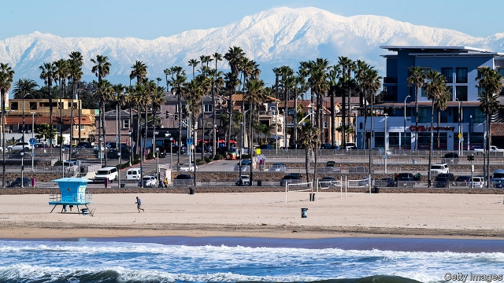

###### Homing in

# Why California’s governor is suing Huntington Beach 

##### Can a lawsuit compel upscale cities to build more housing? 

 

> Mar 28th 2019 

“HOW MANY governors start their administrations suing one of the most beautiful and iconic cities in the state?” asks Gavin Newsom, California’s new governor, sitting in his office in the state Capitol. Not many. However in January, soon after Mr Newsom was sworn in, the state attorney-general’s office, at the governor’s behest, sued Huntington Beach, a coastal city in Orange County, for failing to comply with the state’s housing-supply law. “I love Huntington Beach,” Mr Newsom insists. “Now I’m going to have a hard time walking the streets down there.” 

A warm welcome to “Surf City”, as Huntington Beach is known, may not be in Mr Newsom’s future, but that is not what he was hoping for anyway. California has a severe shortage of affordable housing, and he wants to bring a sense of urgency to the problem. The state has the highest poverty rate in America when adjusted for the cost of living. One-third of renters pay more than half of their income towards rent, and homeownership rates in the state are at their lowest level since the 1940s. The state saw around 80,000 new homes built annually over the past 10 years, about 40% of what is needed. Local governments’ restrictions, slow approval and permitting processes, opposition from residents and high development costs are to blame. 

The lawsuit against Huntington Beach is meant to be a warning shot to cities that they cannot stonewall development. Fifty years ago the state passed a “housing element” law requiring communities to plan for new housing for all income groups, based on forecasts for population growth. In 2017 the state legislature passed several bills to speed up housing development and approvals. Until recently many cities have not met their housing numbers but faced little consequence. They routinely put in place restrictions that make development harder, such as erecting height restrictions and lowering caps on new housing developments. This is what happened in Huntington Beach’s case, according to the state’s lawsuit, which declares, “the time for empty promises has come to an end. The city should not be allowed to avoid its statutory obligations any longer.” 

Huntington Beach is fighting back. It claims that the statute of limitations has already passed and is asking a court to toss out the lawsuit; a hearing to decide this will take place on April 3rd. The city has itself sued the state on several occasions. In February it filed two lawsuits taking aim at the state’s housing laws. Last year the city sued California in a separate instance over its “sanctuary state” policy, arguing that the state cannot require the city to comply with imposed limitations on police collaboration with immigration authorities (the case is now on appeal). Perhaps this immigration spat is part of why Huntington Beach is being “singled out” now, muses Michael Gates, the city attorney. 

Huntington Beach is the only city that has been sued so far, but in his state of the state address in February, Mr Newsom called out 47 cities for not doing enough to build housing. Such public shaming, coupled with the Huntington Beach lawsuit, has brought dozens of local representatives to agree to meet with the governor about housing policy, and several cities are working to come into compliance swiftly. Mr Newsom has also threatened to withhold funds from the gas tax, which is used for local roads and infrastructure, from cities that do not meet housing goals. “Everybody is upset about that, and it’s exactly why I did it. There’s got to be consequences,” he says. For years local governments have been able to slow-walk development with no fear of repercussion. Not on Mr Newsom’s watch. 

-- 

 单词注释:

1.homing['hәumiŋ]:n. 归航, 动物的返回性 a. 有返回性的, 回家的 

2.sue[su:]:vt. 控告, 起诉, 请求 vi. 提出诉讼, 提出请求 

3.huntington['hʌntiŋtәn]:n. 亨廷顿（男子名, 美国地名） 

4.lawsuit['lɒ:sju:t]:n. 诉讼 [法] 诉讼, 诉讼案件 

5.upscale['ʌpskeil]:a. 迎合高层次消费者的；质优价高的 

6.iconic[ai'kɔnik]:[计] 图标的 

7.gavin[]:n. 加文（男子名） 

8.newsom[]: [人名] [英格兰人姓氏] 纽瑟姆 Newsome的变体 

9.Capitol['kæpitl]:n. 国会大厦, 州议会大厦, 朱比特神庙 

10.behest[bi'hest]:n. 命令 

11.coastal['kәustәl]:a. 海岸的, 沿海的, 沿岸的 [法] 海岸的, 沿海的 

12.comply[kәm'plai]:vi. 顺从, 依从 [法] 遵守, 承诺, 照做 

13.surf[sә:f]:n. 海浪, 拍岸浪 vi. 作冲浪运动 

14.California[.kæli'fɒ:njә]:n. 加利福尼亚 

15.affordable[]:[计] 普及型 

16.urgency['ә:dʒәnsi]:n. 紧急, 催促 [法] 紧急, 迫切, 紧急之事 

17.renter['rentә]:n. 承租人, 佃户, 出租人 [经] 租赁人, 租户, 出租人 

18.homeownership[]:n. 私房屋主；自己拥有住房者 (homeowner的变形) 

19.annually['ænjuәli]:adv. 一年一次, 每年 [经] 年度的, 每年的 

20.opposition[.ɒpә'ziʃәn]:n. 反对, 敌对, 相反, 在野党 [医] 对生, 对向, 反抗, 反对症 

21.cannot['kænɒt]:aux. 无法, 不能 

22.stonewall[stәun'wɒ:l]:vi. 防守挡击, 围以石墙, 妨碍或阻碍 

23.legislature['ledʒisleitʃә]:n. 立法机关, 议会, 立法院 [法] 立法机构, 立法机关 

24.routinely[]:adv. 日常, 乏味, 常规, 例行 

25.statutory['stætjutәri]:a. 法令的, 法定的, 可依法惩处的 [经] 法定的 

26.sanctuary['sæŋktʃuәri]:n. 圣所(指教堂、寺院等), 耶路撒冷的神殿, 避难所 [法] 庇护所, 避难所, 教堂 

27.collaboration[kә.læbә'ræʃәn]:n. 合作, 勾结 [法] 通敌卖国者, 奸细 

28.muse[mju:z]:n. 沉思, 冥想 v. 沉思, 冥想, 若有所思地凝望或说 

29.michael['maikl]:n. 迈克尔（男子名） 

30.attorney[ә'tә:ni]:n. 代理人, 律师 [经] 律师, 代理人 

31.compliance[kәm'plaiәns]:n. 遵从, 顺从, 屈从 [化] 柔顺; 顺应 

32.swiftly['swiftli]:adv. 很快地, 即刻 

33.withhold[wið'hәuld]:vt. 使停止, 扣留, 保留, 拒给 vi. 克制, 忍住 

34.infrastructure['infrәstrʌktʃә]:n. 基础结构, 基础设施 [经] 基础设施 

35.repercussion[.ri:pә'kʌʃәn]:n. 弹回, 反响, 反射 [医] 消退[法], 消肿[法], 浮动诊胎法 

