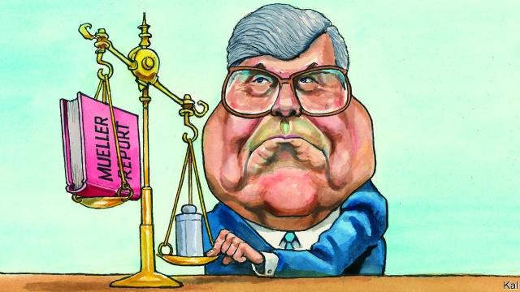

###### Lexington

# William Barr, executive assistant to Donald Trump 

##### The benefits of an attorney-general with a capacious view of presidential authority 

 

> Mar 28th 2019 

MANY DEMOCRATS are dismayed by Robert Mueller’s failure to take down the president. Yet they have a consolatory new hate figure in the form of William Barr, who began his second spell as attorney-general last month. A grandfatherly 68-year-old, who first presided over the Justice Department for George H.W. Bush, Mr Barr has been castigated for his handling of Mr Mueller’s report, which remains under wraps at his discretion. Jerrold Nadler, Democratic chairman of the House Judiciary Committee, called his summary of the report “a hasty, partisan interpretation of the facts.” Several Democrats running for president, including Kamala Harris and Elizabeth Warren, derided Mr Barr as Donald Trump’s “hand-picked attorney-general” (as if there were any other kind). 

This is partly a case of shooting the messenger. Many on the left were convinced Mr Trump was up to his neck in the Russian plot that helped get him elected. They also had an almost cultlike faith in Mr Mueller (the ash-dry prosecutor would be amazed to see how many T-shirts bear his name on campus—as in “Mueller Time—Justice Served Cold!”). The instant Mr Barr relayed the crushing news that the special counsel had found no collusion with Russia by Mr Trump, he was suspected of skulduggery, which seems hysterical. A close friend of the special counsel, Mr Barr is possibly too principled and certainly too canny to have misrepresented his conclusions. If he had done so, they would leak. Yet the attorney-general’s treatment of the second prong of Mr Mueller’s investigation, concerning Mr Trump’s alleged effort to obstruct the various Russia investigations, is more troubling. 

It is not clear why Mr Mueller refrained from ruling on the evidence against Mr Trump on this issue. It is also unclear whether he expected Mr Barr to rule for him. Perhaps Mr Mueller felt the decision was above his paygrade, given the Justice Department’s policy of not indicting a sitting president. Perhaps Mr Barr—and his deputy Rod Rosenstein, who supported his view that Mr Mueller had not made a convincing obstruction case—made a straightforward decision. Yet that would make the emphasis Mr Mueller laid upon the possibility of Mr Trump’s guilt—in stressing that his report did “not exonerate” the president—even odder than it already seems. The result, absent further disclosure to provide explanation and reassurance, is just the sort of heaving political mess of intrigue and innuendo Mr Mueller was appointed to clear up. 

Whatever they intended, he and Mr Barr have combined to damage Mr Trump while clearing him. Theirs is a jumbled, two-handed version of James Comey’s fateful decision to criticise Hillary Clinton’s email arrangements even as he announced that she would not faces charges. No wonder it has elicited the same partisan response. Republicans consider Mr Trump exonerated, Democrats—almost as understandably—think he hasn’t been. 

That is not to imply Mr Mueller considered Mr Trump guilty of obstruction. It will take a fuller disclosure of his report to grasp how “difficult” he considered the factual and legal impediments to that conclusion to be. But it at least seems likely that he wanted his starkly worded equivocation on this issue (which Mr Barr had little option but to relay), to be heard by Congress, which is the only body empowered to hold Mr Trump to account, given that the Justice Department will not. That makes Mr Barr’s final ruling appear unnecessary. Indeed Paul Rosenzweig and others on the Lawfareblog can find no legal or departmental explanation for it. 

That alone risks Mr Barr’s intervention seeming partial—at least to the half of America aching to see Mr Trump in irons. And the impression is reinforced by the fact that Mr Barr prejudged the Mueller investigation, in the president’s favour, before he took charge of it. In an unsolicited 19-page memo to Mr Rosenstein last year, Mr Barr argued that the special counsel’s obstruction probe was “fatally misconceived” and “premised on a novel and legally insupportable reading of the law.” Barr boosters argue that one of his strengths as a member of Mr Trump’s cabinet is that he is too old, successful and phlegmatic to be pushed around. His memo, which was distributed to the White House, suggests he was a bit more eager to get back in the game than that portrayal has it. 

This is a salutary lesson, especially for those who look to the law to settle political disputes. Democrats—and many Republicans, too—were not wrong to contrast Mr Mueller’s integrity with the president’s lack of it. Yet the special counsel was never likely to be the antidote they craved, because the power of the ballot trumps the law, and because the law is slippery. Mr Trump employs alternative facts; on the question of obstruction, Mr Mueller’s report appears to offer alternative realities. 

The episode also underscores concerns about Mr Barr’s expansive view of executive power. In his memo he argued that the president could not obstruct justice, however malign his motives for a given action, in the lawful performance of his office. In summarising the Mueller report he offered a less radical argument, that Mr Trump could not have obstructed justice because he did not collude with Russia. Yet this seemed so obviously threadbare, given the many Russia-related things Mr Trump had to hide short of a grand conspiracy, that it suggested the extent to which he remains fundamentally guided by extreme deference to presidential authority. 

It is a view formed in the 1980s, when conservatives considered the presidency the best means to undo the government expansion of recent years. Almost four decades later, the power of the executive has soared and the ability of lawmakers to hold it to account is at rock-bottom—to the extent that Mr Trump has conducted a two-year war on the Justice Department which most Republican congressmen dare not acknowledge. And yet Mr Barr’s legal and political priorities are unchanged—which is of course why Mr Trump picked him for his job. If dogged consistency is the great virtue of elder statesmen, in changing times it is also their weakness. 

-- 

 单词注释:

1.lexington['leksiŋtәn]:n. 列克星敦市（位于美国肯塔基州） 

2.william['wiljәm]:n. 威廉（男子名）；[常作W-][美俚]钞票, 纸币 

3.barr[]:abbr. 翻转形态（Bump and Run Reversal） 

4.capacious[kә'peiʃәs]:a. 容积大的, 广阔的, 宽敞的 

5.presidential[.prezi'denʃәl]:a. 总统制的, 总统的, 首长的, 统辖的 [法] 总统的, 议长的, 总经理的 

6.democrat['demәkræt]:n. 民主人士, 民主主义者, 民主党党员 [经] 民主党 

7.dismay[dis'mei]:n. 沮丧 vt. 使惊愕, 使气馁 

8.Robert['rɔbәt]:[法] 警察 

9.consolatory[kәn'sɒlәtәri]:a. 慰问的, 可慰藉的 

10.grandfatherly['^rænd,fɑ:ðәli]:a. 老祖父的, 慈祥的, 老祖父似的 

11.preside[pri'zaid]:vi. 统辖, 当主人, 主持 [法] 主持, 负责, 指挥 

12.george[dʒɔ:dʒ]:n. 乔治（男子名）；自动操纵装置；英国最高勋爵勋章上的圣乔治诛龙图 

13.hw[]:abbr. 半波（Half Wave）；热水（hot water）；硬件（Hardware） 

14.castigate['kæstigeit]:vt. 惩罚, 苛评, 修订 

15.discretion[dis'kreʃәn]:n. 慎重, 辨别力, 考虑, 处理权 [法] 有决定权的 

16.jerrold[]: [男子名] [英格兰人姓氏] 杰罗尔德 Garrett的变体 

17.nadler[]: [人名] [英格兰人姓氏] 纳德勒职业名称，制针者，有时也指裁缝，来源于中世纪英语，含义是“针”(needle)+er 

18.judiciary[dʒu:'diʃiәri]:a. 司法的, 法院的, 法官的 n. 司法部, 司法系统, 法官 

19.partisan['pɑ:tizn]:n. 党羽, 虔诚信徒, 同党, 游击队员 a. 党派的, 偏袒的, 效忠的, 献身的, 盲目推崇的 

20.kamala[kә'meilә]:n. [植] 粗糠柴 

21.harris['hæris]:n. 哈里斯（英国苏格兰一地区）；哈里斯（姓氏） 

22.elizabeth[i'lizәbәθ]:n. 伊丽莎白（女子名） 

23.warren['wɒrәn]:n. 养兔场, 拥挤的地区 

24.deride[di'raid]:vt. 嘲弄, 嘲笑 

25.cultlike[]:[网络] 邪教 

26.Mueller[]:米勒（人名） 

27.prosecutor['prɒsikju:tә]:n. 实行者, 告发者, 公诉人 [法] 原告, 起诉人, 检举人 

28.counsel['kaunsәl]:n. 商议, 忠告, 法律顾问 v. 商议, 劝告 

29.collusion[kә'lu:ʃәn]:n. 共谋, 勾结 [经] 勾结, 串通, 串同舞弊 

30.skulduggery[skʌl'dʌgәri]:n. 欺骗, 欺诈, 作假 

31.hysterical[his'terikәl]:a. 歇斯底里的, 异常兴奋的 [医] 癔病的, 歇斯底里的 

32.principled['prinsәpld]:a. 原则的, 有原则的, 原则性的 

33.canny['kæni]:a. 精明的, 谨慎的, 节约的 

34.misrepresent['mis.repri'zent]:vt. 不如实地叙述(或说明), 不称职地代表 

35.prong[prɒŋ]:n. 叉状物, 耙子 vt. 刺, 贯穿, 翻掘 

36.allege[ә'ledʒ]:vt. 宣称, 主张, 提出, 断言 [法] 断言, 指称, 指证 

37.obstruct[әb'strʌkt]:vt. 阻隔, 妨碍, 阻塞, 遮没 vi. 设障碍 

38.refrain[ri'frein]:n. 重复的话, 叠句, 副歌 vi. 节制, 避免, 克制 

39.unclear[.ʌn'kliә]:a. 不易了解的, 不清楚的, 含混的 

40.paygrade['pei^reid]:n. [军]薪饷等级 

41.indict[in'dait]:vt. 起诉, 控告, 指控 [法] 控告, 揭发, 对...起诉 

42.rosenstein[]: [人名] 罗森斯坦 

43.obstruction[әb'strʌʃәn]:n. 障碍, 妨碍, 闭塞物 [医] 梗阻, 不通 

44.exonerate[ig'zɒnәreit]:vt. 免除, 证明无罪 [法] 解放, 开释, 免罪 

45.odder[ɔdə]:a. 奇怪的( odd的比较级 ); 临时的; 奇数的; 不固定的 

46.disclosure[dis'klәuʒә]:n. 揭发, 泄露, 揭发(或暴露)的事实 [经] 揭示, 披露 

47.reassurance[.ri:ә'ʃurәns]:n. 安心, 放心, 再保证 

48.heave[hi:v]:n. 举, 抛, 起伏, 鼓起 vt. 用力举起, 使举起, 使鼓起 vi. 抛出, 起伏, 喘息, 凸起 

49.intrigue[in'tri:g]:n. 阴谋, 复杂的事 vi. 密谋, 私通 vt. 激起...的兴趣, 用诡计取得 

50.innuendo[.inju:'endәu]:n. 讽刺, 暗讽 vi. 说讽刺话 vt. 暗示 

51.jumble[dʒʌmbl]:vi. 搀杂, 混杂 vt. 搞乱, 使混乱 n. 混乱, 薄饼 

52.jame[]: 灰岩井 

53.fateful['feitful]:a. 宿命的, 重大的, 决定性的 

54.criticise['kritisaiz]:v. 批评, 吹毛求疵, 非难 

55.Hillary['hiləri:]:n. 希拉里（美国现任国务卿） 

56.elicit[i'lisit]:vt. 引出, 推导出, 引起 

57.factual['fæktʃuәl]:a. 事实的, 实际的 [法] 事实的, 与事实有关的, 实际的 

58.impediment[im'pedimәnt]:n. 妨碍, 障碍, 阻止, 口吃 [经] 对履行义务的阻碍 

59.starkly[]:adv. 完全, 分明地, 赤裸裸地 

60.equivocation[i.kwivә'keiʃәn]:n. 模棱两可的话, 含糊话 [电] 等业 

61.empower[im'pauә]:vt. 授予权力, 允许, 使能够 [法] 授权, 准许, 转委 

62.paul[pɔ:l]:n. 保罗（男子名） 

63.rosenzweig[]:[网络] 罗森茨威格；罗森茨维格；罗森韦格 

64.departmental[.di:pɑ:t'mentәl]:a. 部门的, 各部的, 分科的 

65.intervention[.intә'venʃәn]:n. 插入, 介入, 调停 [经] 干预 

66.prejudge[pri:'dʒʌdʒ]:vt. 预先判断, 对...预先作出判决 

67.unsolicited['ʌnsә'lisitid]:a. 未经请求的, 主动提供的 [计] 任意型的 

68.memo['memәu]:n. 备忘录 [经] 备忘录 

69.probe[prәub]:n. 探索, 调查, 探针, 探测器 v. 用探针探测, 调查, 探索 

70.fatally['feitәli]:adv. 致命地, 不幸地, 宿命地 

71.misconceive[.miskәn'si:v]:v. 误解 

72.premise['premis]:n. 前提, 房屋连地基, 上述各项 vt. 预先提出, 引出, 作为...的前提 vi. 作出前提 

73.legally['li:gәli]:adv. 法律上, 合法地 [法] 法律上, 合法地, 法定地 

74.insupportable[.insә'pɒ:tәbl]:a. 忍耐不住的, 不合理的 

75.booster['bu:stә]:n. 向前推的人, 支持者, 后援者, 升压器 [化] 爆管; 扩爆药; 传爆药; 升压机; 增压装置; 升压器; 助促进剂 

76.phlegmatic[fle^'mætik]:a. 粘液质的, (正式)平静的, 不动情的, 不动感情的, 冷漠的, 冷淡的, 迟钝的 [医] 粘液质的, 迟钝的 

77.portrayal[pɔ:'treiәl]:n. 描绘, 描写, 画像, 肖像 [计] 描绘 

78.salutary['sæljutәri]:a. 有益的, 有用的, 有益健康的 [医] 适于健康的 

79.integrity[in'tegriti]:n. 正直, 廉正, 完整 [计] 完整性 

80.antidote['æntidәut]:n. 解毒剂, 解毒药 [化] 解毒药 

81.crave[kreiv]:v. 渴望, 热望, 恳求 

82.ballot['bælәt]:n. 投票, 投票用纸, 抽签 vi. 投票, 抽签 vt. 投票选出, 拉选票 

83.trump[trʌmp]:n. 王牌, 法宝, 喇叭 vt. 打出王牌赢, 胜过 vi. 出王牌, 吹喇叭 

84.underscore[.ʌndә'skɒ:]:vt. 划线于...下 n. (表强调的)下划线 [计] 底线 

85.expansive[ik'spænsiv]:a. 扩张性的, 使扩大的, 广阔的 [化] 膨胀的; 可以膨胀的 

86.malign[mә'lain]:a. 有害的, 恶性的, 有恶意的 vt. 诽谤, 说坏话 

87.lawful['lɒ:ful]:a. 法律许可的, 守法的, 合法的 [经] 合法的, 法定的 

88.summarise['sʌmәraiz]:vt. 概括, 总结, 摘要, 概述 

89.les[lei]:abbr. 发射脱离系统（Launch Escape System） 

90.collude[kә'lu:d]:vi. 共谋, 串通, 勾结 

91.threadbare['θredbeә]:a. 衣服磨薄了的, 穿旧了的, 衣着褴褛的, 俗套的, 乏味的 

92.conspiracy[kәn'spirәsi]:n. 同谋, 阴谋, 阴谋集团 [法] 阴谋, 通谋, 共谋 

93.fundamentally[fʌndә'mentәli]:adv. 基础, 首要, 主要, 十分重要, 基本, 根本, 原始, 基频, 基音, 基谐波 

94.deference['defәrәns]:n. 顺从, 尊重 

95.presidency['prezidәnsi]:n. 总统职权, 总裁职位 

96.soar[sɒ:]:n. 高扬, 翱翔 vi. 往上飞舞, 高耸, 翱翔 

97.lawmaker[lɒ:'meikә]:n. 立法者 

98.congressman['kɒŋgresmәn]:n. 国会议员, 众议院议员 [法] 国会议会 

99.consistency[kәn'sistәnsi]:n. 坚硬性, 黏稠度, 一致性 [化] 稠度; 一致性 

