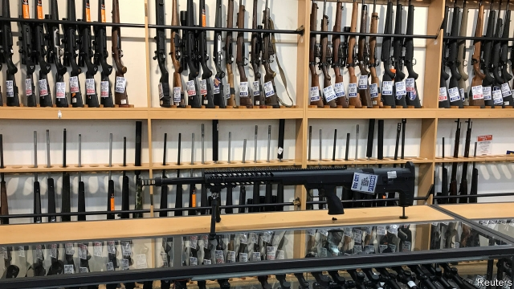
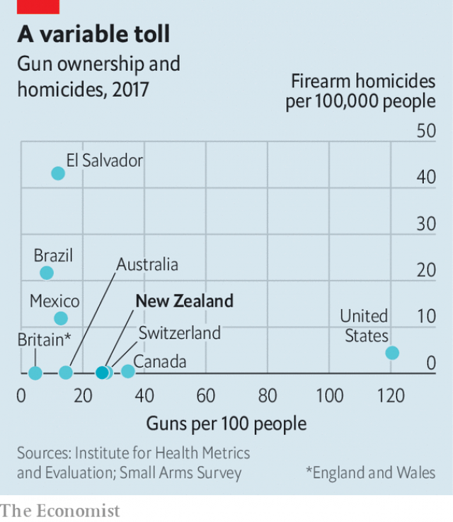

###### Never again

# After the Christchurch massacre, New Zealand bans semi-automatic rifles 

##### A similar law in Australia largely eliminated mass killings 

 

> Apr 4th 2019 

ATTEMPTS TO STRENGTHEN New Zealand’s gun-control laws have failed in parliament four times over the past 20 years. That was before a white supremacist laid siege to two mosques in the city of Christchurch on March 15th, killing 50 people. This week a bill to ban the kind of high-powered semi-automatic weapons that he used was introduced; every MP but one supports it. It should sail into law in days. 

New Zealand has one of the world’s highest rates of gun ownership, with 26 guns per 100 people. That puts it 20th out of the 230 countries and territories ranked by the Small Arms Survey, a research institute. Despite this, it ranks only 172nd out of 195 countries in terms of deaths per person from firearms, according to data from the University of Washington (see chart). Total killings with guns are typically in the single digits each year, out of a population of 4.8m. 

 

The already low rate of killings with guns is one reason why it will be hard to discern the new law’s effectiveness. Australia adopted similar legislation in 1996 after a mass shooting in the state of Tasmania. The Australian government banned semi-automatic rifles, created a national gun registry and bought firearms from citizens, as New Zealand intends to. The stock of licensed guns fell by about a third. 

Firearm-related suicides and homicides fell after the legislation passed. But firearm deaths had already been falling before 1996, and the pace did not notably accelerate. Moreover, gun violence was declining in many other rich countries, few of which had adopted stricter gun laws. 

Australia’s gun reforms almost entirely eliminated mass shootings. Between 1980 and 1996 there were 13 incidents in which five or more victims were shot to death. There has been just one since. But until Christchurch, New Zealand had not seen any mass shootings in over 20 years, despite the many semi-automatic rifles. 

This suggests that social norms have been New Zealand’s best defence against mass shootings. But as Philip Alpers of the University of Sydney notes, the killer in Christchurch would simply not have been able to buy such deadly weapons in his home country, Australia. 

-- 

 单词注释:

1.Christchurch['kraist-tʃә:tʃ]:n. 克赖斯特彻奇 

2.massacre['mæsәkә]:n. 大屠杀 vt. 大屠杀, 残杀 

3.zealand['zi:lәnd]:n. 西兰岛（丹麦最大的岛） 

4.killing['kiliŋ]:n. 谋杀, 杀戮 a. 杀害的, 疲惫的, 迷人的 

5.APR[]:[计] 替换通路再试器 

6.supremacist[sә'premәsist, sju-]:n. 至上主义者 

7.siege[si:dʒ]:n. 包围, 围攻, 再三的努力 vt. 包围, 围攻 

8.mosque[mɒsk]:n. 清真寺 

9.MP[]:国会议员, 下院议员 [计] 宏处理程序, 维护程序, 线性规划, 微程序, 多处理器 

10.firearm['faiә'ɑ:m]:n. 火器, 枪炮 

11.datum['deitәm]:n. 论据, 材料, 资料, 已知数 [医] 材料, 资料, 论据 

12.Washington['wɒʃiŋtn]:n. 华盛顿 

13.typically['tipikәli]:adv. 代表性地；作为特色地 

14.digit['didʒit]:n. 数字, 位数, 指头 [计] 数位; 位 

15.discern[di'zә:n]:v. 辨别, 看清楚, 了解 

16.effectiveness[i'fektivnis]:n. 效力 [经] 有效性, 能行性 

17.tasmania[tæz'meinjә]:n. 塔斯马尼亚岛（位于澳洲东南方） 

18.registry['redʒistri]:n. 登记处, 登记名册 [计] 登录库 

19.suicide['sjuisaid]:n. 自杀, 自杀者 v. 自杀 a. 自杀的 

20.homicide['hɒmisaid]:n. 杀人, 杀人者 [医] 杀人, 杀人者 

21.notably['nәjtbәli]:adv. 显著地, 著名地, 尤其, 特别 

22.entirely[in'taiәli]:adv. 完全, 全然, 一概 

23.norm[nɒ:m]:n. 基准, 模范, 标准, 准则, 平均数 [化] 定额 

24.philip['filip]:n. 菲利普（男子名） 

25.alpers[]:n. (Alpers)人名；(法)阿佩尔；(德、土、阿塞、土库、立陶、拉脱)阿尔佩斯；(土)阿尔佩尔斯；(英)阿尔珀斯 

26.sydney['sidni]:n. 悉尼（澳大利亚港市） 

27.killer['kilә]:n. (非正式)杀人者, 屠杀者, 猛兽, 致死(疾病), 杀手, 止痛药, 限制器, 瞄准器 [计] 删除程序; 断路器 

