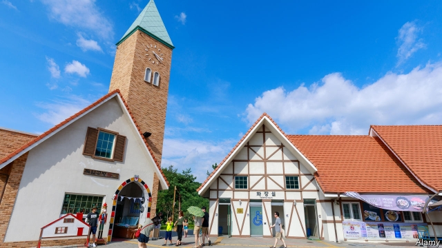

###### Where the Rhine meets the Pacific

# An ersatz German village tries to lure South Korean emigrants home 

##### But there are not many takers 

 

> Apr 4th 2019 

WHEN SHE arrived in Germany from South Korea in 1967 to work as a nurse, Min-ja Fliess was planning to stay for three years before going home to get married. More than 50 years later, she is still there. Sitting in the living room of Sukil Lee, a 90-year-old paediatrician, in Mainz, a small town in western Germany, she talks about her extended stay. “When I arrived I thought German men were intimidating,” she says. Now she has two children with her German husband and returns to South Korea only on holiday. 

Mrs Fliess first came to Germany in response to an ad Dr Lee placed in a South Korean newspaper all those years ago. The hospital where he worked was short of nurses, so he was encouraging qualified young Koreans to apply. In total, more than 10,000 South Korean women arrived in the 1960s and 1970s to work as nurses in German hospitals. (A similar number of South Korean men came to work in coal mines during the same period.) The government of Park Chung-hee, South Korea’s strongman at the time, supported the exodus because the remittances the emigrants sent back helped to finance industrialisation. A message from the dictator thanking Dr Lee for his efforts hangs on the living-room wall. 

For the women who came to work in Germany, life was not easy. Often barely out of their teens, they had to sign contracts they could not read and to start work straight off the plane. The gulf between their home country, where rapid development was only just beginning, and West Germany, which was in the midst of “the miracle on the Rhine”, was immense. “Nobody could find Korea on the map,” says Park Hwa-ja, who arrived in Germany the year before Mrs Fliess. Some of the women could not cope with the alienation of being alone in a strange country. Dr Lee recalls once being called to the hospital in the middle of the night to identify the bodies of two nurses who had committed suicide. 

Today Ms Park and Mrs Fliess stress how glad they are to have moved to Germany. But they still appear happier chatting to each other in Korean than in German. A certain unease lingers. Mrs Fliess says her son, though born in Germany and now a doctor, still finds it tricky to live there. “When he was young people used to call us ‘Chinesen’ (Chinese), and he’d get angry and say, ‘I’m German’.” 

On the other side of the globe, in South Korea, Ryu Gil-ja is grappling with the opposite problem. “People here don’t like strangers, and I’ve been away too long,” she says. Like Mrs Fliess and Ms Park, Ms Ryu (whose German surname is Werner) moved from South Korea to Germany in the 1960s in response to a newspaper ad. Like Mrs Fliess, she married a German and ended up staying for decades. But unlike the other two women, she is happier today speaking German than Korean. Also unlike them, she eventually decided to go back to Korea. 

Ms Ryu’s return is part of an experiment initiated by Kim Doo-kwan, an MP who was born in Namhae, an island-county on the southern coast of the Korean peninsula, and used to be a local official there. In the 1990s, seeing the difficulties that his brother, a miner, and his sister-in-law, a nurse, met when they returned to Korea after long stints in Germany, he decided to create a place for people like them to return to. He advertised the idea among Koreans living in Germany, and lobbied the German and Korean governments to support it. The result is Namhae German Village. 

The village was built on a hill overlooking a tranquil bay. So long as visitors avoid glancing down at the Korean-looking fishing village on the shore below, the ersatz Germanness is rather successful. There are beer gardens and breweries (one serves a stout called “Miner’s melody”), a square for Oktoberfest celebrations, plenty of adverts for Wurst and Schnitzel and a lot of the red rooftiles typical of suburbs in south-western Germany. The houses in the village are named after German cities and supposedly reflect regional building styles—or at least a kitschy imitation of them. 

Ms Ryu’s house, which she designed herself and built with help from the Korean government, is named “Villa Colonia” for Cologne, her longtime home in Germany. It sports a fairy-tale tower and an entrance with a portico. The hallway is decorated with photographs of Cologne’s cathedral. In the living room, the dark-wood furniture and heavy oriental carpets are reminiscent of Dr Lee’s house in Mainz. (There is a Mainz-themed house down the road.) 

As a tourist attraction the village has become quite popular, much like other Korean-themed “folk villages” dotted around the country. Ms Ryu, like many of her neighbours, runs a B&B from her home. A small museum sponsored by the German government that tells the story of the emigrants draws around a quarter of a million visitors every year. They can admire old nursing uniforms, listen to the sounds of a coal mine and watch a rousingly nationalist film glorifying the emigrants’ contribution to Korea’s economic growth. Many more people come just to take in the views of the bay or enjoy a beer and a meal, according to the county office. 

Whether the village has been successful in convincing emigrants to return and helping them to resettle is less clear. It has only a few dozen inhabitants, and only a handful of those are former nurses or miners who responded to Mr Kim’s initiative. The German government estimates that roughly half of the Korean women who came to work as nurses ended up returning home. But most moved to Seoul or went back to their hometowns. There was no systematic effort to track how hard they found it to reintegrate. 

Ms Ryu is happy with her choice, despite the remoteness of the village and the dearth of neighbours. “I always wanted to build my dream home back here in Korea and live in it, and I have done that.” Her German husband is less enthusiastic. He has stayed in Cologne and only occasionally visits. Her two grown-up children also remain in Germany. But Ms Ryu has ensured that her family will join her eventually. On a nearby hillside, above a German Imbiss (snack) stall, she has secured a plot in the village graveyard. A headstone already bears not only her name, but those of her husband and children. 

-- 

 单词注释:

1.Rhine[rain]:n. 莱茵河 

2.ersatz[eә'zɑ:tz]:n. 代用品 

3.lure[luә]:n. 饵, 诱惑 vt. 引诱, 诱惑 

4.Korean[kә'riәn]:n. 朝鲜人, 朝鲜语 a. 朝鲜人的, 朝鲜语的 

5.emigrant['emigrәnt]:n. 移民, 侨民 a. 移民的, 移居的 

6.taker['teikә]:n. 取者, 捕者, 接受者, 收取者 [法] 受者, 收票人, 接受打赌的人 

7.APR[]:[计] 替换通路再试器 

8.Korea[kә'riә]:n. 朝鲜, 韩国 

9.flies[]:n. 裤子前面的开口 

10.lee[li:]:n. 背风处, 避风处, 下风处, 保护, 庇护 a. 避风的, 背风的, 下风的, 保护的 

11.paediatrician[.pi:diә'triʃәn]:n. 儿科医师 

12.Mainz[maints]:美因兹[德意志联邦共和国西部城市](或译美因茨, 莱茵兰-法耳次州首府) 

13.Mr['mistә(r)]:先生 [计] 存储器回收程序, 多重请求 

14.Korean[kә'riәn]:n. 朝鲜人, 朝鲜语 a. 朝鲜人的, 朝鲜语的 

15.strongman[ˈstrɒŋmæn]:n. 大力士 

16.exodus['eksәdәs]:n. 大批的离去 [法] 退出, 大批离去, 成一外出 

17.remittance[ri'mitns]:n. 汇款 [经] 汇款, 寄款, 支付(金额) 

18.industrialisation[ɪndʌstrɪəlaɪzeɪ'ʃən]:n. 工业化 

19.dictator['dikteitә]:n. 命令者, 独裁者 

20.teen[ti:n]:n. 愤怒, 悲哀 

21.alienation[.eiljә'neiʃәn]:n. 疏远, 离间, 转让 [医] 精神错乱 

22.suicide['sjuisaid]:n. 自杀, 自杀者 v. 自杀 a. 自杀的 

23.unease[.ʌn'i:z]:n. 不安 

24.linger['liŋgә]:vi. 逗留, 消磨, 徘徊 vt. 消磨 

25.tricky['triki]:a. 狡猾的, 机敏的 

26.ryu[]:abbr. Ryukyu 琉球群岛; Ryukyuan 琉球人，琉球民族 

27.grapple[græpl]:v. 抓住, 掌握 n. 抓住, 系紧, 掌握, 与...扭打 

28.werner['wә:nә]:n. 维尔纳（男子名） 

29.initiate[i'niʃieit]:n. 入会, 开始 a. 新加入的 vt. 开始, 传授基本知识给 

30.kim[]:n. 金姆（人名） 

31.MP[]:国会议员, 下院议员 [计] 宏处理程序, 维护程序, 线性规划, 微程序, 多处理器 

32.stint[stint]:vt. 节省, 限制, 停止 vi. 节约 n. 吝惜, 节约, 限额 

33.lobby['lɒbi]:n. 大厅, 休息室, 游说议员者 vi. 游说议员, 游说 vt. 游说 

34.tranquil['træŋkwil]:a. 安静的 

35.Germanness[]:n. German的变形 

36.melody['melәdi]:n. 曲子, 美妙音乐, 曲调 

37.oktoberfest[ ɔk'təubəfest]:n. 啤酒节又叫德国十月节，每年的10月10日 

38.advert[әd'vә:t]:vi. 提出看法, 引起注意, 留意 n. 广告 

39.wurst[wә:st]:n. 香肠 

40.schnitzel['ʃnitsәl]:n. 炸小牛肉片 

41.rooftile[]:un. 屋面瓦；炉顶砖 [网络] 瓦片 

42.supposedly[sә'pәuzidli]:adv. 想象上, 看上去像, 被认为是, 恐怕, 按照推测 

43.regional['ri:dʒәnәl]:a. 地方的, 地域性的 [医] 区的, 部位的 

44.kitschy['kitʃi]:艺术上浅薄鄙俗但技巧娴熟的 

45.imitation[.imi'teiʃәn]:n. 模仿, 效法, 冒充, 赝品 [医] 模仿, 仿制, 仿制品 

46.villa['vilә]:n. 别墅 

47.colonia[]:n. 墨西哥裔美国人社区；殖民地 

48.Cologne[kә'lәun]:n. 科隆, 科隆香水 

49.longtime['lɔŋtaim;'lɔ:ŋ-]:a. (已持续)长时间的,为时甚久的 adv. 长久 

50.portico['pɒ:tikәu]:n. 门廊 

51.hallway['hɔ:lwei]:n. 门厅；玄关；走廊 

52.reminiscent[.remi'nisnt]:a. 回忆的, 怀旧的 n. 往事叙述者, 回忆录作者 

53.rousingly[]:adv. rousing的变形 

54.nationalist['næʃәnәlist]:n. 国家主义者, 民族主义者 

55.glorify['glɒ:rifai]:vt. 赞美, 美化, 赞扬, 使辉煌 

56.resettle[ri:'setl]:v. (使)重新定居 

57.les[lei]:abbr. 发射脱离系统（Launch Escape System） 

58.Seoul[sәul]:n. 汉城 

59.reintegrate[ri'intigreit]:vt. 使重新统一, 恢复, 重建, 复兴 

60.remoteness[ri'mәutnis]:n. 远离, 远隔, 微少 [法] 遥远, 间接, 疏远 

61.dearth[dә:θ]:n. 缺乏, 粮食不足, 饥馑 

62.alway['ɔ:lwei]:adv. 永远；总是（等于always） 

63.stall[stɒ:l]:n. 厩, 停车处, 牧师职位, 货摊, 托辞, 拖延 vt. 关入厩, 停顿, 推托, 支吾, 使陷于泥中 vi. 被关在厩内, 陷于泥中, 停止, 支吾 

64.graveyard['greivjɑ:d]:n. 墓地 

65.headstone['hedstәun]:n. 墓石, 基石 

