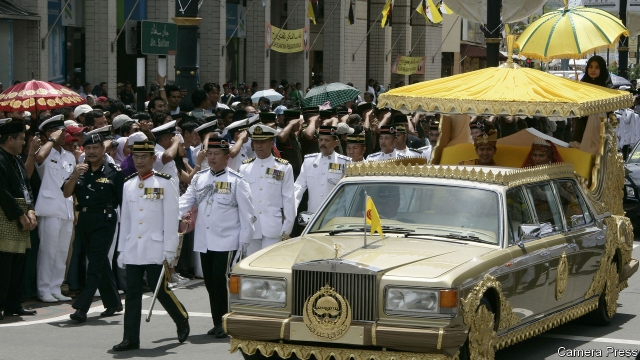

###### The end is Brunei

# Brunei’s ultra-rich monarch adopts harsh Sharia punishments 

##### A new penal code mandates death by stoning for sex outside marriage, anal sex and insulting the prophet Muhammad 

 

> Apr 4th 2019 

THE MOST famous person to have been accused of theft in Brunei is Prince Jefri Bolkiah, the brother of Sultan Hassanal Bolkiah. The government said he embezzled almost $15bn from a sovereign-wealth fund, and pursued him in courts around the world until he agreed to make some restitution. He has a reputation as a philanderer, too. Several women have claimed that he kept them in sexual slavery in a crowded harem. (The prince named one of his yachts Tits and its two tenders Nipple 1 and Nipple 2.) And then there is the question of the vast personal wealth of the sultan himself, who rules the tiny, oil-soaked sliver of Borneo as an absolute monarch. He owns a gold-plated Rolls-Royce, and lives in a palace with air-conditioned stables for 200 polo ponies, which, although perfectly legal, could be seen as wholesale theft from his 430,000 subjects, who derive far less benefit from Brunei’s resources than he does. 

The sultan, presumably, did not have that kind of theft in mind when he pushed for the adoption of a harsh Islamic penal code, which came into force on April 3rd. Among other brutal punishments, it calls for the amputation of a hand or foot as punishment for thieves, and death by stoning for adultery or sex outside marriage. Sex between men, anal sex and insulting the Prophet are also all punishable by stoning. Whipping is prescribed for all manner of crimes; children are not necessarily exempt. 

In practice, the barbarity will probably be limited. For one thing, multiple witnesses to the crimes in question are required for these grisly sentences to be applied. Brunei’s prosecutors do not seem that zealous. Although the death penalty has long been on the books, there have been no executions since 1957. 

Yet there is no guarantee that Brunei’s courts will not implement the new laws. And even if they hesitate, it remains striking that the sultan, without any obvious prodding from his subjects, felt it necessary to bolster his legitimacy by espousing such a cruel interpretation of Islam. Perhaps he wanted to distract them from other, even less defensible aspects of his rule. 

-- 

 单词注释:

1.Brunei['bru:nai]:n. 文莱 

2.monarch['mɒnәk]:n. 帝王, 统治者, 元首 [医] 单原型(植) 

3.sharia[ʃә'ri:ә]:n. 伊斯兰教教法 

4.penal['pi:nl]:a. 有关处罚的, 刑的, 刑罚的, 刑法上的, (课税)繁重的 [法] 刑事的, 刑法的, 受刑罚的 

5.mandate['mændeit]:n. 命令, 指令, 要求 vt. 委任统治 

6.ston[]:n. 上海四通（电器品牌） 

7.anal['einәl]:a. 肛门的, 肛门附近的 [计] 分析员 

8.prophet['prɒfit]:n. 预言者, 先知, 提倡者 

9.muhammad[]:n. 穆罕默德 

10.APR[]:[计] 替换通路再试器 

11.jefri[]:[网络] 杰弗里；杰佛瑞；杰夫瑞 

12.bolkiah[]:[网络] 博尔基亚；文莱苏丹波尔基亚；达乌拉 

13.sultan['sʌltn]:n. 苏丹(某些伊斯兰国家统治者的称号) 

14.hassanal[]:[网络] 哈桑纳尔；文莱苏丹哈桑纳尔；汶莱苏丹哈桑纳尔 

15.embezzle[im'bezl]:vt. 盗用, 挪用 [经] 贪污(公款), 盗用 

16.restitution[.resti'tju:ʃәn]:n. 归还, 偿还, 赔偿 [医] 整复, 恢复, 转回(胎头) 

17.philanderer[fi'lændәrә(r),fә-]:n. 追求女性者, 爱情不专一的男子 

18.harem['herәm]:n. 闺房, (闺房里的)妻妾 

19.sultan['sʌltn]:n. 苏丹(某些伊斯兰国家统治者的称号) 

20.sliver['slivә]:n. 裂片, 薄片, 梳毛 vt. 切成长片 vi. 剖开, 分裂 

21.Borneo['bɒ:niәu]:n. 婆罗洲 

22.polo['pәulәu]:n. 马球, 水球 

23.pony['pәuni]:n. 矮种马 v. 借助逐字直译文翻译 a. 小型的, 每日摘要的 

24.wholesale['hәulseil]:n. 批发 a. 批发的, 大规模的 adv. 大规模, 照批发方式 vi. 经营批发业, 批发 vt. 批发 

25.les[lei]:abbr. 发射脱离系统（Launch Escape System） 

26.adoption[ә'dɒpʃәn]:n. 采用, 采纳, 收养 [法] 收养, 采纳, 采用 

27.Islamic[iz'læmik]:a. 伊斯兰教的, 穆斯林的 

28.brutal['bru:tәl]:a. 残忍的, 野蛮的, 不讲理的 

29.amputation[.æmpju'teiʃәn]:n. 切断, 截肢术 [医] 切断术 

30.adultery[ә'dʌltәri]:n. 通奸 [法] 通奸 

31.prophet['prɒfit]:n. 预言者, 先知, 提倡者 

32.punishable['pʌniʃәbl]:a. 该罚的, 可罚的 [法] 该罚的, 可受惩处的 

33.exempt[ig'zempt]:n. 免税者, 被免除义务者 a. 免除的 vt. 使免除, 豁免 

34.barbarity[bɑ:'bæriti]:n. 残暴的行为, 残忍, 粗鄙 

35.grisly['grizli]:a. 可怕的, 厉害的, 令人畏惧的 

36.prosecutor['prɒsikju:tә]:n. 实行者, 告发者, 公诉人 [法] 原告, 起诉人, 检举人 

37.penalty['penәlti]:n. 处罚, 刑罚, 罚款, 罚球, 报应, 不利结果, 妨碍 [经] 罚金(款), 违约金 

38.execution[.eksi'kju:ʃәn]:n. 实行, 完成, 执行, 死刑 [计] 执行 

39.prod[prɒd]:n. 刺针, 刺棒, 激励话, 提醒物 vt. 戳, 刺, 刺激 vi. 戳, 刺 

40.bolster['bәulstә]:n. 支持, 长枕 vt. 支持, 支撑 

41.legitimacy[li'dʒitimәsi]:n. 合法, 正统, 正当 [法] 合法性, 正统性, 婚生 

42.espouse[i'spauz]:vt. 支持, 赞成, 嫁, 娶 [法] 娶, 出嫁, 信奉 

43.Islam['izlɑ:m]:n. 伊斯兰教 

44.distract[dis'trækt]:vt. 转移, 分心, 使发狂 

45.defensible[di'fensәbl]:a. 可防卫的, 可防护的, 可辩护的 [法] 可辩护的, 能防卫的 

