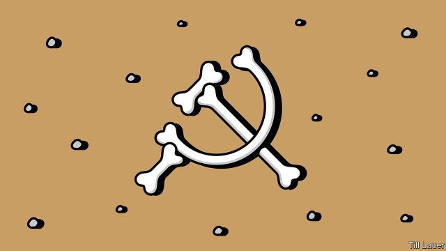

###### Banyan

# China and India use history as an excuse for all sorts of abuses 

##### But states that like to trumpet their history also have to do a lot of forgetting 

 

> Apr 4th 2019 

NOWHERE MORE than in Asia do states and their rulers tend to think they represent not just, say, defined territories or peoples with a shared language, but rather whole civilisations, often cosmically ordained. Strongmen running Central Asian states erect monuments to themselves as heirs to nomadic empires. In Cambodia the autocrat, Hun Sen, collects titles such as “Illustrious Prince, Great Supreme Protector and Famed Warrior” in conscious emulation of the former god-kings of Angkor Wat, the jungle complex which itself was built to represent the centre of Hindu and Buddhist cosmology. And in Japan next month a new emperor will be enthroned who is supposedly a direct descendant of Emperor Jimmu, whose reign began in 660BC and whose illustrious ancestors, in turn, include the goddess of the sun. Just being a simple nation-state is not always enough these days. 

No country plays up the idea of representing a civilisation more than China does. Visitors to Zhongnanhai, the leadership compound in Beijing, are rarely spared a lecture on how, uniquely, China is an “ancient civilisation with over 5,000 years of history”. Although that is an exaggeration, a continuous Chinese state has existed, by and large, since the Qin empire unified a number of warring states in 221BC. It has shaped China’s awareness of itself—and how it expects others to treat it. 

As Lucian Pye, a sinologist, once wrote, it is as if the Roman or Carolingian empire survived today in its heartland, trying to function as a nation-state. Yet perhaps a civilisation masquerading as a state, as Pye called China, helps explain the modern autocratic state’s durability in the face of many predictions of its demise. China’s affairs of state are conducted in near-total secrecy in Zhongnanhai, with dark scandals always present. Yet the projected grandeur of government gives all Chinese, as Pye put it, a right to pride and dignity. Or as Xi Jinping, China’s ruler, says, a civilisation “carries the soul of a country on its back”. 

China’s sense of itself as a glorious civilisation encompasses a long history, a vast geography, a huge population and the incorporation of lesser cultures and peoples. It is also fostered as the flipside of a sense of victimhood over colonial depredations. India offers many parallels, and it is no surprise that notions of a civilisational state are on the rise there, too. In particular, they are embraced by Narendra Modi, the prime minister, and supporters of his Bharatiya Janata Party, for whom the ancient scriptures of Hinduism, above all, represent the glory and essence of India. 

In India Hindu nationalists decry the Western rationalism and universal values embraced by Jawaharlal Nehru and his political heirs. In China enthusiasts of a civilisational state go further, and credit it with the country’s development success. Zhang Weiwei of Fudan University in Shanghai argues that the Communist Party’s pragmatism and its gradual approach to reforms are rooted in an ancient awareness of China’s vast size and complexity, and in a hard-wired imperial aversion to chaos. Arguments like these provide a convenient primordial imprimatur for all manner of abuses, from the suppression of civil liberties to the rejection of any external criticism. 

But history is messy. Those trying to maintain a civilisational mindset must wilfully debase big portions of it. In India, it is not just colonialism and its aftermath that have distorted the true culture in the eyes of Hindu nationalists. They also resent much earlier waves of Muslim conquest and seek to expunge their legacy. Undoing 800-odd years of Islamic influence is impossible, and offensive to India’s 190m Muslims—although that has not prevented the BJP from using the idea as a successful organising principle. 

The Chinese government, too, often chooses to disregard inconvenient episodes. The violent upheaval of the Cultural Revolution, for instance, sits awkwardly with the claim that the Communist Party is upholding China’s time-honoured preference for stability. Other contradictions are even more awkward. The reformist May 4th movement of 1919, which gave birth to the Communist Party itself, was profoundly critical of Confucianism and other conservative aspects of Chinese culture. As the 100th anniversary of the movement approaches, the party will have to perform intellectual contortions as both a convert to the virtues of China’s ancient civilisation and as the notional torchbearer of the May 4th spirit. Confucian ethics are not much guide there. 

-- 

 单词注释:

1.banyan['bænjәn]:n. 印度榕树 [医] 榕树, 孟加拉榕 

2.APR[]:[计] 替换通路再试器 

3.civilisation[,sivilai'zeiʃən;-li'z-]:n. 文明, 文明世界, 文化, 开化, 教化 

4.cosmically['kɒzmikәli]:adv. 按照宇宙法则, 大规模 

5.ordain[ɒ:'dein]:vt. 注定, 规定, 任命 vi. 颁布命令 

6.strongman[ˈstrɒŋmæn]:n. 大力士 

7.nomadic[nәu'mædik]:a. 游牧的, 游牧生活的, 流浪的 [医] 游动的, 无定的, 游离的 

8.Cambodia[kæm'bәudiә]:n. 柬埔寨 

9.autocrat['ɒ:tәkræt]:n. 独裁者 

10.Hun[hʌn]:n. 匈奴人, 德国佬, 野蛮人 

11.SEN[sen]:n. 传感器（传感元件, 探测设备） 

12.illustrious[i'lʌstriәs]:a. 著名的, 辉煌的, 明亮的 

13.protector[prә'tektә]:n. 保护者, 保护物, 保护装置 [医] [催化]保护质, 保护器 

14.famed[feimd]:a. 著名的, 闻名的 

15.warrior['wɒ:riә]:n. 战士, 勇士, 武士, 鼓吹战争的人, 战斗, 尚武 

16.emulation[.emju'leiʃәn]:n. 效法, 竞争 [计] 仿真 

17.Angkor['æŋkɔ:]:吴哥(柬埔寨的古都) 

18.wat[wɑ:t. wɔt]:n. 泰国佛寺 

19.Hindu['hindu:]:a. 印度教教徒的 n. 印度教教徒 

20.cosmology[kɒz'mɒlәdʒi]:n. 宇宙哲学, 宇宙论 [电] 宇宙论 

21.supposedly[sә'pәuzidli]:adv. 想象上, 看上去像, 被认为是, 恐怕, 按照推测 

22.descendant[di'sendәnt]:n. 后裔, 子孙 a. 传下的, 下降的 

23.Jimmu[]:Jimmu Tenno-first emperor of Japan who began his reign in 660 BC 日本首位君主Jimmu Tenno,执政始于公元前660年 

24.illustrious[i'lʌstriәs]:a. 著名的, 辉煌的, 明亮的 

25.goddess['gɒdis]:n. 女神, 美女, 受崇拜的女性 

26.alway['ɔ:lwei]:adv. 永远；总是（等于always） 

27.zhongnanhai[]:[网络] 中南海烟液；中国政府；帝国之脑 

28.uniquely[]:adv. 独特地；珍奇地 

29.exaggeration[ig.zædʒә'reiʃәn]:n. 夸张, 夸大的事物, 夸大之词 

30.unify['ju:nifai]:v. 统一, 使成一体 

31.warring['wɔ:riŋ]:a. 交战的, 敌对的, 冲突的 [法] 战争, 敌对行为 

32.awareness[ә'weәnis]:n. 意识, 认识 [计] 识别, 议定, 明白 

33.lucian['lu:sjәn]:n. 琉善（腊修辞学家和讽刺诗人）；卢西恩（男子名） 

34.PYE[pai]:派伊(姓氏) 

35.Sinologist[sai'nɔlәdʒist,si-]:n. 汉学家, 研究中国问题专家 

36.Carolingian[kærә'lindʒiәn]:a. 卡洛林王朝的 n. 卡洛林王朝的帝王 

37.heartland['hɑ:tlænd]:n. 心脏地区, 中心地带 

38.masquerade[.mɑ:skә'reid]:n. 化装舞会, 伪装 vi. 参加化装舞会, 伪装, 假装 

39.autocratic[.ɒ:tә'krætik]:a. 独裁的, 专制的 

40.durability[,djuәrә'biliti]:[计] 耐久性, 耐用性, 持久性 

41.prediction[pri'dikʃәn]:n. 预言, 预报 [化] 预测 

42.demise[di'maiz]:n. 崩, 薨, 死亡 vt. 让渡, 遗赠, 转让 

43.secrecy['si:krisi]:n. 秘密, 保密 [法] 秘密, 秘密状态, 保密 

44.grandeur['grændʒә]:n. 庄严, 伟大, 壮丽 

45.encompass[in'kʌmpәs]:vt. 围绕, 完成, 包括, 包含, 环绕, 包围 

46.incorporation[in.kɒ:pә'reiʃәn]:n. 包含, 结合, 编入, 团体组织 [医] 惨合, 混合, 合并 

47.lesser['lesә]:a. 较少的, 较小的, 次要的 

48.foster['fɒstә]:a. 收养的, 养育的 vt. 养育, 抚育, 培养, 鼓励, 抱(希望) 

49.flipside[]:n. 另一面；反面 

50.victimhood[]:n. 受害人；牺牲品；牺牲者 (victim的变形) 

51.colonial[kә'lәunjәl]:a. 殖民的, 殖民地的 [法] 殖民地居民 

52.depredation[.depri'deiʃәn]:n. 掠夺, 破坏 

53.civilisational[]:[网络] 文明 

54.narendra[]:[网络] 纳伦德拉；纳兰德；纳然陀 

55.MODI['mәudai]:[计] 模块化光学数字接口 

56.supporter[sә'pɒ:tә]:n. 支持者, 后盾, 迫随者, 护身织物 [法] 支持者, 赡养者, 抚养者 

57.Bharatiya[]:[网络] 巴拉蒂亚 

58.Janata['dʒʌnətɑ:]:n. （印度）人民团体；人民党（印度联合政党） 

59.scripture['skriptʃә]:n. 圣经, 圣经的一节, 圣经的一句, 铭文 

60.Hinduism['hinduizm]:n. 印度教 

61.essence['esns]:n. 实质, 本质, 香精 [化] 香精 

62.nationalist['næʃәnәlist]:n. 国家主义者, 民族主义者 

63.decry[di'krai]:vt. 反对, 责难, 诽谤, 诋毁 

64.rationalism['ræʃәnәlizm]:n. 合理主义, 理性论, 纯理论 

65.jawaharlal[]:[网络] 下巴哈拉尔 

66.nehru['neiru:]:n. 尼赫鲁（前印度总理） 

67.enthusiast[in'θju:ziæst]:n. 热心家, 狂热者, 爱好者 

68.zhang[]:n. 张, 章（中国姓氏） 

69.weiwei[]: [地名] [肯尼亚] 韦韦 

70.fudan[]:[网络] 复旦；普通 

71.pragmatism['prægmәtizm]:n. 实用主义 [法] 实用主义, 干涉主义, 独断 

72.complexity[kәm'pleksiti]:n. 复杂, 复杂性, 复杂的事物 

73.imperial[im'piәriәl]:a. 帝王的, 宗主国的, 至尊的, 壮丽的 n. 特等品 

74.aversion[ә'vә:ʃәn]:n. 厌恶, 讨厌的事, 讨厌的人 [医] 厌恶, 移转, 移位 

75.chao[]:n. 钞（货币） 

76.primordial[prai'mɒ:diәl]:a. 原始的, 自原始时代的 [医] 原始的 

77.imprimatur[,impri'meitә]:n. 出版许可, 赞许 [法] 出版许可, 出版许可, 批准 

78.suppression[sә'preʃәn]:n. 抑压, 镇压, 抑制 [计] 抑制 

79.rejection[ri'dʒekʃәn]:n. 拒绝, 抛弃, 驳回, 被抛弃的东西, 呕出物 [化] 报废; 拒收 

80.mindset[]:n. 心态；倾向；习惯；精神状态 

81.wilfully['wɪlfəlɪ]:adv. 任性固执地; 蓄意地 

82.debase[di'beis]:vt. 贬低, 降低 

83.colonialism[kә'lәunjәlizm]:n. 殖民主义 

84.aftermath['ɑ:ftәmæθ]:n. 结果, 后果 [法] 后果, 结果 

85.distort[dis'tɒ:t]:vt. 扭曲, 歪曲 [法] 歪区, 曲解, 纂改 

86.resent[ri'zent]:vt. 愤恨, 憎恶, 怨恨 

87.Muslim['mjzlim; (?@) 'mʌzlem]:n. 伊斯兰教, 伊斯兰教教徒 

88.expunge[ik'spʌndʒ]:vt. 擦掉, 删掉, 除去 

89.legacy['legәsi]:n. 祖先传下来之物, 遗赠物 [经] 遗产, 遗赠物 

90.Islamic[iz'læmik]:a. 伊斯兰教的, 穆斯林的 

91.offensive[ә'fensiv]:a. 令人不快的, 侮辱的, 攻击性的 [法] 攻击的, 进攻的, 冒犯的 

92.bjp[]: [医][=Bence Jones protein]本周（氏）蛋白，凝溶蛋白 

93.disregard[.disri'gɑ:d]:n. 忽视, 漠视 vt. 忽视, 不顾 

94.inconvenient[.nkәn'vi:njәnt]:a. 不便的, 有困难的 

95.upheaval[ʌp'hi:vl]:n. 举起, 隆起, 大变动, 剧变 

96.cultural['kʌltʃәrәl]:a. 文化的, 教养的, 修养的 [医] 培养的 

97.awkwardly[]:adv. 笨拙地；无技巧地 

98.uphold[ʌp'hәuld]:vt. 支撑, 赞成, 鼓励, 举起, 坚持 [法] 确认, 赞成, 支持 

99.reformist[ri'fɒ:mist]:n. 改良主义者, 改革者 

100.profoundly[prә'fajndli]:adv. 深深地, 深切地 

101.Confucianism[kәn'fju:ʃjәnizm]:n. 孔子思想, 儒家思想 

102.contortion[kәn'tɒ:ʃәn]:n. 扭弯, 扭歪, 曲解 [医] 扭歪, 扭转 

103.notional['nәuʃәnәl]:a. 概念的, 想像的 [经] 名义上的 

104.torchbearer['tɒ:tʃbєәrә]:n. 持火炬者, 启蒙者 

105.Confucian[kәn'fju:ʃ(ә)n]:a. 孔子的, 儒家学说的, 儒家的, 孔夫子的, 孔丘的 n. 孔子的门徒, 儒家 

106.ethic['eθik]:n. 道德规范, 伦理 

