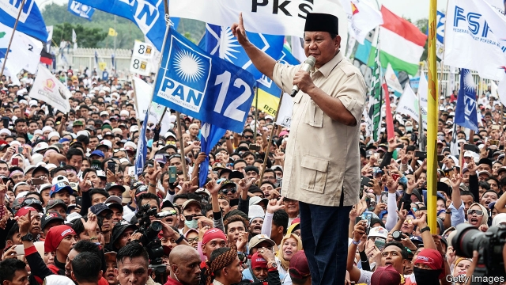

###### General lethargy

# Prabowo Subianto’s campaign for president in Indonesia is half-hearted 

##### The former soldier may be running to secure his party’s future more than his own 

 

> Apr 4th 2019 

THE CROWD at the University of the Republic of Indonesia in the city of Bandung surges towards the stage in anticipation. Then, to whoops and applause, Prabowo Subianto appears, sporting sunglasses and a traditional peci—a sort of small, black fez. After a prayer, the presidential candidate delivers a fiery speech, full of indignation. Indonesia, he says, lags behind neighbouring countries on all kinds of measures, from literacy rates to the performance of its national football team. He blames corruption and foreigners: “If we are weak, we are going to be stomped upon by other nations.” 

In the campaign for presidential and legislative elections on April 17th, Mr Prabowo is selling himself as the antidote to such weakness. The retired three-star general trades on his reputation for toughness, a stark contrast to his opponent, incumbent president Joko Widodo, or Jokowi, who nurtures a man-of-the-people persona. Mr Prabowo’s image is not just a branding exercise. He is accused of committing various human-rights abuses during his military career, including the kidnapping of pro-democracy activists. He was certainly a loyal defender of his father-in-law, Suharto, a strongman whose 30-year rule ended in 1998. That is a plus for many of his supporters, who yearn for a strong government. Naufal Ubaidillah, a student at the rally, says Indonesia suffers from an “inferiority complex” and Mr Prabowo would not be bullied by other countries. 

The strongman’s clownish side also appeals to voters. At the rally his wisecracking has the crowd guffawing. A campaign brochure released in December played up his lighthearted side. It responded to rumours that his penis was lost in a military accident (not true, apparently) and parried questions about his love of horses (“What is wrong with horses?” it exclaims). 

But Mr Prabowo’s routine has become rather tired. He ran for vice-president in 2009 and then for the top job in 2014. Both times voters turned him down. Has his offering changed enough to win them round? 

Mr Prabowo has toned himself down somewhat. His campaign in 2014 was full of props designed to remind voters of Sukarno, Indonesia’s founding father, such as white safari jackets and retro microphones, points out Stephen Sherlock of the University of New South Wales. All of that has gone. He rarely calls for a return to Sukarno’s constitution of 1945, which would be a step back for democracy. And he is more forthcoming about being part of the ruling class, although he still derides it. 

Mr Prabowo is also less energetic. He used to give speeches in three districts in a day, hopping between them in his helicopter. Today, the 67-year-old can only manage one, often looking worn out. Illness led him to cancel a speech in January. In 2014 televised debates were one of his strengths. Now he looks lacklustre in them. And he seems to have less money to spend, perhaps because his brother, who bankrolled previous runs, has been less generous. Mr Prabowo’s aides joke about running a “value-package campaign”. 

Mr Prabowo’s running mate, Sandiaga Uno, a businessman, has picked up the slack. His jam-packed schedule has made him the face of the campaign. He is also a big donor. Last year he raised roughly $40m by selling shares in his private-equity firm. He may be thinking of the long-run rewards. This campaign will put him in good stead to run for president in 2024. 

Jokowi has enjoyed a 20-percentage-point lead in the polls since well before he or Mr Prabowo officially entered the race, in August. Many observers wonder why Mr Prabowo, apparently short of both funds and energy, bothered to run at all. One explanation is that he expected to be campaigning under different circumstances. In August the currency, the rupiah, had fallen to levels not seen since the Asian financial crisis in 1997-98, owing to fears of a global trade war. Some analysts were predicting an imminent downturn, which would have tilted the odds in Mr Prabowo’s favour. 

Another reason to run is that a big, national campaign helps the parliamentary candidates of the Great Indonesia Movement Party, or Gerindra, the outfit Mr Prabowo founded in 2008. Mr Sandiaga is also a member of Gerindra. Choosing him as a running-mate, instead of a representative of one of the other parties backing the ticket, alienated Mr Prabowo’s allies. The decision has led some experts to speculate that Mr Prabowo is less interested in winning the election than in maximising Gerindra’s power in parliament. He could then use its clout to retain influence over the government, defend his and his family’s interests and perhaps secure a senior job. If that is the plan, it is working: the party is on course for its best parliamentary showing. Mr Prabowo may finally get a seat at the top table, just not the one he always wanted. 

-- 

 单词注释:

1.lethargy['leθәdʒi]:n. 昏睡, 瞌睡, 无力气 [医] 昏睡, 嗜眠 

2.prabowo[]:[网络] 拉波沃；拉博沃 

3.Indonesia[.indәu'ni:ʒә]:n. 印尼 

4.APR[]:[计] 替换通路再试器 

5.Bandung['bɑ:ndjŋ]:n. 万隆 

6.surge[sә:dʒ]:n. 巨涌, 汹涌, 澎湃 vi. 汹涌, 澎湃, 颠簸, 猛冲, 突然放松 vt. 使汹涌奔腾, 急放 [计] 电压尖峰 

7.anticipation[æn.tisi'peiʃәn]:n. 预期, 预料 [医] 提前出现(如遗传病) 

8.whoop[hwu:p]:n. 大叫, 呐喊, 一点点 vi. 叫喊, 鸣叫 vt. 高声说, 唤起 

9.sunglass['sʌnglæs]:n. 凸透镜, 太阳眼镜 

10.fez[fez]:n. 土耳其无边毡帽 

11.presidential[.prezi'denʃәl]:a. 总统制的, 总统的, 首长的, 统辖的 [法] 总统的, 议长的, 总经理的 

12.fiery['faiәri]:a. 炽热的, 热烈的, 暴躁的 

13.indignation[.indig'neiʃәn]:n. 愤怒, 愤慨, 义愤 

14.literacy['litәrәsi]:n. 读写能力, 识字, 精通文学 

15.corruption[kә'rʌpʃәn]:n. 腐败, 堕落, 贪污 [计] 论误 

16.stomp[stɒmp]:n. 跺脚 vt. 跺, 践踏 vi. 跺脚, 践踏 

17.legislative['ledʒislәtiv]:n. 立法机构 a. 立法的, 有立法权的 

18.antidote['æntidәut]:n. 解毒剂, 解毒药 [化] 解毒药 

19.toughness['tʌfnis]:n. 有粘性, 强硬, 强健 [化] 韧性 

20.stark[stɑ:k]:a. 僵硬的, 完全的, 刻板的, 明显的, 荒凉的, 结实的 adv. 突出地, 简直, 全然 

21.incumbent[in'kʌmbәnt]:a. 现任的, 依靠的, 负有义务的 n. 领圣俸者, 在职者 

22.Joko[]:[网络] 佐戈；上甲；彩绘阿祥 

23.widodo[]:[网络] 阿斯 

24.Jokowi[]:[网络] 佐科威；省长佐科威；雅加达市长 

25.nurture['nә:tʃә]:n. 养育, 营养物, 培育 vt. 养育, 供给营养物, 教养 

26.persona[pә:'sәunә]:n. 人, 人物, 角色, 外表印象, 人格面具 [医] 伪装人格 

27.kidnap['kidnæp]:vt. 绑架, 诱拐, 拐骗 [法] 拐带, 诱拐, 绑架 

28.activist['æktivist]:n. 激进主义分子 

29.defender[di'fendә]:n. 防卫者, 防护者, 辩护者 [法] 辩护人, 保护人 

30.Suharto[su'hɑ:təu]:n. 苏哈托（人名） 

31.strongman[ˈstrɒŋmæn]:n. 大力士 

32.supporter[sә'pɒ:tә]:n. 支持者, 后盾, 迫随者, 护身织物 [法] 支持者, 赡养者, 抚养者 

33.yearn[jә:n]:vi. 渴望, 想念, 怀念, 同情 

34.rally['ræli]:n. 重振旗鼓, 集合, 群众集会, 跌停回升 v. 重整旗鼓, 集合, 恢复精神, 团结, 挖苦, 嘲笑 

35.inferiority[in.fiәri'ɒriti]:n. 自卑, 次等 [医] 下位, 下级, 次级, 劣等 

36.bully['buli]:n. 欺凌弱小者, 土霸 vt. 威胁, 恐吓, 欺负 vi. 欺负 a. 特好的, 第一流的 adv. 十分 

37.clownish['klauniʃ]:a. 滑稽的 

38.voter['vәutә]:n. 选民, 投票人 [法] 选民, 选举人, 投票人 

39.wisecrack['waizkræk]:n. 俏皮话 

40.guffaw[gʌ'fɒ:]:v. 哄笑, 狂笑 n. 哄笑, 狂笑 

41.lightheart[]:[网络] 轻松的心情；轻松心情；愉快的心情 

42.penis['pi:nis]:n. 阳物, 阴茎 [医] 阴茎 

43.apparently[ә'pærәntli]:adv. 表面上, 清楚地, 显然地 

44.parry['pæri]:vt. 挡开, 回避, 闪避的回答 n. 挡开, 回避, 闪避的回答 

45.prop[prɒp]:n. 支柱, 支持者, 倚靠人, 道具, 螺旋桨 vt. 支撑, 维持 

46.Sukarno[]:n. (Sukarno)人名；(印尼)苏加诺 苏加诺 

47.safari[sә'fɑ:ri]:n. 旅行, 旅行队, 科学考察 

48.retro['retrәu]:n. 制动火箭, 减速火箭；（服装式样等）重新流行 

49.stephen['sti:vn]:n. 斯蒂芬（男子名） 

50.sherlock['ʃә:lɔk]:[法] 私家侦探 

51.wale[weil]:n. 隆起的伤痕, 鞭痕, 凸条纹, 精华, 选择 vt. 在...上留下鞭痕, 织成棱纹, 挑选, 撑住 vi. 挑选 

52.forthcoming['fɒ:θ'kʌmɑŋ]:a. 即将来临的 n. 来临 

53.deride[di'raid]:vt. 嘲弄, 嘲笑 

54.les[lei]:abbr. 发射脱离系统（Launch Escape System） 

55.hop[hɒp]:n. 单脚跳, 跳跃, 舞会, 飞行 vi. 单脚跳, 跳跃 vt. 跃过, 跳上, 加蛇麻子于, 服麻醉药 [计] 跳跃式传输 

56.televise['telivaiz]:v. 用电视播放, 播映 

57.lacklustre['læklʌstә]:a. 无光泽的, 无生气的 n. 无光泽, 无生气 

58.aide[eid]:n. 助手, 副官 [计] 数据输入的可说明性 

59.UNO['ju:nәu]:联合国组织 

60.slack[slæk]:n. 松弛, 松懈, 淡季, 闲散, 家常裤 a. 松弛的, 不流畅的, 疏忽的, 无力的, 呆滞的, 软弱的, 漏水的 adv. 马虎地, 缓慢地 vt. 放松, 使缓慢 vi. 松懈, 减弱, 松弛 

61.donor['dәunә]:n. 捐赠人 [化] 给体; 供体 

62.stead[sted]:n. 代替, 接替, 有利, 用处, 好处 vt. 对...有利 

63.officially[ә'fiʃәli]:adv. 作为公务员, 职务上, 官方地 

64.bother['bɒðә]:vt. 烦扰, 迷惑 vi. 烦恼, 操心 n. 麻烦, 纠纷, 讨厌的人 

65.rupiah[ru:'pi:ә]:n. 卢比(印尼货币单位) 

66.analyst['ænәlist]:n. 分析者, 精神分析学家 [化] 分析员; 化验员 

67.imminent['iminәnt]:a. 即将来临的, 逼近的 

68.downturn['dauntә:n]:n. (尤指经济方面的)衰退, 下降趋势 [电] 低迷时期 

69.tilt[tilt]:n. 倾斜, 倾向, 船篷, 车篷 vt. 使倾斜, 使倾侧, 用帆布篷遮盖 vi. 倾斜, 翘起, 冲, 评击 [计] 倾斜 

70.odds[ɒdz]:n. 可能性, 几率, 机会, 胜算, 不平等 

71.parliamentary[.pɑ:lә'mentәri]:a. 国会的, 议会的, 议会制度的 

72.Gerindra[]:[网络] 大印尼运动党；大印尼行动党；大印度尼西亚运动 

73.outfit['autfit]:n. 用具, 配备, 机构 vt. 配备, 供应 vi. 得到装备 

74.alienate['eiljәneit]:vt. 使疏远, 离间, 转让 [法] 转让, 让与, 疏远 

75.ally['ælai. ә'lai]:n. 同盟者, 同盟国, 助手 vt. 使联盟, 使联合, 使有关系 vi. 结盟 

76.speculate['spekjuleit]:vi. 深思, 推测, 投机 [经] 投机 

77.maximise['mæksimaiz]:vt. 把...增加到最大限度, 把...扩大到最大限度, 充分重视, 找出...的最高值 

78.clout[klaut]:n. 敲击, 破布 vt. 打补钉 

79.alway['ɔ:lwei]:adv. 永远；总是（等于always） 

