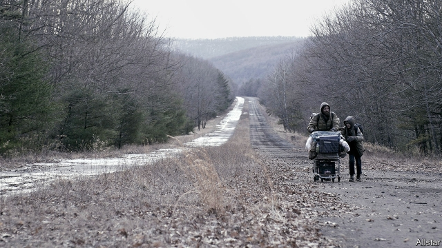

###### The tallest story

# Can the novel handle a subject as cataclysmic as climate change? 

##### Writers are coming to appreciate the theme’s urgency—and its narrative possibilities 

 

> Apr 4th 2019 

THE LITERARY novel has a problem with scale. For centuries it has principally focused on the stuff of everyday life. It doesn’t generally concern itself with the cataclysmic or tectonic. Compare Homer’s “Odyssey” with James Joyce’s “Ulysses”: whereas the epic incorporates gods, slaughters and the fate of nations, the novel celebrates the intimate and quotidian. 

The literary novel has a problem with time. Novels are one of the ways in which a culture thinks about the challenges it faces, but frequently the form looks to the past to illuminate the present, rather than into the future. The Victorian novel pondered the rapidly industrialising economy and shifting class structures of the age. Yet many of the great books of the period, from “Middlemarch” to “A Tale of Two Cities”, employed historical settings. Today’s novelists often turn to the two world wars, or even more remote eras, for their subjects. 

These tendencies are a handicap in the age of climate change, a crisis which is both current and to come. The Indian novelist Amitav Ghosh recognised this drawback in “The Great Derangement”, a collection of essays published in 2016. In a piece ostensibly about environmental catastrophe, Mr Ghosh pondered the cultural role of the novel. Climate change, he argued, seems just too capacious, uncertain and abstract a subject to be addressed by a form with an innate fear of the unknowable and provisional—ie, of the future. And if the novel cannot confront the biggest danger to humanity, can it retain its relevance? 

Time is a factor in more ways than one. Particularly since Modernism, which saw Joyce and Virginia Woolf anatomise the minutiae of life, literary time has been circumscribed. Whether it is Mrs Dalloway’s day or the longer arc of the Bildungsroman, there is generally an inherent limit on the temporal horizons of serious novels: the length of a character’s life. Novelistic time is tightly bounded, as well as being sequestered in the past. The leap forward needed to envisage the climate’s trajectory requires more elastic parameters. 

Not all fiction is hobbled in this way. What Mr Ghosh snobbishly calls the “generic outhouses”—speculative and science fiction—have tried to tackle climate change head-on. These genre boundaries are blurry and contested: J.G. Ballard’s “The Drowned World” (1962), a sci-fi novel that was among the first to deal with climate-related fears, has been reassessed and reclassified as the author’s reputation evolved. But the literary novel has long defined itself in opposition to other genres, and the future and its risks have been tainted by association. At least, they were until recently. 

As the divide between literary and other types of fiction has become increasingly porous, so the literary establishment has begun to recognise the imaginative possibilities of climate change. Cormac McCarthy’s “The Road” (2006), in which a father and son traverse an ashen landscape after an unnamed apocalypse, was an early turning point. The book served as a bridge between the fears of one generation, which involved mushroom clouds and mutually assured destruction, and those of the next, which are of melting ice caps and wildfires. 

Mr McCarthy wrote “The Road” after becoming a father in his 50s. Gazing over a Texan landscape with his son, he imagined the hills scorched black, depredations the boy would see but he would not. The story can be interpreted as a message from Mr McCarthy to his child, as a metaphor for a universal anxiety about leaving offspring to fend for themselves, and as a dramatisation of a horror that humans have despoiled the Earth. The book draws attention to the fact that novels are in a sense always about the future, because that is when they will be read. It was a breakthrough for writers keen to engage with the climate. Novelists including Ian McEwan and Margaret Atwood have done so. 

Now the genre that Mr McCarthy helped galvanise, sometimes known as “cli-fi”, is gathering pace. His impulse to tell stories for future generations animates two recent examples. In “The End We Start From”, Megan Hunter evokes “An unprecedented flood. London. Uninhabitable. A list of boroughs, like the shipping forecast, their names suddenly as perfect and tender as the names of children.” The anonymous narrator shepherds her baby son, Z, through this flooded Britain in search of safety and the boy’s father. The narrative is interlaced with passages from mythological sources, closing the circle between the destructive floods of the cli-fi future and the watery origin stories of many religions. 

Similarly, Louise Erdrich’s “Future Home of the Living God” purports to be written by a woman to her unborn child, preparing it for the world it will inhabit. A thermometer ticks upwards like a primed bomb; the novel ends with a lyrical passage in which the narrator recalls the snows of her youth. “Next winter it rained. The cold was mild and refreshing. But only rain. That was the year we lost winter.” 

Some dystopias combine the spectre of climate carnage with other fears. John Lanchester’s “The Wall” imagines a future in which Britain’s coastlines have been replaced by the titular wall, built to hold back both the rising tides and the “Others”—boat-borne hordes seeking refuge. The migrant crisis and Brexit contribute to a bleak vision of paranoid insularity. In Omar El Akkad’s “American War”, meanwhile, swathes of late-21st-century America are under water. Florida has vanished; a second civil war erupts over fossil-fuel usage. 

Literary novelists have begun to appreciate that climate change is not just an urgent subject but a font of drama and plots. All too soon the theme may revert from the territory of science fiction to the realm of old-fashioned realism. 

-- 

 单词注释:

1.cataclysmic[,kætә'klizmik]:a. 洪水的, 灾变的, 政治和社会大变动的 

2.narrative['nærәtiv]:n. 叙述, 故事 a. 叙述的, 叙事的, 故事体的 

3.APR[]:[计] 替换通路再试器 

4.principally['prinsәpәli]:adv. 主要地, 大部分 

5.tectonic[tek'tɒnik]:a. 构造的, 建筑的 [医] 整形的, 整复的, 成形的 

6.Odyssey['ɒdisi]:n. 奥德赛(古希腊史诗) 

7.jame[]: 灰岩井 

8.epic['epik]:n. 史诗, 叙事诗 a. 史诗的, 叙事诗的 

9.incorporate[in'kɒ:pәreit]:a. 合并的, 组成公司的, 一体化的 vt. 吸收, 合并, 使组成公司, 体现 vi. 合并, 混合, 组成公司 

10.slaughter['slɒ:tә]:n. 残杀, 屠杀, 杀戮 vt. 残杀, 屠杀, 亏本出售 

11.quotidian[kwɒ'tidiәn]:a. 每日的, 每日发作的, 司空见惯的, 平凡的 n. 日发热 

12.illuminate[i'lju:mineit]:vt. 照明, 用灯装饰, 阐明, 说明, 使灿烂 vi. 照亮, 用灯装饰 

13.Victorian[vik'tɔ:riәn]:a. 英国维多利亚女王时代的, 笃信宗教的, 讲究体面的 n. 维多利亚女王时代的英国人 

14.ponder['pɒndә]:v. 沉思, 考虑 

15.industrialise[in'dʌstriәlaiz]:vi.vt. (使)工业化 

16.Middlemarch[]:米德尔马契（小说名） 

17.handicap['hændikæp]:n. 障碍, 困难, 不利条件 vt. 加障碍于, 妨碍 

18.ghosh[]:n. (Ghosh)人名；(印)高希 

19.derangement[]:n. 捣乱, 紊乱, 精神错乱, 混乱, 搅乱, 扰乱 [计] 错位排列, 重排 

20.ostensibly[]:adv. 可公开, 显然, 表面, 外表, 诡称, 假装 

21.environmental[in.vaiәrәn'mentәl]:a. 周围的, 环境的 [经] 环境的, 环保的 

22.cultural['kʌltʃәrәl]:a. 文化的, 教养的, 修养的 [医] 培养的 

23.capacious[kә'peiʃәs]:a. 容积大的, 广阔的, 宽敞的 

24.innate[i'neit]:a. 先天的, 天生的 [医] 先天的, 生来的 

25.unknowable[.ʌn'nәuәbl]:a. 不能知道的, 不可知的 

26.cannot['kænɒt]:aux. 无法, 不能 

27.confront[kәn'frʌnt]:vt. 使面对, 对抗, 遭遇, 使对质, 比较 [法] 对证, 使对质, 比较 

28.humanity[hju:'mæniti]:n. 人性, 人类, 博爱 

29.modernism['mɒdәnizm]:n. 现代作风, 现代主义, 现代思想 

30.joyce[dʒɔis]:n. 乔伊斯（女名） 

31.Virginia[vә'dʒinjә]:n. 弗吉尼亚 

32.woolf[wulf]:n. 伍尔夫（英国作家）；伍尔夫（姓氏） 

33.anatomise[ә'nætәmaiz]:v. 解剖, 解析 

34.minutia[mai'nju:ʃiә]:n. 细节, 琐事 

35.circumscribe['sә:kәmskraib]:vt. 在...周围画线, 限制 

36.Mr['mistә(r)]:先生 [计] 存储器回收程序, 多重请求 

37.arc[ɑ:k]:n. 弧, 弧形, 弓形, 弧光 [化] 弧 

38.bildungsroman['bildjŋzrәj,mɑ:n]:<德> n.教育小说(源于德国文学中一种传统的小说类型, 以描述主人公成长过程为主题) 

39.inherent[in'hiәrәnt]:a. 固有的, 与生俱来的 [医] 固有的, 生来的 

40.temporal['tempәrәl]:a. 时间的, 暂时的, 现世的, 世俗的, 颞的, 太阳穴的 n. 世间万物, 教会财产 

41.novelistic[.nɒvә'listik]:a. 小说的 

42.tightly['taitli]:adv. 紧紧地, 坚固地 

43.sequester[si'kwestә]:vt. 使隐退, 使隔绝, 扣押, 没收 [化] 螯合剂; 多价螯合剂 

44.envisage[in'vizidʒ]:vt. 面对, 正视, 想象 

45.trajectory[trә'dʒektri]:n. 轨道, 弹道, 轨线 [化] 轨道 

46.parameter[pә'ræmitә]:n. 参变数, 参变量, 参数, 参量 [计] 参量; 参数 

47.hobble['hɒbl]:vi. 蹒跚 vt. 使跛行, 阻碍 n. 跛行 

48.snobbishly[]:adv. snobbish的变形 

49.generic[dʒi'nerik]:a. 属类的, 一般的 [计] 一般的 

50.tackle['tækl]:n. 工具, 复滑车, 滑车, 装备, 扭倒 vt. 固定, 处理, 抓住 vi. 扭倒 

51.genre['ʒɒŋrә]:n. 类型, 流派 

52.blurry['blә:ri]:a. 模糊的, 不清楚的, 污脏的 

53.jg[]:abbr. 少尉（junior grade） 

54.reassess[.ri:ә'ses]:vt. 再评价, 再摊派, 再课税 

55.reclassify['ri:'klæsifai]:[经] 三级分类 

56.opposition[.ɒpә'ziʃәn]:n. 反对, 敌对, 相反, 在野党 [医] 对生, 对向, 反抗, 反对症 

57.taint[teint]:n. 污点, 耻辱, 感染 vt. 污染, 使腐败, 沾染, 腐蚀 

58.porous['pɒ:rәs]:a. 多孔的, 有气孔的, 多孔性的, 能渗透的 [医] 多孔的 

59.imaginative[i'mædʒinәtiv]:a. 想像的, 虚构的 

60.Cormac[]:科马克（人名） 

61.traverse['trævә:s]:n. 越过, 横贯, 横断物, 屏障, 否认, 反驳 vt. 横过, 穿过, 经过, 详细研究, 反对, 在...来回移动 vi. 横越, 横断, 旋转, 来回移动 a. 横亘的, 横贯的 

62.ashen['æʃәn]:a. 由灰烬构成的, 灰色的, 苍白的 [机] 灰的, 似灰的 

63.landscape['lændskeip]:n. 风景, 山水, 风景画 vi. 从事景观美化 vt. 美化...景观 [计] 横向 

64.unnamed['ʌn'neimd]:a. 未命名的, 没有名字的, 未提及的 [计] 无名的 

65.apocalypse[ә'pɒkәlips]:n. 启示, 天启 

66.mutually['mju:tʃuәli]:adv. 互相地, 互助 

67.wildfire['waildfaiә]:n. (古时战争时所用的)燃料剂, 磷火, 鬼火, 野火 

68.mccarthy[mә'kɑ:θi]:n. 麦卡锡（姓氏） 

69.Texan['teksәn]:a. 得克萨斯州的 n. 得克萨斯州的人, 得克萨斯人 

70.scorch[skɒ:tʃ]:n. 烧焦, 枯萎 v. 烧焦, 拷焦, (使)枯萎, 讽刺 

71.depredation[.depri'deiʃәn]:n. 掠夺, 破坏 

72.metaphor['metәfә]:n. 隐喻 

73.offspring['ɒ:fspriŋ]:n. 子孙, 后代, 产物 [法] 后辈, 子孙, 后裔 

74.fend[fend]:vt. 击退, 保护, 供养 

75.dramatisation[]:戏剧性描写 （小说等）改编为剧本 

76.despoil[di'spɒil]:vt. 夺取, 掠夺 

77.alway['ɔ:lwei]:adv. 永远；总是（等于always） 

78.ian[iәn]:n. 伊恩（男子名） 

79.McEwan[]:n. (McEwan)人名；(英)麦克尤恩 

80.margaret['mɑ:^әrit]:n. 玛格利特（女子名） 

81.Atwood[ˈætˌwʊəd]:阿特伍德 Attwood的变体 阿特伍德 

82.galvanise['^ælvәnaiz]:vt. 通电流于, 给...镀锌, 电镀, 刺激, 使兴奋, 激动, 激励, 惊起 

83.impulse['impʌls]:n. 冲动, 驱使, 刺激, 推动, 冲力, 建议, 脉冲 vt. 推动 

84.animate['ænimeit]:vt. 使有生气, 赋予生命 a. 有生命的, 有生气的 

85.megan[]:n. 梅根（女子名） 

86.evoke[i'vәuk]:vt. 唤起, 引起, 召(魂) [法] 提审, 移送 

87.unprecedented[.ʌn'presidentid]:a. 空前的 [经] 空前的, 无前例的 

88.uninhabitable['ʌnin'hæbitәbl]:a. 不可居住的, 不适宜居住的 

89.borough['bә:rәu]:n. 自治的市镇, 区 

90.anonymous[ә'nɒnimәs]:a. 姓氏不详的, 无名的, 无特色的 [计] 无记录 

91.narrator[]:n. 讲述者, 叙述者 [法] 陈述者, 叙述者 

92.Z[zed; (?@) zi:]:[计] 阻抗, 零, 零标志 [医] 原子序数 

93.interlace[.intә'leis]:vt. 使交织, 使组合, 使交错 vi. 交错, 交织 [计] 交错 

94.mythological[.miθә'lɒdʒikәl]:a. 神话的, 神话学的, 虚构的 

95.watery['wɒ:tәri]:a. 水的, 湿的, 平淡的, 稀薄的, 水淋淋的 

96.louise[lu(:)'i:z]:n. 路易丝（女子名） 

97.purport['pә:pɒ:t]:n. 意义, 要旨, 目的 vt. 意味着, 声称, 打算 

98.unborn[.ʌn'bɒ:n]:a. 未诞生的, 未来的, 在胎内的 [法] 未诞生的, 未来的, 原来存在的 

99.lyrical['lirikәl]:a. 抒情诗调的, 有抒情味的, 感情丰富的 

100.dystopia[dis'tәupiә]:n. 非理想化的地方 [医] 异位, 错位 

101.spectre['spektә]:n. 幽灵, 妖怪, 凶兆 

102.carnage['kɑ:nidʒ]:n. 大屠杀, 残杀 

103.john[dʒɔn]:n. 盥洗室, 厕所, 嫖客 

104.coastline['kәustlain]:n. 海岸线 

105.titular['titjulә]:a. 享有所有权的, 名誉上的, 有名无实的, 有头衔的 n. 只有称号的人 

106.horde[hɒ:d]:n. (一)群, 游牧部落, 移动群 vi. 成群结队 

107.migrant['maigrәnt]:n. 候鸟, 移居者 [法] 移居者 

108.Brexit[]:[网络] 英国退出欧盟 

109.bleak[bli:k]:a. 萧瑟的, 荒凉的, 阴冷的 

110.paranoid['pærәnɔid]:a. (似)患妄想狂的, (似)患偏执狂的 n. 患妄想狂的人 

111.insularity[.insju'læriti]:n. 岛屿生活状况, 孤立, 岛国性质 

112.omar['әjmɑ:(r)]:n. 奥马尔（男子名） 

113.el[el]:abbr. 预期损失（Expected Loss） 

114.swathe[sweiθ]:vt. 绑, 裹, 包围 n. 带子, 绷带 

115.Florida['flɒridә]:n. 佛罗里达州 

116.font[fɒnt]:n. 字体, 字形, 洗礼盘, 泉 [计] 字体 

117.revert[ri'vә:t]:vi. 恢复, 复归, 回复, 还原 vt. 使回复原状, 使回转 n. 恢复原信仰的人 [计] 还原 

118.realism['riәlizm]:n. 写实主义, 现实, 实在论 [法] 现实主义 

