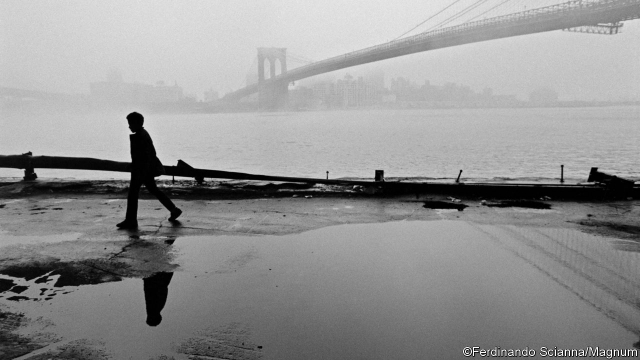

###### Feet first

# Erling Kagge wants you to walk 

##### It will lengthen your life in more ways than one 

 

> Apr 4th 2019 

Walking: One Step at a Time. By Erling Kagge. Translated by Becky Crook. Pantheon; 192 pages; $19.95. Viking; £9.99. 

HAVE YOU ever been so heartbroken that you felt a need to cover yourself in effluent? Erling Kagge, a Norwegian explorer, has. In his latest book, “Walking: One Step at a Time” (translated by Becky Crook), he describes how the sewer he was navigating once became so small that he was forced to shuffle on his stomach, his nose skimming a river of muck. He emerges into daylight head to toe in human waste, yet feeling better for his jaunt. 

In his previous book, “Silence: In the Age of Noise”, Mr Kagge emphasised the quiet of subterranean New York. In “Walking” he revisits the urban underworld to reflect on the therapeutic effects of exploration. The first person to complete the “Three Poles Challenge”—ie, reaching both poles and the summit of Mount Everest—on foot, Mr Kagge reminisces about how far he has gone to escape. In those sewers he took a break from his crumbling marriage and dodged arrest for trespassing. He lives out his notion that pain can be “beneficial and pleasurable”; his credo is that shortcuts make any endeavour “superficial” and pointless. 

Initially his book risks becoming a didactic screed about the dangers of modern technology, as the author laments the way cars, trains, buses and gawking at a smartphone speed life up, leaving little to be savoured. Yet in the end it is much more subtle than a typical self-help tome. He does not expect his readers to visit the meanest streets of Los Angeles, as he has done, or become so hungry that they crouch in the snow to retrieve a single lost raisin, as he did in Antarctica. Instead he uses his acquaintance with extreme environments to reflect on the mental and physical benefits of walking. 

“He who walks lives longer,” he writes, but that is “only half the truth”. The other half is that the act of walking also slows down time, and forces you to consider your surroundings. “The mountain up ahead, which slowly changes as you draw closer, feels like an intimate friend by the time you’ve arrived.” Walking, in other words, prolongs the experience of life, as well as life itself. 

-- 

 单词注释:

1.erling[]:[网络] 俄林；二牛 

2.lengthen['leŋθәn]:vt. 加长, 使延长 vi. 变长 

3.APR[]:[计] 替换通路再试器 

4.becky['beki]:n. [口]上挂钩 

5.viking['vaikiŋ]:n. 海盗 

6.heartbroken['hɑ:tbrәukәn]:a. 心碎的 

7.Norwegian[nɒ:'wi:dʒәn]:n. 挪威人, 挪威语 a. 挪威的, 挪威人的, 挪威语的 

8.crook[kruk]:n. 钩, 弯曲部分, 坏蛋 vt. 使弯曲, 诈骗 vi. 弯曲 

9.sewer['su:ә]:n. 下水道, 阴沟, 裁缝师 vt. 用下水道排, 铺设下水道于 

10.navigate['nævigeit]:vi. 航行 vt. 航行于, 驾驶, 操纵, 使通过 

11.shuffle['ʃʌfl]:n. 拖着脚走, 曳步, 混乱, 蒙混, 洗纸牌 v. 拖曳, 马虎地做, 笨手笨脚地穿(脱)衣, 推诿, 洗牌 [计] 混洗 

12.muck[mʌk]:n. 垃圾, 肥料 vt. 施肥, 弄脏, 弄糟 vi. 搬运矸石 

13.jaunt[dʒɒ:nt]:n. 远足, 徒步旅游 vi. 远足, 徒步旅游 

14.emphasise[]:vt. 强调, 重读, 加强...的语气, 着重 

15.subterranean[.sʌbtә'reinjәn]:a. 地下的, 秘密的 n. 地下室, 地下工作者 

16.york[jɔ:k]:n. 约克郡；约克王朝 

17.revisit[ri:'vizit]:vt. 再访, 重游, 重临 n. 再访问 

18.underworld['ʌndәwә:ld]:n. 下层社会, 地狱, 下流社会 

19.therapeutic[.θerә'pju:tik]:a. 治疗的, 有益于健康的 [医] 治疗的; 治疗学的 

20.exploration[.eksplә'reiʃәn]:n. 探险, 踏勘, 探测 [医] 探察 

21.reminisce[.remi'nis]:vt. 追忆说 vi. 追忆往事, 话旧 

22.crumble['krʌmbl]:v. (使)粉碎, (使)成为碎屑, 瓦解, 崩溃, 败落 

23.dodge[dɒdʒ]:v. 避开, 躲避 n. 诡计, 躲藏 

24.trespass['trespәs]:n. 擅自进入, 非法侵入, 侵害 vi. 侵害, 侵入, 打扰, 冒犯 

25.pleasurable['pleʒәrәbl]:a. 快乐的, 愉快的, 舒适的, 心情舒畅的 

26.credo['kri:dәu]:n. 信条 

27.shortcut['ʃɒ:tkʌt]:n. 捷径, 最短路线 [计] 快捷方式 

28.endeavour[in'devә]:n. 努力, 力图, 尽力 vi. 努力, 力图, 尽力 

29.pointless['pɒintlis]:a. 不尖的, 钝的, 不得要领的 

30.initially[i'niʃәli]:adv. 最初, 开头 

31.didactic[di'dæktik(әl), dai-]:a. 教训的, 说教的, 教导的, 教诲的 [医] 教导的 

32.screed[skri:d]:n. 冗长的文章, (瓦工用的)抹灰靠尺 [法] 事故陈述书, 呈文, 冗长文章 

33.lament[lә'ment]:n. 悲叹, 悔恨, 恸哭, 挽歌, 悼词 vt. 哀悼 vi. 悔恨, 悲叹 

34.gawk[gɒ:k]:n. 笨人, 呆子, 笨拙的人 vi. 痴呆着看 

35.smartphone[]:n. 智能手机 

36.savour['seivә]:n. 滋味, 气味, 食欲 vi. 有...的滋味 vt. 品味, 加调味品于, 使有风味, 尝到 

37.subtle['sʌtl]:a. 敏锐的, 精细的, 狡猾的, 稀薄的, 灵巧的, 微妙的 [医] 锐敏的; 精细的 

38.tome[tәum]:n. 册, 卷, 大本书 

39.meanest[miːn]:vt. 表示…的意思；意思是；作…解释：；意味着；即是： vi. 用意；怀有特定用意；有重要意义；有重要性；有影响： 

40.los[lɔ:s]:abbr. 月球轨道航天器（Lunar Orbiter Spacecraft）；视线（Line of Sight） 

41.angeles[]:n. 安杰利斯（姓氏）；天使城（菲律宾地名） 

42.crouch['krautʃ]:n. 蹲伏, 蜷缩 vi. 蹲下, 蜷着, 缩着 vt. 低头 

43.raisin['reizn]:n. 葡萄干 

44.prolong[prәu'lɒŋ]:vt. 延长, 拖延, 拖长 [化] 冷凝管 

