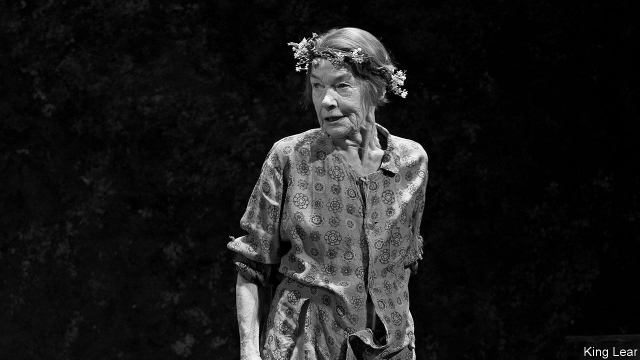

###### Ripeness is all

# Glenda Jackson’s King Lear is the thing itself 

##### On Broadway, her Lear is less a man or a woman than a human undone by human frailty 

 

> Apr 4th 2019 

GLENDA JACKSON has a reputation for asperity. As a star of stage and screen, she earned notoriety and two Academy awards for her knack for finding something wise and sharp in even middling scripts. A profile in 1971 heralded her as “the screen’s champion castrator”. As a left-wing Labour backbencher for over two decades until 2015, she regularly skewered Tony Blair and took Margaret Thatcher’s death as an opportunity to lambast her. Yet it is hard to be intimidated on meeting Ms Jackson (pictured) at her New York haunt of choice—a humble Manhattan diner—where she is dressed in what she calls her “work gear”: a shabby Tintin sweatshirt and no makeup. 

In person, she is less harsh than self-assured. Perhaps because she is a woman, her fierce and unapologetic intelligence has earned comparisons to a schoolmistress, but her assertiveness is more puckish than pedantic. In a voice that nearly growls after a lifetime of smoking, she speaks with refreshing candour about her return to Broadway to star in “King Lear”, directed by Sam Gold, which opens at the Cort Theatre on April 4th. 

As well as, in the past, being overwhelmingly reserved for men, the role of Lear is often thought too demanding for actors close in age to the geriatric patriarch. Few have the stamina to disintegrate on stage for over three hours, racked by time, betrayal and hubris. With a dismissive wave, Ms Jackson quickly rejects the notion that, at 82, she might find it taxing to shoulder Shakespeare’s tragedy eight times a week: “There’s an energy in the play which gives you energy.” She commands the part with electrifying charisma, at once vitriolic and vulnerable, grandly trilling her Rs and—always convincing when she is cruel—wielding her words like a scythe. Yet Lear’s encroaching impotence leaves her slicing at air. Stripped of most of her clothes and nearly all of her power, she is a hauntingly mortal figure on spindly legs. 

After a quarter of a century away from the stage, Ms Jackson’s turn as Lear in London in 2016 made it clear that time had burnished her original craft. Last year she won a Tony for her performance as an acidic widow in Edward Albee’s “Three Tall Women”. With disarming humility, she admits she is surprised to be getting such good roles again. She recalls her first years after graduating from the Royal Academy of Dramatic Art, when her unconventional looks and “unemployable accent”—she grew up in north-west England—made it hard to find work. “Every time I finished a job I thought, I’m never going to work again. That doesn’t go away.” Mr Gold admires her for “a work ethic that goes beyond anyone I’ve worked with before.” For Ms Jackson, such dedication is part of her inheritance. “I come from a socio-economic group where if you didn’t work, you didn’t eat.” 

In this production, Lear’s court is gilded in an unmistakably Trumpian splendour. The fool (a delightful Ruth Wilson) wears socks printed with the American flag. “I think we need to see what happens when an autocrat’s madness gets taken to its logical extreme,” Mr Gold says of the play’s calamitous ending. Casting a female Lear unexpectedly amplifies the sense of male privilege. Ms Jackson’s version is generally androgynous—less a man or a woman than a human undone by human frailty—but the king’s shock at his waning power seems terribly male. It is hard to imagine a woman going to such lengths to lament the loss of a supremacy that she never truly had. 

It is not lost on Ms Jackson that so many of the best roles are still written for men. “There are a lot of very good contemporary dramatists around, but they don’t find women interesting.” She does not seem impressed by the cascade of sackings that have followed the #MeToo revelations. “It makes you laugh, doesn’t it? Did people really not know it was going on?” 

Acting, she says, is sadomasochistic. “Every night is the first time,” she explains. “A performance has to be alive every time.” It’s hard work, and she is not always sure why she does it. But at its best it involves a group of strangers in the light sending their energy to a group of strangers in the dark, “and when it works that energy is strengthened and sent back to you in a kind of perfect circle. It’s a unique experience.” 

-- 

 单词注释:

1.ripeness['raipnis]:n. 成熟, 圆通, 完成 

2.glenda['glendә]:n. 格伦达（女子名） 

3.Lear[liә]:n. 李尔 

4.broadway['brɒ:dwei]:n. 百老汇大街 

5.les[lei]:abbr. 发射脱离系统（Launch Escape System） 

6.frailty['freilti]:n. 弱点, 脆弱, 意志薄弱 [法] 虚弱, 意志薄弱, 因意志薄弱而犯的错误 

7.APR[]:[计] 替换通路再试器 

8.glenda['glendә]:n. 格伦达（女子名） 

9.jackson['dʒæksn]:n. 杰克逊（男子名）；杰克逊（美国密西西比州的城市） 

10.asperity[æ'speriti]:n. 粗暴, 严酷, 粗糙 

11.notoriety[.nәutә'raiәti]:n. 恶名, 臭名, 声名狼藉 

12.knack[næk]:n. 熟练技术, 巧妙手法, 诀窍 [化] 窍门 

13.middling['midliŋ]:a. 中等的, 普通的, 平凡的 adv. 中等 

14.script[skript]:n. 手迹, 手稿, 正本, 手写体 vt. 改编为演出本 [计] 手写体, 小型程序 

15.profile['prәufail]:n. 侧面, 轮廓, 传略 vt. 描绘...轮廓, 写...的传略 [计] 提问档; 剖面图法; 剖面法 

16.herald['herәld]:n. 使者, 传令官, 先驱 vt. 预报, 宣布, 传达, 欢呼 

17.castrator[]: [医]家畜去势器（兽医用） 

18.backbencher['bækbentʃә]:n. 后座议员 

19.skewer[skju:ә]:n. 串肉棒, 烤肉叉子, 针状物 vt. 刺穿, 串住, 讽刺 

20.tony['tәuni]:a. 高贵的, 时髦的 

21.blair[bleә(r)]:n. 布莱尔（男子名） 

22.margaret['mɑ:^әrit]:n. 玛格利特（女子名） 

23.lambast[]:vt. 鞭打, 狠打, 严厉责骂 [机] 害草净 

24.jackson['dʒæksn]:n. 杰克逊（男子名）；杰克逊（美国密西西比州的城市） 

25.york[jɔ:k]:n. 约克郡；约克王朝 

26.haunt[hɒ:nt]:n. 常到的地方, 生息地 vt. 常到, 出没于, 萦绕于 vi. 出没, 作祟 

27.Manhattan[mæn'hætәn]:n. 曼哈顿 

28.tintin[]:n. 丁丁历险记（电影名） 

29.sweatshirt[]:n. 园领长袖运动衫 

30.makeup['meikʌp]:n. 组成, 性格, 化妆品, 化装(术), 虚构, 补考 

31.unapologetic[ˌʌnəˌpɒləˈdʒetɪk]:a. 不道歉的, 不认错的； 不辩解的 

32.schoolmistress['sku:lmistris]:n. 女教师, 女校长 

33.assertiveness[ə'sə:tivnis]:n. 魄力, 自信 

34.puckish['pʌkiʃ]:a. 顽皮的, 恶作剧的 

35.pedantic[pi'dæntik]:a. 卖弄学问的, 学究式的, 假装学者的 

36.growl[graul]:n. 吠声, 咆哮声 v. 怒吠, 咆哮, 吼 

37.candour['kændә]:n. 坦率, 正直, 公正, 爽直, 白色, 光明 

38.SAM[sæm]:[计] 安全性帐户管理器 

39.cort[]:abbr. 皮质醇（Cortisol） 

40.overwhelmingly[.әuvә'hwelmiŋli]:adv. 压倒性地, 不可抵抗地 

41.geriatric[,dʒeri'ætrik]:a. 老年病学的, 衰老的, 老年的 [医] 老年医学的, 老年病学的, 老人学的 

42.patriarch['peitriɑ:k]:n. 创办人, 家长, 元老, 教长, (天主教)教皇 [法] 家长, 族长, 创始人 

43.stamina['stæminә]:n. 精力, 活力, 耐力, 雄蕊 [医] 耐力, 精力; 雄蕊 

44.disintegrate[dis'intigreit]:vt. (使)分解, (使)碎裂 [医] 分解, 分裂, 蜕变 

45.betrayal[bi'treiәl]:n. 背叛, 辜负 [法] 背叛, 通敌, 背信 

46.hubris['hju:bris]:n. 傲慢, 狂妄野心 

47.dismissive[dis'misiv]:a. 轻视的 

48.quickly['kwikli]:adv. 很快地 

49.electrify[i'lektrifai]:vt. 通电, 上电, 使带电, 使电气化 [医] 起电, 带电 

50.charisma[kә'rizmә]:n. 非凡的领导力, 神秘的个人魅力, 神授的能力 

51.vitriolic[.vitri'ɒlik]:a. 硫酸的, 像硫酸的, 语言刻薄的 

52.vulnerable['vʌlnәrәbl]:a. 易受伤害的, 有弱点的, 易受影响的, 脆弱的, 成局的 [医] 易损的 

53.grandly['grændli]:adv. 宏伟地, 盛大地 

54.trill[tril]:n. 颤声, 颤音, 啭鸣 vt. 用颤声说, 用颤音唱 vi. 发出颤音 

55.R[ɑ:(r)]:[计] 半径, 比例, 读, 接收, 寄存器, 复位, 电阻, 程式 

56.scythe[saið]:n. 长柄大镰刀, 大钐镰 vt. 用大镰刀割 

57.encroach[in'krәutʃ]:vi. 侵犯, 侵蚀, 蚕食 [法] 侵犯, 侵入, 侵占 

58.impotence['impәtәns]:n. 无力, 虚弱, 无效, 阳萎 [医] 阳萎, 无能力 

59.hauntingly['hɔ:ntiŋli]:adv. 萦绕于心头地；难以忘怀地 

60.spindly['spindli]:a. 纺锤形的, 细长的 

61.burnish['bә:niʃ]:vt. 擦亮, 打磨, 磨光 vi. 磨光发亮 n. 光辉, 光泽 

62.acidic[ә'sidik]:a. 成酸的, 尖刻的, 酸性的 [机] 酸性 

63.edward['edwәd]:n. 爱德华（男子名） 

64.disarm[dis'ɑ:m]:vt. 解除武装, 裁军, 缓和 vi. 放下武器 

65.humility[hju:'militi]:n. 谦逊, 谦虚, 谦卑 

66.unconventional[.ʌnkәn'venʃәnl]:a. 不依惯例的, 非传统的, 非常规的 

67.unemployable[.ʌnim'plɒiәbl]:n. 不能受雇者 a. 不能受雇的 

68.ethic['eθik]:n. 道德规范, 伦理 

69.dedication[.dedi'keiʃәn]:n. 奉献, 献身, 献辞 [计] 专用 

70.inheritance[in'heritәns]:n. 遗传, 遗产 [医] 遗传 

71.gild[gild]:vt. 镀金, 虚饰, 装饰, 供给钱 

72.unmistakably[ˌʌnmɪ'steɪkəblɪ]:adv. 显而易见地; 不会弄错地; 不会误解地; 明白地 

73.Trumpian[]:特朗普的 

74.splendour['splendә]:n. 光辉, 壮丽, 显赫 

75.delightful[di'laitful]:a. 令人愉快的, 可爱的 

76.ruth[ru:θ]:n. 怜悯, 悲哀 

77.wilson['wilsn]:n. 威尔逊（姓氏） 

78.madness['mædnis]:n. 疯狂, 愚蠢的行为 [医] 狂, 疯狂 

79.calamitous[kә'læmitәs]:a. 灾难性的, 不幸的 

80.unexpectedly[]:adv. 想不到的, 突然的, 意外的, 出乎意料的 

81.wane[wein]:n. 减少, 衰微, 败落, 亏缺, 月亏 vi. 变小, 亏缺, 衰落, 消逝, 退潮 

82.terribly['terәbli]:adv. 可怕地, 甚为, 非常 

83.lament[lә'ment]:n. 悲叹, 悔恨, 恸哭, 挽歌, 悼词 vt. 哀悼 vi. 悔恨, 悲叹 

84.supremacy[sju'premәsi]:n. 至高无上, 霸权地位, 优势, 至上 [法] 至高权力, 无上权力, 霸权 

85.dramatist['dræmәtist]:n. 剧作家 

86.cascade[kæ'skeid]:n. 小瀑布, 瀑布状物 vi. 成瀑布落下 [计] 层叠, 级联 

87.sacking['sækiŋ]:n. 袋布, 麻袋布 

88.metoo['metkəʊ]:adj. 〈美口〉行仿效计策的 v. 同意(对方的政见等) [网络] 咪兔；我也是；蜜桃 

89.revelation[.revi'leiʃәn]:n. 揭露, 泄露, 发觉, 默示, 启示 

90.sadomasochistic[]: [医]施虐受虐狂的 

91.alway['ɔ:lwei]:adv. 永远；总是（等于always） 

