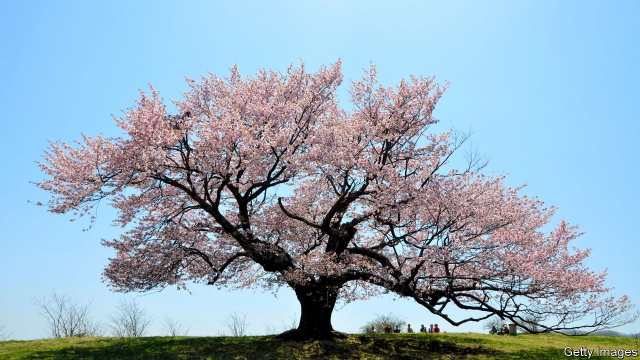

###### Flower power

# The Englishman who helped safeguard Japan’s cherry trees 

##### You may never look at cherry blossom in the same way again 

 

> Apr 4th 2019 

The Sakura Obsession. By Naoko Abe. Knopf; 400 pages; $27.95. Published in Britain as “‘Cherry’ Ingram: The Englishman Who Saved Japan’s Blossoms” by Chatto & Windus; £18.00. 

ON MARCH 21ST a Japanese phenologist observed the pink-and-white blossoms on a cherry tree in the Yasukuni shrine in central Tokyo and formally declared the start of the cherry-blossom viewing season. There are many of this type of cherry, known as somei-yoshino, in the shrine that honours Japan’s war dead. Some are so old they are held up by wooden struts. In Japan’s militaristic mythology, the petals represent the souls of dead fighters. 

Few of those currently visiting Japan would associate the delicate flowers with the cruelty of war. More likely they will swoon over nature’s ephemeral beauty and, like their hosts at this time of year, drink wildly. Yet the somei-yoshino has a dark past, which Naoko Abe explains in her lovely book, “The Sakura Obsession”. It is also the story of a quintessentially English nature lover, Collingwood “Cherry” Ingram, who was one of the first to grasp the somei-yoshino cherry tree’s dangerous seductiveness, and to attempt to tame it. 

Cherry trees come in hundreds of forms. In the mountains of Japan, the lordly yama-zakura, for instance, is one of a few wild cherries. But in the cities, the vast majority are somei-yoshino, a cloned variety that flowers for a mere eight days or so in spring, evoking syrupy delight as its mist of pink blossoms billow in the wind. As Ms Abe tells it, the tree was first hybridised in the 1860s, just as Japan was emerging from a 400-year period shut off from the outside world by its rulers. After the fall of the shogunate, its outward-looking leaders needed a symbol of unity and modernisation. The somei-yoshino “fitted the bill perfectly”. 

Ingram was a cherry devotee. Shortly after returning from the first world war, the middle-aged country toff decided to plant as many cherry varieties as he could find in his large garden in Kent. He imported seeds, grafted scions onto root stock, and worked feverishly to understand the naming system of Japanese cherry trees. In 1926 his quest took him to Japan, almost 25 years after he had first visited the country as a young man and been smitten by its beauty. 

He was no idle enthusiast. He soon realised that an extraordinary variety of cherry trees cultivated during 2,000 years of tree-worship in Japan were in danger of being lost in favour of one, the somei-yoshino. Not only did he relate this in a blunt speech to the titans of Japanese industry at Tokyo’s Imperial Hotel. He also promised to help Japan restore more variety by sending stock back from his garden. 

Two tensions animate this book: the difficulty of sending fragile scions around the world and successfully grafting them; and the wrenching historical context. As Ingram battled to safeguard Japan’s cherry legacy, the country was succumbing to belligerent nationalism. Many loathed the idea of relying on a Westerner to recover its botanical heritage. Moreover, the somei-yoshino cult was just getting into its swing. Within 20 years, kamikaze pilots would fly to their doom with cherry blossoms painted on their fuselages. After death, they were promised, they would be reborn as blossoms at Yasukuni. 

Be warned. It is hard to view the blossoms of the somei-yoshino with such tender joy after reading Ms Abe’s book. On the other hand, visitors to Japan will yearn to see more of the yama-zakura, great-white cherries and other varieties that Ingram so devotedly helped to rescue. 

These days Japanese people increasingly bemoan the tide of foreigners, especially from China, who join their hanami, or cherry-blossom viewing parties. Perhaps commentaries like Ms Abe’s will inspire them to cultivate other cherry trees, which flower earlier or later, and delight in their variety, as their ancestors did centuries ago. 

-- 

 单词注释:

1.safeguard['seifgɑ:d]:n. 保卫, 保护措施, 防护设施 vt. 保卫, 保护 

2.APR[]:[计] 替换通路再试器 

3.sakura[]:n. 樱花 

4.naoko[]:n. 直子（日本女子名）；奈绪子 n. (Naoko)人名；(日)尚子 (名) 

5.Chatto[]:n. (Chatto)人名；(英)查托 查托 

6.Windus[]:n. (Windus)人名；(英)温达斯 

7.phenologist[]:[医] 物候学家 

8.yasukuni[]:[网络] 靖国神社；靖国神社的名字；安藏 

9.shrine[ʃrain]:n. 圣地, 神龛, 庙 vt. 将...置于神龛内 

10.formally['fɒ:mәli]:adv. 正式地, 形式上 

11.strut[strʌt]:n. 高视阔步, 支柱, 压杆 vi. 趾高气扬地走, 肿胀 vt. 用支柱支撑, 炫耀 

12.militaristic[.militә'ristik]:a. 军国主义的 

13.mythology[mi'θɒlәdʒi]:n. 神话 

14.petal['petәl]:n. 花瓣 [医] 花瓣 

15.currently['kʌrәntli]:adv. 现在, 当前, 一般, 普通 [计] 当前 

16.cruelty['kru:әlti]:n. 残酷, 野蛮, 残酷行为 [法] 残酷, 残忍, 虐待 

17.swoon[swu:n]:n. 昏晕, 晕厥 vi. 昏晕, 着迷, 渐渐消失 

18.ephemeral[i'femәrәl]:a. 朝生暮死的, 短命的, 短暂的 [医] 暂时的 

19.wildly[]:adv. 狂暴地, 激动地, 狂热地, 鲁莽地, 轻率地 

20.abe[eib]:n. 亚伯（男子名, 等于Abraham） 

21.obsession[әb'seʃәn]:n. 困扰, 困扰人的情绪 [医] 强迫观念 

22.quintessentially[,kwinti'senʃəli]:adv. 典型地, 标准地 

23.Collingwood[]:科灵伍德 

24.ingram['iŋ^rәm]:n. 英格拉姆（男子名） 

25.seductiveness[]:n. 富有魅力, 诱人 

26.lordly['lɒ:dli]:a. 有威严的, 贵族似的, 高傲的 adv. 贵族般地, 有气派地, 傲然地 

27.clon[klәun]:[医] 无性系, 纯系(植物、细胞、细菌等) 

28.evoke[i'vәuk]:vt. 唤起, 引起, 召(魂) [法] 提审, 移送 

29.syrupy['sirәpi]:a. 糖浆的, 糖浆状的, 甜蜜的, 美妙的, 太甜的, 伤感的 

30.billow['bilәu]:n. 巨浪 vi. 象巨浪般汹涌, 象巨浪般波动 vt. 使翻腾 

31.hybridise['haibridaiz]:v. <主英> = hybridize 

32.shogunate['ʃәugʌneit]:n. 将军职位, 将军政治, 幕府时代 

33.modernisation[,mɔdәnai'zeiʃәn;-ni'z-]:n. <主英>=modernization 

34.devotee[.devә'ti:]:n. 爱好者, 献身者, 虔诚的宗教信徒 

35.toff[tɒf]:n. 花花公子, 有钱人, 爱打扮的人 

36.Kent[kent]:n. 肯特郡(英国郡名) 

37.graft[grɑ:ft]:n. 嫁接, 贪污 v. 嫁接, 移植, 贪污 

38.scion['saiәn]:n. 接穗, 子孙 [医] 嫩枝, 接穗 

39.feverishly['fi:vәriʃli]:adv. 兴奋地 

40.quest[kwest]:n. 探索, 寻求, 调查 v. 寻找, 找, 追寻猎物 

41.smite[smait]:vt. 重击, 打, 击败, 毁灭, 侵袭, 打动 vi. 重击, 打 n. 重击, 打 

42.enthusiast[in'θju:ziæst]:n. 热心家, 狂热者, 爱好者 

43.blunt[blʌnt]:a. 钝的, 坦率的, 麻痹的 

44.Titan['taitn]:n. 提坦, 太阳神, 巨人 

45.imperial[im'piәriәl]:a. 帝王的, 宗主国的, 至尊的, 壮丽的 n. 特等品 

46.animate['ænimeit]:vt. 使有生气, 赋予生命 a. 有生命的, 有生气的 

47.wrench['rentʃ]:n. 扳钳, 扳手, 扭伤, 歪曲, 痛苦 vt. 猛扭, 扭伤, 曲解, 折磨 vi. 猛扭, 猛绞 

48.context['kɒntekst]:n. 上下文, 背景, 来龙去脉 n. 上下文 [计] 上下文 

49.legacy['legәsi]:n. 祖先传下来之物, 遗赠物 [经] 遗产, 遗赠物 

50.succumb[sә'kʌm]:vi. 屈从, 屈服, 死 

51.belligerent[bi'lidʒәrәnt]:a. 好战的, 交战的, 交战国的 [法] 交战一方, 交战国, 交战集团 

52.nationalism['næʃәnәlizm]:n. 民族主义, 民族特性 

53.loathe[lәuð]:vt. 厌恶, 憎恶 

54.heritage['heritidʒ]:n. 遗产, 祖先遗留物, 继承物 [医] 遗传性 

55.cult[kʌlt]:n. 膜拜, 礼拜式, 祭仪, 一群信徒 [医] 迷信, 巫术 

56.kamikaze[.kɑ:mi'kɑ:zi]:n. 神风对队员；神风特攻队 

57.doom[du:m]:n. 厄运, 不幸, 法律, 宣告, 判决, 死亡 vt. 命中注定, 判决 

58.fuselage['fju:zilɑ:dʒ]:n. 机身 

59.reborn[.ri:'bɒ:n]:a. 再生的, 更新的 

60.yearn[jә:n]:vi. 渴望, 想念, 怀念, 同情 

61.devotedly[]:adv. 忠实地；一心一意地 

62.bemoan[bi'mәun]:vt. 哀悼, 惋惜, 认为遗憾, 哀叹 

63.hanami[]:[网络] 当樱花盛开；樱花会；花见节 

64.commentary['kɒmәntәri]:n. 注释, 评论, 说明 [法] 注释, 评注, 评论 

