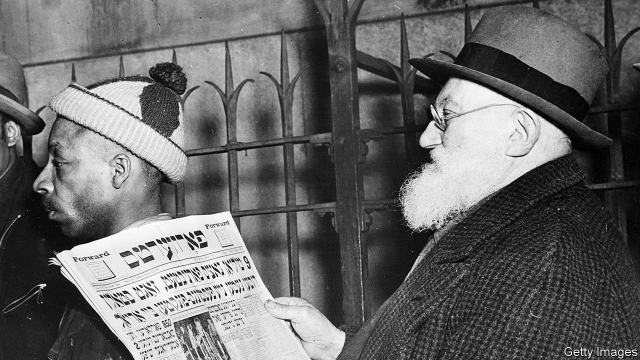

###### Chronicle of the golden land

# The history of the Forward is a parable of Jewish-American life 

##### The Yiddish newspaper once had a bigger circulation than the New York Times 

 

> Apr 4th 2019 

THEY CAME, for the most part, from a cloistered world that time and tragedy have dissolved. It was circumscribed by dogma and poverty and revolved around ritual. From homelands with names that have faded from maps of Europe—Galicia, Bessarabia, the Pale of Settlement—they traversed hostile countryside, boarded trains to Hamburg and Bremen, and packed into ships bound for di goldene medine. 

Between 1880 and 1924 as many as 2.5m Jews came to America from eastern Europe. They were not the country’s first Jewish citizens: Sephardim (Iberian Jews) arrived in small numbers in the colonial period, and among the immense 19th-century wave of German immigrants were around 250,000 Jews. But this later cohort formed the foundation of what grew into a recognisably Jewish-American culture. 

On the whole the immigrants were poor but relatively well educated: Judaism prized argument and exegesis, which require literacy. In daily life they spoke and read Yiddish (Hebrew was the language of prayer), a hybrid tongue perfectly suited to expressing what Irving Howe, a Jewish-American historian, called the “distinctive traits of the modern Jewish spirit at its best…an eager restlessness, a moral anxiety, an openness to novelty, a hunger for dialectic, a refusal of contentment, an ironic criticism of all fixed opinions.” 

In 1897, a decade and a half after arriving in New York from Vitebsk (now in Belarus), a young socialist and writer named Abraham Cahan founded the Jewish Daily Forward—the Forvertz in Yiddish, the language in which it was published. By the mid-1920s its daily circulation was higher than that of the New York Times. Mostly read in and around New York, it had followings in Boston, Chicago, Detroit and Philadelphia and as far afield as Buenos Aires, Berlin, Warsaw and Tel Aviv. No Jewish periodical anywhere had a larger circulation than the Forward until Maariv, an Israeli paper, overtook it in 1968. It was based in the Lower East Side, the epicentre of Jewish America, but had bureaus across the country. An array of Jewish writers contributed, including Isaac Bashevis Singer, the sole Yiddish Nobel laureate for literature, who maintained his Forward column until 1991. 

The Forward expanded into radio. Its station, WEVD, was named in honour of Eugene V. Debs, a five-time presidential candidate from the Socialist Party of America. The paper, and its readers, were so steeped in Yiddish that it did not publish an English edition until 1990. But it was not parochial. As Seth Lipsky, who launched that English edition, explains: “It was a general-interest daily in the Jewish language.” Unsurprisingly, it thrived on argument, and never shied from slaughtering a sacred cow. Despite his early socialist views, Cahan swiftly turned on Bolshevism; he visited the Soviet Union in 1927 and found life there even worse than it had been under the tsars. 

The newspaper had an intimate side. It ran an advice column called “A Bintel Brief” (“A Bundle of Letters”), which began answering readers’ questions about their bewildering new country in 1906. The letters, and their answers, took a deeply Jewish, morally practical tone. “I am a ‘greenhorn’, only five weeks in the country,” explained one young man. “I come from Russia, where I left a blind father…I promised that I would send him the first money I earned in America.” The writer has managed some modest savings, but his work is tenuous. “I want you to advise me what to do. Shall I send my father a few dollars for Passover, or should I keep the little money for myself,” as a safeguard against future penury? “The answer to this young man”, explained the editor paternally, “is that he should send his father the few dollars [because] he will find it easier to earn a living than will his blind father in Russia.” 

Another correspondent, another sticky situation. He is “a Russian revolutionist and a free thinker” who is about to marry. The problem is that his in-laws are still hooked on the opiate of the masses. Should he stick to his principles and alienate them, or grit his teeth through a synagogue marriage? The Forward’s advice—“there are times when it pays to give in to old parents”—will resonate with anyone who has endured overbearing elders. 

Jewish immigration slowed after Congress passed the Immigration Act of 1924, which admitted newcomers in proportion to their nationality’s presence in America in 1890. During the second world war millions of potential emigrants were reduced to ash. Meanwhile second- and third-generation Jews whose families had made it to the golden land began to assimilate (including in their reading matter), as the Germans and Irish did before them. Yiddish became the language of the dwindling older generation—viewed from Jewish suburbs with affectionate nostalgia, as an ornament of comedy sketches rather than an everyday tongue. By the 1980s the Forward’s acculturative function was becoming superfluous. Some Jews were still arriving, but as J.J. Goldberg, who succeeded Mr Lipsky as the editor of the English edition, summarises, “they were assimilated Russians coming to become assimilated Americans.” 

For a time the Forward published a Russian edition. A Jewish-American journalist who worked under Mr Lipsky fondly recalls the mix of staff: Hasidim from Brooklyn who laboured in Yiddish; secular American Jews who put out the English edition; fast-talking, conspiracy-minded Russians who wrote in their language. Even as the Yiddish readership aged and the Russian edition was sold in 2004, the Forward soldiered on. But paper is expensive, the industry is changing and everything must end: the last print copies will roll off the presses in April or May. The building in Manhattan that was once the paper’s headquarters now houses condominiums. 

This does not mark the end of the Yiddish press: Di Tzeitung is published weekly in Brooklyn and caters to Hasidim, many of whom still reserve Hebrew for liturgy as their ancestors did, and wish to hold the secular American world at bay. Nor, even, does it mark the end of the Forward, which will continue as an online publication in both English and Yiddish. The business, says its publisher, Rachel Fishman Feddersen, remains “on firm financial footing”, committed to its mission “to create the best independent journalism and protect the Jewish-American soul”. 

But in an age of atheism and intermarriage, what is that soul, and how best to protect it? That is the beginning of an argument—one that Abraham Cahan would surely have loved. 

-- 

 单词注释:

1.chronicle['krɒnikl]:n. 年代记, 记录, 编年史 vt. 把...载入编年史 

2.parable['pærәbl]:n. 寓言, 隐晦的比较 

3.Yiddish['jidiʃ]:n. 意第绪语,依地语(犹太人使用的国际语) a. 意第绪语的,依地语,<俚>犹太人的 

4.circulation[.sә:kju'leiʃәn]:n. 流通, 循环, 发行量 [化] 环流 

5.york[jɔ:k]:n. 约克郡；约克王朝 

6.APR[]:[计] 替换通路再试器 

7.cloister['klɒistә]:n. 修道院, 回廊 vt. 使与尘世隔绝 

8.circumscribe['sә:kәmskraib]:vt. 在...周围画线, 限制 

9.dogma['dɒgmә]:n. 教条 

10.revolve[ri'vɒlv]:v. (使)旋转, 反复考虑, 循环出现 

11.ritual['ritʃuәl]:n. 仪式, 典礼, 宗教仪式 a. 仪式的, 依仪式进行的 

12.Bessarabia[,besә'reibiә]:比萨拉比亚[苏联东南部一地区](曾属罗马尼亚) 

13.traverse['trævә:s]:n. 越过, 横贯, 横断物, 屏障, 否认, 反驳 vt. 横过, 穿过, 经过, 详细研究, 反对, 在...来回移动 vi. 横越, 横断, 旋转, 来回移动 a. 横亘的, 横贯的 

14.hamburg['hæmbә:^]:n. 汉堡（德国城市） 

15.bremen[]:n. 不来梅港市（德国地名） 

16.DI[]:[计] 数据输入, 数据项, 设备独立性, 双整数 

17.goldene[]:[网络] 金明讯；黄金时代 

18.medine[]:[网络] 美丁；医学；美迪努 

19.Jew[dʒu:]:n. 犹太人, 守财奴, 犹太教信徒 vt. 欺骗, 杀价 

20.Sephardim[si'fɑ:dim,si,fɑ:'di:m]:Sephardi的复数 

21.Iberian[ai'biәriәn]:a. 伊比利亚的, 伊比利亚语的 n. 伊比利亚人, 伊比利亚语 

22.colonial[kә'lәunjәl]:a. 殖民的, 殖民地的 [法] 殖民地居民 

23.cohort['kәuhɒ:t]:n. 一群；步兵大队；支持者；共同特点的一群人 

24.recognisably[]:[网络] 可以肯定的 

25.Judaism['dʒu:diizm]:n. 犹太教, 犹太文明, 犹太教信仰 

26.exegesis[.eksi'dʒi:sis]:n. 注释, 解释 

27.literacy['litәrәsi]:n. 读写能力, 识字, 精通文学 

28.Hebrew['hi:bru:]:n. 希伯来人, 希伯来语, 犹太人 a. 希伯来人的, 希伯来语的 

29.hybrid['haibrid]:n. 混血儿, 杂种, 混合物 a. 混合的, 杂种的, 混合语的 [计] NetWare的主机实用程序, 双重用户建立程序 

30.irving['ә:viŋ]:n. 欧文（男子名, 涵义为海的朋友）；欧文（美国作家） 

31.howe[hau]:n. 洞；洼地 

32.historian[hi'stɒ:riәn]:n. 历史学家, 记事者 

33.distinctive[di'stiŋktiv]:a. 有特色的, 出众的 

34.trait[treit]:n. 特征, 特性, 一笔, 少许 

35.restlessness[]:n. 坐立不安；不安定 

36.openness['әupәnnis]:n. 公开；宽阔；率真 

37.novelty['nɒvәlti]:n. 新奇, 新鲜, 新奇的事物 

38.dialectic[daiә'lektik]:a. 辩证的, 辩证法的 n. 辩证法, 逻辑论证 

39.contentment[kәn'tentmәnt]:n. 满足, 使人满意的事物, 满意 

40.ironic[aiә'rɔnik]:a. 冷嘲的, 挖苦的, 反话的, 讽刺的, 令人啼笑皆非的, 出乎意料的 

41.Vitebsk['vi:'tepsk]:维帖布斯克[苏联白俄罗斯东北部城市] 

42.Belarus['belərəs]:n. 白俄罗斯, 白俄罗斯共和国 

43.abraham['eibrәhæm, -hәm]:n. 亚伯拉罕（男子名） 

44.cahan[]: [人名] 卡恩 

45.Boston['bɒstәn]:n. 波士顿 

46.Chicago[ʃi'kɑ:gәu]:n. 芝加哥 

47.Detroit[di'trɒit]:n. 底特律(美国城市) 

48.Philadelphia[.filә'delfjә]:n. 费城 

49.afield[ә'fi:ld]:adv. 离开着, 偏离着, 在战场上 

50.Buenos[]:n. (Buenos)人名；(西)布埃诺斯 

51.aire[]:n. 亚耳河（英国约克郡西部河流） 

52.Berlin[bә:'lin]:n. 柏林, (软质)柏林毛线 

53.warsaw['wɔ:sɔ:]:n. 华沙（波兰首都） 

54.tel[tel]:abbr. 试验仪器清单（Test Equipment List） 

55.Aviv[ɑ:'viv]:n. 大自然的重生 n. (Aviv)人名；(俄)阿维夫 

56.periodical[.piәri'ɒdikl]:n. 期刊 a. 定期出版的, (有关)期刊的, 间歇(性的), 周期的, 定期的 

57.maariv[]:[网络] 晚报；晚祷；晚祷报 

58.Israeli[iz'reili]:a. 以色列的, 以色列人(语)的 n. 以色列人 

59.epicentre['episentә(r)]:n. 震中, 集中点, 中心 

60.array[ә'rei]:n. 排列, 衣服, 大批, 军队 vt. 布署, 打扮, 排列 [计] 数组; 阵列 

61.isaac['aizәk]:n. 艾萨克（男人名）；以撒（希伯来族长, 犹太人的始祖亚伯拉罕和萨拉的儿子） 

62.Nobel['nәubel]:n. 诺贝尔 

63.laureate['lɒ:riәt]:a. 戴桂冠的, 用月桂树枝编织成的, 荣誉的 n. 桂冠诗人 vt. 使戴桂冠 

64.eugene[ju:'ʒein, 'ju:dʒi:n]:n. 尤金（男子名） 

65.V[vi:]:[计] 溢出, 变量, 向量, 检验, 虚拟, 垂直 [医] 钒(23号元素) 

66.deb[deb]:n. 初上舞台的人, 初进社交界的女孩 [计] 数据扩充块 

67.presidential[.prezi'denʃәl]:a. 总统制的, 总统的, 首长的, 统辖的 [法] 总统的, 议长的, 总经理的 

68.parochial[pә'rәukiәl]:a. 教区的, 地方性的, 目光偏狭的 

69.seth[seθ]:n. 赛斯（男子名） 

70.lipsky[]: [人名] 利普斯基 

71.unsurprisingly[]:adv. 不出所料的；不出奇的；意料中的 

72.slaughter['slɒ:tә]:n. 残杀, 屠杀, 杀戮 vt. 残杀, 屠杀, 亏本出售 

73.swiftly['swiftli]:adv. 很快地, 即刻 

74.Bolshevism['bɒlʃivizm]:n. 布尔什维克主义, 激进论 

75.tsar[zɑ:]:n. 沙皇 

76.bewilder[bi'wildә]:vt. 使迷惑, 使不知所措 

77.morally['mɒrәli]:adv. 道德上, 德性上, 有道德地 

78.tenuous['tenjuәs]:a. 稀薄的, 微细的, 纤细的, 脆弱的 [医] 细薄的, 纤细的 

79.Passover['pæs.әuvә]:n. 逾越节 

80.safeguard['seifgɑ:d]:n. 保卫, 保护措施, 防护设施 vt. 保卫, 保护 

81.paternally[pә'tә:nәli]:adv. 父亲一般地 

82.revolutionist[.revә'lu:ʃәnist]:n. 革命家 

83.thinker['θiŋkә]:n. 思想者, 思想家 

84.opiate['әupiit]:n. 鸦片制剂, 镇静剂 a. 含鸦片的, 催眠的 vt. 使麻醉, 使缓和 

85.alienate['eiljәneit]:vt. 使疏远, 离间, 转让 [法] 转让, 让与, 疏远 

86.grit[grit]:n. 砂砾, 粗砂石 vt. 覆以砂砾, 咬牙切齿地说 vi. 摩擦作声 

87.synagogue['sinәgɒg]:n. 犹太人集会, 犹太教会堂, 犹太教 

88.resonate['rezәneit]:v. (使)共鸣, (使)共振 

89.overbear[.әuvә'bєә]:vt. 威压, 压服, 压抑 vi. 结果实过多, 繁殖过度 

90.newcomer[nju:'kʌmә]:n. 新来者 

91.emigrant['emigrәnt]:n. 移民, 侨民 a. 移民的, 移居的 

92.assimilate[ә'simileit]:vt. 使同化, 吸收, 使相拟, 把...比作 vi. 被吸收, 被同化 

93.dwindle['dwindl]:vi. 减少, 缩小, 衰落 vt. 使缩小 

94.affectionate[ә'fekʃәnәt]:a. 深情的, 充满情爱的 

95.nostalgia[nɒs'tældʒiә]:n. 乡愁, 向往过去, 怀旧之情 [医] 怀乡病 

96.acculturative[]:文化适应的 

97.superfluous[sju'pә:fluәs]:a. 多余的, 过剩的 

98.JJ[]:n. 林俊杰；约瑟夫逊结 

99.goldberg['^әjldb\\:^]:n. [俚]犹太老板（尤指在黑人聚居区开店或雇用黑人的） 

100.summarise['sʌmәraiz]:vt. 概括, 总结, 摘要, 概述 

101.fondly['fɒndli]:adv. 溺爱地, 怜爱地, 情柔地 

102.Hasidim['hæsidim]:Hasid的复数 

103.Brooklyn['bruklin]:n. 布鲁克林区(纽约行政区) 

104.secular['sekjulә]:n. 修道院外的教士 a. 世俗的, 现世的, 长期的 

105.readership['ri:dәʃip]:n. 读者, 读者人数 

106.Manhattan[mæn'hætәn]:n. 曼哈顿 

107.headquarter[,hed'kwɔ:tә]:vt. 将...的总部设在 

108.condominium[.kɒndә'miniәm]:n. 共同统治 [经] 财产共有权 

109.DI[]:[计] 数据输入, 数据项, 设备独立性, 双整数 

110.liturgy['litәdʒi]:n. 礼拜仪式, 祷告文, 圣餐仪式 

111.online[]:[计] 联机 

112.publisher['pʌbliʃә]:n. 出版者, 发行人 [法] 发行人, 出版者, 报刊发行者 

113.rachel['reitʃәl]:n. 雷切尔（女子名） 

114.fishman[]:n. 捕鱼人, 捕鱼船 

115.feddersen[]:n. (Feddersen)人名；(德)费德森 

116.journalism['dʒә:nәlizm]:n. 新闻业, 报章杂志 [法] 报刊, 新闻业, 新闻出版 

117.atheism['eiθiizm]:n. 无神论 

118.intermarriage[.intә'mæridʒ]:n. 异族结婚, 近亲结婚 [医] 血族婚姻, 异种结婚 

