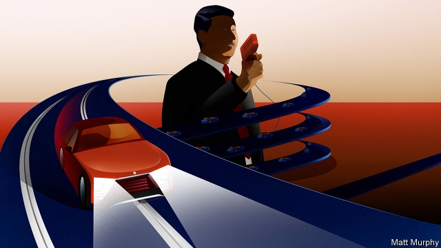
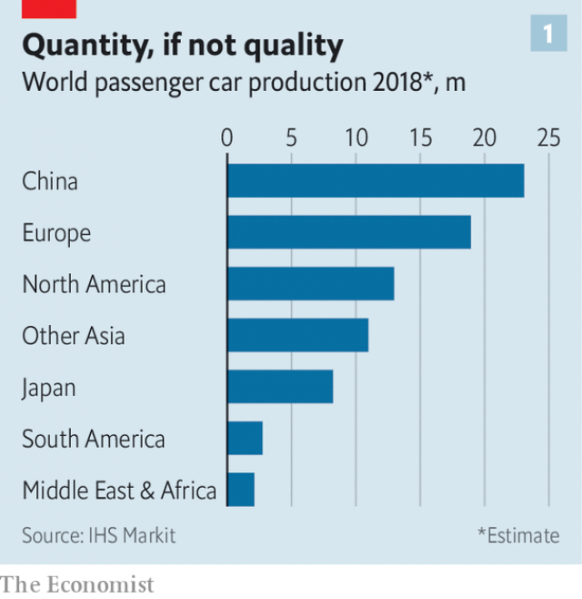
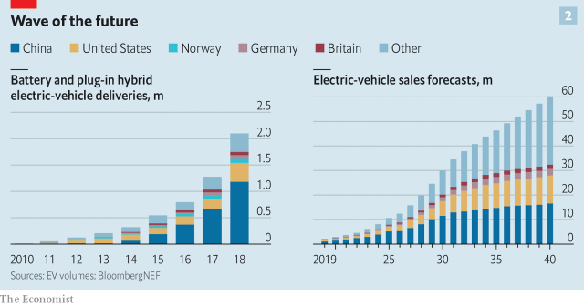
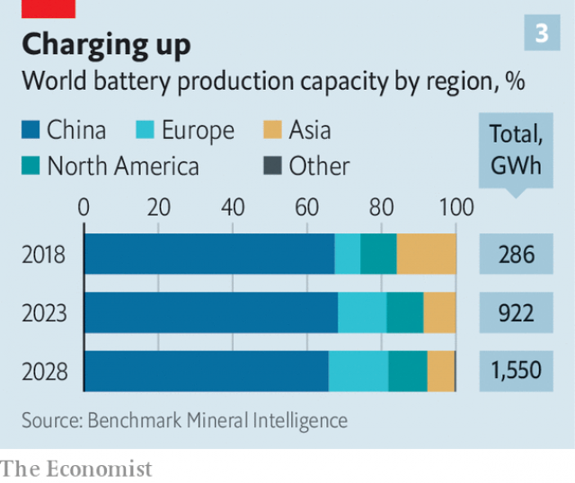
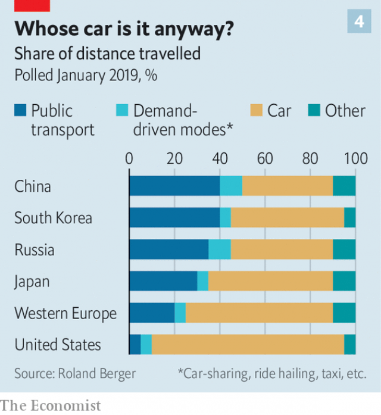
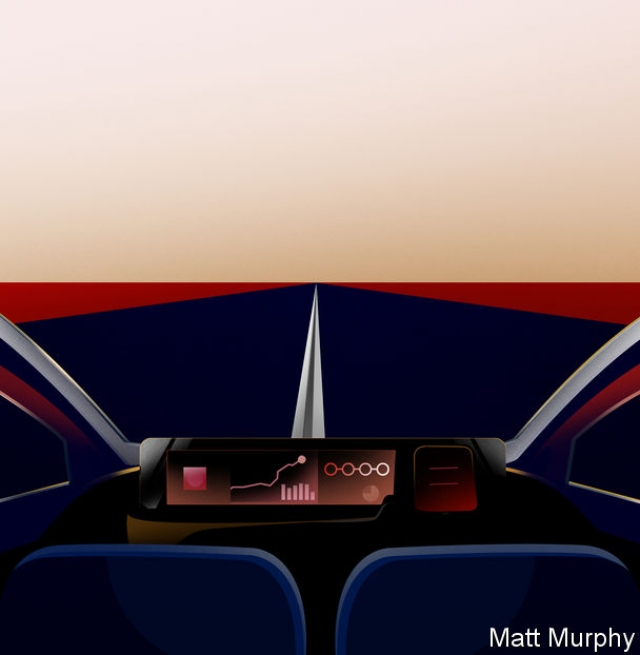

###### It’s the system, stupid

# China’s plans for the electrified, autonomous and shared future of the car 

##### It does not need to have the best car companies to win the race 

 

> Apr 4th 2019 

THE VEHICLES on Beijing’s boulevards offer little evidence that China has a car industry at all. Range Rovers seem to outnumber all the Havals, Changans and BYDs put together; you sometimes see nothing but a stream of Volkswagens and Toyotas. And when you notice how slowly those congested streams flow you would certainly be hard put to imagine the country’s car industry expanding further. But the Chinese government has plans to prove you wrong on both points. China is set to whizz out of the automotive slow lane. 

Chinese carmakers already make more cars than those of any other country. They also make more electric cars than anyone else, laying a claim to the industry’s future. Beyond that, China’s rulers, carmakers and tech firms also want to take advantage of the upheavals in how people get around beyond driving their own car—ride-hailing apps, autonomous vehicles, bike- and scooter-sharing schemes, smart public transport and more. A mediocre track record as carmakers need not be an obstacle in this. Indeed, it may be an advantage. 

What is going on today is not modern China’s first transport revolution. Crossing the road in a big Chinese city three decades ago the few cars you would have seen in the sea of bicycles would almost all have been either official limousines or beaten-up Japanese saloons touting as taxis. The government saw this carlessness as a flaw to be filled in by a new domestic industry: a clear path to industrial development and export earnings. Needing some yeast to get things growing, in the 1980s it allowed foreign companies to establish joint ventures with state-run firms such as FAW and SAIC. 

 

This joint-venture strategy achieved many of its aims. The cars in Beijing may carry foreign badges, but they are Chinese made. The country produced 23m cars last year, outstripping Europe and putting America in the shade (see chart 1). In terms of quality, though, the results have been poorer. No Chinese carmaker is remotely as impressive in its sector as Huawei, say, is in telecoms. 

Chinese carmakers, feather-bedded by the cash the joint ventures generated and with a vast market for nobbut middlin cars beyond the biggest cities, proved slow to learn the fine arts of setting up and managing supply chains and assembling cars in volume to exacting tolerances. Recently, though, this has been changing. 

The Chinese consumer’s desperate desire for four-wheeled transport has, to some extent, been sated. With some 325m cars now on its roads China endures eight of the top 20 most congested cities in the world, according to TomTom, a navigation firm. A survey by Bain & Co, a consulting firm, found that in 2017 the number of Chinese people who felt owning a car improved social status fell below 50%. After two decades of year-on-year growth, sales of new cars fell slightly in 2018. 

Some of China’s 70-odd domestic carmakers have concluded that it is time to start making better cars. They have improved both their engineering and their design. Lin Huaibin of IHS Markit, a research firm, points out that some firms now splash out on Western designers—witness the sleek SUVs which will grace the Shanghai motor show when it opens on April 16th. By some estimates domestic sales will surpass those of foreign brands by 2020. 

Some Chinese firms are now looking at exports to the West: Geely, GAC and Great Wall are particularly ambitious in this respect. America’s imposition of tariffs last year put a dent in some of these plans, and there have been other problems. For example, GAC has found that American dealers are not keen to market its GS8 SUV under the company’s Trumpchi brand. But Europe, and eventually America, are seen both as plausible export destinations and, for some, as investment opportunities. In 2018 Geely, by far the most ambitious in the latter respect, revealed that it had amassed 9.7% of Germany’s mighty Daimler to add to the controlling stake in Sweden’s Volvo the company already owned. 

The government has plans to further the sector’s progress. It has said it will allow foreign carmakers to take full control of their Chinese joint ventures, increasing competition and attracting investment. It is also fostering consolidation. It is drafting proposals to encourage successful independent firms such as Geely and Great Wall to invest in state-owned clunkers. Perennial whispers that the government is going to merge state-owned FAW, Dongfeng and Changan are getting louder. 

But China’s plans for making cars—one of ten sectors targeted for special attention in its “Made in China 2025” policy—do not depend merely on using its size to surpass the West in volume and an increasingly competitive home market to catch up in quality. It wants to use industrial policy to overtake the West on the road to the future. 

Mark Wakefield of AlixPartners, a consulting firm, identifies a key component of this as a “strategy to dominate” electric vehicles. The idea has many attractions. Several Western governments have called time on internal-combustion engines which burn fossil fuels. Emission rules in Europe are tightening, Britain and France have said they see no role for cars powered only by internal combustion after 2040. So the market seems there. 

Carmakers all around world know that this transition is under way. Tesla is built on it; some incumbents, like Volkswagen, are thoroughly on board. But quite a few European, American and Japanese firms are holding back. Some of those concentrating on the mass market think high battery costs mean electric cars will not be profitable for some time. Others simply seem too culturally invested in the fine points of internal-combustion engines—much more complex than electric ones—to break away from them. 

There is much less such concern in China. The proud engineering tradition that surrounds internal-combustion engines at venerable carmakers is largely absent, as are the sunk costs that add to their perceived value. What is more, because the country’s carmakers are not particularly politically powerful, any unease they may feel will not matter much; BYD’s sway in Beijing is hardly BMW’s in Berlin. The industry is thus largely united around abandoning the internal-combustion engine. 

The strategy also fits with China’s other industrial strengths. It is a huge producer of batteries and wants to be the biggest in the world, in the same way that it has become the dominant provider of solar panels. Chinese battery-makers are growing rapidly and signing deals with lithium producers around the world. CATL, the biggest car-battery maker in China, is building a new plant second only in size to Tesla’s gigafactory in Nevada. China’s total planned battery-making capacity is three times that which the rest of the world will construct. 

Electric vehicles have attractions that go beyond the benefits to the car industry and synergies with battery-making. As Bill Russo of Automobility, a consulting firm based in Shanghai, points out, China is keen to reduce its oil imports, currently the largest in the world. It also wants to clean its air and cut its carbon-dioxide emissions. Electric vehicles will not make a huge impact in these respects as long as China’s grid is largely fired by coal. But reducing the exhaust-pipe emissions on city streets is a plus even if smoke keeps belching from power-plant chimneys. 

China’s government has used several means to increase both the supply of electric vehicles and the demand for them. Carmakers earn tradable credits when they produce “new energy vehicles”, which include hybrids and fuel-cell-powered cars as well as electric cars. This year carmakers are required to earn or buy credits equivalent to 10% of their internal-combustion-engine sales. In 2020 the requirement will be 12%. Such rules may disadvantage foreign manufacturers, all the more so when, as it is rumoured, they get to hear of changes later than domestic companies do. The non-Chinese battery-makers with which foreign car companies like to work, such as LG of South Korea and Panasonic of Japan, were until recently restricted in the Chinese market. 

To stimulate demand, electric vehicles are generously subsidised and exempt from purchase taxes. They are also exempt from the restrictions placed on the purchase of cars with internal-combustion engines in six of the biggest cities. Further measures include requiring public-sector bodies to buy electric vehicles—a big boost for buses—and favouring car-sharing businesses that use them. The country’s charging infrastructure is far ahead of the rest of the world’s. Beijing has more public charging points than Germany. 

 

Together, these stimuli have created an electric-vehicle boom (see chart 2). Chinese electric-car sales are expected to hit 1.5m this year, compared with 1.1m in 2018. Colin McKerracher, head of advanced transport at Bloomberg New Energy Finance, goes so far as to suggest that the current rapid rate of growth in electric-vehicle sales, coupled with the decline in overall car sales seen last year, may mean that sales of cars powered by internal-combustion engines in China have already peaked. 

Compared with the thriving home market, Chinese exports of electric cars remain small so far. But its busmakers are showing the way. Almost all of the 400,000 electric buses in circulation around the world were made in China. Most are used at home, easing congestion and pollution, but exports are growing. According to BYD, one of China’s biggest bus manufacturers, its vehicles are used in more than 300 cities in other countries. 

Exports are not the only route to global power. The size of the Chinese market will help to “suck the world’s [electric-vehicle] supply chain into China,” says Mr Russo. Western mass-market carmakers keen to electrify but struggling with the investments required may increasingly license technology or buy hardware from Chinese firms. If more of the supply chain for electric vehicles is in China than anywhere else, Chinese-made power trains may become the global standard. 

 

The speed with which China is taking the lead in electrification puts it in a good position to profit from its convergence with two other distinct but related big shifts in transport; autonomy and sharing. In the West, companies from the technology world, not the carmaking world, are in the driving seat. The same is true in China, where the “big three” internet giants, Alibaba, Baidu and Tencent, are at the centre of a web of investments in autonomous cars and mobility apps as well as electric vehicles. And unlike its carmakers, China’s tech giants are already world class. 

China has more internet users that any other country and it generates more data than anywhere else. The ubiquity of digital-payment systems helps to run seamless services for China’s burgeoning middle-classes, who are among the keenest in the world to try the latest gadgets and apps. And car ownership is still low by developed-country standards. Little wonder that China is already the world’s largest market for rides ordered from a smartphone. 

Both Alibaba and Tencent are investors in Didi Chuxing, the world’s biggest ride-sharing company. It has over 550m registered users and provides 30m rides a day, dwarfing the 15m Uber provides worldwide. Didi has spread across South-East Asia and invested in India and Europe. In March the two big tech firms teamed up with FAW, Dongfeng, Changan and other investors to sink $1.5bn into a competing ridesharing venture, spreading their bet. 

 

Ride-hailing on this scale may be bringing about a structural shift in the car market; people buy with an eye for others as well as themselves. According to Roland Berger, a consultancy, in 2017 around 10% of all cars in China were “shared”; that is, either taxis or used for ride-hailing, car-sharing and similar schemes. That is ten times the number in the West. If the world is making a decisive turn from the goal of everyone owning cars to the goal of everyone being able to access mobility when needed, China is well ahead (see chart 4). 

As well as investing in ride hailing, the tech giants are also ploughing money directly into carmaking. Baidu and Tencent are investors in NIO, the most promising of the “Chinese Teslas”. Xpeng, WM Motor, Byton and others all intend to produce cars which both epitomise and extend the smartphone way of life. 

The tech sector is not only interested in batteries. Its investors have made large investments in pedal power, with mixed success. A vast fleet of rentable bikes has sprung up over the past three years—as have mountains of their abandoned carcasses. Mobike, partly financed by Tencent, now has over 230m registered users, mostly in China. Ofo, its largest and Alibaba-backed rival, is teetering on the brink of bankruptcy. Whether such businesses can persist when their rental incomes fall far short of the capital costs remains unclear. If they can, it will be because of the value that tech firms capture from the data they provide. Providing the best advice on when to get on a bike, when to wait a minute for a bus and when to hail a Didi would bring with it an impressive flow of cash. 

The tech giants are also making strides in autonomy. Baidu and Tencent have been testing self-driving cars on public roads since the start of last year. Like Lyft and Uber in America, Didi is aiming to build autonomous robotaxis. In partnership with King Long, a bus company, Baidu is also deploying driverless shuttles in several Chinese cities, including Beijing and Shenzhen. They hope to introduce them on Japanese roads in 2019. 

 

McKinsey, a consulting firm, reckons that China lags two or three years behind America in autonomous driving. Companies like Waymo, Google’s self-driving unit, still have an edge. But Chinese artificial-intelligence research, the field that autonomy most relies on, is in general impressive. It is another of the ten “Made in China 2025” industries, and if that proves a help, rather than a loser-backing hindrance, it may well soon be second to none. 

Chinese companies are also working hard on the other technologies autonomy will require. Alibaba, Baidu and Tencent all own high-definition mapping companies. RoboSense, a startup in which Alibaba, SAIC and BAIC, another carmaker, have all invested, is taking on Western firms developing the lidar sensors that tell autonomous vehicles about their surroundings. Most crucially China is becoming the world leader in 5G mobile-communications technology, which is expected to be vital for the lightning-fast connectivity that autonomous cars will require. 

In this field, too, the weakness of Chinese carmakers may be a sort of strength. In the West co-operation between tech firms and carmakers is wary; neither wants to give too much away. But China’s dominant tech firms are close collaborators with domestic vehicle-makers—and indeed foreign ones. Non-Chinese carmakers are starting to run tests in Chinese cities rather than in Europe and parts of America, where the rules are tighter. Roadstar, which is testing self-driving electric-vehicles in Shenzhen, and Pony, which is developing autonomous taxis in Guangzhou, are tapping into tech talent in Silicon Valley. Baidu has been developing Apollo, an open-source self-driving system which it hopes to establish as an industry standard, in California since 2015. Daimler, BMW and Ford have all agreed to sign on. 

China’s plan is to create an ecosystem for mobility, one comprised of cars, apps, data, standards, communications and more, that can be deployed anywhere around the world. If the carmaking world were facing just one vast technological change, such ambition from a country with a short track record might seem hubristic. But the combined challenge of electrification and autonomy is stretching Western incumbents enough that some, maybe many, will snap. China’s carmakers and tech giants will face stiff competition from those Western counterparts that are at the forefront of the race to create the future of mobility. But if Chinese firms do it faster and cheaper than their competitors, the evidence of their existence will not only stretch along Chinese roads but the highways of the rest of the world. 

-- 

 单词注释:

1.electrify[i'lektrifai]:vt. 通电, 上电, 使带电, 使电气化 [医] 起电, 带电 

2.APR[]:[计] 替换通路再试器 

3.boulevard['bu:lәvɑ:d]:n. 林荫大道 

4.rover['rәuvә]:n. 漂泊者, 流浪者, 海盗 [法] 流浪者, 海盗, 海盗船 

5.outnumber[.aut'nʌmbә]:vt. 数目超过, 比...多 

6.Changan[]:长安（中国地名） 长安汽车（中国汽车品牌） 

7.volkswagen['fɔ:lks,vɑ:^әn]:n. 大众汽车（财富500强公司之一） 

8.toyota[]:n. 日本丰田汽车（公司名） 

9.congest[kәn'dʒest]:vt. 使充满, 使拥塞, 使充血 vi. 充塞, 充血, 拥挤 

10.whizz[hwiz]:n. 飕飕声, 精明的人, 专家 v. (使)飕飕作声 

11.automotive[.ɒ:tәu'mәutiv]:a. 汽车的 

12.carmaker['kɑ:,meikә(r)]:n. 汽车制造商 

13.tech[tek]:n. 技术学院或学校 

14.upheaval[ʌp'hi:vl]:n. 举起, 隆起, 大变动, 剧变 

15.APP[]:[计] 应用, 应用程序; 相联并行处理器 

16.mediocre[.mi:di'әukә]:a. 不好不坏的, 通常, 平凡的 

17.limousine['limәzi:n]:n. 轿车 

18.saloon[sә'lu:n]:n. 大厅, 沙龙, 酒吧, 会客室 

19.tout[taut]:vi. 招徕顾客, 兜售物品 vt. 招徕, 刺探...情报 n. 兜售者, 侦查者 

20.carlessness[]:[网络] 疏忽 

21.flaw[flɒ:]:n. 缺点, 裂纹, 瑕疵, 一阵狂风 [化] 划痕; 裂缝; 裂纹 

22.earning['ә:niŋ]:n. 收入（earn的现在分词） 

23.yeast[ji:st]:n. 酵母 [化] 酵母 

24.faw[]:abbr. First Automobile Works <中国>第一汽车制造厂; forward area weapons 前方区武器; fleet air wing 舰队航空联队; forward area warning (radar) 前方地域警戒（雷达） 

25.saic[saik]:爱琴海双桅纵帆船 

26.badge[bædʒ]:n. 徽章, 标记 [计] 标记 

27.outstrip[.aut'strip]:vt. 追过, 胜过, 凌驾 

28.remotely[]:adv. 极小地, 极细微地 

29.sector['sektә]:n. 扇形, 部门, 部分, 函数尺, 象限仪, 段, 区段 vt. 把...分成扇形 [计] 扇面; 扇区; 段; 区段 

30.huawei[]: 华为 

31.telecom['telәkɔm]:telecommunication 电信 

32.nobbut['nɔbәt]:adv. 只是, 不过是 

33.middlin[]:[网络] 米德林 

34.sate[seit]:vt. 充分满足, 过分满意, 使厌腻 

35.tomtom[]:n. (印度等地用手拍击的)长筒鼓(鼓声)；锣 v. 拍击长筒鼓 [网络] 汤姆汤姆；通腾；导航 

36.bain[]:n. 贝恩（公司名称） 

37.Co[]:[医] 钴(27号元素) 

38.statu[]:[网络] 状态查看；雕像；特级雪花白 

39.lin[]:n. 林 

40.Huaibin[]:[网络] 淮滨县 

41.ih[]:abbr. 测量端（Instrument Head）；间接加热（Indirect Heating）；反时针（Inverted Hour） 

42.Markit[]:un. 拍号 [网络] 麦盖提；马基特经济研究公司；编撰机构 

43.sleek[sli:k]:a. 光滑的, 油嘴滑舌的, 线条明快的, 圆滑的, 时髦的 vt. 使光滑, 掩盖 vi. 打扮漂亮, 滑动 

44.suv[]:abbr. 多功能车（SportsUtilityVehicle）；小型单层水泡（small unilamellar vesicles） 

45.surpass[sә'pɑ:s]:vt. 超越, 凌驾, 胜过 

46.geely[]:[网络] 吉利；吉利汽车；中国吉利 

47.gac[]:abbr. 加拿大地质协会（Geological Association of Canada）；全局程序集缓存（Global Assembly Cache）；中华人民共和国海关总署（The Ministry of Foreign Trade and Economic Cooperation （MOFTEC） and the General Administration of Customs） 

48.ambitious[æm'biʃәs]:a. 有野心的, 抱负不凡的, 雄心勃勃的 

49.imposition[.impә'ziʃәn]:n. 征收, 课税, 强加, 欺骗 [经] 征税, 税, 税款 

50.tariff['tærif]:n. 关税, 关税表, 价格表, 收费表 vt. 课以关税 [计] 价目表 

51.dent[dent]:n. 凹痕 vt. 使凹下, 削弱 vi. 塌陷 

52.dealer['di:lә]:n. 经销商, 商人 [经] 交易员, 贩卖商 

53.suv[]:abbr. 多功能车（SportsUtilityVehicle）；小型单层水泡（small unilamellar vesicles） 

54.plausible['plɒ:zibl]:a. 貌似真实的, 貌似合理的, 说得煞有其事的 [法] 花言巧语的, 似乎有理的 

55.amass[ә'mæs]:vt. 积聚, 堆积 

56.mighty['maiti]:n. 有势力的人 a. 有势力的, 强大的, 有力的 adv. 很, 极 

57.daimler[]:n. 戴姆勒（英国的高级汽车名） 

58.volvo['vɔlvәj]:n. 沃尔沃（汽车品牌, 总部设在瑞典） 

59.foster['fɒstә]:a. 收养的, 养育的 vt. 养育, 抚育, 培养, 鼓励, 抱(希望) 

60.consolidation[kәn.sɒli'deiʃәn]:n. 巩固, 团结, 合并, 加强 [医] 实变 

61.clunker['klʌnkә]:n. 年久失修的旧机器 

62.perennial[pә'reniәl]:a. 常年的, 长期的, 反复的 [医] 多年生的 

63.merge[mә:dʒ]:vt. 使合并, 使消失, 吞没 vi. 合并, 渐渐消失 [计] 合并 

64.Dongfeng[]:n. 东风 

65.Changan[]:长安（中国地名） 长安汽车（中国汽车品牌） 

66.wakefield['weikfi:ld]:n. 韦克菲尔德（英格兰北部城市） 

67.AlixPartners[]:[网络] 艾睿铂；咨询公司艾睿铂；商业咨询公司艾睿铂 

68.fossil['fɒsәl]:n. 化石, 古物 a. 化石的, 陈腐的, 守旧的 

69.emission[i'miʃәn]:n. 发射, 射出, 发行 [医] 发射, 遗精 

70.tighten['taitn]:vt. 勒紧, 使变紧 vi. 变紧, 绷紧 

71.combustion[kәm'bʌstʃәn]:n. 燃烧, 骚动 [化] 燃烧 

72.transition[træn'ziʃәn]:n. 转变, 转换, 变迁, 过渡时期, 临时转调 [化] 跃迁 

73.Tesla['teslә]:[电] 特斯拉 

74.incumbent[in'kʌmbәnt]:a. 现任的, 依靠的, 负有义务的 n. 领圣俸者, 在职者 

75.volkswagen['fɔ:lks,vɑ:^әn]:n. 大众汽车（财富500强公司之一） 

76.thoroughly['θʌrәli]:adv. 彻底地, 绝对地, 透彻地, 详尽地, 周到地, 完全地, 完善地, 全面地 

77.culturally[]:adv. 从文化角度, 文化意义上；在人文学方面 

78.les[lei]:abbr. 发射脱离系统（Launch Escape System） 

79.venerable['venәrәbl]:a. 庄严的, 值得尊敬的 

80.politically[]:adv. 政治上 

81.unease[.ʌn'i:z]:n. 不安 

82.Berlin[bә:'lin]:n. 柏林, (软质)柏林毛线 

83.producer[prә'dju:sә]:n. 生产者, 制作者, 制作人 [化] 发生器; (炉煤气)发生炉; 制气炉; 生产者 

84.dominant['dɒminәnt]:a. 占优势的, 支配的 [医] 优性的, 显性的 

85.provider[prә'vaidә]:n. 供应者, 供养人, 伙食承办人 [计] 提供器 

86.lithium['liθiәm]:n. 锂 [化] 锂Li 

87.CATL[]:[网络] CTIA Authorized Test Lab; 卡特; 电话调查 

88.maker['meikә]:n. 制造者, 上帝 [经] 制造者, 出票人 

89.Nevada[ni'vædә]:n. 内华达 

90.synergy['sinәdʒi]:n. 协同作用 [医] 协同, 协作, 增效, 协作(指药物) 

91.Russo[]:拉索（人名） 

92.automobility[,ɔ:tәumɔ'biliti]:汽车的用途 

93.currently['kʌrәntli]:adv. 现在, 当前, 一般, 普通 [计] 当前 

94.emission[i'miʃәn]:n. 发射, 射出, 发行 [医] 发射, 遗精 

95.grid[grid]:n. 格子, 栅格 [计] 网格 

96.belch[beltʃ]:vi. 打嗝, 喷吐 vt. 打嗝, 吼叫着发出(命令), 喷吐 n. 打嗝, 喷吐 

97.tradable['treidәbl]:a. 可贸易的, 可买卖的 

98.hybrid['haibrid]:n. 混血儿, 杂种, 混合物 a. 混合的, 杂种的, 混合语的 [计] NetWare的主机实用程序, 双重用户建立程序 

99.lg[]:abbr. 水平规, 水准仪（Level Gauge ）；直线发生器, 矢量发生器（Line Generator） 

100.Korea[kә'riә]:n. 朝鲜, 韩国 

101.panasonic[]:n. 日本松下公司 

102.generously[]:adv. 宽大地；慷慨地；丰盛地 

103.subsidise[]:vt. 给...补助金, 津贴, 资助 

104.exempt[ig'zempt]:n. 免税者, 被免除义务者 a. 免除的 vt. 使免除, 豁免 

105.infrastructure['infrәstrʌktʃә]:n. 基础结构, 基础设施 [经] 基础设施 

106.stimulus['stimjulәs]:n. 刺激, 激励, 刺激品 [医] 刺激特, 刺激 

107.colin['kɔlin]:n. 科林（男子名） 

108.bloomberg[]: [人名] 布隆伯格 

109.circulation[.sә:kju'leiʃәn]:n. 流通, 循环, 发行量 [化] 环流 

110.congestion[kәn'dʒestʃәn]:n. 拥挤, 充血 [计] 拥挤, 拥塞 

111.byd[]:abbr. Bureau of Yards and Docks 船坞局（美国海军）; 比亚迪股份有限公司 

112.electrification[i.lektrifi'keiʃәn]:n. 起电, 带电, 电气化 [化] 起电 

113.convergence[kәn'vә:dʒәns]:n. 集中, 收敛 [计] 收敛, 会聚 

114.autonomy[ɒ:'tɒnәmi]:n. 自治, 自治权 [医] 自主性 

115.carmaking[]:[网络] 汽车制造 

116.alibaba[]:n. 阿里巴巴（公司名） 

117.baidu[]:n. 百度（全球最大的中文搜索引擎） 

118.Tencent[]:[网络] 腾讯；腾讯公司；腾讯控股 

119.mobility[mәu'biliti]:n. 可动性, 流动性, 机动性 [化] 迁移率 

120.datum['deitәm]:n. 论据, 材料, 资料, 已知数 [医] 材料, 资料, 论据 

121.ubiquity[ju:'bikwәti]:n. 到处存在, 普遍存在 

122.seamless['si:mlis]:a. 无缝的, 无缝合线的 [医] 无缝的 

123.burgeoning[]:[计] 急速增长的 

124.gadget['gædʒit]:n. 小配件, 小玩意, 诡计 

125.smartphone[]:n. 智能手机 

126.investor[in'vestә]:n. 投资者 [经] 投资者 

127.Didi[]:n. 迪迪（足球运动员名） 

128.dwarf[dwɒ:f]:n. 矮子, 侏儒 v. (使)变矮小 

129.uber['ju:bә]:[医] 乳房 

130.ridesharing[]:[网络] 通勤者；共乘合乘車；共乘的意思 

131.roland['rәulәnd]:n. 罗兰（男子名） 

132.Berger['bә:dʒә]:伯杰(姓氏) 

133.consultancy[]:n. 商量, 协商, 磋商, 会诊, 与...商量, 咨询, 请教, 找(医生)看病, 查阅, 考虑 [经] 咨询业务, 咨询服务 

134.decisive[di'saisiv]:a. 决定性的, 坚定的, 果断的 

135.hail[heil]:n. 冰雹, 致敬, 欢呼, 招呼 vt. 向...欢呼, 致敬, 招呼, 使象下雹样落下 vi. 招呼, 下雹 interj. 万岁, 欢迎 

136.nio[]:abbr. Nioki, Democratic Republic of Congo 刚果; National Institute of Oceanology 海军海洋学会; National Institute of Oceanography <英国>国家海洋学研究所; National Intelligence Office 国家情报局 

137.Tesla['teslә]:[电] 特斯拉 

138.wm[]:abbr. 水表（water flowmeter）；威廉（William） 

139.epitomise[]:vt. 对...作摘要, 集中体现, 成为...的化身, 成为...的缩影, 概括 

140.pedal['pedl]:n. 踏板, 脚蹬子 a. 脚的, 脚踏的 vt. 用脚踏动 vi. 踩踏板, 骑车 

141.rentable[]:a. 可租的, 可收租金的 [法] 可租的, 可收租金的 

142.carcass['kɑ:kәs]:n. 尸体 [医] 屠体(宰后除脏的畜体) 

143.mobike['mәjbaik]:n. <口>=motorbicycle 

144.Ofo[]:[网络] 奥福美国医学研究卫星(Orbiting Frog Otolith)；欧富；净油系统 

145.teeter['ti:tә]:vi. 步履不稳地走动, 踉跄, 摇晃, 摇摆不定, 摇摇欲坠, 玩跷跷板 n. 踉跄, 摇摆, 跷跷板 

146.brink[briŋk]:n. 边缘, 陡岸 

147.bankruptcy['bæŋkrәptsi]:n. 破产者 [经] 破产, 倒闭 

148.rental['rentl]:n. 租费, 租金收入 a. 租赁的, 收取租金的 

149.unclear[.ʌn'kliә]:a. 不易了解的, 不清楚的, 含混的 

150.stride[straid]:n. 大步, 步幅, 步态, 进步 v. 迈大步走, 跨过, 跨 

151.lyft[]:[网络] 散落 

152.partnership['pɑ:tnәʃip]:n. 合伙, 合股, 合作关系 [经] 合伙(合作)关系, 全体合伙人 

153.deploy[di'plɒi]:v. 展开, 配置 

154.driverless[d'raɪvərles]: 无人驾驶的 

155.shenzhen['ʃʌn'dʒʌŋ]:n. 深圳 

156.McKinsey[]:n. 麦肯锡（公司） 

157.reckon['rekәn]:vt. 计算, 总计, 估计, 认为, 猜想 vi. 数, 计算, 估计, 依赖, 料想 

158.hindrance['hindrәns]:n. 妨害, 障碍, 阻碍物 

159.startup[]:[计] 启动 

160.Baic[]:[网络] 北汽控股；禁止所有呼入呼叫(barring of all incoming calls)；北京汽车工业控股公司(Beijing Automotive Industry Corporation) 

161.lidar['laidɑ:]:n. 激光雷达 

162.sensor['sensә]:n. 传感器 [计] 检测器 

163.crucially[ˈkru:ʃɪəlɪ]:adv. 至关重要地, 关键地 

164.connectivity[kәnek'tiviti]:[计] 连通性, 连通度 

165.wary['wєәri]:a. 谨慎的, 小心的, 机警的, 周到的, 唯恐的 

166.collaborator[kә'læbәreitә]:n. 合干者, 合作者, 通敌者 [法] 合作者, 协助者, 勾结者 

167.roadstar[]:[网络] 路斯达；之星；路星 

168.pony['pәuni]:n. 矮种马 v. 借助逐字直译文翻译 a. 小型的, 每日摘要的 

169.guangzhou['ɡwɑ:ŋ'dʒəu]:n. 广州（广东省省会） 

170.silicon['silikәn]:n. 硅 [化] 硅Si 

171.Apollo[ә'pɒlәu]:n. 阿波罗(太阳神), 美男子 

172.California[.kæli'fɒ:njә]:n. 加利福尼亚 

173.bmw[]:abbr. 德国宝马汽车公司（Bavarian Motor Works） 

174.ford[fɒ:d]:n. 浅滩, 福特汽车 v. 涉过, 涉水 

175.ecosystem['i:kәu.sistәm]:n. 生态系统 [医] 生态系 

176.technological[.teknә'lɒdʒikl]:a. 技术的 [经] 工艺的, 技术的 

177.hubristic[]:a. 傲慢的, 目中无人的。 

178.counterpart['kauntәpɑ:t]:n. 副本, 复本, 配对物, 相应物 [经] 副本, 正副二份中之一 

179.forefront['fɒ:frʌnt]:n. 最前部, 最前线 

