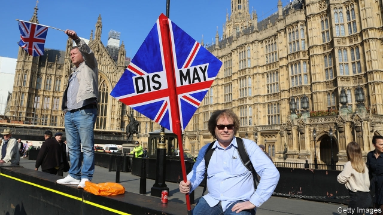

###### In search of lost compromises

# Can Theresa May and Jeremy Corbyn compromise on Brexit? 

##### Compromises are often unsatisfactory to all 

 

> Apr 4th 2019 

IT WAS PERHAPS fitting that this week’s Commons debates on Brexit were interrupted by a protest by 12 semi-naked people. MPs tried hard to ignore the invaders even as several glued their bottoms against the glass barrier above the chamber. In line with a surreal atmosphere of repetitious argument, the protest was not even about Brexit, but climate change. 

This was far from the high point of the week’s drama. That came a day later when Theresa May emerged from a seven-hour cabinet meeting to announce that, to break the Brexit logjam, she would now try to agree a plan with the Labour leader, Jeremy Corbyn. Even more important, she added that, if this effort failed, she would bind herself to implement whatever Brexit proposal MPs agreed upon in their next round of voting. 

The prime minister’s volte-face comes at a crucial moment. For months she has been advised that, because she would never get all hardline Brexiteers in the Tory European Research Group (ERG) and the Northern Irish Democratic Unionist Party (DUP) to back the Brexit deal she has done with the European Union, she must reach out to the opposition. Now she has belatedly accepted this advice. In doing so, she has tilted firmly against a no-deal Brexit. To invert her mantra, she now seems to think any deal is better than no-deal. Tory hardliners are furious with her (see Bagehot). 

Even so, it is not obvious that her move will bear fruit. The two leaders, who met on the afternoon of April 3rd, are not just far apart politically but also notoriously intransigent. Mrs May might soften some Brexit “red lines”, but she is still opposed to both the customs union and the single market. Mr Corbyn wants to pursue the first, and many elements of the second. He is also under pressure from his party to press for a second referendum, but she has been determinedly against this. Any Brexit deal must also espouse the current withdrawal agreement, including the contentious Irish backstop that implicitly relies on a customs union and regulatory alignment as insurance against a hard border. 

It does not help that MPs keep showing what they are against, not what they are for. On March 29th, when Brexit was originally due to happen, MPs rejected Mrs May’s deal for a third time, albeit by the margin of 58 votes, down from the record previous defeats by 230 and 149. Then on April 1st MPs again rejected all Brexit options before them in a second round of “indicative votes”—though by less than before. A customs-union motion was rejected by just three votes; a confirmatory referendum by 12; and a “Norway-plus” option redubbed “Common Market 2.0” by 21 votes. 

The main reason why nothing gets through is that there is so little mood for compromise on any side. Hardliners in the ERG and the DUP voted against every option because they do not want in any way to soften the hard Brexit they favour. But firm Remainers were almost equally obdurate. They refused to back Common Market 2.0 because it would weaken their campaign for a second referendum. Deadlock in the Commons was symbolised by a tie in a procedural vote about more Brexit voting next week, though it is in practice still likely. 

Nick Boles, who sponsored Common Market 2.0, accused fellow Tories of refusing to compromise and announced his resignation from the party whip. He is right that the Tories were, along with the DUP, the most intransigent of all. Barely a sixth of Tory MPs backed any option in the indicative votes. He won over the Scottish Nationalists, yet the Liberal Democrats and the new Change UK party were also hostile to his plan. 

This aversion to compromise can only make Mrs May’s attempt to find one even harder. That is unfortunate for two big reasons. One is that Brexit requires trade-offs: between the health of the economy and the desire for greater sovereignty, and between unfettered access to the EU market and the wish to control free movement of people. Compromises are often unsatisfactory to all. A customs union, for example, would only reduce not eliminate border frictions (including in Northern Ireland). By making it impossible to offer third countries lower tariffs on their goods exports, it would also make it far harder to strike free-trade deals, though they could in theory be done for services alone. 

The second reason is the looming deadline, now April 12th. Usually when compromise fails, the status quo prevails. For Brexit, however, the default is leaving without a deal. This week the cabinet secretary, Sir Mark Sedwill, spelt out the consequences for ministers in gory detail. Prices would jump, the economy tip into recession and the nation’s security be imperilled. That is why MPs this week were trying to push through a law requiring Mrs May to seek another extension to the deadline. 

She has in fact promised to do just that at the European Council in Brussels on April 10th. But it is not a given that EU leaders, whose unanimous approval is needed for an extension, will agree. Several are fed up with Mrs May’s indecision and with British MPs’ failure to agree upon anything. Charles Grant of the Centre for European Reform, a think-tank, says the leaders are split, with France’s Emmanuel Macron inclined to be tougher on Mrs May than Germany’s Angela Merkel. 

Mr Grant adds that EU leaders will insist that, if Britain is still a member after May 22nd, which is likely even if Mrs May and Mr Corbyn miraculously compromise in the next few days, it must take part in the European Parliament elections due on May 23rd-26th. Mrs May is keen not to do this so as to avoid explaining to voters why such an election is happening almost three years after the Brexit referendum. But she was careful this week not to rule out the possibility, so in a crunch she will surely give way. The government is already making contingency plans to hold the election. 

However the next few days go, Mrs May once again faces torrid negotiations in Brussels next week. EU leaders are aware that she has lost control of her party and of Parliament. They know she has promised to quit as prime minister, and they are fearful of who might succeed her. Returning to that Commons protest, Aneurin Bevan famously warned the Labour Party that scrapping nuclear weapons would mean its foreign secretary walking naked into the conference chamber. Mrs May will not have to do that. But she has few weapons and even less credibility with which to lever more concessions from the EU. 

-- 

 单词注释:

1.theresa[ti'ri:zә]:n. 特丽萨（女子名） 

2.jeremy['dʒerimi]:n. 杰里米（男子名） 

3.Corbyn[]:科尔宾（人名） 

4.APR[]:[计] 替换通路再试器 

5.Brexit[]:[网络] 英国退出欧盟 

6.invader[in'veidә]:n. 侵略者 [化] 侵入物 

7.surreal[sә'riәl]:a. 超现实主义的；离奇的；不真实的 

8.repetitious[.repi'tiʃәs]:a. 多次反复的, 重复的, 反复性的 

9.logjam['lɒgdʒæm]:n. 拥挤, 行不通, 为许多圆木材所阻 

10.hardline[]:n. 强硬路线 [电] 硬线 

11.Brexiteers[]:支持英国退欧的人（Brexiteer的复数） 

12.Tory['tɒ:ri]:n. 托利党党员, 保守党员, 亲英分子 a. 保守分子的 

13.erg[ә:^]:n. 尔格 [计] 尔格 

14.unionist['ju:njәnist]:n. 工会会员, 工联主义者 [法] 工会会员, 工会主义者 

15.dup[dʌp]:vt. 打开；重复 

16.opposition[.ɒpә'ziʃәn]:n. 反对, 敌对, 相反, 在野党 [医] 对生, 对向, 反抗, 反对症 

17.belatedly[bi'leitidli]:adv. 延迟地；延续地 

18.tilt[tilt]:n. 倾斜, 倾向, 船篷, 车篷 vt. 使倾斜, 使倾侧, 用帆布篷遮盖 vi. 倾斜, 翘起, 冲, 评击 [计] 倾斜 

19.invert[in'vә:t]:a. 转化的 vt. 使反转, 使颠倒, 使转化 n. 颠倒的事物 [计] 倒置; 反转 

20.mantra['mʌntrә, 'mæn-]:颂歌, 咒语(尤指四吠陀经典内作为咒文或祷告唱念的) 

21.hardliner[ˌhɑ:d'laɪnə(r)]:n. 强硬路线者 

22.politically[]:adv. 政治上 

23.notoriously[]:adv. 臭名昭著的, 声名狼藉的 

24.intransigent[in'trænsidʒәnt]:a. 非妥协性的 n. 不妥协的人 

25.Mr['mistә(r)]:先生 [计] 存储器回收程序, 多重请求 

26.soften['sɒftn]:v. (使)变柔软, (使)变柔和 

27.referendum[.refә'rendәm]:n. （就重大政治或社会问题进行的）全民公决，全民投票 

28.determinedly[dɪ'tɜ:mɪndlɪ]:adv. 坚定地; 坚决地; 决然地; 断然地 

29.espouse[i'spauz]:vt. 支持, 赞成, 嫁, 娶 [法] 娶, 出嫁, 信奉 

30.withdrawal[wið'drɒ:l]:n. 提款, 撤退, 退回, 撤消, 退隐, 戒毒过程 [医] 戒除, 脱瘾 

31.contentious[kәn'tenʃәs]:a. 好争吵的, 爱争论的, 有异议的 [法] 诉讼的, 争执的, 引起争论的 

32.backstop['bækstɒp]:n. 挡球网, 接球手 [电] 背向停止 

33.implicitly[]:adv. 含蓄, 不言明, 暗示, 暗指, 内含, 固有, 无疑, 绝对, 无保留 [计] 隐含地 

34.regulatory['regjulәtәri]:a. 受控制的, 统制的, 调整的 [经] 规则的 

35.alignment[ә'lainmәnt]:n. 队列, 结盟, 校正 [计] 校准; 对齐; 对准 

36.originally[ә'ridʒәnli]:adv. 本来, 原来, 最初, 就起源而论, 独创地 

37.albeit[ɔ:l'bi:it]:conj. 尽管, 虽然 

38.indicative[in'dikәtiv]:a. 指示的, 象征的, 表示...的 [经] 指标的 

39.les[lei]:abbr. 发射脱离系统（Launch Escape System） 

40.confirmatory[kәn'f\\:mәtәri]:起确定作用的, 坚信礼的, 证实的 [计] 证实 

41.redubbed[]:[网络] 减少 

42.remainers[]:[网络] 剩余物 

43.equally['i:kwәli]:adv. 相等地, 同样地, 平等地 

44.obdurate['ɒbdjurit]:a. 顽固的, 执拗的, 冷酷的 [法] 执迷不悟的, 毫不悔改的, 无情的 

45.deadlock['dedlɒk]:n. 僵局, 停顿 v. (使)停顿, (使)相持不下 [计] 死锁 

46.symbolise['simbәlaiz]:vt. 象征, 代表, 作为...的象征 vt.vi. 用符号表示, 使用符号 

47.procedural[prә'si:dʒәrәl]:a. 程序上的 [经] 程序上的 

48.nick[nik]:n. 刻痕, 缺口, 划痕 vt. 刻痕于, 弄缺, 擦伤 vi. 狙击 

49.bole[bәul]:n. 树干 [医] 胶灰粘土 

50.Tory['tɒ:ri]:n. 托利党党员, 保守党员, 亲英分子 a. 保守分子的 

51.nationalist['næʃәnәlist]:n. 国家主义者, 民族主义者 

52.democrat['demәkræt]:n. 民主人士, 民主主义者, 民主党党员 [经] 民主党 

53.aversion[ә'vә:ʃәn]:n. 厌恶, 讨厌的事, 讨厌的人 [医] 厌恶, 移转, 移位 

54.sovereignty['sɒvrәnti]:n. 主权, 独立国 [法] 主权, 主权国家, 统治权 

55.unfetter[.ʌn'fetә]:vt. 给...解开脚链, 释放, 使自由 [法] 除去...脚镣, 释放 

56.tariff['tærif]:n. 关税, 关税表, 价格表, 收费表 vt. 课以关税 [计] 价目表 

57.loom[lu:m]:n. 织布机, 若隐若现的景象 vi. 朦胧地出现, 隐约可见, 可怕地出现 

58.statu[]:[网络] 状态查看；雕像；特级雪花白 

59.quo[]:vt. [古]说 

60.default[di'fɒ:lt]:n. 违约, 不履行责任, 缺席, 默认值 v. 疏怠职责, 缺席, 拖欠, 默认 [计] 默认; 默认值; 缺省值 

61.gory['gɒ:ri]:a. 血淋淋的, 满是血的, 血污的 

62.recession[ri'seʃәn]:n. 后退, 凹处, 衰退, 归还 [医] 退缩 

63.imperil[im'peril]:vt. 使处于危险, 危害 

64.Brussel[]:n. 布鲁塞尔（比利时首都） 

65.unanimous[ju:'nænimәs]:a. 意见一致的, 无异议的 

66.indecision[.indi'siʒәn]:n. 优柔寡断 [医] 决定不能 

67.charle[]:n. 查理（男子名）；查理（姓氏） 

68.emmanuel[i'mænjuәl]:n. 以马内利（耶稣基督的别称）；伊曼纽尔（男子名, 等于Immanuel） 

69.macron['mækrәn]:n. 长音符号 

70.angela['ændʒilә]:n. 安吉拉（女子名） 

71.merkel[]: [人名] 默克尔; [地名] [美国] 默克尔 

72.miraculously[]:adv. 超自然, 非凡, 不可思议, 令人惊叹, 象奇迹一样, 奇迹般, 能创造奇迹 

73.voter['vәutә]:n. 选民, 投票人 [法] 选民, 选举人, 投票人 

74.crunch[krʌntʃ]:v. 嘎吱嘎吱的咬嚼, 压碎, 嘎吱嘎吱地踏过 n. 咬碎, 咬碎声 

75.contingency[kәn'tindʒәnsi]:n. 偶然性, 可能性, 意外事故 [经] 意外事故, 意外开支, 偶然事故 

76.torrid['tɒ:rid]:a. 晒热的, 酷热的, 炎热的 

77.negotiation[ni.gәuʃi'eiʃәn]:n. 谈判, 磋商, 交涉 [经] 谈判, 协商 

78.aneurin[ә'naiәrin]:[医] 硫胺, 维生素B-1 

79.Bevan['bevәn]:贝文(姓氏) 

80.famously['feimәsli]:adv. 极好地, 非常令人满意地 

81.scrap[skræp]:n. 碎片, 残余物, 些微, 片断, 铁屑, 吵架 vt. 扔弃, 敲碎, 拆毁 vi. 互相殴打 a. 零碎拼凑成的, 废弃的 

82.credibility[.kredi'biliti]:n. 可信用, 确实性, 可靠 [法] 证据能力, 可信程度, 确实性 

83.concession[kәn'seʃәn]:n. 特许, 让步, 认可 [经] 核准, 许可, 特殊(权) 

