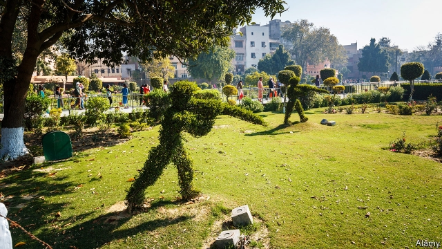

###### A century of dithering

# The politics of apologising for Amritsar 

##### In 2013 David Cameron wrote of the “deeply shameful” event 

 

> Apr 4th 2019 

IF THE GOVERNMENT cannot make up its collective mind on Brexit after three years, perhaps it is not surprising that ministers are still “reflecting” on whether or not to issue an apology for the Amritsar massacre after one hundred. That was the verdict from the government benches during a recent debate on the subject in the House of Lords, ahead of the centenary on April 13th. 

On that day in 1919, General Reginald Dyer ordered 50 men under his command to fire into a crowd of people at Amritsar, the spiritual home of Sikhism, in north-west India. In just ten minutes his troops fired 1,650 rounds, killing at least 370 and wounding over 1,000. Whereas the general claimed he was forestalling an insurrection, those gathered in the public garden of Jallianwala Bagh were in fact unarmed, listening peacefully to some speeches. 

The massacre shattered any lingering moral claims that the British might have had to rule India. Winston Churchill, colonial secretary at the time, called it a “monstrous event”. Queen Elizabeth laid a wreath there in 1997. In 2013 David Cameron, then the prime minister, visited Jallianwala Bagh and wrote in the visitors’ book of the “deeply shameful” event . The government has promised to mark the centenary in the most “respectful” way, but an outright apology looks unlikely. It wants to avoid opening a can of worms that could see it compelled to apologise for other colonial outrages. 

That may cause surprisingly little indignation in India. Not much fuss is being made over the centenary in the city itself. Insofar as the term “Amritsar” marks a harrowing episode in the history of India, these days it tends to recall the bloody partition of India and Pakistan in 1947. Families of Hindu Punjabis who fled Lahore via Amritsar suffered great depredations on the way. A museum devoted to preserving the memory of partition opened in 2017. 

Some, like Rudrangshu Mukherjee, a historian at Ashoka University, are actually irritated by the notion that Britain might apologise for the incident. It would be good for the British to remember that Dyer’s actions constituted “a national tragedy of enormous proportion”, says Mr Mukherjee. Yet Amritsar was just one example of British misrule. Mr Mukherjee warns that “you could make an apology about this specific incident without acknowledging a broader reality—which would be of no help.” 

With national elections set to start on April 11th, Indians have more pressing matters in mind. Narendra Modi, the prime minister, controls the story of Indian nationalism these days, and has little use for the history of the anti-colonial struggle (which his own heroes, the first Hindu nationalists, largely sat out). The Congress party, now in opposition, would traditionally stoke the embers of the anti-British campaigns, which it led. But it is trying hard to appeal to new voters, desperate for jobs and otherwise far from the memory of the freedom struggle. 

-- 

 单词注释:

1.dither['diðә]:n. 发抖, 兴奋 vi. 发抖 

2.politic['pɒlitik]:a. 精明的, 明智的, 策略的 

3.apologise[ә'pɔlәdʒaiz]:vi. 道歉（等于apologize） 

4.Amritsar[,ʌm'ritsә(r)]:阿姆利则[印度北部城市](锡克教圣地) 

5.david['deivid]:n. 大卫；戴维（男子名） 

6.cameron['kæmәrәn]:n. 卡梅伦/隆（男子名） 

7.shameful['ʃeimful]:a. 可耻的, 丢脸的, 不道德的, 淫猥的, 猥亵的, 不体面的 

8.APR[]:[计] 替换通路再试器 

9.cannot['kænɒt]:aux. 无法, 不能 

10.Brexit[]:[网络] 英国退出欧盟 

11.massacre['mæsәkә]:n. 大屠杀 vt. 大屠杀, 残杀 

12.verdict['vә:dikt]:n. 裁决, 判决, 判断性意见, 定论, 结论 [法] 定论, 判断, 意见 

13.centenary[sen'ti:nәri]:n. 一百年 a. 一百年的 

14.reginald['redʒinәld]:n. 雷金纳德（男子名） 

15.dyer['daiә]:n. 染色工 

16.sikhism[ˊsiːkizәm]:n. 西克教 

17.forestal[]:a. forest（森林）的变形 

18.insurrection[.insә'rekʃәn]:n. 起义, 暴动, 反抗 [法] 起义, 叛乱, 暴动 

19.bagh[bɑ:ɡ]:n. （巴基斯坦、印度的）花园；孟加拉虎 n. (Bagh)人名；(阿拉伯、法、德、印)巴格 

20.unarm[.ʌn'ɑ:m]:vt. 缴械 vi. 放下武器 

21.peacefully[]:adv. 平静地 

22.shatter['ʃætә]:n. 碎片, 粉碎, 落叶, 喷洒 vt. 打碎, 使散开, 粉碎, 破坏 vi. 粉碎, 损坏, 脱落 

23.linger['liŋgә]:vi. 逗留, 消磨, 徘徊 vt. 消磨 

24.winston['winstәn]:n. 温斯顿（姓氏, 男子名） 

25.Churchill['tʃә:tʃil]:n. 邱吉尔 

26.colonial[kә'lәunjәl]:a. 殖民的, 殖民地的 [法] 殖民地居民 

27.monstrous['mɒnstrәs]:a. 巨大的, 畸形的, 怪异的 [法] 巨大的, 异形的, 畸形的:荒诞的 

28.elizabeth[i'lizәbәθ]:n. 伊丽莎白（女子名） 

29.outright['autrait]:a. 率直的, 完全的, 总共的, 直率的 adv. 完全地, 率直地, 立刻地, 一直向前 

30.outrage['autreidʒ]:n. 暴行, 侮辱, 愤怒 vt. 凌辱, 虐待, 触犯 

31.indignation[.indig'neiʃәn]:n. 愤怒, 愤慨, 义愤 

32.fuss[fʌs]:n. 大惊小怪, 小题大作, 忙乱 vi. 无事自扰, 焦急, 焦燥, 忙乱 vt. 使激动, 使烦燥 

33.insofar[.insәu'fɑ:]:adv. 在...的范围 

34.harrow['hærәu]:n. 哈罗公学, 耙 vt. 耙掘, 伤害, 使苦恼 vi. 被耙松 

35.bloody['blʌdi]:a. 血腥的, 嗜杀的, 有血的 

36.partition[pɑ:'tiʃәn]:n. 分割, 隔离物, 隔墙, 财产分割 vt. 区分, 瓜分, 隔开, 分割 [计] 分区; 划分 

37.Pakistan[.pɑ:ki'stɑ:n]:n. 巴基斯坦 

38.Hindu['hindu:]:a. 印度教教徒的 n. 印度教教徒 

39.Punjabi[.pʌn'dʒɑ:bi]:n. 旁遮普人, 旁遮普语 a. 旁遮普的, 旁遮普人的, 旁遮普语的 

40.lahore[lә'hɔ:]:n. 拉合尔（巴基斯坦城市） 

41.depredation[.depri'deiʃәn]:n. 掠夺, 破坏 

42.mukherjee[]:[网络] 穆克纪；玛克赫吉；穆克琪 

43.historian[hi'stɒ:riәn]:n. 历史学家, 记事者 

44.ashoka[]:n. 阿育王（印度孔雀王朝的第三位君主） 

45.irritate['iriteit]:vt. 激怒, 使发怒, 使兴奋, 使发炎 vi. 引起不快 

46.constitute[kәn'stitjut]:vt. 构成, 组成, 任命 [建] 构造, 组成 

47.misrule[mis'ru:l]:vt. 施暴政 n. 暴政 

48.narendra[]:[网络] 纳伦德拉；纳兰德；纳然陀 

49.MODI['mәudai]:[计] 模块化光学数字接口 

50.nationalism['næʃәnәlizm]:n. 民族主义, 民族特性 

51.nationalist['næʃәnәlist]:n. 国家主义者, 民族主义者 

52.opposition[.ɒpә'ziʃәn]:n. 反对, 敌对, 相反, 在野党 [医] 对生, 对向, 反抗, 反对症 

53.traditionally[]:adv. 传统上；传说上；习惯上 

54.stoke[stәuk]:v. 司炉, (使)大吃 

55.ember['embә]:n. 灰烬, 余烬 

56.voter['vәutә]:n. 选民, 投票人 [法] 选民, 选举人, 投票人 

