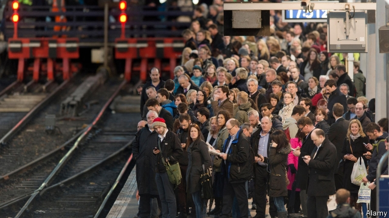

###### Power cut

# The “Northern Powerhouse” may not be as dead as it looks 

##### George Osborne’s pet project has languished but may soon get a reboot 

 

> Apr 4th 2019 

TWO YEARS ago, Doves Nest Farm, with its drystone walls and views of heather-covered hills, was as idyllic as any in the North York Moors National Park. Now its fields are the site of something less pretty: the first deep mine to be sunk in Britain since the 1970s. A company, Sirius Minerals, is about to dig up the area’s vast underground stash of polyhalite, an ingredient in fertiliser. So as not to wreck the scenery it is constructing a tunnel to carry the stuff all the way (37km, or 23 miles) to Teesside. The cost will be £3.2bn ($4.2bn), one of the north’s biggest-ever private-sector investments. Sirius says it will deliver billions of pounds of exports and good jobs for the next half-century. 

But a big setback came in January when the Treasury’s Infrastructure and Projects Authority reduced a £1.5bn loan guarantee it had extended to Sirius by £600m, to minimise risk to taxpayers. The company will probably still be able to raise the money it needs but the reduction has meant some uncertainty for a landmark project. 

It was the latest blow for the “Northern Powerhouse”, a concept launched in 2014 by George Osborne, the then chancellor, and Jim O’Neill, an economist. The idea was to boost northern cities and rebalance the economy from perceived overdependence on the south and the City of London. Upgrading rail, devolving power to new regional mayoralties and attracting Chinese cash were important elements of the plan. 

Before long, however, the Northern Powerhouse suffered a power cut. Following the Brexit referendum of 2016 Mr Osborne left government. Theresa May, the prime minister, showed her disdain for his pet project by appointing a new minister for the Northern Powerhouse, Andrew Percy, but banning him from using the phrase, even on trips to the north. Meanwhile the government started promoting the “Midlands Engine”, a rival regional plan. Brexit then drained attention in Westminster from either scheme. 

Nowadays, complains Andy Burnham, the Labour mayor of Greater Manchester, China’s government talks more about the Northern Powerhouse than Britain’s does. China sees northern England as part of its Belt and Road Initiative (BRI), a series of infrastructure investments across Eurasia, the Middle East and Africa. Its president, Xi Jinping, has talked about the Northern Powerhouse in descriptions of the BRI. 

Neglect by central government has not quite finished off the Northern Powerhouse, however. Northerners, for their part, quickly bought into the concept: by 2015 over half of them knew the term, according to IPPR North, a think-tank. The scheme’s main achievements are devolution deals to give power to new metro mayors in Greater Manchester, Liverpool city-region, Sheffield city-region and Tees Valley, with more to come; and the establishment of Transport for the North (TfN), a statutory transport body. Manchester and Liverpool together rank in the world’s top ten cities for foreign investment, according to a recent study by IBM. 

The biggest test now looms. The government is this year to “refresh” the Northern Powerhouse. As part of its forthcoming spending review it will decide whether to fund TfN’S recently submitted £39bn plan for Northern Powerhouse Rail, a high-speed line over the Pennines that would transform east-west connectivity in the north, which at present is dire (the 125 miles from Liverpool to Hull takes three hours). Also known as HS3, it is meant to link up with HS2, a high-speed line under construction, which will link London to Birmingham, Manchester and Leeds. 

Opponents of the spiralling costs of HS2 argue that Northern Powerhouse Rail is a better bet. Philip Hammond, the chancellor, recently expressed support for the northern proposal. Still, people will need to see the money before they believe. Last year the Treasury considered spending £7bn on high-speed rail to connect Liverpool to Manchester airport, but the money has not yet appeared. 

The current minister for the Northern Powerhouse, Jake Berry, has big plans for the coming reboot, such as a new department for the north with powers to levy its own taxes. But there are limits; some ministers see devolution as creating powerful platforms for Labour politicians, says Nick Forbes, Labour leader of Newcastle city council. This year may be the last for the government to act or see the Northern Powerhouse finally run out of juice. 

-- 

 单词注释:

1.powerhouse['pauәhaus]:n. 发电所, 动力室, 精力旺盛的人, 办事效率高的机构 

2.george[dʒɔ:dʒ]:n. 乔治（男子名）；自动操纵装置；英国最高勋爵勋章上的圣乔治诛龙图 

3.languish['læŋgwiʃ]:vi. 憔悴, 凋萎, 苦思 

4.reboot[ri:'bu:t]:[计] 重新启动 

5.APR[]:[计] 替换通路再试器 

6.dove[dʌv]:n. 鸽子 dive的过去式 

7.drystone[d'rɪstəʊn]: 干石 

8.idyllic[ai'dilik]:a. 田园诗的, 牧歌的, 悠闲的 

9.york[jɔ:k]:n. 约克郡；约克王朝 

10.moor[muә]:n.荒野；旷野 Moor: 摩尔人. v.系住；停泊 

11.les[lei]:abbr. 发射脱离系统（Launch Escape System） 

12.Sirius['siriәs]:n. 天狼星 

13.stash[stæʃ]:vt. 藏起来 n. 隐藏处, 隐藏物 

14.polyhalite[,pɔli'hælait]:n. [矿]杂卤石 

15.fertiliser['fә:tilaizә]:[化] 肥料 

16.Teesside[]:蒂赛德（地区）（地名）（英国） 

17.setback['setbæk]:n. 挫折, 退步, 逆流 

18.infrastructure['infrәstrʌktʃә]:n. 基础结构, 基础设施 [经] 基础设施 

19.minimise[]:vt. 使减到最少/最小, 使降到最低限度, 使缩到最小, 极度轻视 

20.taxpayer['tækspeiә]:n. 纳税人 [法] 纳税人, 纳税义务人 

21.uncertainty[.ʌn'sә:tnti]:n. 不确定, 不可靠, 不确定的事物 [化] 不确定度 

22.landmark['lændmɑ:k]:n. 陆标, 划时代的事, 地界标 [医] 界标 

23.Osborne[]:n. 奥斯本（男子名） 

24.chancellor['tʃɑ:nsәlә]:n. 大臣, 总理, 首相, 大使馆/领事馆的一等秘书, 司法官, 大学校长 

25.jim[dʒim]:n. 吉姆（人名） 

26.economist[i:'kɒnәmist]:n. 经济学者, 经济家 [经] 经济学家 

27.rebalance[re'bæləns]: 再平衡 

28.overdependence[]: [医]过分依赖 

29.upgrade['ʌpgreid]:n. 上坡, 升级, 上升 adv. 往上 vt. 使升级, 提升, 改良品种 vi. 升级 [计] 升级 

30.devolve[di'vɒlv]:vt. 转移, 下放(权力等), 委托 vi. 被移交 

31.regional['ri:dʒәnәl]:a. 地方的, 地域性的 [医] 区的, 部位的 

32.mayoralty['mєәrәlti]:n. 市长职位 [法] 市长职位, 市长任期 

33.Brexit[]:[网络] 英国退出欧盟 

34.referendum[.refә'rendәm]:n. （就重大政治或社会问题进行的）全民公决，全民投票 

35.theresa[ti'ri:zә]:n. 特丽萨（女子名） 

36.disdain[dis'dein]:n. 蔑视 vt. 蔑视, 鄙弃 

37.andrew['ændru:]:n. 安德鲁（男子名） 

38.percy['pә:si]:n. 珀西（男子名） 

39.midland['midlәnd]:n. 中部地方, 内地 

40.Westminster['westminstә]:n. 威斯敏斯特 

41.andy['ændi]:n. 安迪（男子名, 等于Andrew） 

42.Burnham[]:n. (Burnham)人名；(英、西)伯纳姆 

43.Manchester['mæntʃestә]:n. 曼彻斯特 

44.BRI[]:[计] 基本速率综合业务数字网 

45.sery[]:n. (Sery)人名；(俄)谢雷；(科特)塞里 

46.infrastructure['infrәstrʌktʃә]:n. 基础结构, 基础设施 [经] 基础设施 

47.Eurasia[ju'reiʒә]:n. 欧亚大陆 

48.northerner['nɔ:ðәnә]:n. 北方人 

49.quickly['kwikli]:adv. 很快地 

50.IPPR[]:[网络] 公共政策研究所(Institute for Public Policy Research)；英国公共政策研究所；图像处理和模式识别(Image Processing and Pattern Recognition) 

51.devolution[.devә'lu:ʃәn]:n. 相传, 转让, 委付 [医] 退化, 异化 

52.metro['metrәu]:n. 地铁 

53.Liverpool['livәpu:l]:n. 利物浦 

54.sheffield['ʃefi:ld]:n. 谢菲尔德（英国城市） 

55.tee[ti:]:n. T字形, T字形之物, 发球区, 球座, 目标 vt. 搁在球座上 a. T字形的 

56.tfn['ti:'ef'en]: [医][=total fecal nitrogen]总粪氮（量），粪内总氮量 

57.statutory['stætjutәri]:a. 法令的, 法定的, 可依法惩处的 [经] 法定的 

58.IBM[]:美国国际商用机器公司 [计] 国际商用机器公司 

59.loom[lu:m]:n. 织布机, 若隐若现的景象 vi. 朦胧地出现, 隐约可见, 可怕地出现 

60.forthcoming['fɒ:θ'kʌmɑŋ]:a. 即将来临的 n. 来临 

61.pennines[]:n. 北乃恩山脉 

62.connectivity[kәnek'tiviti]:[计] 连通性, 连通度 

63.dire[daiә]:a. 可怕的, 悲惨的, 阴沉的, 极端的 

64.hull[hʌl]:n. 壳, 皮, 船体 vt. 去壳 

65.Birmingham['bә:miŋәm]:n. 伯明翰 

66.LEED[]:[化] 低能电子衍射 

67.spiral['spairәl]:n. 螺旋形之物, 螺线 a. 螺旋形的, 盘旋的 vi. 螺旋形下降, 螺旋形上升, 螺旋形行进 vt. 使螺旋形行进 

68.philip['filip]:n. 菲利普（男子名） 

69.hammond['hæmәnd]:n. 哈蒙德（美国城市） 

70.treasury['treʒәri]:n. 国库, 宝库, 财政部, 国库券 [经] 库存, 国库, 金库 

71.jake[dʒeik]:a. 满意的, 上等的 n. 乡下佬, 家伙 

72.levy['levi]:n. 税款, 所征的人数, 征收 vi. 征税, 课税 vt. 征收, 强求, 召集 

73.nick[nik]:n. 刻痕, 缺口, 划痕 vt. 刻痕于, 弄缺, 擦伤 vi. 狙击 

74.forbes['fɔ:bz, 'fɔ:bis]:n. 福布斯（美国出版及媒体集团）；福布斯（美国著名财经杂志）；福布斯（姓氏） 

75.newcastle['nju:,kɑ:sl]:n. 纽卡斯尔（英国港市） 

