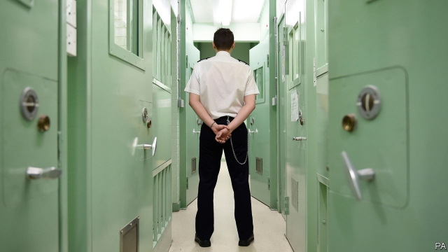
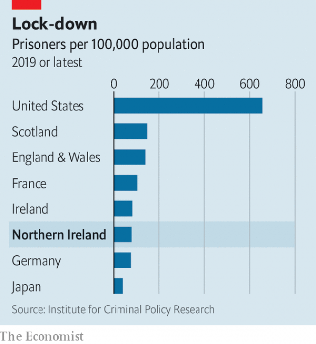

###### Irish porridge

# Why are Northern Ireland’s prisons so empty? 

##### The province’s prison system looks more Scandinavian than British 

 

> Apr 4th 2019 

NORTHERN IRELAND’S prisons were once notorious. They were battlegrounds of the “Troubles” of 1968-98, as the government experimented with internment without trial and prisoners demanded recognition of their political status with “dirty protests”, during which some smeared excrement on cell walls. The gaunt features of Bobby Sands, a Republican inmate, became well known as he starved himself to death in 1981. The Irish Republican Army targeted warders. “People had assumptions about who we were,” says Austin Treacy, the province’s director of prisons. “And during the Troubles, we didn’t want them to know who we were.” 

Yet Mr Treacy and his colleagues now have something to boast about. A much smaller share of the population serves time than in England, Wales or Scotland (see chart). Its incarceration rate is closer to that of countries championed by penal reformers such as Norway and Sweden than it is to the rest of the UK. English prisons are crammed but there is plenty of room to spare in jails across the Irish Sea. The disparity seems counterintuitive, given the relatively recent conflict and evidence suggesting that the province’s judges are no less likely to impose custodial sentences than those elsewhere in the UK. 

 

Three factors help explain the gap. The first is a gulf in crime rates. Surveys suggest Northern Irish people are a little more than half as likely to fall victim to crime as those in England and Wales. Some think the higher number of cops relative to population in the province has a deterrent effect. Others, including Mr Treacy, point to the lack of big cities, which tend to have concentrations of crime. 

Second, the Northern Irish system is better at deterring prisoners from reoffending once they are released. On March 28th Dame Glenys Stacey, the chief inspector of probation in England and Wales, concluded that the part-privatisation of its system in 2014 was “irredeemably flawed”. All of the 10 private probation firms inspected last year were given the lowest two of four grades. By contrast Northern Ireland kept its unified, public-sector system. Olwen Lyner of NIACRO, a criminal-justice charity, adds that having one probation agency and a single police force (rather than the 43 in England and Wales) makes it easier to co-ordinate support for ex-prisoners. 

Even the much-criticised prisons are beginning to play a part. After inspectors rebuked HMP Maghaberry in 2015 partly for failing to provide enough activities for inmates, officers opened a recycling plant to train inmates and a café where prisoners do the serving. They rebranded the only jail for young offenders as a “secure college”, where staff call prisoners, who study educational and vocational courses, “students”. It is too early to judge the lasting effects of the changes, but Mr Treacy claims they are bearing fruit. Prisoners are becoming less likely to reoffend, and the overall recidivism rate is ten percentage points lower than in England and Wales. 

The final explanation is historical—and disturbing. During the Troubles, paramilitaries ran a shadow justice system to police their neighbourhoods. Their influence is waning but they still enforce a strict “moral code” in some working-class districts, says John Topping of Queen’s University Belfast. Several dozen “punishment assaults” are recorded by police every year, to enforce drug debts but also for suspected criminal offences that may otherwise be reported to the police. Victims are shot in the knees or roughed up with baseball bats. 

In an attempt to end this violence, the state licenses grassroots alternatives to the justice system. One group, Community Restorative Justice Ireland, is run by Harry Maguire, a Republican who served ten years in jail for his part in the murder of two British soldiers. It claims to handle 1,700 or so disputes a year, mostly between Republicans. It refers serious crimes to the police, but otherwise mediates between parties involved in low-level wrongdoing or to prevent family feuds escalating. 

The groups break cycles of offending and keep young people in particular out of prison, says Phil Scraton, also of Queen’s. As they are subject to inspection, they offer a more legitimate form of informal justice, argues David Ford, a former justice minister at Stormont. But their sectarian nature means they are hardly ideal models. “Would you do it in England and Wales? Probably not,” Mr Ford admits. 

-- 

 单词注释:

1.Scandinavian[,skændi'neivjәn]:n. 斯堪的纳维亚人, 斯堪的纳维亚语, 北欧日耳曼语系 a. 斯堪的纳维亚人的, 斯堪的纳维亚语的, 北欧日耳曼语系的 

2.APR[]:[计] 替换通路再试器 

3.notorious[nәu'tɒ:riәs]:a. 声名狼藉的, 臭名昭著的, 众人皆知的 

4.internment[in'tә:nmәnt]:n. 拘留 [法] 拘留, 收容, 禁闭 

5.statu[]:[网络] 状态查看；雕像；特级雪花白 

6.smear[smiә]:vt. 涂, 擦上, 玷污, 把...擦模糊 vi. 被弄脏 n. 污点, 污迹, 污蔑 

7.excrement['ekskrimәnt]:n. 排泄, 大便 [医] 粪便 

8.gaunt[gɒ:nt]:a. 瘦削的, 憔悴的, 荒凉的 

9.bobby['bɒbi]:n. 警察 

10.inmate['inmeit]:n. 同住者, 被收容者 [法] 内部的, 接近中心的, 内在的 

11.warder['wɒ:dә]:n. 看守, 守卫, 看门人 [法] 监狱看守人, 门警, 管理人 

12.austin['ɔ:stin]:n. 奥斯丁（人名）；英国制汽车牌名 

13.Treacy[]:特里西（人名） 

14.wale[weil]:n. 隆起的伤痕, 鞭痕, 凸条纹, 精华, 选择 vt. 在...上留下鞭痕, 织成棱纹, 挑选, 撑住 vi. 挑选 

15.incarceration[in.kɑ:sә'reiʃәn]:n. 下狱, 监禁, 禁闭 [医] 箝闭 

16.penal['pi:nl]:a. 有关处罚的, 刑的, 刑罚的, 刑法上的, (课税)繁重的 [法] 刑事的, 刑法的, 受刑罚的 

17.reformer[ri'fɒ:mә]:n. 改革家, 改革运动者 [化] 转化炉; 转化器; 重整器; 重整炉 

18.Norway['nɒ:wei]:n. 挪威 

19.Sweden['swi:dn]:n. 瑞典 

20.UK[ju: 'kei]:n. 联合王国 

21.cram[kræm]:vt. 塞满, 填满, 猛吃 vi. 贪吃 n. 极度拥挤, 死记硬背 

22.disparity[dis'pæriti]:n. 不一致 [医] 差异, 不等 

23.counterintuitive[,kajntәrin'tju:itiv]:a. 违反直觉的 

24.les[lei]:abbr. 发射脱离系统（Launch Escape System） 

25.custodial[kʌ'stәudjәl]:a. 保管的, 保管人的 n. 圣物保存器 

26.cop[kɒp]:n. 警官 vt. 抓住 

27.deterrent[di'tә:rәnt]:a. 制止的, 威慑的, 遏制的 n. 威慑力量(或因素), 制止物 

28.deter[di'tә:]:vt. 制止, 吓住, 威慑 

29.reoffend[]: 再犯罪；再犯法 

30.dame[deim]:n. 夫人 

31.stacey[]:n. 史黛丝（女子名） 

32.inspector[in'spektә]:n. 检查员, 巡视员 [化] 检查员 

33.probation[prәu'beiʃәn]:n. 鉴定, 查验, 证明, 试用, 察看, 缓刑 [医] 审辨, 试验, 鉴定, 试用, 见习 

34.irredeemably[ˌiri'diːməbl]:a. 不能赎回的；不能兑现的；不可救药的 

35.flaw[flɒ:]:n. 缺点, 裂纹, 瑕疵, 一阵狂风 [化] 划痕; 裂缝; 裂纹 

36.unify['ju:nifai]:v. 统一, 使成一体 

37.olwen['ɔlwen]:n. (威尔士传说中的)奥尔温公主 

38.rebuke[ri'bju:k]:n. 指责, 谴责, 非难 vt. 斥责, 指责, 制止 

39.HMP[]:主机监督协议 

40.recycling[]:[电] 再循环 

41.rebrand[ˌri:ˈbrænd]:v. 给（产品或组织）重新命名（或包装）, 重塑…的形象 

42.offender[ә'fendә]:n. 罪犯, 无礼的人, 得罪人的人 

43.educational[.edju'keiʃәnl]:a. 教育的, 教育性的 

44.vocational[vәu'keiʃәnl]:a. 职业的 [法] 职业上的, 天职的 

45.recidivism[ri'sidivizm]:n. 累犯 [医] 复发趋向, 再发趋向, 再犯趋向 

46.paramilitary[.pærә'militәri]:a. 辅助军事的 

47.wane[wein]:n. 减少, 衰微, 败落, 亏缺, 月亏 vi. 变小, 亏缺, 衰落, 消逝, 退潮 

48.john[dʒɔn]:n. 盥洗室, 厕所, 嫖客 

49.Belfast[.belfɑ:st]:n. 贝尔法斯特 

50.assault[ә'sɒ:t]:n. 攻击, 袭击 vt. 袭击, 攻击 vi. 发动攻击 

51.grassroot[]:n. 草根 

52.restorative[ri'stɒrәtiv]:a. 恢复健康的, 滋补的 n. 兴奋药, 补药 

53.harry['hæri]:vt. 掠夺, 使苦恼, 强使前行, 折磨, 骚扰 

54.Maguire[]:n. 马奎尔（男子名）；美奎（公司名） 

55.mediate['mi:dieit]:a. 居间的, 间接的 vt. 斡旋, 调停 vi. 处于中间, 调解 

56.wrongdoing['rɒŋ'du:iŋ]:n. 干坏事, 坏事 

57.feud[fju:d]:n. 不和, 封地, 争执 vi. 长期不和, 擦亮 

58.escalate['eskәleit]:vi. 逐步扩大, 逐步升高, 逐步增强 vt. 使逐步上升 

59.phil[fil]:abbr. 哲学（philosophy） 

60.legitimate[li'dʒitimәt]:a. 合法的, 正当的, 婚生的 vt. 认为正当, 立为嫡嗣, 使合法 

61.informal[in'fɒ:mәl]:a. 非正式的, 不拘礼的, 通俗的 [经] 非正式的, 日常使用的 

62.david['deivid]:n. 大卫；戴维（男子名） 

63.ford[fɒ:d]:n. 浅滩, 福特汽车 v. 涉过, 涉水 

64.Stormont[]:n. (Stormont)人名；(英)斯托蒙特 

65.sectarian[sek'tєәriәn]:a. 宗派的, 党派的, 偏狭的 n. 宗派成员, 闹宗派的人 

