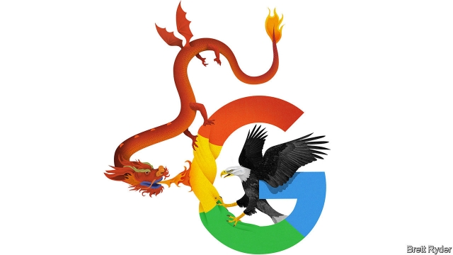

###### Schumpeter

# Google and the ethics of business in China 

##### For American firms, it feels like a Chinese burn 

 

> Apr 6th 2019 

ANYONE WHO has suffered a Chinese burn as a child will remember the pain when two hands grip the forearm and twist the skin in opposite directions. Americans doing business in China know the feeling well. The growing strategic rivalry between the two superpowers is putting pressure on American businesses and investors in two ways. One grip on the forearm is that of the American government, which is increasing scrutiny of American firms operating in China on national-security and human-rights grounds. The other is that of China’s Communist regime, which is attempting to force companies in China, including foreign ones, to bend to its rules. At worst, this means pushing them to assist China’s armed forces and its police state. That presents firms with a big ethical quandary. 

The predicament is unprecedented. During the cold war business was largely untroubled by superpower rivalry because the Soviet Union was an unwelcoming, closed economy. China, by contrast, is America’s biggest trading partner. Americans have invested more than $250bn in the country since 1990. The weight that Chinese firms listed on the mainland have in equity benchmarks such as the MSCI index is rising. Whatever the outcome of trade talks between President Donald Trump and his Chinese counterpart, Xi Jinping, heightened attention to security-related matters has made life uncomfortable for Chinese firms like Huawei. American companies are smarting, too. 

Google is the most prominent example. It pulled out of China in 2010 after refusing to permit censorship on its platform. Aspects of its recent return have been lambasted by Mr Trump and General Joseph Dunford, chairman of America’s joint chiefs of staff. General Dunford’s concerns revolve around an artificial-intelligence (AI) centre that Google set up in Beijing in 2017. He says development of AI in China supports an authoritarian government, and ultimately its army. Google’s boss, Sundar Pichai, met both men recently and offered reassurances that the centre creates innocuous open-source tools available to everyone, not just the Chinese. Meanwhile, protests from outraged Googlers last August forced Mr Pichai to suspend a project, code-named “Dragonfly”, for a Chinese search engine that may have let censors in. 

Another source of concern for companies and investors is Xinjiang. Authorities in the western Chinese province have sent up to 1m members of the Uighur Muslim minority to “re-education camps”. This year two American firms have been forced by unflattering media reports to sever ties with the state. Thermo Fisher Scientific, a medical-technology firm, stopped selling gene-sequencing instruments that were used to trace Uighurs’ DNA. Badger Sportswear, a big American clothing company, cut links with a Chinese supplier suspected of using Uighur forced labour. 

Attention is moving to Chinese firms linked to Xinjiang that are part of the MSCI index. For instance, American fund managers have flocked to buy Hikvision, a China-based supplier of surveillance cameras with a booming global business. It has now been put on a blacklist by the American government. Some investors are dropping it like a stone. Their reputations are also on the line. 

Doing business with unsavoury regimes is always fraught with risk. But in China the stakes are rising. Two decades ago, as the Communist state was opening up to trade, Western governments blithely assumed that foreign investment would help democratise it. Instead, the lure of its huge market led some firms to compromise their integrity. For a long time foreign corporations there worried more about business risks, such as intellectual-property theft, than reputational ones. This is changing as Mr Xi strengthens party control over business at home and turns more belligerent abroad. Last year some American airlines, and the Marriott hotel chain, had to change how they referred to Taiwan, which China regards as a renegade province. 

The growing importance of technology makes the minefield trickier to negotiate. It is ludicrous to think that American tech firms will stop doing business in China. It is a hub of innovation, with legions of coders and endless fields of data. Amazon Web Services and Microsoft are setting up their own AI centres in Shanghai. But just as Western politicians and voters fear that such technologies, as well as improving people’s lives, will destroy privacy, so in China the line between their use for civilian benefit and for repression may blur. The risk of missteps is high. 

Scrutiny is coming from many directions. The Trump administration, though loth to condemn human-rights abuses among allies like Saudi Arabia, is paying more attention to Xinjiang, not least because of pressure from Congress. On April 3rd a bipartisan group of lawmakers urged the administration to impose tougher restrictions on security firms like Hikvision, investigate their role in global financial markets and ensure that American firms do not assist in the “vast civilian surveillance or big-data predictive policing” in Xinjiang. 

Employees and human-rights groups are also watching carefully, as Google has discovered. That said, American companies also have many Chinese employees, who may be more tolerant of state meddling. Companies are going to find that they have to reveal uncomfortable details about the risks of operating in an authoritarian state. Roger Robinson, head of RWR Advisory, a risk-management consultancy, says the momentum in Washington to demand more openness from Chinese and Western firms on such matters is growing. Those in the West can seize the moral high ground, refusing to sacrifice their principles to satisfy the demands of the Chinese state. That may seem like a high-risk strategy. But in the long run people respect firms that stand up for their values—just as they would a person enduring a Chinese burn without begging for mercy. 

-- 

 单词注释:

1.Schumpeter[]:n. 熊彼特（美籍奥匈帝国经济学家, 当代资产阶级经济学代表人物之一） 

2.google[]:谷歌；搜索引擎技术；谷歌公司 

3.ethic['eθik]:n. 道德规范, 伦理 

4.APR[]:[计] 替换通路再试器 

5.forearm['fɒ:rɑ:m]:n. 前臂 vt. 预先武装, 准备 

6.rivalry['raivlri]:n. 竞争, 对抗 [医] 拮抗 

7.superpower[.sju:pә'pauә]:n. 超级强权, 超级大国 [经] 超级大国 

8.investor[in'vestә]:n. 投资者 [经] 投资者 

9.scrutiny['skru:tini]:n. 细看, 仔细检查, 监视, 选票检查 [经] 复查, 评核, 仔细检查 

10.regime[rei'ʒi:m]:n. 政权, 当权期间, 政体, 社会制度, 体制, 情态 [医] 制度, 生活制度 

11.ethical['eθikәl]:a. 伦理的, 民族的, 民族特有的 [医] 伦理的, 道德的 

12.quandary['kwɒndәri]:n. 困惑, 迷惑, 为难 

13.predicament[pri'dikәmәnt]:n. 处境, 穷境, 困局 

14.unprecedented[.ʌn'presidentid]:a. 空前的 [经] 空前的, 无前例的 

15.untroubled['ʌn'trʌbld]:a. 不烦恼的, 无忧虑的, 未被扰乱的, 未受骚扰的, 平静的 

16.unwelcome[ʌn'welkәm]:a. 不受欢迎的, 讨厌的 n. 冷淡 vt. 冷淡地对待, 冷淡地接受 

17.equity['ekwiti]:n. 公平, 公正 [经] 权益, 产权 

18.benchmark[]:[计] 基准程序; 基准 

19.msci[]:abbr. medium scale compound integration 中规模混合集成; multi-protocol serial communications interface 多协议串行通信接口 

20.counterpart['kauntәpɑ:t]:n. 副本, 复本, 配对物, 相应物 [经] 副本, 正副二份中之一 

21.heighten['haitn]:vt. 增高, 提高, 加强 vi. 升高, 变大 

22.huawei[]: 华为 

23.censorship['sensәʃip]:n. 检查制度 [医] 督察, 监察 

24.lambast[]:vt. 鞭打, 狠打, 严厉责骂 [机] 害草净 

25.Joseph['dʒәuzif]:n. 约瑟夫（男子名）；约瑟（圣经中雅各的第十一子） 

26.Dunford[]:n. (Dunford)人名；(英)邓福德 

27.revolve[ri'vɒlv]:v. (使)旋转, 反复考虑, 循环出现 

28.AI[ai]:[计] 附加信息, 人工智能 [化] 人工智能 

29.authoritarian[ɒ:.θɒri'tєәriәn]:a. 独裁的, 独裁主义的 

30.sundar[]:n. (Sundar)人名；(印、尼)孙达尔 

31.reassurance[.ri:ә'ʃurәns]:n. 安心, 放心, 再保证 

32.innocuous[i'nɒkjuәs]:a. 无害的, 无伤大雅的 [医] 无害的, 良性的 

33.outrage['autreidʒ]:n. 暴行, 侮辱, 愤怒 vt. 凌辱, 虐待, 触犯 

34.googlers[]:[网络] 谷歌人；谷歌工程师 

35.dragonfly['drægәnflai]:n. 蜻蜓 

36.censor['sensә]:n. 检查员 vt. 检查, 审查, 删改 

37.Uighur[]:n. 维吾尔族人, 维吾尔语, 维吾尔人 

38.Muslim['mjzlim; (?@) 'mʌzlem]:n. 伊斯兰教, 伊斯兰教教徒 

39.unflattering['ʌn'flætәriŋ]:a. 不奉承的, 不恭维的, 指出缺点的, 耿直的, 坦率的, 准确无误的 

40.sever['sevә]:vt. 切断, 脱离, 分开, 使分离, 断绝, 中断 vi. 断, 裂开 

41.thermo[θɜ:məʊ]:a. 热的；热电的 

42.fisher['fiʃә]:n. 渔夫, 食鱼动物, 渔船 

43.DNA[]:脱氧核糖核酸 [计] 无效数据, 数字网络体系结构, 分布式网络体系结构 

44.badger['bædʒә]:n. 獾, 獾皮毛 vt. 纠缠 

45.sportswear['spɒ:tswєә]:n. 运动装, 休闲服 

46.supplier[sә'plaiә]:n. 供应者, 供给国, 供应商 [化] 承制厂; 供应厂商 

47.surveillance[sә:'veilәns]:n. 监视, 监督 [电] 侦测 

48.blacklist['blæklist]:n. 黑名单 

49.unsavoury[,ʌn'seivәri]:a. 没有味道的, 没有香味的, 难吃的, 难闻的, 令人不快的, 不可接受的 

50.alway['ɔ:lwei]:adv. 永远；总是（等于always） 

51.fraught[frɒ:t]:a. 含有...的, 伴着...的, 充满...的 

52.blithely[]:adv. 欢乐的, 轻率的, 无忧无虑的, 愉快的 

53.democratise[di'mɔkrәtaiz]:v. <主英> = democratize 

54.lure[luә]:n. 饵, 诱惑 vt. 引诱, 诱惑 

55.integrity[in'tegriti]:n. 正直, 廉正, 完整 [计] 完整性 

56.reputational[,repju'teiʃən]:a. reputation（名声, 声誉）的变形 

57.belligerent[bi'lidʒәrәnt]:a. 好战的, 交战的, 交战国的 [法] 交战一方, 交战国, 交战集团 

58.Marriott[]:n. 马里奥特（美国第二大宴会承包商） 

59.taiwan['tai'wɑ:n]:n. 台湾 

60.renegade['renigeid]:n. 背教者, 变节者, 脱党者 a. 背弃的, 脱离的, 叛徒的 vi. 背叛, 背弃, 脱离 

61.minefield[]:n. 布雷区, 布雷水域, 布雷场 

62.tricky['triki]:a. 狡猾的, 机敏的 

63.ludicrous['lu:dikrәs]:a. 可笑的, 滑稽的, 荒唐的 

64.tech[tek]:n. 技术学院或学校 

65.hub[hʌb]:n. 毂, 木片, 中心 [计] 插座; 插孔; 集线器, 集中器, 连接器, 中继站 

66.innovation[.inәu'veiʃәn]:n. 改革, 创新 [法] 创新, 改革, 刷新 

67.legion['li:dʒәn]:n. 军团, 军队, 众多的人 

68.coder['kәudә]:n. 编码器 [计] 编码员 

69.datum['deitәm]:n. 论据, 材料, 资料, 已知数 [医] 材料, 资料, 论据 

70.amazon['æmәzɒn]:n. 亚马孙河 [医] 无乳腺者 

71.Microsoft[]:n. (美国)微软公司 [电] 微软公司 

72.voter['vәutә]:n. 选民, 投票人 [法] 选民, 选举人, 投票人 

73.privacy['praivәsi]:n. 隐私, 隐居, 秘密 [计] 个人保密权 

74.repression[ri'preʃәn]:n. 抑制, 压抑, 制止 [医] 压抑, 抑制 

75.blur[blә:]:vt. 使模糊, 弄脏 vi. 弄脏, 模糊 

76.misstep[.mis'step]:n. 踏错, 错误, 失策 [法] 失足, 过失, 失策 

77.scrutiny['skru:tini]:n. 细看, 仔细检查, 监视, 选票检查 [经] 复查, 评核, 仔细检查 

78.loth[lәuθ]:a. 不愿意的, 厌恶的 

79.ally['ælai. ә'lai]:n. 同盟者, 同盟国, 助手 vt. 使联盟, 使联合, 使有关系 vi. 结盟 

80.saudi['sajdi]:a. 沙乌地阿拉伯（人或语）的 

81.Arabia[ә'reibiә]:n. 阿拉伯半岛 

82.bipartisan[bai,pɑ:ti'zæn]:a. 两党连立的 

83.lawmaker[lɒ:'meikә]:n. 立法者 

84.predictive[pri'diktiv]:a. 预言性的, 成为前兆的 

85.carefully['kєәfuli]:adv. 小心地, 谨慎地 

86.tolerant['tɒlәrәnt]:a. 宽容的, 容忍的, (对冷、热)能耐的 [医] 能耐受的 

87.meddle['medl]:vi. 干涉, 干预, 擅自摸弄 [法] 干预, 插手, 弄乱 

88.roger['rɔdʒә]:interj. 对!, 行!, 好! 

89.robinson['rɔbinsn]:n. 罗宾逊（男子名） 

90.RWR[]:雷达告警接收机 

91.advisory[әd'vaizәri]:a. 顾问的, 咨询的, 劝告的 [法] 劝告的, 忠告的, 咨询的 

92.consultancy[]:n. 商量, 协商, 磋商, 会诊, 与...商量, 咨询, 请教, 找(医生)看病, 查阅, 考虑 [经] 咨询业务, 咨询服务 

93.momentum[mәu'mentәm]:n. 动力, 动量 [化] 动量 

94.Washington['wɒʃiŋtn]:n. 华盛顿 

95.openness['әupәnnis]:n. 公开；宽阔；率真 

