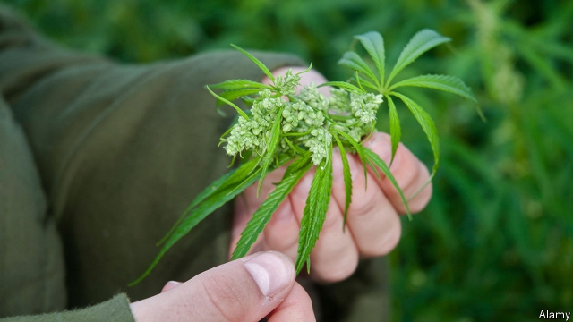

###### A budding trade

# Industrial cannabis is booming in China 

##### Hemp stocks reach an all-time high 

 

> Apr 4th 2019 

THE HEMP plant has a storied history in China. It was probably twisted into the world’s first rope there around 2,800BC. In the West you find it in cigarette paper and Bible pages. In the East, it is woven into uniforms of the People’s Liberation Army (PLA). Since its cooler sister, marijuana, became legal for recreational use in Canada and many American states last year, industrial-use hemp—a variety of cannabis that contains trivial amounts of weed’s mind-altering substance, THC—is flourishing in a country that until a few years ago banned its cultivation outright and where cannabis traffickers can face the death penalty. 

China grows nearly half the world’s legal hemp. In 2018 sales, mostly of textile fibre made from the plant’s stalk, totalled $1.2bn. Now global demand for its seeds, leaves and flowers is surging. Packed with fulsome fatty acids, seeds go into snacks and oil. Leaves and flowers contain cannabidiol (CBD), a non-intoxicating compound that reduces anxiety and inflammation. It is being added as a supplement to food, drinks and cosmetics across the West. In June America approved the first CBD medicine, for epilepsy. 

China’s first licence to extract CBD went to Hanma Investment Group, owner of its largest hemp planter and processor, in January 2017. By next year, estimates New Frontier Data, a cannabis consultancy, Chinese sales of CBD will more than quadruple to $228m. Investors are rushing into the field. A Chinese hemp index tracked since 2018 by Wind Information, a data provider, has more than doubled in value this year. Shares in Shanghai Shunho New Materials Technology, a packaging firm, rose threefold after it received a licence to plant hemp in south-western Yunnan, the first province to lift a national ban in 2010. Shineco, a biotech company whose market capitalisation on New York’s Nasdaq exchange has nearly doubled to $25m since it unveiled a hemp subsidiary last month, plans China’s largest industrial-cannabis project in frosty Heilongjiang. 

That north-eastern province became the second to legalise hemp-growing in 2017, issuing a three-year plan to become the biggest cannabis base in the world by 2020. In its inaugural year, Heilongjiang harvested 30,000 hectares (74,000 acres) of hemp—nearly one-third the size of European and Canadian fields combined. Neighbouring Jilin province, too, will soon earn a licence. 

Chinese growers are already setting their sights farther afield. In December America legalised industrial hemp nationwide for the first time since the second world war. Hanma ships more than half its domestic output there. Tan Xin, chairman of Hanma, says he will begin to grow and process hemp in Nevada later this year. American hemp has higher CBD levels than China permits. 

On March 27th the anti-drugs squad declared that China had never approved industrial cannabis as a medical or food additive; the hemp index briefly drooped. Mr Tan expects China’s government to tighten monitoring, while gradually allowing wider application of the plant’s by-products. Factories in China are also closely monitored with CCTV cameras and workers are subjected to daily urine tests. But Hanma has teamed up with the PLA to develop a CBD-based drug to treat post-traumatic stress. That will be the next chapter in the plant’s long history in China. During the long years of the hemp ban Yunnan’s ethnic minorities continued in secret to harvest leaves, stalks and seeds. Today they can earn farmers 50,000 yuan ($7,400) per hectare, at least twice as much as corn. 

-- 

 单词注释:

1.cannabis['kænәbis]:n. 大麻 [化] 大麻 

2.hemp[hemp]:n. 大麻烟卷, 大麻, 麻类植物 [医] 大麻 

3.APR[]:[计] 替换通路再试器 

4.hemp[hemp]:n. 大麻烟卷, 大麻, 麻类植物 [医] 大麻 

5.storied['stɒ:rid]:a. 传说上有名的, 以历史画装饰的, 分层的 

6.PLA[]:中国人民解放军 [计] 可编程序逻辑阵列 

7.marijuana[.mæriju'ɑ:nә]:n. 大麻 [医] 大麻 

8.recreational[.rekri'eiʃәnәl]:a. 消遣的, 娱乐的 

9.trivial['tiviәl]:a. 琐碎的, 不重要的, 轻微的, 平常的 

10.cultivation[.kʌlti'veiʃәn]:n. 教化, 培养, 耕作 [医] 培养[法] 

11.outright['autrait]:a. 率直的, 完全的, 总共的, 直率的 adv. 完全地, 率直地, 立刻地, 一直向前 

12.trafficker['træfikә]:n. 商人, 贩子 [法] 贩卖者, 买卖者, 商人 

13.penalty['penәlti]:n. 处罚, 刑罚, 罚款, 罚球, 报应, 不利结果, 妨碍 [经] 罚金(款), 违约金 

14.hemp[hemp]:n. 大麻烟卷, 大麻, 麻类植物 [医] 大麻 

15.stalk[stɒ:k]:n. 茎, 追踪, 高视阔步 vi. 悄悄靠近, 蹑手蹑脚地走近, 蔓延, 高视阔步 vt. 追踪, 搜索 

16.surge[sә:dʒ]:n. 巨涌, 汹涌, 澎湃 vi. 汹涌, 澎湃, 颠簸, 猛冲, 突然放松 vt. 使汹涌奔腾, 急放 [计] 电压尖峰 

17.fulsome['fulsәm]:a. 过度的, 过分的, 令人生厌的 

18.fatty['fæti]:a. 肥胖的, 脂肪的, 含脂肪的 [医] 脂肪的 

19.cannabidiol[]:[化] 大麻二酚 [医] 大麻二酚 

20.cbd[]:abbr. 交货前付款（Cash Before Delivery）；业务中心地区（Central Business District） 

21.inflammation[.inflә'meiʃәn]:n. 怒火, 发火, 燃烧, 发炎 [医] 炎[症] 

22.cosmetic[kɒz'metik]:n. 化妆品 a. 化妆用的 

23.epilepsy['epilepsi]:n. 癫痫症 [医] 癫痫(羊痫疯) 

24.extract[ik'strækt]:n. 榨出物, 精汁, 摘录, 选段 vt. (费力地)取出, 采掘, 榨取, 摘录, 吸取 [计] 提取 

25.planter['plæntә]:n. 种植者, 耕作者, 种植机, 花盆 

26.processor[prә'sesә]:n. 信息处理机, 加工者, 处理者 [计] 处理器 

27.datum['deitәm]:n. 论据, 材料, 资料, 已知数 [医] 材料, 资料, 论据 

28.consultancy[]:n. 商量, 协商, 磋商, 会诊, 与...商量, 咨询, 请教, 找(医生)看病, 查阅, 考虑 [经] 咨询业务, 咨询服务 

29.quadruple['kwɒdrupl]:a. 四倍的, 四重的, 四部分组成的 n. 四倍 vt. 使成四倍 vi. 成为四倍 

30.investor[in'vestә]:n. 投资者 [经] 投资者 

31.provider[prә'vaidә]:n. 供应者, 供养人, 伙食承办人 [计] 提供器 

32.packaging['pækidʒiŋ]:n. 包装, 包装业, 包装术 [计] 组装; 封装 

33.threefold['θri:fәuld]:a. 三倍的, 三重的 adv. 三倍地, 三重地 

34.yunnan['ju:n'næn]:n. 云南（中国西南部一省） 

35.biotech['baɪəʊtek]:n. 生物技术 

36.capitalisation[,kæpitәlai'zeiʃən;-li'z-]:n. <主英>=capitalization 

37.nasdaq['næz,dæk]:abbr. 全国证券交易商自动报价系统协会（National Association of Securities Dealers Automated Quotation） 

38.unveil[.ʌn'veil]:vt. 揭开, 揭幕, 除去...的面纱 vi. 显露, 除去面纱 

39.subsidiary[sәb'sidiәri]:n. 子公司, 附件, 辅助者 a. 辅助的, 次要的, 津贴的 

40.frosty['frɒsti]:a. 霜冻的, 严寒的, 冷淡的 

41.Heilongjiang['hei'ljŋ'dʒjɑ:ŋ]:黑龙江(位于中国东北地区北部) 

42.legalise['li:^әlaiz]:vt. 使合法化, 使成为法定, 法律上认可 

43.inaugural[i'nɒ:gjurәl]:a. 就任的, 开幕的 n. 就职演讲 

44.hectare['hektɑ:]:n. 公顷 [经] 公顷 

45.Jilin['dʒi:'lin]:吉林(位于中国东北地区中部) 

46.grower['grәuә]:n. 栽培者, 生长物 

47.afield[ә'fi:ld]:adv. 离开着, 偏离着, 在战场上 

48.xin[]:n. 兴宁（城市名） 

49.Nevada[ni'vædә]:n. 内华达 

50.squad[skwɒd]:n. 班, 小队, 小集团 vt. 编成班 

51.additive['æditiv]:a. 添加的, 附加的, 加法的, 累积的 n. 添加物 

52.briefly['brifli]:adv. 简短地, 扼要地, 简明地, 简单地 

53.droop[dru:p]:vi. 下垂, 消沉 vt. 使下垂 n. 低垂, 消沉 

54.tighten['taitn]:vt. 勒紧, 使变紧 vi. 变紧, 绷紧 

55.CCTV[]:[计] 闭路电视 

56.urine['juәrin]:n. 小便, 尿 [医] 尿 

57.ethnic['eθnik]:a. 人种的, 种族的 [医] 人种的 

