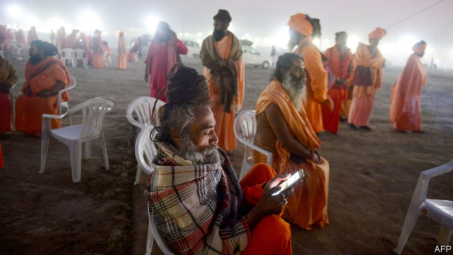

###### Hotstar wars

# Netflix, Amazon and Disney fight for India’s online audience 

##### The streaming giants are having trouble getting Indians to pay for content 

 

> Apr 6th 2019 

ON A TYPICAL night in India the family television set might be tuned to one of countless dowdy soap operas. The dramas play out over hundreds of episodes; strict broadcast standards on sex and violence mean they rarely sizzle. It is either that, or reality TV and game shows. “Mind-numbing” is how one entertainment executive describes it. 

Flipping channels is no longer Indian TV-lovers’ only option, however. Hundreds of millions watch videos on their phones, on crowded commutes, at home in the evening, or (whisper it) at work—often free of charge. Netflix, Amazon and Disney, as well as local streaming rivals, now want to get Indians to pay to watch shows that look a lot like those in America and Europe—edgier, sexier, funnier. 

Until 2016 widespread mobile streaming seemed as outlandish as a Bollywood script. No one but the wealthiest Indians could afford that much mobile data. Then Reliance Jio, an upstart telecoms firm, started a price war, which rages on. The 300m smartphones on which Indians watch video today outnumber India’s 200m TV-owning households. As Sanjay Gupta, who runs Disney’s direct-to-consumer operations in India puts it, “there’s a second and third TV in every home.” 

The boom in cheap mobile broadband has fuelled another in Hollywood-style programming. Netflix, Amazon and Disney (which owns Hotstar, India’s leading streaming platform) are investing hundreds of millions of dollars. Production budgets have swelled, luring Bollywood stars, as well as consultants from Hollywood, Tel Aviv and other entertainment hubs. Hotstar is putting out Indian reprises of hit British programmes such as “Criminal Justice” and “The Office” at an estimated production cost of $100,000-300,000 an hour, compared with less than $30,000 for those dowdy soaps. Netflix, which last year released its first Indian original show, “Sacred Games”, and Amazon have splurged closer to $1m for an hour. 

India’s allure is understandable. Besides being populous and fast-growing, it lacks quality home-grown cable television like HBO or Showtime against which new content providers must compete. “We never made our ‘Sopranos’,” says Sameer Nair, boss of Applause Entertainment, which produces “The Office”and “Criminal Justice” (scheduled to debut on April 5th). 

However, in America $10 a month for Netflix is a steal next to an $80 monthly cable bill. India, where households can already enjoy 300 TV channels for $3-4 a month, is the other way around. Netflix costs twice as much. Media Partners Asia, a research firm, estimates the American streaming giant has just 1m subscribers in India out of its 139m subscribers worldwide. To boost that count it recently introduced half-price mobile-only offers for 250 rupees ($3.65) per month. 

That may not be cheap enough. Amazon charges just 999 rupees a year for its Prime subscriptions, which include free shipping for purchases with the e-commerce behemoth as well as films and TV shows. Hotstar VIP, Disney’s new service which bundles sports and programmes like “Criminal Justice”, costs 365 rupees a year. Mr Gupta says he hopes to spend close to $300m on original programming within a year. He would love to convert some of the 150m monthly viewers who tune in to such fare as big cricket matches, which Jio throws in with its mobile service at no additional cost, into fully fledged subscribers. Hotstar is eyeing 100m or more subscribers, not just 5m or 10m, he says. Stay tuned for a sequel to Jio’s price war. 

-- 

 单词注释:

1.netflix[]:n. 全球十大视频网站中唯一收费站点 

2.amazon['æmәzɒn]:n. 亚马孙河 [医] 无乳腺者 

3.Disney['dizni]:n. 迪斯尼 

4.online[]:[计] 联机 

5.APR[]:[计] 替换通路再试器 

6.countless['kauntlis]:a. 数不尽的, 无数的 

7.dowdy['daudi]:a. 过时的, 懒散的 n. 懒散女人, 邋遢女人 

8.sizzle['sizl]:vi. 发出嘶嘶声 vt. 烧灼 n. 咝咝声 

9.flip[flip]:vt. 掷, 弹, 轻击, 空翻 vi. 用指轻弹, 抽打, 蹦跳 n. 抛, 弹, 筋斗 a. 无礼的 [计] 翻转 

10.commute[kә'mju:t]:vt. 交换, 折偿, 减轻 vi. 代偿, 经常乘车来往 

11.sexy['seksi]:a. 有性感的, 色情的 

12.outlandish[aut'lændiʃ]:a. 外国气派的, 偏僻的, 古怪的 

13.bollywood[]:n. 宝莱坞（位于印度孟买的电影制作中心） 

14.script[skript]:n. 手迹, 手稿, 正本, 手写体 vt. 改编为演出本 [计] 手写体, 小型程序 

15.datum['deitәm]:n. 论据, 材料, 资料, 已知数 [医] 材料, 资料, 论据 

16.JIO[]:Joint Information Officer 联合信息官 

17.upstart['ʌpstɑ:t]:n. 新贵, 暴发户, 自命不凡者 a. 暴富的 

18.telecom['telәkɔm]:telecommunication 电信 

19.smartphones[]: 智能手机（smartphone的复数） 

20.outnumber[.aut'nʌmbә]:vt. 数目超过, 比...多 

21.Sanjay[]:n. 桑杰（男子名） 

22.Gupta[]:n. (Gupta)人名；(德、意、印、孟、尼)古普塔 笈多 

23.broadband['brɔ:dbænd]:[计] 宽带 

24.lure[luә]:n. 饵, 诱惑 vt. 引诱, 诱惑 

25.Hollywood['hɔliwud]:n. 好莱坞, 美国电影界, 美国电影工业, 美国式电影 

26.tel[tel]:abbr. 试验仪器清单（Test Equipment List） 

27.Aviv[ɑ:'viv]:n. 大自然的重生 n. (Aviv)人名；(俄)阿维夫 

28.hub[hʌb]:n. 毂, 木片, 中心 [计] 插座; 插孔; 集线器, 集中器, 连接器, 中继站 

29.reprise[ri'praiz]:n. 年金, 重演, 重复 vt. 重演, 重奏 

30.les[lei]:abbr. 发射脱离系统（Launch Escape System） 

31.splurge[splә:dʒ]:n. 炫耀, 夸示 vi. 炫耀, 卖弄, 挥霍 vt. 挥霍 

32.allure[ә'luә]:vt. 引诱, 吸引 n. 魅力, 诱惑力 

33.understandable[.ʌndә'stændәbl]:a. 可以理解的 

34.populous['pɒpjulәs]:a. 人口多的, 人口稠密的 

35.hbo[]:abbr. 家庭影院（Home Box Office）；美国家庭电影院 

36.showtime['ʃәutaim]:n. 好戏上演；（电视等的）节目播放时间 

37.provider[prә'vaidә]:n. 供应者, 供养人, 伙食承办人 [计] 提供器 

38.sameer[seɪm]:a. [the same]同一的；[the same]相同的,同样的 adv. [the same]同样地,一样地 pron. [the  same或指示代词]同一个人；同一个物；同样的事物 

39.nair['nɑ:iә]:耐尔（一种检验法）；印度水獭 

40.debut['deibju:]:n. 初次登台, 开张 v. 初次登台 

41.subscriber[sʌbs'kraibә]:n. 签署者, 捐献者, 订户 [经] 定户 

42.rupee[ru:'pi:]:n. 卢比(印、巴等国货币单位) 

43.subscription[sәb'skripʃәn]:n. 捐献, 订金, 订阅, 签署, 同意 [化] 订购 

44.behemoth[bi'hi:mɔθ]:n. 庞然大物 

45.VIP[]:n. 要人, 大人物 [化] 血管活性肠肽 

46.fully['fuli]:adv. 十分地, 完全地, 充分地 

47.fledge[fledʒ]:vt. 喂养, 用羽毛盖上, 装上羽毛 vi. 长羽毛 

48.sequel['si:kwәl]:n. 继续, 续集, 后果 [计] 结构的英语查询语言 

