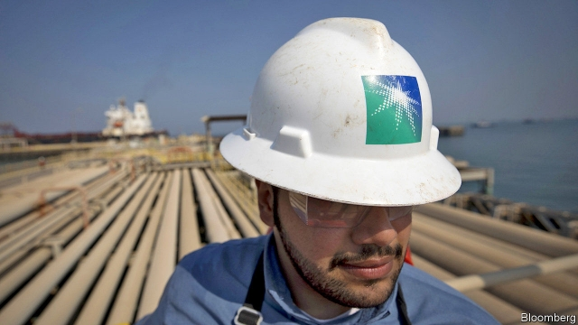
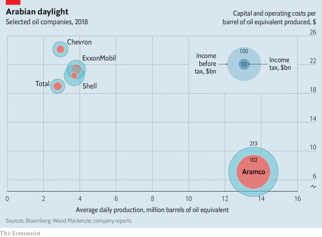

###### Open Sesame

# Saudi Aramco made a $111bn profit in 2018 

##### A look inside its books also reveals constraints on Saudi Arabia’s oil colossus 

 

> Apr 6th 2019 

FOR YEARS investors dreamed of peering into the books of Saudi Aramco, the oil colossus wholly owned by Saudi Arabia. On April 1st they got their wish. A 469-page bond prospectus revealed $111bn in net income last year, more than the five oil majors—Royal Dutch Shell, ExxonMobil, Chevron, Total and BP—managed combined. The document also highlighted Aramco’s constraints. 

Like rivals, it faces swinging oil prices and uncertain long-term demand. The bond will help finance the acquisition of 70% of SABIC, a petrochemical company, from the kingdom’s sovereign wealth fund, for $69bn. This will diversify Aramco’s revenues—and give the state cash to invest in sectors beyond oil (especially now that a planned listing of 5% of Aramco’s shares has been postponed). 

 

Aramco looks better prepared than rivals for a less fossil-hungry future. It is less indebted and produces roughly four times as much oil, at about one-third the cost per barrel (see chart). Yet Aramco also bears an unusual burden. In 2018 it paid Saudi income tax of $102bn, more than the combined profits of Apple and Samsung, the world’s most profitable listed firms. That is on top of royalties of $56bn and a dividend of $58bn. Credit raters at Fitch note that taxes limit Aramco’s funds flow from operations, a measure of profitability, to $26 a barrel, less than Shell’s $38 or Total’s $31. Ghawar, a giant field, was believed by some to pump 5m barrels a day, but only manages 3.8m. Fitch and Moody’s, another agency, rated Aramco A+ and A1, respectively—below ExxonMobil, Shell or Total. 

-- 

 单词注释:

1.sesame['sesәmi]:n. 芝麻 [医] 芝麻, 脂麻, 胡麻 

2.saudi['sajdi]:a. 沙乌地阿拉伯（人或语）的 

3.aramco[]:abbr. 沙特阿美石油公司（Arabian-American Oil Company） 

4.constraint[kәn'streint]:n. 强制, 约束 [计] 约束 

5.colossus[kә'lɒsәs]:n. 巨像, 巨人 

6.APR[]:[计] 替换通路再试器 

7.investor[in'vestә]:n. 投资者 [经] 投资者 

8.peer[piә]:n. 同等的人, 匹敌, 贵族 vi. 凝视, 窥视, 费力地看, 隐现 vt. 与...同等, 封为贵族 

9.Arabia[ә'reibiә]:n. 阿拉伯半岛 

10.prospectus[prәs'pektәs]:n. 创办计划书, (内容)说明书, 内容简介 [经] (募债)说明书 

11.Dutch[dʌtʃ]:n. 荷兰人, 荷兰语 a. 荷兰的 

12.exxonmobil[]:n. 埃克森美孚国际公司 

13.chevron['ʃevrәn]:n. V形袖章, 锯齿形花饰 [计] 人字形 

14.SABIC[]:[网络] 沙特基础工业公司(Saudi Basic Industries Corporation)；沙特基础工业(Saudi Basic Industries Corp)；沙特阿拉伯 

15.petrochemical[.petrәu'kemikәl]:a. 石化的, 石化制品的, 岩石化学的 n. 石化产品 

16.sovereign['sɒvrin]:n. 元首, 独立国 a. 具有主权的, 至高无上的, 国王的, 完全的 

17.diversify[dai'vә:sifai]:vt. 使多样化, 使变化 

18.sector['sektә]:n. 扇形, 部门, 部分, 函数尺, 象限仪, 段, 区段 vt. 把...分成扇形 [计] 扇面; 扇区; 段; 区段 

19.les[lei]:abbr. 发射脱离系统（Launch Escape System） 

20.indebted[in'detid]:a. 负债的, 受惠的 [法] 负债的, 法律上有义务偿还的 

21.samsung[]:n. 三星电子（韩国电子公司） 

22.royalty['rɒiәlti]:n. 皇室, 王族成员, 王权, 特权阶层, 庄严 [经] 特许权, 使用费, 使用税 

23.dividend['dividend]:n. 被除数, 股利 [计] 被除数 

24.rater['reitә]:n. 定价人 

25.fitch[fitʃ]:n. 艾鼬, 艾鼬毛皮 

26.profitability[.prɒfitә'biliti]:n. 收益性, 利益率 [经] 可获利润率 

27.ghawar[]:[网络] 加瓦尔；油田加瓦尔；加瓦尔油田 

