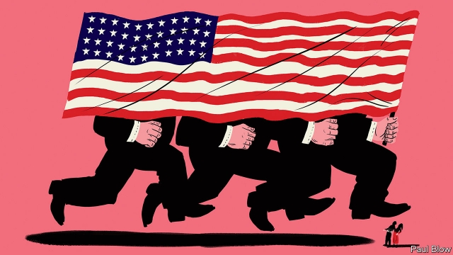

###### Corporate crises

# Scandals suggest standards have slipped in corporate America 

##### Boeing, Goldman Sachs and Facebook are among the companies in hot water 

 

> Apr 4th 2019 

TWO THINGS stand out about business in America today. One is how successful American firms are: they account for 57 of the world’s 100 most valuable listed firms. The other is the bad smell hanging over a number of powerful companies. 

Boeing faces claims that it sold 737 MAX planes with dangerous software. It says it is “taking actions to fully ensure the safety of the 737 MAX”. Criminal charges have been filed against Goldman Sachs in Malaysia for its role in arranging $6.5bn of debt for a state-run fund that engaged in fraud. Goldman says it is co-operating with investigators. A jury in California has just found that Monsanto failed to warn a customer that its weedkiller could, allegedly, cause cancer. Bayer, a German firm which bought Monsanto in June, says it will appeal the verdict. 

Wells Fargo, one of America’s biggest banks, has admitted creating 3.5m unauthorised bank accounts. It says it is working to “rebuild trust with our stakeholders”. Facebook is ensnared in scandals; its data practices have come under scrutiny in several countries. The firm says “we need a more active role for governments and regulators” (see article). Some 146m customers of Equifax, a credit-scoring firm, had their personal details stolen in 2017. It is being sued for negligence, according to its annual report. A recent document for its investors says protecting information is “our highest priority”. 

Then there is the opioid epidemic, which involves not only Purdue Pharma, the maker of OxyContin, but also, according to a lawsuit by New York’s attorney-general, other firms including McKesson and Johnson & Johnson. Purdue says it is “deeply concerned” about opioid addiction. Last year McKesson also said it is “deeply concerned” by the epidemic and that its board has “enhanced oversight procedures related to opioid distribution”. Johnson & Johnson says it is “committed to ensuring its medicines are used correctly”. 

It is tempting to view these cases as unrelated events caused by factors ranging from bad luck and human error to negligence and criminality. That would be a mistake. American firms seem to be more scandal-prone than their peers across the pond. The total market value of American firms involved in big incidents that have become public since 2016 is $1.54trn. At least 200m consumers have been affected. The figures are only $600bn and under 30m for European firms, including carmakers that faked emissions tests and Nordic banks involved in money-laundering. 

America is no stranger to corporate scandals. In the 19th century abattoirs sold rotten meat. In the 1960s Detroit made cars that were “unsafe at any speed”, in the words of Ralph Nader, a consumer-rights crusader. In the 1990s tobacco and asbestos claims led to legal settlements that have cost shareholders over $150bn. Accounting scandals erupted at WorldCom, Enron and Tyco in the early 2000s, and by the mid-2000s mortgage fraud was endemic. 

Today’s crises are diverse but have common elements. The firms tend to be established, with dominant market positions. Outrage infuses social media and Congress. And yet the financial cost has been limited. Take a sample of ten big American listed firms involved in controversial episodes: their median share price has lagged behind the stockmarket by a bearable 11% since the event, after adjusting for dividends. Although Boeing’s shares have lost 8% since the crash in Ethiopia, they are above their level in January. 

The crises have caused bosses to stand down in only two of the ten cases: Wells Fargo and Equifax. Some adjustments to bosses’ pay have been made. Goldman says that some ex-executives’ share awards could be clawed back depending on the probe into the Malaysia incident. Equifax says cyber-security is now factored into its pay schemes. Nonetheless, for the ten firms the total pool of senior executive pay has risen over the four most recent years, to almost $600m, according to Bloomberg. 

For critics of capitalism none of this will be a surprise. They argue that firms controlled by private shareholders are especially unethical. Yet it is easy to poke holes in this. Volkwagen cheated on emissions tests even though it is part-owned by the German state and has workers on its board. Despite Sweden’s cuddly “stakeholder” capitalism, Swedbank faces a criminal investigation for money-laundering. 

An alternative explanation is that American capitalism has got out of kilter. It has always been restless and dynamic. Companies test the boundaries of what is possible—and permissible. Tech firms are just the latest to “move fast and break things”, to use Facebook’s unofficial slogan. But three forces have long constrained corporate conduct: regulation, litigation and competition. The aftermath of the financial crisis saw a storm of lawsuits and fines on banks. But since then each of the three forces may have weakened, increasing the incentive for firms to take risks. 

Take regulation first. The system is a strange blend: there are pockets of laissez-faire attitudes here, thickets of rules there and lobbying everywhere. It is variously prone to laxity, capture and incompetence. The Federal Drug Administration allowed opioids to be sold to the masses. The Federal Aviation Administration delegated part of its inspection process to Boeing employees. The Federal Trade Commission has struggled to police Facebook. The fines imposed by some regulators can be small relative to market values of giant firms. 

Second, litigation may no longer be quite the deterrent it once was. Criminal cases leading to jail terms for top executives are as rare as socialists at Goldman Sachs. And civil law has lost its bite. America has long used class-action suits to punish firms and compensate consumers. Tort costs born by firms are equivalent to about 2% of GDP a year, higher than in other countries. Nonetheless, life has got easier for firms. Arbitration clauses, in which customers and staff forfeit the right to pursue class actions, have become more common. Firms are more likely to extend cases to appeal, which can take up to a decade. One veteran class-action lawyer says that financial penalties have shrunk relative to the value of many firms, which in turn have risen as a result of a takeover wave. She complains that for the top 50 firms, the threat of a multi-billion-dollar legal settlement “doesn’t move the needle any more”. 

The final constraint is competition. It can drive firms to cut corners but in the long run should act to discipline careless or badly behaved firms, because customers shun them. Kraft and Heinz boomed in the 20th century, thanks in part to a reputation for safety. Japanese car firms forced Detroit to raise its game in the 1980s. And today Netflix trounces the traditional cable TV firms which love to bamboozle customers. 

But across the economy incumbent firms have got more powerful over the past 20 years, making it harder for customers to switch. There is one alternative to Boeing, Airbus, but it lacks spare capacity. Users find it hard to leave Facebook. Pesticides and herbicides, credit-checking, drug distribution and drug retailing have grown more concentrated, too. Perhaps the rash of crises will prompt corporate soul-searching. If not, public confidence in capitalism may suffer another blow. 

-- 

 单词注释:

1.corporate['kɒ:pәrit]:a. 社团的, 合伙的, 公司的 [经] 团体的, 法人的, 社团的 

2.corporate['kɒ:pәrit]:a. 社团的, 合伙的, 公司的 [经] 团体的, 法人的, 社团的 

3.boe[bəu]:abbr. back outlet eccentric 后偏心（轮）出口 

4.goldman[]:n. 高曼（姓氏） 

5.Sachs[zaks]:n. 萨克斯（汽车零配件生产厂商） 

6.facebook[]:n. 脸谱网 

7.APR[]:[计] 替换通路再试器 

8.MAX[mæks]:[计] 最大 

9.fully['fuli]:adv. 十分地, 完全地, 充分地 

10.Malaysia[mә'leiziә]:n. 马来西亚 [经] 马来西亚 

11.fraud[frɒ:d]:n. 欺骗, 欺诈, 诡计, 骗子 [经] 欺诈, 舞弊, 骗子 

12.investigator[in'vestigeitә]:n. 调查者, 审查者 [法] 审查员, 侦查员, 调查员 

13.California[.kæli'fɒ:njә]:n. 加利福尼亚 

14.monsanto[]:n. 孟山都公司（美国著名农业生化公司） 

15.weedkiller[ˈwi:dkɪlə(r)]:n. 除莠剂; 除草剂 

16.allegedly[ә'ledʒidli]:adv. 依其申述 

17.baye[]: [地名] [毛里塔尼亚] 巴伊 

18.verdict['vә:dikt]:n. 裁决, 判决, 判断性意见, 定论, 结论 [法] 定论, 判断, 意见 

19.fargo['fɑ:ɡəu]:n. 法戈（美国北达科他州东南部城市） 

20.unauthorised[ʌn'ɔ:θəraizd]:a. 无权的（等于unauthorized） 

21.stakeholder['steikhәuldә]:n. 赌金保管者 [法] 赌款保存人, 保存保证金的人 

22.ensnare[in'snєә]:vt. 以陷阱捕捉, 诱入圈套, 诱捕 

23.datum['deitәm]:n. 论据, 材料, 资料, 已知数 [医] 材料, 资料, 论据 

24.scrutiny['skru:tini]:n. 细看, 仔细检查, 监视, 选票检查 [经] 复查, 评核, 仔细检查 

25.regulator['regjuleitә]:n. 调整者, 校准者, 校准器, 调整器, 标准钟 [化] 调节剂; 调节器 

26.equifax[]:[网络] 可飞；艾可飞；可飞公司 

27.sue[su:]:vt. 控告, 起诉, 请求 vi. 提出诉讼, 提出请求 

28.negligence['neglidʒәns]:n. 疏忽, 粗心大意, 忽视 [经] 疏忽, 过失 

29.investor[in'vestә]:n. 投资者 [经] 投资者 

30.opioid[əʊ'pi:əʊɪd]:a. 类鸦片（引起）的 n. 类鸦片活性肽 

31.epidemic[.epi'demik]:n. 传染病, 流行病 a. 流行的, 传染性的 

32.purdue[]:n. 普杜大学（美国一所大学） 

33.pharma[]:n. 制药公司 

34.maker['meikә]:n. 制造者, 上帝 [经] 制造者, 出票人 

35.oxycontin[]: [医]盐酸羟考酮控释片剂<镇痛药> 

36.lawsuit['lɒ:sju:t]:n. 诉讼 [法] 诉讼, 诉讼案件 

37.mckesson[]: [人名] 麦克森 

38.johnson['dʒɔnsn]:n. 约翰逊（姓氏） 

39.addiction[ә'dikʃәn]:n. 入迷, 瘾 [医] 瘾, 癖嗜 

40.oversight['әuvәsait]:n. 勘漏, 失察, 失败, 照料 [经] 监督权 

41.correctly[kә'rektli]:adv. 对, 正确, 恰当, 符合一般性准则, 符合行为准则, 端正, 符合 

42.unrelated[]:[法] 无关的 

43.criminality[.krimi'næliti]:n. 犯罪, 有罪, 犯罪行为 [法] 有罪, 犯罪行为, 犯罪性 

44.peer[piә]:n. 同等的人, 匹敌, 贵族 vi. 凝视, 窥视, 费力地看, 隐现 vt. 与...同等, 封为贵族 

45.carmaker['kɑ:,meikә(r)]:n. 汽车制造商 

46.fake[feik]:n. 假货, 欺骗, 诡计 a. 假的 vt. 假造, 仿造 vi. 伪装 

47.emission[i'miʃәn]:n. 发射, 射出, 发行 [医] 发射, 遗精 

48.Nordic['nɒ:dik]:n. 北欧人, 日耳曼民族, 北欧两项滑雪 a. 北欧人的, 日耳曼民族的, 北欧两项滑雪的 

49.abattoir['æbәtwɑ:]:n. 屠场, 角斗场 [医] 屠宰场 

50.Detroit[di'trɒit]:n. 底特律(美国城市) 

51.Ralph[reif, rælf]:n. 拉尔夫（男子名） 

52.nader[]:n. 内德（姓氏） 

53.crusader[kru:'seidә]:n. 十字军战士, 改革者 

54.asbestos[æs'bestɒs]:n. 石棉 [化] 石棉 

55.shareholder['ʃєә.hәuldә]:n. 股东 [法] 股东, 股票持有人 

56.worldcom[]:abbr. World Communications Inc. 世界通信公司[美国]; [计]= WORLD COMmunications Inc.，世界通信有限公司 

57.enron[]:n. 安然公司（财富500强公司之一） 

58.tyco[]:[网络] 泰科；美国泰科；泰科电子 

59.mortgage['mɒ:gidʒ]:n. 抵押, 约束性义务, 抵押借款 vt. 抵押, 以...作担保, 把...许给 

60.endemic[en'demik]:n. 地方病 a. 某地(或某些人中)流行的, 地方的 

61.dominant['dɒminәnt]:a. 占优势的, 支配的 [医] 优性的, 显性的 

62.outrage['autreidʒ]:n. 暴行, 侮辱, 愤怒 vt. 凌辱, 虐待, 触犯 

63.infuse[in'fju:z]:vt. 注入, 使充满, 泡制, 鼓舞 vi. 泡 

64.median['mi:diәn]:a. 中央的, 中间的, 正中的 n. 正中动脉, 中位数, 中线 

65.stockmarket[s'tɒkmɑ:kɪt]: 证券市场; 证券交易所; 证券行情 

66.bearable['bєәrәbl]:a. 可忍受的, 支承得住的 

67.dividend['dividend]:n. 被除数, 股利 [计] 被除数 

68.Ethiopia[.i:θi'әupiә]:n. 埃塞俄比亚 

69.probe[prәub]:n. 探索, 调查, 探针, 探测器 v. 用探针探测, 调查, 探索 

70.factore[]:[网络] 行纪；主轴转速 

71.nonetheless[,nʌnðә'les]:conj. 然而, 尽管, 不过 adv. 不过, 仍然, 尽管如此, 然而 

72.bloomberg[]: [人名] 布隆伯格 

73.capitalism['kæpitәlizәm]:n. 资本主义 [经] 资本主义 

74.unethical[]:a. 不道德的 

75.volkwagen[]:[网络] 褔士 

76.cuddly['kʌdli]:a. 可爱的, 适于搂抱的, 喜欢拥抱的, 可拥抱的 

77.kilter['kiltә]:n. 良好状态, 顺利, 平衡 

78.alway['ɔ:lwei]:adv. 永远；总是（等于always） 

79.permissible[pә'misәbl]:a. 可允许的, 可容许程度的 [机] 容许, 允许 

80.tech[tek]:n. 技术学院或学校 

81.unofficial[.ʌnә'fiʃәl]:a. 非正式的, 非官方的 [化] 非法定的; 未入药典的 

82.constrain[kәn'strein]:vt. 强迫, 限制, 关押 

83.litigation[.liti'geiʃәn]:n. 诉讼, 起诉 [经] 诉讼, 纠葛 

84.aftermath['ɑ:ftәmæθ]:n. 结果, 后果 [法] 后果, 结果 

85.incentive[in'sentiv]:n. 动机 a. 激励的 

86.thicket['θikit]:n. 丛林, 草丛 

87.lobby['lɒbi]:n. 大厅, 休息室, 游说议员者 vi. 游说议员, 游说 vt. 游说 

88.variously['veәriәsli]:adv. 各种各样, 种种, 不同, 多方面, 多才多艺, 许多, 各个, 个别, 杂色, 彩色 

89.prone[prәun]:a. 俯伏的, 面向下的, 有...倾向的 [医] 旋前的, 伏的, 俯的 

90.laxity['læksәti]:n. 松弛, 不检点 [医] 松驰, 无紧张 

91.incompetence[in'kɔmpitәns]:n. 不胜任, 不够格, 不合格, 不适合, 无能力, 不熟练, 无资格 [医] 机能不全, 闭锁不全, 关闭不全 

92.deterrent[di'tә:rәnt]:a. 制止的, 威慑的, 遏制的 n. 威慑力量(或因素), 制止物 

93.tort[tɒ:t]:n. 民事侵权行为 [经] 侵犯行为(不包括违约), 非法行为 

94.arbitration[.ɑ:bi'treiʃәn]:n. 仲裁, 公断 [计] 仲裁 

95.clause[klɒ:z]:n. 子句, 条款 [计] 子句 

96.forfeit['fɒ:fit]:n. 没收物, 罚金, 丧失 vt. 没收, 丧失 a. 丧失了的 

97.penalty['penәlti]:n. 处罚, 刑罚, 罚款, 罚球, 报应, 不利结果, 妨碍 [经] 罚金(款), 违约金 

98.takeover[]:n. 接管, 接收 [经] 接收 

99.constraint[kәn'streint]:n. 强制, 约束 [计] 约束 

100.shun[ʃʌn]:vt. 避开, 规避, 避免 

101.kraft[krɑ:ft]:n. 牛皮纸 

102.heinz[]:n. 海因茨（姓氏）；亨氏食品公司（世界著名的食品供应商, 主要产品包括调味品和餐食两大类） 

103.netflix[]:n. 全球十大视频网站中唯一收费站点 

104.trounce[trauns]:vt. 痛打, 严惩 

105.bamboozle[bæm'bu:zl]:vt. 欺骗, 迷惑 

106.incumbent[in'kʌmbәnt]:a. 现任的, 依靠的, 负有义务的 n. 领圣俸者, 在职者 

107.airbus['eәbʌs]:空中客车 

108.pesticide['pestisaid]:n. 杀虫剂 [化] 农药 

109.herbicide['hә:bisaid]:n. 除草剂 [化] 除草剂 

110.rash[ræʃ]:a. 轻率的, 匆忙的, 鲁莽的 n. 皮疹 

