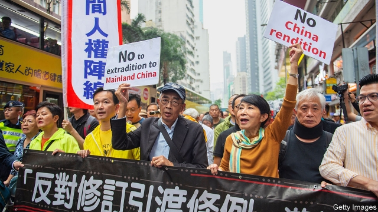

###### Back to the mainland

# A draft bill would allow Hong Kong to hand suspects to China’s police 

##### Could it be used against the Communist Party’s enemies? 

 

> Apr 4th 2019 

“TRUSTING CHINA is like trusting pigs can climb trees!” read one of the many sardonic placards held by protesters. Despite a chilly drizzle, thousands of Hong Kongers rallied at the headquarters of the territory’s government on March 31st. Many chanted slogans denouncing Carrie Lam, Hong Kong’s chief executive. Pro-democracy activists delivered rousing speeches. A little farther out, a gaggle of masked demonstrators waved banners calling for Hong Kong’s independence. 

The demonstration was about a bill that, for the first time since Hong Kong’s return to Chinese rule in 1997, would allow the extradition of criminal suspects from the territory to China’s mainland. On April 3rd a draft was presented to Hong Kong’s legislature, which is all but certain to approve it. By China’s design, pro-establishment lawmakers have a majority. 

Under their “one country, two systems” arrangement, Hong Kong and the mainland are separate jurisdictions. The territory has concluded its own extradition deals with 20 other countries, including America, Britain, Canada and Germany. But Hong Kong’s law on the surrender of fugitives, which was passed shortly before the handover, in effect prohibited the handing over of suspects to the mainland by specifying that the legislation does not apply to “any part” (later amended to “any other part”) of China. The new bill would scrap this exclusion. Johannes Chan of the University of Hong Kong said the omission of China had helped to reassure countries signing extradition deals with Hong Kong that people would not be re-extradited to the mainland. Countries that have done so have been assured that the new bill will not be applied retrospectively. 

China believes that more than 300 fugitives from the mainland are lying low in Hong Kong, a former senior Chinese police official recently told the territory’s public broadcaster, RTHK. Most are suspected of economic crimes such as corruption. But some Hong Kongers worry that Hong Kong’s government, which often bows to the Communist Party’s demands, might use the bill to turn over dissidents and other political troublemakers at the central government’s request. Unlike Hong Kong, the mainland offers the right to a fair trial only in name. The bill does not cover political crimes. Hong Kong may refuse an extradition request if a suspect faces execution. But the party often pursues its enemies by accusing them of non-political offences. 

Anxieties about the bill have been fuelled by China’s apparent frustration with the use of Hong Kong as a safe haven by those it dislikes politically. In 2017 Xiao Jianhua, a Chinese billionaire with close links to powerful families in China, was snatched from Hong Kong by plainclothes agents and taken to the mainland. In 2015 five Hong Kong booksellers mysteriously vanished, only to resurface on the mainland in custody. One of them was abducted from Thailand, another from Hong Kong itself. Their offence was selling gossipy books about Chinese leaders. One of them, Lam Wing-kee, who was detained while crossing the mainland-Hong Kong border and released after months of interrogation, was at the forefront of the protest against the bill (he is pictured, wearing a baseball cap). Mr Lam says he plans to leave Hong Kong before the bill is enacted to avoid being ensnared by it. 

Perhaps to avoid focusing on potentially controversial extraditions to the mainland, Hong Kong’s government justifies the legal change in a roundabout way. In February last year a Hong Konger fled back to the territory after allegedly murdering his girlfriend in Taiwan. Officials in Taiwan want Hong Kong to hand him over. But Hong Kong says it is prevented from doing so by the law’s inapplicability to other parts of China. Hong Kong’s official stance is the same as China’s: that Taiwan is part of the People’s Republic. Alvin Yeung, the leader of the pro-democracy Civic Party, accepts that there is a strong case for extraditing the suspect to Taiwan. But he says there is no need for a legal revision as big as the one proposed; the law, he argues, should merely be tweaked to exclude extraditions to “mainland China.” That would still allow suspects to be sent to Taiwan. 

The proposed bill says that to be eligible for extradition, a suspect must be accused of committing at least one of 37 offences. They include murder, kidnapping and rape. A few relate to white-collar crime. Hong Kong’s government insists that adequate measures are in place to guard against politically motivated extraditions. Holden Chow, a pro-establishment legislator, says that even if the mainland were to try to secure the extradition of a political offender by accusing that person of a non-political crime, Hong Kong’s courts would be able to find the “disguised motive” and refuse the request. But Mr Chan, the academic, says the burden is on the defendant to prove political intent, which is hard. 

After lobbying by businessmen, the local government agreed on March 26th that the bill would not cover nine crimes that are commonly covered by Hong Kong’s extradition deals. These include tax violations and unlawful use of computers. The government also decided that extraditable offences should only involve those punishable by at least three years in prison instead of just one. That was a relief to some Hong Kongers who feared being handed over for trivial reasons. But many still worry that some extraditable offences are too sweeping, such as crimes “relating to bribery”. 

People in Hong Kong who worry about extraditions to a legal system so lacking in due process have company elsewhere. Only around 40 countries have ratified extradition treaties with China. Very few are rich democracies (France, Italy, Spain and South Korea are exceptions). China Daily, a mainland government mouthpiece, accused critics of the bill of “scaremongering” and said the law would “not be abused in any way”. In a territory where many people have misgivings about Chinese justice, it will be hard to instil confidence. 

-- 

 单词注释:

1.hong[hɔŋ]:n. （中国、日本的）行, 商行 

2.kong[kɔŋ]:n. 含锡砾石下的无矿基岩；钢 

3.APR[]:[计] 替换通路再试器 

4.sardonic[sɑ:'dɒnik]:a. 嘲笑的, 冷笑的, 讥讽的 [医] 痉笑的 

5.placard['plækɑ:d]:n. 公告, 布告, 小牌, 海报 vt. 公布, 布告, 张帖, 贴海报于 

6.protester[]:n. 抗议者, 持异议者, 拒付者 [经] 反对者 

7.chilly['tʃili]:a. 寒冷的, 冷淡的, 不友好的 [建] 番椒, 冷 

8.drizzle['drizl]:n. 细雨 v. 下毛毛雨 

9.rally['ræli]:n. 重振旗鼓, 集合, 群众集会, 跌停回升 v. 重整旗鼓, 集合, 恢复精神, 团结, 挖苦, 嘲笑 

10.headquarter[,hed'kwɔ:tә]:vt. 将...的总部设在 

11.denounce[di'nauns]:vt. 告发, 抨击, 谴责 [法] 谴责, 斥责, 告发 

12.carrie['kæri]:n. 卡丽（女名, Caroline的昵称） 

13.lam[læm]:v. 打, 鞭笞, 逃脱 n. 逃亡 

14.activist['æktivist]:n. 激进主义分子 

15.gaggle['gægl]:n. 鹅群, 一群, 嘎嘎叫声 vi. 嘎嘎地叫 

16.demonstrator['demәnstreitә]:n. 论证者, 证明者, 指示者, 示威者 [医] 示教者 

17.demonstration[.demәn'streiʃәn]:n. 示范, 实证 [医] 示教, 实物教授 

18.extradition[.ekstrә'diʃәn]:n. 引渡逃犯, 亡命者送还本国 [法] 引渡 

19.legislature['ledʒisleitʃә]:n. 立法机关, 议会, 立法院 [法] 立法机构, 立法机关 

20.lawmaker[lɒ:'meikә]:n. 立法者 

21.jurisdiction[.dʒuәris'dikʃәn]:n. 司法权, 审判权, 管辖权 [经] 法律管辖权, 审判权 

22.fugitive['fju:dʒitiv]:a. 逃亡的, 短暂的, 难捉摸的 n. 逃亡者, 亡命者, 难捕捉之物 

23.handover['hændәuvә]:[计] 转移, 转换 

24.amend[ә'mend]:vt. 修改, 改善, 改良 vi. 改过自新 

25.scrap[skræp]:n. 碎片, 残余物, 些微, 片断, 铁屑, 吵架 vt. 扔弃, 敲碎, 拆毁 vi. 互相殴打 a. 零碎拼凑成的, 废弃的 

26.exclusion[ik'sklu:ʒәn]:n. 排除, 除外, 逐出 [医] 排除, 除外, 分离术 

27.Johanne[]:n. (Johanne)人名；(德、丹)约翰妮 

28.chan[]:n. 通道（槽, 沟） 

29.omission[әu'miʃәn]:n. 省略, 遗漏, 疏忽 [化] 省略 

30.reassure[.ri:ә'ʃuә]:vt. 使...安心, 向...再保证 [法] 重新保证, 再保险, 使清除疑虑 

31.retrospectively[ˌretrə'spektɪvlɪ]:adv. 回顾地 

32.broadcaster['brɒ:dkæstә]:n. 播送者, 广播装置, 播种机 

33.RTHK[]:[网络] 香港电台(Radio Television Hong Kong)；香港电台电视部；港台 

34.corruption[kә'rʌpʃәn]:n. 腐败, 堕落, 贪污 [计] 论误 

35.dissident['disidәnt]:a. 意见不同的, 持不同政见的 n. 意见不同的人, 持不同政见者 

36.troublemaker['trʌbl.meikә]:n. 惹麻烦的人 

37.execution[.eksi'kju:ʃәn]:n. 实行, 完成, 执行, 死刑 [计] 执行 

38.frustration[frʌs'treiʃәn]:n. 挫折, 顿挫 [医] 挫折 

39.haven['heivn]:n. 港, 避难所, 安息所 vt. 安置...于港中, 庇护, 入港 

40.politically[]:adv. 政治上 

41.xiao[]:箫 

42.jianhua[]:[网络] 陈建华；江苏；店主 

43.billionaire[.biljә'nєә]:n. 亿万富翁 

44.plainclothe[]:n. 便衣 

45.bookseller['bukselә]:n. 书商 

46.mysteriously[mɪ'stɪərɪəslɪ]:adv. 神秘地; 不可思议地; 诡秘地; 故弄玄虚地 

47.resurface[ri:'sә:fis]:vi. 重铺路面 vi. 重新露面 

48.custody['kʌstәdi]:n. 监护, 拘留, 监禁 [经] 保管, 照顾, 保护 

49.abduct[æb'dʌkt]:vt. 诱拐, 绑架, 使外展 [医] 外展, 展 

50.Thailand['tailәnd]:n. 泰国 

51.gossipy['gɒsipi]:a. 喜饶舌的, 漫谈式的 

52.detain[di'tein]:vt. 扣留, 扣押, 耽搁 [法] 拘留, 扣押, 留住 

53.interrogation[in.terәu'geiʃәn]:n. 审问, 疑问句, 问号 [电] 询问 

54.forefront['fɒ:frʌnt]:n. 最前部, 最前线 

55.enact[i'nækt]:vt. 制定法律, 扮演, 颁布 [法] 法令, 法规, 条例 

56.ensnare[in'snєә]:vt. 以陷阱捕捉, 诱入圈套, 诱捕 

57.potentially[pә'tenʃәli]:adv. 可能地, 潜在地 

58.allegedly[ә'ledʒidli]:adv. 依其申述 

59.girlfriend[]:n. 女朋友 

60.taiwan['tai'wɑ:n]:n. 台湾 

61.inapplicability[ɪnæplɪkə'bɪlɪtɪ]:n. 不适用 

62.stance[stæns]:n. 准备击球姿势, 站立的姿势, 位置, 姿态 [经] 地位, 形势 

63.alvin['ælvin]:[机] 阿尔文 

64.yeung[]:n. 洋扬阳杨（香港的拼音用法） 

65.civic['sivik]:a. 市的, 市民的, 公民的 [法] 公民的, 市民的, 公民资格的 

66.tweak[twi:k]:n. 拧, 扭, 焦急 vt. 扭, 开足马力 

67.eligible['elidʒәbl]:a. 有资格当选的, 合格的 n. 有资格者, 合格者, 适任者 

68.kidnap['kidnæp]:vt. 绑架, 诱拐, 拐骗 [法] 拐带, 诱拐, 绑架 

69.rape[reip]:n. 抢夺, 掠夺, 强奸, 葡萄渣, 芸苔 vt. 掠夺, 抢夺, 强奸 

70.holden['hәuldәn]:v. 留下；抱住；拿住（hold的过去分词） 

71.chow[ʃu:]:n. 食物, 颚 

72.legislator['ledʒisleitә]:n. 立法者, 立法官, 立法委员 [法] 立法者, 立法机关成员, 立法委员 

73.offender[ә'fendә]:n. 罪犯, 无礼的人, 得罪人的人 

74.defendant[di'fendәnt]:n. 被告 [经] 被告方 

75.intent[in'tent]:n. 意图, 含义, 故意 a. 专心的, 决心的, 热心的 

76.lobby['lɒbi]:n. 大厅, 休息室, 游说议员者 vi. 游说议员, 游说 vt. 游说 

77.violation[.vaiә'leiʃәn]:n. 违反, 违背, 妨碍 [法] 违犯, 违背, 违反 

78.unlawful[.ʌn'lɒ:ful]:a. 非法的, 不正当的 [法] 不法, 不法的, 非法的 

79.extraditable['ekstrәdaitәbl]:a. 该引渡的, 可引渡的 [法] 可引渡的, 可引渡逃犯的 

80.punishable['pʌniʃәbl]:a. 该罚的, 可罚的 [法] 该罚的, 可受惩处的 

81.trivial['tiviәl]:a. 琐碎的, 不重要的, 轻微的, 平常的 

82.bribery['braibәri]:n. 贿赂行为, 行贿, 受贿 [经] 行贿, 受贿 

83.ratify['rætifai]:vt. 批准, 认可 [经] 证实, 肯定, 确认 

84.Spain[spein]:n. 西班牙 

85.Korea[kә'riә]:n. 朝鲜, 韩国 

86.mouthpiece['mauθpi:s]:n. 发话筒, 代言人, (电话)送话口 [机] 钳口垫片 

87.scaremonger['skєәmʌŋgә]:n. 散布谣言的人, 危言耸听者 

88.misgiving[mis'^iviŋ]:n. 疑虑, 不安, 害怕, 担扰, 疑惧 

89.instil[in'stil]:vt. 滴注, 逐渐灌输, 不断灌输 [医] 滴注 

