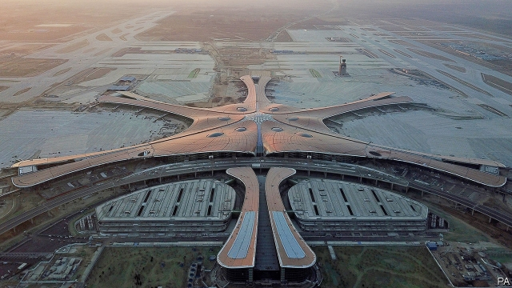

###### The sky’s the limit

# Beijing is building a colossal new airport 

##### So why will delays remain common? 

 

> Apr 4th 2019 

OFFICIALS USE many superlatives to describe a massive new airport nearing completion in Daxing district on Beijing’s southern edge. It deserves them all. The golden-roofed terminal (pictured) is a triumph of design by Zaha Hadid, an Iraqi-born British architect who died in 2016, a few days after work on the edifice began. At 180,000 square metres the building’s steel roof, they say, is the largest of any airport terminal. The ground floor has the world’s biggest seamless single slab of concrete. It covers nearly 250,000 square metres, roughly the area of 35 football pitches. The state-owned firm in charge of building the airport says construction has involved “unprecedented” difficulty. 

It was only just over a decade ago that the capital was boasting the completion of what it then called the world’s largest man-made structure—terminal three of the current main aviation hub, Beijing Capital international airport. That building (also designed by a British architect), along with a new runway, more than doubled the airport’s capacity to 80m passengers per year. Last year, however, Capital airport handled more than 100m travellers, making it the world’s second-busiest, after Atlanta in America. Beijing is “very ready for another new airport”, says a foreign airline executive. Daxing airport will have four runways, compared with three at Capital. 

In many other countries, a project on this scale would be beset with delays and cost overruns. But as always with big projects in China, NIMBY-ish concerns have been ignored. Officials had a free hand to requisition land for the airport: 13 villages were demolished and about 20,000 people relocated to make way for it. The construction manager, Li Jianhua, says Daxing airport is on budget (it is costing 80bn yuan, or nearly $12bn) and on time. It is due to open in September. Officials call it a gift for the communist country’s 70th birthday, which will be celebrated on October 1st. 

The airport is also intended as a gift for the relatively underdeveloped region south of the capital where it is located (67km from Capital airport in the north-east). It is roughly equidistant between the centre of Beijing and a new city, Xiongan, that is being built in Hebei province, south of Daxing, to relieve population pressure on the capital (Xiongan is a project cherished by China’s leader, Xi Jinping, as is the airport). The cost of new infrastructure around Daxing, including road and high-speed rail links between the airport, Xiongan and downtown Beijing, is four times as much as the facility itself. 

China needs many more new airports. The International Air Transport Association predicts that by the mid-2020s China will surpass America as the world’s largest aviation market. By 2037 China will be serving 1.6bn air passengers yearly, 1bn more than in 2017, it reckons. But airlines also need more room in China’s sky. The People’s Liberation Army keeps rigid control of around 75% of Chinese airspace, a far greater share than most other countries reserve for defence purposes. It is reluctant to loosen its grip, say many in the industry. As a result, passengers often suffer long and unpredictable delays, especially in the corridor between Beijing and Shanghai, China’s busiest. If traffic grows as projected, the congestion will get worse. 

-- 

 单词注释:

1.colossal[kә'lɒsәl]:a. 巨大的, 巨像似的 

2.APR[]:[计] 替换通路再试器 

3.superlative[sju:'pә:lәtiv]:a. 最上的, 无比的, 过度的 n. 最好的人(物), 最高程度, 最高级 

4.completion[kәm'pli:ʃәn]:n. 完成 [经] 完井, 结束, 完工 

5.zaha[]: [地名] [缅甸] 扎哈 

6.hadid[]:[网络] 哈迪德；哈叠；建筑师哈迪特 

7.edifice['edifis]:n. 大厦, 大建筑物 

8.seamless['si:mlis]:a. 无缝的, 无缝合线的 [医] 无缝的 

9.slab[slæb]:n. 平板, 厚片 vt. 切成厚板, 以平板盖上 

10.unprecedented[.ʌn'presidentid]:a. 空前的 [经] 空前的, 无前例的 

11.hub[hʌb]:n. 毂, 木片, 中心 [计] 插座; 插孔; 集线器, 集中器, 连接器, 中继站 

12.runway['rʌnwei]:n. 跑道, 河床, 过道 [化] 单轨架空道; 吊车道 

13.traveller['trævlә]:n. 旅行者 [经] 旅行商 

14.atlanta[әt'læntә]:n. 亚特兰大（美国城市） 

15.beset[bi'set]:vt. 围绕, 使苦恼, 镶嵌 

16.overrun[.әuvә'rʌn]:n. 蔓延, 风行一时, 超过限度 vt. 蔓延, 蹂躏, 超过, 泛滥 vi. 泛滥, 超载限度 [计] 超限 

17.alway['ɔ:lwei]:adv. 永远；总是（等于always） 

18.requisition[.rekwi'ziʃәn]:n. 正式请求, 申请, 需要, 征用, 通知单, 申请书, 引渡要求 vt. 征用, 要求 

19.demolish[di'mɒliʃ]:vt. 毁坏, 破坏, 粉碎 

20.relocate[ri:'lәukeit]:vt. 重新安置, 再配置, 放在新地方 [计] 再定位; 浮动 

21.jianhua[]:[网络] 陈建华；江苏；店主 

22.underdevelop[.ʌndәdi'velәp]:v. (使)发展不完全, (使)显影不足 

23.equidistant[.i:kwi'distәnt]:a. 距离相等的, 等距的 

24.cherish['tʃeriʃ]:vt. 珍爱, 怀有, 爱护 

25.infrastructure['infrәstrʌktʃә]:n. 基础结构, 基础设施 [经] 基础设施 

26.surpass[sә'pɑ:s]:vt. 超越, 凌驾, 胜过 

27.reckon['rekәn]:vt. 计算, 总计, 估计, 认为, 猜想 vi. 数, 计算, 估计, 依赖, 料想 

28.unpredictable[.ʌnpri'diktәbl]:a. 不可预知的 

29.congestion[kәn'dʒestʃәn]:n. 拥挤, 充血 [计] 拥挤, 拥塞 

