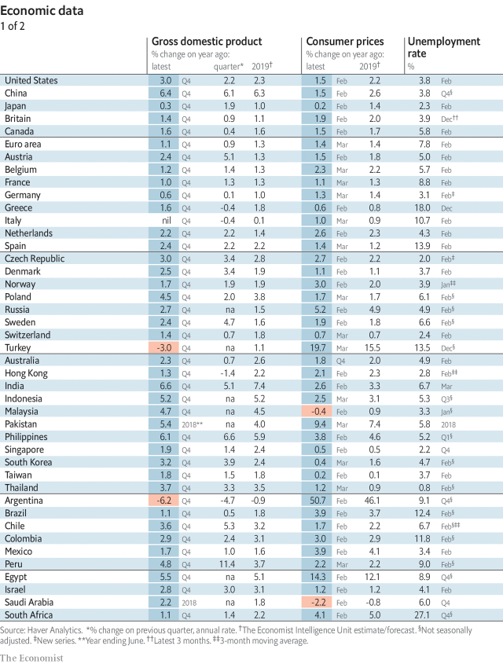
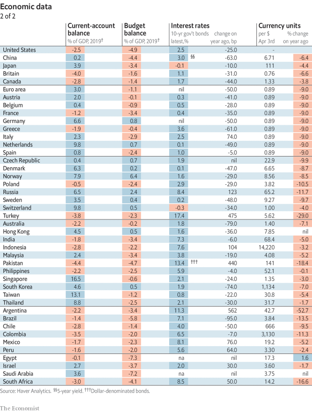
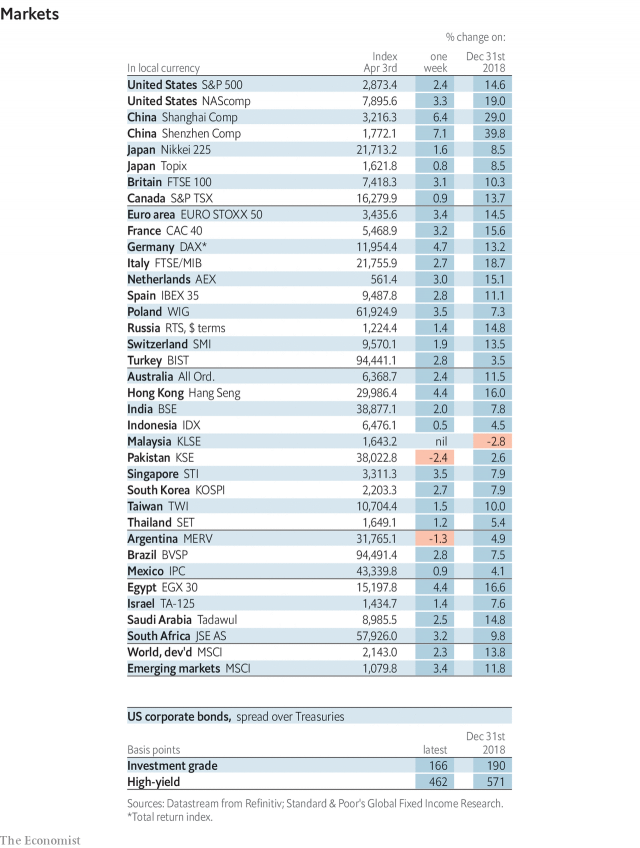
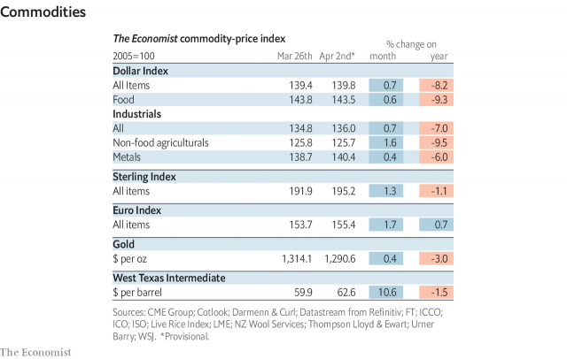

###### The Brexit negotiations

# Economic data, commodities and markets 

> Apr 4th 2019 

 

 

 

 

-- 

 单词注释:

1.Brexit[]:[网络] 英国退出欧盟 

2.negotiation[ni.gәuʃi'eiʃәn]:n. 谈判, 磋商, 交涉 [经] 谈判, 协商 

3.datum['deitәm]:n. 论据, 材料, 资料, 已知数 [医] 材料, 资料, 论据 

4.commodity[kә'mɒditi]:n. 农产品, 商品, 有用的物品 [经] 商品, 货物, 日用品 

5.APR[]:[计] 替换通路再试器 

