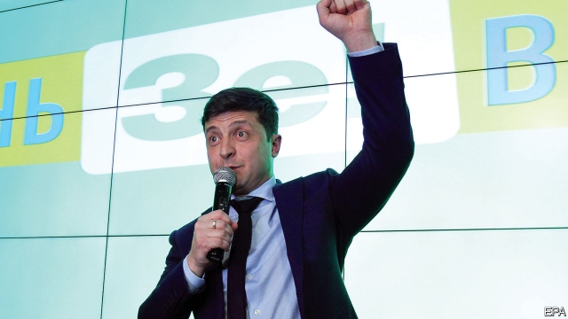

###### Send in the clown

# A TV comedian wins the first round of Ukraine’s presidential election 

##### A massive rebuff to Petro Poroshenko 

 

> Apr 4th 2019 

FEW COUNTRIES are as disposed to spectacle and phantasmagoria as Ukraine, the birthplace of Mikhail Bulgakov and Nikolai Gogol. Their shadows, surely, enveloped springtime Kiev on March 31st as a comedian who plays the president in a popular TV show “Servant of the People” emerged as the likely next president of Ukraine. Ukrainian politics have often resembled a reality show. Now a show is turning into reality. 

In the first round of presidential elections Volodymyr Zelensky, an actor who plays a history teacher accidentally propelled into the presidency, won 30% of the votes, as many as the incumbent president, Petro Poroshenko, and a former prime minister, Yulia Tymoshenko, put together. This was not only a verdict on Mr Poroshenko’s five-year presidency, much of it tainted by persistent corruption scandals, but a resounding slap in the face for the entire Ukrainian class of politicians who have misruled the country for most of its post-Soviet history. 

Mr Zelensky, a man of huge name-recognition and no political experience, took centre-stage to attack the failures of established Ukrainian politicians, who have played different roles in different costumes but have generally acted in their own interests and the interests of the oligarchs who stood behind them. The Maidan revolution of 2013-14 was supposed to mark a break with that system, but instead was hijacked by old-style politicians and oligarchs, including Mr Poroshenko. 

Mr Zelensky’s turn to politics seemed as accidental as that of his character. The idea of stepping from the TV screen into a race emerged two years ago, after Mr Poroshenko’s analysts measured the actor’s ratings only to discover that he was the most popular choice. He was seen, at the time, as a perfect spoiler for Slava Vakarchuk, a well-known rock-singer who tantalised Ukrainians with the idea of a run for the presidency only to back down. He will now face Mr Poroshenko in the second round, scheduled for April 21st. 

Mr Poroshenko, a confectionery magnate, also came to the presidency almost by accident. He was elected to stop the war in the east of the country and improve the country’s dire economic situation, and for this election wrapped himself in the flag and campaigned under the slogan of “Army. Language. Faith”. He chose Vladimir Putin, Russia’s president, as his real election opponent and appealed to more nationalist-minded western Ukraine, leaving the Russian-speaking east and south of the country to Yury Boyko, a Kremlin-backed former energy minister. 

Mr Zelensky, not wishing to divide opinions and votes, said almost nothing about his politics. He did not hold political rallies or take part in television debates. Instead he toured the country giving two shows a day—one free, one paid. Unlike his rivals, who had to work hard to get people to come to their to rallies, Mr Zelensky actually made money from ticket sales. But those who voted for him have little idea about the man behind the screen. 

 

He is 41, of a Jewish background, and comes from a rough industrial city, Krivoy Rog. His team consists of cool-headed lawyers, close friends and business partners who run a tight ship. His business dealings with Ihor Kolomoisky, a controversial oligarch whose TV channel hosts Mr Zelensky’s show and whose top lawyer is on his campaign team, raised questions that were quickly exploited by Mr Poroshenko. But Mr Zelensky is also surrounded by reformers, including Oleksandr Danyliuk, a respected former finance minister who clashed with Mr Kolomoisky, helping to nationalise his bank and then securing a freeze of his worldwide assets. 

The eccentricity of Ukrainian politics should not obscure some important achievements. Thanks to free media and genuine political competition, “this has been the freest and most peaceful election in Ukraine’s history,” says Alexander Martynenko, a commentator and the head of Interfax Ukraine, a news agency. Most important, the vote averted a split along linguistic, historical and ethnic lines long exploited both by the country’s own politicians and by the Kremlin, and has brought it closer together than it had been for years. Being Russian-speaking and pro-Ukrainian, Mr Zelensky covered most of the country, with the exception of the eastern and western peripheries. 

He lacks a core electorate, but managed to mobilise the urban lower-middle class—traders, taxi-drivers, craftsmen—who rarely vote. Many of these people stayed at home watching TV during the Maidan “revolution of dignity”. But although Mr Zelensky himself is no revolutionary and even made jokes about it, he is the latest manifestation of a historic process that Maidan set off. He and his team are very different from the political class that has milked Soviet-era resources over past decades. Now they have a second round to win, and a lot of expectations to live up to. 

-- 

 单词注释:

1.clown[klaun]:n. 小丑, 乡下人 

2.comedian[kә'mi:djәn]:n. 喜剧演员 

3.presidential[.prezi'denʃәl]:a. 总统制的, 总统的, 首长的, 统辖的 [法] 总统的, 议长的, 总经理的 

4.rebuff[ri'bʌf]:n. 断然拒绝, 严厉拒绝, 漠不关心 vt. 严厉拒绝 

5.petro[]:n. 佩特罗（女子名）；[宗]（希）彼得（男子名, 涵义为石头） 

6.Poroshenko[]:[网络] 波罗申科 

7.APR[]:[计] 替换通路再试器 

8.phantasmagoria[.fæntæzmә'gɒ:riә]:n. 千变万化的情景, 幻灯的一种, 幻影汇集, 幻觉效应 

9.ukraine[ju(:)'krein]:n. 乌克兰（原苏联一加盟共和国, 现已独立） 

10.Mikhail[]:米哈伊尔（人名） 

11.bulgakov[]:[网络] 布尔加科夫；作家；布尔加柯夫 

12.Nikolai[]:n. 尼古拉 

13.Gogol['^ɔ^әl]:果戈理(①姓氏 ②Nikolai Vasilievich, 1809—1852, 俄国小说家、剧作家) 

14.envelop[in'velәp]:vt. 包封, 遮盖, 包围 n. 信封 

15.kiev['ki:ev]:n. 基辅（乌克兰共和国首都） 

16.ukrainian[ju(:)'kreinjәn]:a. 乌克兰的；乌克兰人的 

17.politic['pɒlitik]:a. 精明的, 明智的, 策略的 

18.volodymyr[]:[网络] 昊宇 

19.zelensky[]:[网络] 泽伦斯基 

20.accidentally[.æksi'dentli]:adv. 偶然地, 意外地 

21.propel[prәu'pel]:vt. 推进, 驱使 [机] 推进 

22.presidency['prezidәnsi]:n. 总统职权, 总裁职位 

23.incumbent[in'kʌmbәnt]:a. 现任的, 依靠的, 负有义务的 n. 领圣俸者, 在职者 

24.yulia[]:[网络] 尤利娅；尤莉娅；尤利亚 

25.tymoshenko[]:[网络] 季莫申科；总理季莫申科；乌克兰前总理季莫申科 

26.verdict['vә:dikt]:n. 裁决, 判决, 判断性意见, 定论, 结论 [法] 定论, 判断, 意见 

27.taint[teint]:n. 污点, 耻辱, 感染 vt. 污染, 使腐败, 沾染, 腐蚀 

28.persistent[pә'sistәnt]:a. 固执的, 坚持的, 持续的, 作用持久的 [法] 坚持的, 固执的, 持续的 

29.corruption[kә'rʌpʃәn]:n. 腐败, 堕落, 贪污 [计] 论误 

30.resound[ri'zaund]:vi. 回响, 鸣响, 反响, 驰名, 被传遍 vt. 使回响, 传颂 

31.slap[slæp]:n. 掴, 掌击, 侮辱, 拍击声 v. 拍击, 惩罚 adv. 正面地, 直接地, 突然地 

32.misrule[mis'ru:l]:vt. 施暴政 n. 暴政 

33.costume['kɒstju:m]:n. 装束, 服装 

34.oligarch['ɒligɑ:k]:n. 寡头政治执政者 

35.maidan[mai'dɑ:n]:n. <印> 练兵场, 操场 

36.hijack['haidʒæk]:vt. 抢劫, 劫持, 敲诈 [法] 挡路抢劫, 抢劫, 绑架 

37.analyst['ænәlist]:n. 分析者, 精神分析学家 [化] 分析员; 化验员 

38.rating['reitiŋ]:n. 等级, 额定功率, 责骂 [经] 等级评定 

39.spoiler[]:n. 掠夺者, 搞坏事情的人, 宠坏别人的人 

40.slava[]:n. (Slava)人名；(俄、捷、塞)斯拉娃 (女名), 斯拉瓦 

41.tantalise['tæntәlaiz]:vt. 诱发无法实现的希望, 使干着急, 惹弄, 逗惹, 逗弄 

42.ukrainian[ju(:)'kreinjәn]:a. 乌克兰的；乌克兰人的 

43.confectionery[kәn'fekʃәnәri]:n. 甜食, 糕饼制造业, 糖果店 [建] 糖食店 

44.magnate['mægneit]:n. 大官, 巨头 [法] 大官, 权贵, 大资本家 

45.dire[daiә]:a. 可怕的, 悲惨的, 阴沉的, 极端的 

46.Vladimir[vlɑ'dimɪr]:n. 弗拉基米尔（古罗斯弗拉基米尔-苏兹达里公国的古都） 

47.putin['putin]:n. 普京（人名） 

48.Yury[]:n. (Yury)人名；(俄)尤里；(法)于里 

49.boyko[]: [人名] 博伊科 

50.rally['ræli]:n. 重振旗鼓, 集合, 群众集会, 跌停回升 v. 重整旗鼓, 集合, 恢复精神, 团结, 挖苦, 嘲笑 

51.krivoy[]:[网络] 克里沃伊 

52.rog[rɔdʒ]:abbr. 货已收到, 凭单（Receipt Of Goods） 

53.dealing['di:liŋ]:n. 经营行为, 行为, 交易 [法] 待遇, 处置, 行为 

54.ihor[]:[网络] 至尊铭 

55.quickly['kwikli]:adv. 很快地 

56.reformer[ri'fɒ:mә]:n. 改革家, 改革运动者 [化] 转化炉; 转化器; 重整器; 重整炉 

57.oleksandr[]:[网络] 乌克兰奥勒克 

58.clash[klæʃ]:n. 冲突, 撞击声, 抵触 vi. 冲突, 抵触 vt. 使发出撞击声 [计] 对撞 

59.nationalise['næʃәnәlaiz]:vt. 把...收归国有, 使具有某国国籍, 使国有化 

60.asset['æset]:n. 资产, 有益的东西 

61.eccentricity[.eksen'trisiti]:n. 古怪, 古怪行为, 怪癖 [化] 偏心度; 偏心距; 偏心率 

62.alexander[,æli^'zɑ:ndә]:n. 亚历山大（男子名） 

63.commentator['kɔmenteitә]:n. 评论员, 实况广播员, 注释者, 时事评论员 

64.interfax[]: 文传 

65.avert[ә'vә:t]:vt. 转开, 避免, 防止 

66.linguistic[liŋ'^wistik]:a. 语言的, 语言学的 [计] 语言的, 语言学的 

67.ethnic['eθnik]:a. 人种的, 种族的 [医] 人种的 

68.Kremlin['kremlin]:n. 克里姆林宫 [经] 克里姆林宫 

69.periphery[pә'rifәri]:n. 外围, 边缘地区, 圆周 [医] 外周, 周围 

70.electorate[i'lektәrit]:n. 选民, 有选举权者, 选区 [法] 选民, 选举团, 选区 

71.mobilise['mәjbilɑiz]:vi.vt. 动员, 松动, 使活动, 调动, 发动 

72.manifestation[.mænifes'teiʃәn]:n. 显示, 证明, 示威运动 [医] 表现, 表示 

73.historic[hi'stɒrik]:a. 历史上著名的, 有历史性的 

