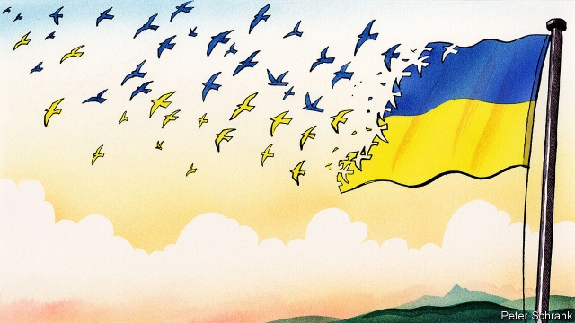

###### Charlemagne

# Europe’s other migration crisis 

##### Emigration towards the continent’s core takes internationalists from the places that need them most 

 

> Apr 4th 2019 

“POROSHENKO, ZELENSKY, Poroshenko, Zelensky…” chants the teller, sing-song, over the flutter of papers. It is shortly before midnight on Sunday in the Ukrainian embassy in Warsaw. Representatives of the country’s presidential candidates are gathered around a conference table to count first-round votes from citizens living here in neighbouring Poland. From a pile in the centre a staffer peels out the long ballot slips—there were 39 candidates—and hands each to his boss who reads out the vote and passes it to the appropriate delegate, who adds it to his or her stack. The piles for Petro Poroshenko, the incumbent, and Volodymyr Zelensky, his comedian-turned-politician challenger, are the largest. 

The scene captures something of Ukraine’s resilience. Unlike some former Soviet states it is a democracy, albeit a deeply flawed one. It remains keen on the Europeanist course set during the pro-EU, Maidan protests in 2013-2014, despite Russian military incursions and the annexation of Crimea since then. Ukrainians enjoy the freedom, boosted by a visa liberalisation in 2017, to travel to the EU and hundreds of thousands have exercised this right in the past five years. Most went to Poland, attracted by its proximity, its cultural-linguistic similarities and its booming economy. On March 31st thousands of them queued up at the embassy in Warsaw, and consulates in Gdansk and Krakow, to cast their votes: a paragon of trans-European democracy. 

Yet democracy and European convergence demand more than five-yearly elections. They also require the rule of law, transparency and strong institutions. And here Ukraine is struggling. Corruption is endemic and oligarchs still dominate politics. Disappointment at the slow pace of progress has driven much of the emigration. From about 220,000 in 2013, the number of Ukrainians living in Poland is now around 1.5m, though estimates vary. Compared with previous waves of Ukrainian emigrants, this one is less seasonal but also younger, more multilingual and better-educated. More than a third of recent leavers have university degrees. 

Anhelina Prymak moved to Poland in 2013 to study European affairs. Corruption in universities is a major factor for emigrant students like her; bribes-for-grades are so rife in Ukraine that the overall cost of studying can be similar on both sides of the border. Now she works for a Polish think-tank. Likewise Sasha Iwaniuk, a politicial scientist and novelist from Kiev, found her university in Ukraine parochial and corrupt, so moved her PhD studies to Lublin. Many entrepreneurs have moved to Poland, along with thousands of IT professionals who often see it as a stepping stone to Germany or beyond. “Students and businesspeople are leaving,” despairs Ms Iwaniuk. “It’s a catastrophe in terms of demography. The country is losing the people who can change it.” 

Natalia Panchenko, a Maidan protester now living in Warsaw, agrees: “The ones leaving are those who could push for changes.” But precisely those people—often young and without partners, children or homes anchoring them to Ukraine—say they do not intend to return until the situation there improves. At least they can invest some of their reformist energies in their adoptive country. For example, a number of Ukrainians attended protests against the constitutional abuses of Poland’s governing Law and Justice (PiS) party. Igor Isajew, a Ukrainian journalist, was propelled into Citizens of Poland, an anti-PiS movement, in 2016 by government restrictions on the media. “I’m optimistic that Poland will vote out PiS,” he says. Others contribute outside of party politics. As part of BETA Polska, a pro-EU campaign, Ms Prymak is helping to run educational simulations of the European Parliament for pupils and voters around Poland. “People really engage!” she enthuses, recalling a teacher who overheard her discussing the initiative in a café and invited BETA to her school on the spot. 

For Ukrainians in Poland, read also Romanians in Spain, Poles in Britain and Lithuanians in Germany. Free movement, cheap flights, the rise of English and the internationalisation of universities have made it easier than ever for Europeans to up sticks. Those who do so tend to be disproportionately young and well-educated, and are becoming more so. They are by definition mobile and thus alive to the benefits of European integration. They tend to gravitate from Europe’s eastern and southern periphery towards its core. Brussels, the EU’s capital, is the supreme example; the destination of choice for many who know and care the most about the EU. On sunny evenings café terraces outside the European Parliament teem with bright young officials, politicians and advisers from across the continent, mingling with others who (predominantly) share their European expertise and enthusiasms. “One of the unintended consequences of building up European institutions is that many of the best-informed, most pro-European people have left national capitals for Brussels,” observes Timothy Garton Ash, a historian at Oxford University. 

EU politicians at least travel home to their constituencies. And social media sites make it easier than ever for emigrants to remain active in the politics and societies of their countries of origin; they can vote in national elections, though most of them do not. But it is plain that their centripetal movement carries with it some of the modernising vim that, staying put, might propel those countries faster in the same direction. An IMF study in 2016 found a “significant negative association” between the rate of high-skill emigration from eastern European countries in 2000 and improvements in their quality of government 14 years later. 

The knock-on effects of recent waves of emigration will take at least as long to be felt fully. But they are already visible in some places. Mr Garton Ash points to countries like Poland, where the departure of highly informed, pro-European natives can be felt in the tone of national debates. “The Europeans have, as it were, gone to Europe.” 

-- 

 单词注释:

1.Charlemagne['ʃɑ:lә'mein]:查理曼大帝(742-814, 世称 Charles the Great或Charles I, 768-814为法兰克王, 800-814为西罗马帝国皇帝) 

2.migration[mai'greiʃәn]:n. 移民, 移往, 移动 [计] 迁移 

3.emigration[.emi'greiʃәn]:n. 移民, 移居外国(或外地) [医] 血细胞渗出 

4.internationalist[.intә'næʃәnәlist]:n. 国际主义者, 国际法学家 [法] 国际法学家, 国际主义者, 国际派 

5.APR[]:[计] 替换通路再试器 

6.Poroshenko[]:[网络] 波罗申科 

7.zelensky[]:[网络] 泽伦斯基 

8.Poroshenko[]:[网络] 波罗申科 

9.teller['telә]:n. 叙述者, 讲故事者, 出纳员 [经] 出纳员 

10.flutter['flʌtә]:n. 摆动, 鼓翼, 烦扰 vi. 摆动, 鼓翼, 烦扰 vt. 拍(翅), 使焦急 [计] 颤动 

11.ukrainian[ju(:)'kreinjәn]:a. 乌克兰的；乌克兰人的 

12.warsaw['wɔ:sɔ:]:n. 华沙（波兰首都） 

13.presidential[.prezi'denʃәl]:a. 总统制的, 总统的, 首长的, 统辖的 [法] 总统的, 议长的, 总经理的 

14.Poland['pәulәnd]:n. 波兰 

15.staffer['stɑ:fә]:n. (一名)职员(尤指编辑或记者) 

16.ballot['bælәt]:n. 投票, 投票用纸, 抽签 vi. 投票, 抽签 vt. 投票选出, 拉选票 

17.petro[]:n. 佩特罗（女子名）；[宗]（希）彼得（男子名, 涵义为石头） 

18.incumbent[in'kʌmbәnt]:a. 现任的, 依靠的, 负有义务的 n. 领圣俸者, 在职者 

19.volodymyr[]:[网络] 昊宇 

20.zelensky[]:[网络] 泽伦斯基 

21.challenger['tʃælindʒә]:n. 挑战者 [经] 申请回避的人 

22.resilience[ri'ziliәns]:n. 弹回, 有弹力, 恢复力 [化] 回弹; 弹性; 弹回性; 回能; 弹能 

23.albeit[ɔ:l'bi:it]:conj. 尽管, 虽然 

24.flaw[flɒ:]:n. 缺点, 裂纹, 瑕疵, 一阵狂风 [化] 划痕; 裂缝; 裂纹 

25.Europeanist[,jjәrә'pi:әnist]:a. 欧洲经济共同体第一主义的 

26.maidan[mai'dɑ:n]:n. <印> 练兵场, 操场 

27.incursion[in'kә:ʃәn]:n. 侵入, 侵略, 奇袭 

28.annexation[ænek'seiʃәn]:n. 合并, 附加, 附加物 [法] 兼并, 侵吞, 附加物 

29.Crimea[krai'miә]:n. 克里米亚, 克里米亚半岛 

30.ukrainian[ju(:)'kreinjәn]:a. 乌克兰的；乌克兰人的 

31.liberalisation[,libərəlai'zeiʃən, -li'z-]:n. 自由化；开放 

32.EU[]:[化] 富集铀; 浓缩铀 [医] 铕(63号元素) 

33.proximity[prɒk'simiti]:n. 接近, 亲近 

34.similarity[.simi'læriti]:n. 类似, 类似处 [法] 类似, 相似, 类似事例 

35.consulate['kɒnsjulit]:n. 领事, 领事任期, 领事馆 [经] 领事馆 

36.Gdansk[^ә'dɑ:nsk]:格但斯克(旧称Danzig但泽, 波兰港市) 

37.Krakow['krɑ:ku:f]:n. 克拉科夫(波兰城市) 

38.paragon['pærәgәn]:n. 杰出典范, 完人, 完美之物 

39.convergence[kәn'vә:dʒәns]:n. 集中, 收敛 [计] 收敛, 会聚 

40.transparency[træns'pærәnsi]:n. 透明, 透明度, 透过性, 透明物, 清晰 [计] 透明性; 透明 

41.ukraine[ju(:)'krein]:n. 乌克兰（原苏联一加盟共和国, 现已独立） 

42.corruption[kә'rʌpʃәn]:n. 腐败, 堕落, 贪污 [计] 论误 

43.endemic[en'demik]:n. 地方病 a. 某地(或某些人中)流行的, 地方的 

44.oligarch['ɒligɑ:k]:n. 寡头政治执政者 

45.politic['pɒlitik]:a. 精明的, 明智的, 策略的 

46.emigration[.emi'greiʃәn]:n. 移民, 移居外国(或外地) [医] 血细胞渗出 

47.emigrant['emigrәnt]:n. 移民, 侨民 a. 移民的, 移居的 

48.les[lei]:abbr. 发射脱离系统（Launch Escape System） 

49.seasonal['si:znәl]:a. 季节的, 依照季节的, 周期性的 [经] 季节性的, 季节的 

50.multilingual[.mʌlti'liŋgwәl]:a. 多语言的 

51.leaver['li:vә]:n. 离开者（常指学校毕业生） 

52.rife[raif]:a. 流行的, 盛传的, 充满的 

53.sasha[]:n. 萨莎（女子名） 

54.politicial[]:[网络] 政治 

55.kiev['ki:ev]:n. 基辅（乌克兰共和国首都） 

56.parochial[pә'rәukiәl]:a. 教区的, 地方性的, 目光偏狭的 

57.phd[]:abbr. 哲学博士学位（Doctor of Philosophy） 

58.lublin[]:卢布林(波兰城市) 

59.entrepreneur[.ɒntrәprә'nә:]:n. 企业家, 主办人 [经] 承包商, 企业家 

60.businessperson['bɪznəspɜ:sn]:n. 商人 

61.demography[di:'mɒgrәfi]:n. 人口统计学 [医] 人口学, 人口统计学 

62.Natalia[nә'tæljә, -'tɑ:l-]:n. 纳塔莉亚(f.) 

63.protester[]:n. 抗议者, 持异议者, 拒付者 [经] 反对者 

64.precisely[pri'saisli]:adv. 精确地, 明确地, 刻板地, 拘泥地, 正好, 恰恰, 对, 正是如此, 确实如此, 不错 

65.reformist[ri'fɒ:mist]:n. 改良主义者, 改革者 

66.adoptive[ә'dɒptiv]:a. 有收养关系的, 采用的 [法] 收养的, 采用的 

67.constitutional[.kɒnsti'tju:ʃәnl]:a. 宪法的, 立宪的, 体质的 [医] 全身的; 体质的 

68.pi[pai]:n. 圆周率 [计] 处理器接口, 程序中断 

69.Igor[]:n. (Igor)人名；(乌克、罗、塞、斯洛伐、法、葡、俄、西、英)伊戈尔 abbr. 注入气和采出石油比（Injection Gas-Oil Ratio） 

70.propel[prәu'pel]:vt. 推进, 驱使 [机] 推进 

71.beta['beitә]:n. 希腊字母表的第二个字母 [医] β(希腊文的第二个字母), 乙种 

72.polska['pɔ:lskɑ:]:n. 波兰 

73.educational[.edju'keiʃәnl]:a. 教育的, 教育性的 

74.simulation[.simju'leiʃәn]:n. 模拟, 假冒物, 模仿 [计] 模拟 

75.voter['vәutә]:n. 选民, 投票人 [法] 选民, 选举人, 投票人 

76.enthuse[in'θju:z]:vt. 使充满热情, 使感兴趣, 使热心 vi. 热心 

77.overhear[.әuvә'hiә]:vt. 无意中听到, 偷听 

78.Romanian[ru:'meiniәn]:n. 罗马尼亚人, 罗马尼亚语 a. 罗马尼亚的 

79.Spain[spein]:n. 西班牙 

80.Lithuanian[.liθju:'einiәn]:n. 立陶宛人 a. 立陶宛的, 立陶宛人的, 立陶宛语的 

81.internationalisation[ɪntɜ:næʃənəlaɪ'zeɪʃən]:n. 国际化 

82.disproportionately[]:adv. 不匀称, 不相称 

83.integration[.inti'greiʃәn]:n. 综合, 与环境协调的行为, 集成 [化] 集成; 整合 

84.gravitate['græviteit]:vi. 被重力吸引, 沉下, 下降 vt. 使受重力吸引 

85.periphery[pә'rifәri]:n. 外围, 边缘地区, 圆周 [医] 外周, 周围 

86.Brussel[]:n. 布鲁塞尔（比利时首都） 

87.terrace['terәs]:n. 阶地, 梯田, 房屋之平顶, 阳台, 沿岸防地, 露台 a. 叠层式的 vt. 使成梯田, 使成有平台屋顶 

88.teem[ti:m]:vi. 充满, 充足, 倾注 vt. 倒出 

89.adviser[әd'vaizә]:n. 顾问, 劝告者, 指导教师 [法] 顾问, 劝告者 

90.mingle['miŋgl]:v. (使)混合 

91.predominantly[]:adv. 主要地, 显著地, 大多数地, 突出地 

92.expertise[.ekspә:'ti:z]:n. 专家意见, 专门技术 [法] 专门知识, 专家意见 

93.unintended['ʌnin'tendid]:a. 不是存心的, 无心的, 非故意的 

94.timothy['timәθi]:n. 梯牧草 [医] 梯牧草, 牛草 

95.Garton[]:n. (Garton)人名；(英、葡)加顿 

96.historian[hi'stɒ:riәn]:n. 历史学家, 记事者 

97.Oxford['ɒksfәd]:n. 牛津, 牛津大学 

98.constituency[kәn'stitjuәnsi]:n. 选民, 顾客, 读者 [法] 选区, 全体选民, 选区内的选民 

99.centripetal[sen'tripitәl]:a. 向心的 [医] 向心的, 向中的, 求中的 

100.modernise['mɔdәnaiz]:vt.vi. (使)现代化, (使)适应现代需要 vi. 用现代方法 

101.vim[vim]:n. 精力；活力；力量 [网络] 波形蛋白(vimentin)；文本编辑器；真空感应熔炼(vacuum induction melting) 

102.IMF[]:国际货币基金组织 [经] 国际货币基金 

103.fully['fuli]:adv. 十分地, 完全地, 充分地 

