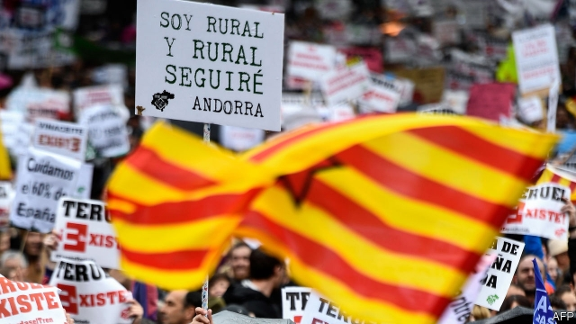
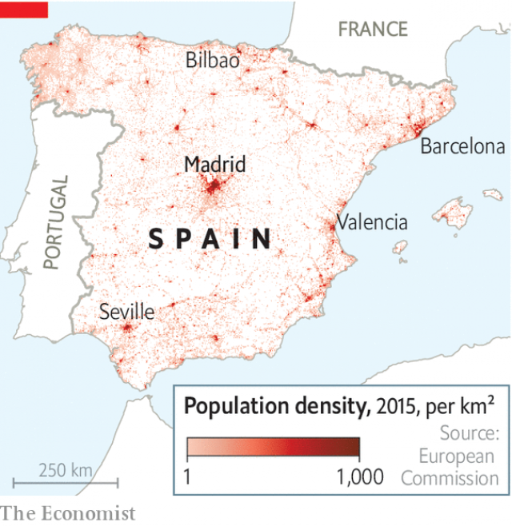

###### Rural requiem or revival

# In Spain’s election, the emptying countryside matters 

##### Its interior is as deserted as Lapland or the Scottish highlands 

 

> Apr 4th 2019 

THEY COME from medieval villages the colour of the harsh surrounding land, from the Spain of transhumant shepherds, lonely sierras and forests of oak and elm. And they are quietly angry. On March 31st some 50,000 of them marched through the centre of Madrid in what they called “the rebellion of emptied-out Spain”. Their placards and banners displayed the poetry of place names; their demands were prosaic. Villamayor del Rio wants a pharmacy, Orihuela del Tremedal needs faster internet, Aranda del Duero demands better infrastructure, “Almanza resists”, while “Fuentes de Béjar exists” as do Arévalo de la Sierra and El Royo. “We feel a bit abandoned, we need doctors,” said Paula Siles, a social-care worker from Las Parras de Castellote (population 57, down from 86 in 2004) in the Maestrazgo mountains of Teruel. 

Spain urbanised late but abruptly. As Spaniards have clustered in Madrid and on the coasts, a huge swathe of the central plateau now has some of the lowest population densities in Europe, comparable only to Lapland and the Scottish highlands. Countless villages are deserted, or home to a handful of the elderly. Many country towns are emptying too. 

 

The countryside was long a reliable source of seats for the conservative People’s Party (PP). But in the election on April 28th the right is split three ways. This means that many of the 99 seats (out of 350) in “empty Spain” are up for grabs. Politicians have developed a sudden interest in rural affairs. The Socialist government of Pedro Sánchez last month rolled out 70 proposals to halt depopulation, ranging from siting military installations to better internet connections. Albert Rivera of the centre-right Ciudadanos (Cs) proposes income-tax breaks; he was seen mounting a tractor. Pablo Casado of the PP inspected some tomatoes in Almería. The PP echoes Vox, a new hard-right group, in promising to protect bullfighting and hunting. 

Will any of this work? In a bestselling book of 2016, “La España Vacía” (Empty Spain), which popularised the term, Sergio del Molino argued that “it was never full” and that the demographic imbalance is ancient. Those who leave for the cities do so in search of opportunities that village life can never offer. Providing public services to thinly spread populations is expensive. But if nothing is done, the festive atmosphere of the Madrid demo might turn into something closer to France’s aggressive gilets jaunes. 

-- 

 单词注释:

1.requiem['ri:kwiәm]:n. 安魂曲, 安灵曲, 挽歌, 悲歌 

2.revival[ri'vaivl]:n. 复兴, 复活, 恢复精神, 苏醒 [医] 复苏, 回生, 精神重振 

3.Lapland['læplænd]:n. 拉普兰 

4.highland['hailәnd]:n. 高地, 苏格兰高地 

5.APR[]:[计] 替换通路再试器 

6.medieval[.medi'i:vl]:a. 中古的, 中世纪的 

7.Spain[spein]:n. 西班牙 

8.transhumant[]:（牲畜的）季节性迁移放牧的 

9.sierra[si'єәrә]:n. 呈齿状起伏的山脉 

10.oak[әuk]:n. 橡树, 橡木 a. 橡木制的 

11.elm[elm]:n. 榆树 [计] unix操作系统的信件处理程序 

12.quietly['kwaiәtli]:adv. 安静地, 沉着地, 秘密地 

13.Madrid[mә'drid]:n. 马德里 

14.placard['plækɑ:d]:n. 公告, 布告, 小牌, 海报 vt. 公布, 布告, 张帖, 贴海报于 

15.prosaic[prәu'zeiik]:a. 散文的, 散文体的, 平凡的 

16.Villamayor[]:[地名] 比利亚马约尔 ( 西 ) 

17.DEL[del]:[计] 数据输入语言, 作废; DOS内部命令:从磁盘上删除一个或多个文件 

18.rio[]:n. 里约（巴西共和国的旧首都） 

19.pharmacy['fɑ:mәsi]:n. 药房, 配药学, 制药业 [医] 药学, 药剂学, 调剂学, 药房 

20.Orihuela[]:[地名] 奥里韦拉 ( 西 ) 

21.Tremedal[]:[地名] 特雷梅达尔 ( 巴西 ) 

22.aranda[ə'rændə]:n. 阿兰达人；阿兰达 

23.Duero['dweәrәj]:<西>=Douro 

24.infrastructure['infrәstrʌktʃә]:n. 基础结构, 基础设施 [经] 基础设施 

25.almanza[]:n. (Almanza)人名；(西)阿尔曼萨；(英)阿尔曼扎 

26.fuente[]: [人名] 富恩特; [地名] 泉（西班牙语） 

27.de[di:]:[化] 非对映体过量 [医] 铥(69号元素铥的别名,1916年Eder离得的假想元素) 

28.Béjar[]:[地名] 贝哈尔 ( 西 ) 

29.Arévalo[]:[地名] 阿雷瓦洛 ( 乌拉、西 ) 

30.La[lɔ:, lɑ:]:[医] 镧(57号元素) 

31.sierra[si'єәrә]:n. 呈齿状起伏的山脉 

32.el[el]:abbr. 预期损失（Expected Loss） 

33.royo[]:[网络] 洛亚；欧阳；荣仕雅 

34.paula['pɔ:lә]:n. 保拉（女子名） 

35.siles[]: [地名] [西班牙] 锡莱斯 

36.parras[]: [地名] [墨西哥] 帕拉斯 

37.Castellote[]:[地名] 卡斯特略特 ( 西 ) 

38.Teruel[]:n. (Teruel)人名；(西)特鲁埃尔 

39.urbanise['\\:bәnaiz]:v. 使都市化, 使文雅 

40.abruptly[ә'brʌptli]:adv. 突然地, 唐突地 

41.Spaniard['spænjәd]:n. 西班牙人 

42.cluster['klʌstә]:n. 串, 丛, 群, 簇 vi. 成串, 丛生 vt. 使聚集 [计] 簇 

43.swathe[sweiθ]:vt. 绑, 裹, 包围 n. 带子, 绷带 

44.plateau[plæ'tәu]:n. 高地, 高原, (上升后的)稳定水平 [医] 高原, 平顶, 坪 

45.countless['kauntlis]:a. 数不尽的, 无数的 

46.p[pi:]:便士 [计] 页, 对, 并行, 奇偶性, 指示器, 多项式, 程序, 方法, 皮 

47.grab[græb]:n. 抓握, 掠夺, 强占, 东方沿岸帆船 vi. 抓取, 抢去 vt. 攫取, 捕获, 霸占 

48.pedro['pi:drәu]:n. 彼得牌戏（一种纸牌戏） 

49.depopulation[]:[经] 人口下降 

50.albert['ælbәt]:n. 艾伯特（男子名） 

51.Rivera[]:n. 里韦拉（乌拉圭北部最重要的边境城市, 里韦拉省首府） 

52.C[si:]:[计] 调用, 访问, 呼叫；电容, 进位, 通道, 字符, 清除, 常数, 控制, 周期；C 程序设计语言 [化] 碳的化学符号; 胞苷 

53.Pablo['pæblәu]:n. 巴勃罗（西班牙籍体育明星）；帕布洛（英国水槽产品品牌）；帕布鲁（西班牙著名画家毕加索的姓） 

54.casado[]:[网络] 卡萨德奥；卡沙度；已婚者 

55.vox[vɔks]:[医] 语音, 语声 

56.bullfight['bulfait]:n. 斗牛 

57.bestselling[]:a. 畅销的 

58.La[lɔ:, lɑ:]:[医] 镧(57号元素) 

59.popularise['pɔpjjlәraiz]:vt.vi. 使通俗化, 使受欢迎, 使大众化, 使普及, 宣传, 推广 

60.Sergio[]:n. 塞尔吉奥（NBA球员） 

61.molino[]: [地名] [秘鲁、菲律宾、美国、墨西哥、智利] 莫利诺 

62.demographic[.demә'græfik]:a. 人口统计的 [法] 人口统计的, 人口学的 

63.imbalance[im'bælәns]:n. 不平衡, 不均衡 [医] 不平衡, 失调 

64.thinly['θinli]:adv. 薄, 细, 瘦 

65.festive['festiv]:a. 庆祝的, 喜庆的, 欢乐的 

66.Demo['demәu]:n. 演示, 样本唱片 [计] 演示 

67.gilet[dʒi'lei]:n. 背心, 马甲 

68.jaune[]:[网络] 汝拉 

