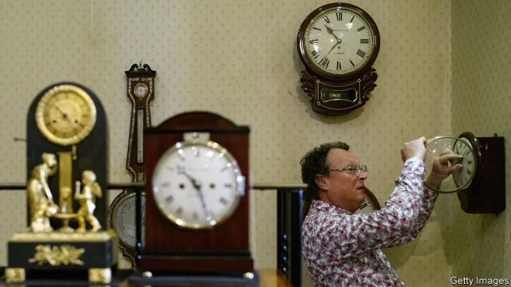

###### Summertime blues

# The European Parliament votes to abolish summer time 

##### Should Europe’s clocks spring forward, or fall back? 

 

> Apr 4th 2019 

IT IS A bright, cold day in April, and the clocks have sprung forward. The morning sun gleams alluringly as pupils arrive at the Fläming Gymnasium (high school) in Bad Belzig, a small town in the east German state of Brandenburg. But on this particular Monday, a day after the start of daylight saving, many of these children are accident-prone, easily distracted and tired, victims of the rich world’s biannual ritual of tampering with time. 

That is if the research on daylight-saving time (DST) is to be believed. Disrupting adolescents’ sleep can play havoc with their bodies. Katrin Stachen says losing an hour’s sleep leaves her teenage daughter, whom she has just dropped off at school, tired for days. Adults suffer, too: one German study found a 25% growth in reported heart problems in the three days after the spring time change. 

So time may soon be up for Europe’s 23-year experiment with harmonised daylight saving. On March 26th the European Parliament voted to end DST by 2021. By next April the EU’s governments must decide what to do. None is more gripped than Germany, the first country to introduce DST, in 1916 (dismissed by the New York Times as “the Kaiser’s Trick-Hour”). Germans accounted for 67% of the replies to a (self-selecting) European Commission “consultation” last year. The vast bulk of them wanted to ditch DST. 

Even beyond the effect on health, the scrappers’ case is strong. Under DST, energy savings from lighter evenings are cancelled out by extra heating bills in the morning. Steffen Kampeter of Germany’s Federal Employers’ Association says business would welcome an end to disruptive clock changes. Yet he also, rightly, fears a temporal “patchwork” across Europe if some countries shift to permanent summertime and others to wintertime. To avoid such chaos, the EU institutions are now urging governments to co-ordinate their approaches. But views vary: Portugal, for example, prefers the status quo. If compromise proves impossible, the proposal could be ditched. 

Perhaps spooked by the prospect of truncated summer evenings in the Biergärten, most Germans say they prefer year-round summertime. But Alfred Wiater, a somnologist, says that longer daylight in the evening can indirectly delay sleep by disrupting the metabolism of sleep-inducing melatonin. In some people that raises the risk of heart problems, depression and neurodegenerative disorders. 

The German Teachers’ Association (DL), is also opposed. In December northern German towns would not see the sun until after 9.30am (the same applies for Spain, which is stuck in the same time zone as Germany thanks to General Franco’s genuflection towards Hitler). Dark mornings delay serotonin secretion, which, says Mr Wiater, is especially bad for teenage brains. Katrin Wiencek, headteacher at the school in Bad Belzig and head of the local DL branch, frets about parents on dark school runs crashing into the deer and boar that stalk the forests around the town. In Germany and elsewhere, the debate has only just begun. Who will prevail? Only time will tell. 

-- 

 单词注释:

1.summertime['sʌmәtaim]:n. 全盛时期, 夏季 

2.APR[]:[计] 替换通路再试器 

3.gleam[gli:m]:n. 光束, 微光, 反光 vi. 闪烁, 隐约地闪现 vt. 使发微光, 使闪烁 

4.alluringly[ə'ljuəriŋli]:adv. 诱人地；妩媚地 

5.Fläming[]:[地名] 弗莱明(地区) ( 德 ) 

6.Belzig[]:[地名] 贝尔齐希 ( 德 ) 

7.Brandenburg['brændənbə:ɡ]:n. 勃兰登堡（德国城市） 

8.distract[dis'trækt]:vt. 转移, 分心, 使发狂 

9.biannual[bai'ænju:әl]:a. 一年两次的 [经] 每年两次 

10.ritual['ritʃuәl]:n. 仪式, 典礼, 宗教仪式 a. 仪式的, 依仪式进行的 

11.tamper['tæmpә]:vi. 干预, 拨弄, 贿赂, 损害, 篡改 vt. 篡改 n. 捣棒, 打夯机, 填塞者 

12.dst[]:abbr. 神学博士（Doctor of Sacred Theology）；夏令时（Daylight Saving time） 

13.disrupt[dis'rʌpt]:a. 分裂的, 中断的 vt. 使分裂, 使瓦解 

14.havoc['hævәk]:n. 大破坏, 蹂躏 vt. 严重破坏 

15.Katrin[]:n. (Katrin)人名；(英)凯特琳；(德)卡特琳 

16.teenage['ti:nidʒ]:a. 十三岁到十九岁的 

17.harmonise['hɑ:mәnaiz]:vi.vt. 以和声歌唱/演奏, (使)协调, (使)一致, (使)相称, (使)调和 

18.york[jɔ:k]:n. 约克郡；约克王朝 

19.consultation[.kɒnsәl'teiʃәn]:n. 请教, 咨询, 磋商会 [医] 会诊 

20.steffen[]: [人名] 斯蒂芬 

21.disruptive[dis'rʌptiv]:a. 分裂的, 破坏(性)的 [计] 击穿的, 中断的 

22.rightly['raitli]:adv. 合适地, 正当地, 正确地 

23.temporal['tempәrәl]:a. 时间的, 暂时的, 现世的, 世俗的, 颞的, 太阳穴的 n. 世间万物, 教会财产 

24.patchwork['pætʃwә:k]:n. 拼缝物, 拼凑物 

25.summertime['sʌmәtaim]:n. 全盛时期, 夏季 

26.wintertime['wintәtaim]:n. 冬季, 冬天 

27.chao[]:n. 钞（货币） 

28.EU[]:[化] 富集铀; 浓缩铀 [医] 铕(63号元素) 

29.Portugal['pɒ:tʃugl]:n. 葡萄牙 

30.statu[]:[网络] 状态查看；雕像；特级雪花白 

31.quo[]:vt. [古]说 

32.spook[spu:k]:n. 幽灵, 鬼 vt. 惊吓, 鬼怪般地出没 vi. 惊吓而逃窜, 受惊 

33.truncate['trʌŋkeit]:vt. 切去头端, 缩短, 截棱, 使成平面 a. 切去了头的, 缩短了的 

34.alfred['ælfrid]:n. 阿尔佛雷德（男子名） 

35.somnologist[]:[网络] 生物学家 

36.indirectly[]:adv. 间接, 曲折, 迂回, 不直截了当, 不诚实, 不坦率 [计] 间接地 

37.metabolism[mi'tæbәlizm]:n. 新陈代谢, 变态 [化] 新陈代谢; 代谢 

38.melatonin[,melә'tәunin]:[化] 褪黑激素; N-乙酰-5-甲氧基色胺 

39.neurodegenerative[]:[医] 神经变性的 

40.DL[]:[计] 数据语言, 数据长度, 数据表, 描述语言 [医] 分升 

41.Spain[spein]:n. 西班牙 

42.genuflection[.dʒenju:'flekʃәn]:n. 曲膝, 屈服 

43.hitler['hitlә]:n. 希特勒（纳粹德国元首） 

44.serotonin[.siәrәu'tәunin]:n. 血清素 [化] 5-羟色胺 

45.secretion[si'kri:ʃәn]:n. 分泌, 分泌物, 分泌液, 隐蔽 [医] 分泌; 分泌物 

46.fret[fret]:n. 烦躁, 磨损, 焦急, 网状饰物 vi. 烦恼, 不满, 磨损 vt. 使烦恼, 腐蚀, 使磨损, 使起波纹 

47.boar[bɒ:]:n. 公猪, 野猪 

48.stalk[stɒ:k]:n. 茎, 追踪, 高视阔步 vi. 悄悄靠近, 蹑手蹑脚地走近, 蔓延, 高视阔步 vt. 追踪, 搜索 

