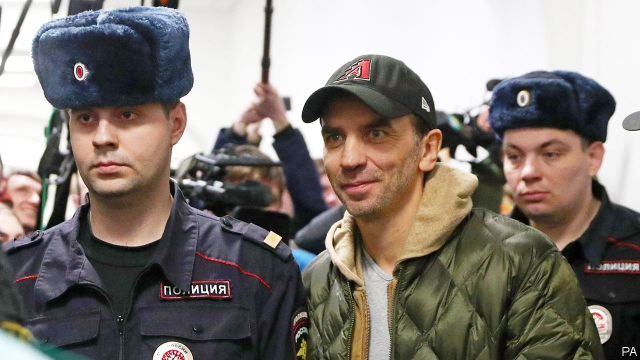

###### The uses of fear

# Vladimir Putin turns to attacking the elite 

##### It’s an ancient tactic 

 

> Apr 4th 2019 

EVERY TIME a high-powered Russian official, oligarch or governor gets arrested, the same questions surface: why him, why now, who’s next? In recent months these questions have become more frequent as former and current ministers, governors, high officials and an American investor have ended up in Moscow’s high-security Lefortovo jail. 

So when Mikhail Abyzov, a former minister in the government of Dmitry Medvedev, was arrested on March 26th, the conspiracy theories mushroomed: it was a swipe at Mr Medvedev, Russia’s prime minister, by the security services; it was a plot by the Alfa Group, a well-connected business that wanted to recover an overdue loan; it was the result of a conflict with Viktor Vekselberg, an oligarch. 

The allegation levelled against him—that Mr Abyzov had set up a criminal group and embezzled 4bn roubles ($61m) by selling an energy firm for an inflated price—seemed almost incidental. Few people believe he is innocent or feel much sympathy for a former minister who enjoyed life in a vast Italian villa among acres of vineyards, as first exposed by Alexei Navalny, an anti-corruption blogger and opposition leader. But equally, few people believe that this is part of a genuine crackdown on corruption rather than an intra-regime redistribution of assets. 

The nature of Mr Putin’s rule fuels this suspicion. The regime is both obsessed with the letter of the law and totally disrespectful of its spirit. Corruption holds the system together. Courts rubber-stamp decisions made by the Kremlin or its security services. An investigation almost always results in a charge, and the percentage of jury acquittals is less than 2%. All this creates the conditions for the use of repression as an instrument of government. 

In the early 2000s arrests among the nomenklatura were rare, and almost never touched top officials. Outside the elite they tended to involve relatively insignificant groups, such as left-wing radicals and ultra-nationalists. The Kremlin preferred to co-opt the powerful by allowing them access to rents, and to placate any public discontent with cash and foreign conquests, most notably the annexation of Crimea in 2014. But as Kirill Rogov, a political analyst in Moscow, writes: “soft authoritarian regimes that rely on economic growth start looking for new sources of legitimacy and broaden repressive practices when economic conditions worsen.” 

A year ago Mr Putin secured an election victory with 77% of the vote, confirming his position as a populist authoritarian leader able to appeal to the people over the heads of the various Russian elites. Since then, however, his rating has fallen to 64% and discontent is mounting. The economy is showing no sign of improvement, real incomes have been falling for five years, foreign adventures cause irritation rather than pride and the effect of television propaganda is wearing thin. 

It is hardly surprising, therefore, that Mr Putin’s regime is increasingly reliant on fear and coercion, morphing into what Mr Rogov calls “repressive populism”. So far, the aim of the current wave of repression is not to put down protest, since it does not yet threaten the system, but to forestall its growth by boosting the waning legitimacy of the regime. This is why repression against the opposition, though it has been gradually increasing since 2012, remains fairly mild. Instead it is the use of attacks against insiders that is expanding. These are meant to please the crowds, but also to keep the elite in a state of fear, discouraging dissent from its members. 

Between 2001 and 2005 only three senior officials were prosecuted. The number of cases against senior members of the government and the Duma reached 35 in 2018 alone. The actions have targeted high-profile figures across many walks of life. An economics minister, a famous theatre director, a police general, a prominent investor, a rich and powerful senator, not to mention mayors and governors—all are either in jail or under house arrest. Most of them were detained in spectacular, made-for-TV busts, which were then hyped on social media. Rauf Arashukov, a senator from the Caucasus region, was nabbed during a parliamentary session. 

Given Russia’s tragic history, any such repression inevitably triggers memories of Stalin’s purges and show trials. But unlike those great terrors of the 1930s, which liquidated entire social classes and most of the old Bolshevik party, the current moves are limited in scale. Another difference, says Ekaterina Schulmann, a political scientist based in Moscow, is that today’s campaign, unlike Stalin’s, is neither underpinned by an ideology nor accompanied by overt propaganda. 

Most of the current cases against the elite are based on money and involve redistribution of assets from one group to another. But whether or not the arrests are centrally co-ordinated, they are part of a broader political process. As Ivan Tkachev, a senior general of the FSB, Russia’s internal security service, told a regional boss, Alexander Shestun, shortly before putting him in jail last year: “I see who will get steamrollered in one month, who in two, who in three, who will get replaced, who is scared. It is a big one [campaign].” 

This strategy for appealing to the people while keeping the elite fearful is hardly new. Throwing a boyar (an aristocratic official) off the porch to a restive crowd was a standard means of placating discontent until Peter the Great’s time. Yet so far, although fear is spreading, popularity is not returning. Recent research conducted by Sergei Belanovsky, a sociologist who predicted the protests of 2011, paints a striking picture: the appetite for a “strong hand” is waning, and more people want democratic rule and an open parliament. The sight of another body being thrown off the porch is unlikely to satisfy them. 

-- 

 单词注释:

1.Vladimir[vlɑ'dimɪr]:n. 弗拉基米尔（古罗斯弗拉基米尔-苏兹达里公国的古都） 

2.putin['putin]:n. 普京（人名） 

3.elite[ei'li:t]:n. 精华, 精锐, 中坚分子 

4.tactic['tæktik]:n. 一项战术, 一条策略 a. 战术的, 顺序的, 排列的 

5.APR[]:[计] 替换通路再试器 

6.oligarch['ɒligɑ:k]:n. 寡头政治执政者 

7.investor[in'vestә]:n. 投资者 [经] 投资者 

8.lefortovo[]:[网络] 列福尔托沃；列佛尔托沃监狱；福尔托夫 

9.Mikhail[]:米哈伊尔（人名） 

10.Dmitry[]:n. 德米特里（俄罗斯钢琴家） 

11.Medvedev[]:n. 梅德韦杰夫（俄罗斯总统） 

12.conspiracy[kәn'spirәsi]:n. 同谋, 阴谋, 阴谋集团 [法] 阴谋, 通谋, 共谋 

13.swipe[swaip]:n. 强打, 用力挥击, 尖刻的话, 碰擦, 起重杆 vt. 强打, 用力挥击, 偷 

14.alfa['ælfә]:[机] 芦苇草 

15.Viktor[]:维克托（人名） 

16.allegation[.æli'geiʃәn]:n. 断言, 主张, 申辩 [法] 声明, 事实陈述, 断言 

17.embezzle[im'bezl]:vt. 盗用, 挪用 [经] 贪污(公款), 盗用 

18.rouble['ru:bl]:n. 卢布 

19.inflate[in'fleit]:vt. 使膨胀, 使得意, 使通货膨胀, 使充气 vi. 充气, 膨胀 

20.incidental[.insi'dentәl]:a. 附带的, 偶然的, 容易发生的 n. 附带事件 

21.villa['vilә]:n. 别墅 

22.vineyard['vinjәd]:n. 葡萄园 

23.Alexei[]:n. (Alexei)人名；(捷、罗、俄)阿列克谢 

24.Navalny[]:[网络] 纳瓦尔内；瓦尔尼 

25.blogger[]:n. 写博客的人；博客使用者 

26.opposition[.ɒpә'ziʃәn]:n. 反对, 敌对, 相反, 在野党 [医] 对生, 对向, 反抗, 反对症 

27.equally['i:kwәli]:adv. 相等地, 同样地, 平等地 

28.crackdown['krækdaun]:n. 制裁, 镇压, 痛击 

29.corruption[kә'rʌpʃәn]:n. 腐败, 堕落, 贪污 [计] 论误 

30.redistribution['ri:distri'bju:ʃәn]:n. 重新分配, 再分发 [计] 重新分配 

31.asset['æset]:n. 资产, 有益的东西 

32.regime[rei'ʒi:m]:n. 政权, 当权期间, 政体, 社会制度, 体制, 情态 [医] 制度, 生活制度 

33.obsess[әb'ses]:vt. 迷住, 使困扰 

34.disrespectful[.disri'spektful]:a. 失礼的, 无礼的, 不尊敬的 

35.corruption[kә'rʌpʃәn]:n. 腐败, 堕落, 贪污 [计] 论误 

36.Kremlin['kremlin]:n. 克里姆林宫 [经] 克里姆林宫 

37.alway['ɔ:lwei]:adv. 永远；总是（等于always） 

38.acquittal[ә'kwitәl]:n. 履行, 无罪开释 [经] (债务的)清偿 

39.les[lei]:abbr. 发射脱离系统（Launch Escape System） 

40.repression[ri'preʃәn]:n. 抑制, 压抑, 制止 [医] 压抑, 抑制 

41.nomenklatura[nəʊmeŋkleɪ'tərə]:n. （尤指前苏联等国家由共产党任命的）要职人员 

42.placate[plә'keit]:vt. 抚慰, 平息, 使和解, 怀柔 

43.discontent[.diskәn'tent]:n. 不满 

44.notably['nәjtbәli]:adv. 显著地, 著名地, 尤其, 特别 

45.annexation[ænek'seiʃәn]:n. 合并, 附加, 附加物 [法] 兼并, 侵吞, 附加物 

46.Crimea[krai'miә]:n. 克里米亚, 克里米亚半岛 

47.kirill[]:n. (Kirill)人名；(俄)基里尔 

48.rogov[]:[网络] 罗格夫；罗戈夫 

49.analyst['ænәlist]:n. 分析者, 精神分析学家 [化] 分析员; 化验员 

50.authoritarian[ɒ:.θɒri'tєәriәn]:a. 独裁的, 独裁主义的 

51.legitimacy[li'dʒitimәsi]:n. 合法, 正统, 正当 [法] 合法性, 正统性, 婚生 

52.broaden['brɒ:dn]:vi. 变宽, 扩大 vt. 放宽, 使扩大 

53.repressive[ri'presiv]:a. 压抑的, 抑制的, 镇压的 

54.worsen['wә:sn]:vt. 使更坏, 使恶化 vi. 变得更坏, 恶化 

55.Populist['pɔpjulist]:n. 民粹派的成员 

56.irritation[.iri'teiʃәn]:n. 刺激, 烦恼, 刺激物 [医] 刺激[作用], 兴奋 

57.propaganda[.prɒpә'gændә]:n. 宣传, 宣传活动 [医] 宣传 

58.reliant[ri'laiәnt]:a. 依赖的, 信赖的 

59.coercion[kәu'ә:ʃәn]:n. 强迫, 威压, 高压统治 [法] 强迫, 强制, 高压统治 

60.morphing['mɔ:fiŋ]:n. 变形 

61.Populism['pɒpjulizm]:n. 平民主义, 民粹主义 

62.forestall[fɒ:'stɒ:l]:vt. 预先阻止, 先...一步行动, 占先一步, 垄断, 阻碍 [法] 先采取行动预防或阻止, 垄断 

63.wane[wein]:n. 减少, 衰微, 败落, 亏缺, 月亏 vi. 变小, 亏缺, 衰落, 消逝, 退潮 

64.insider['in'saidә]:n. 内部的人, 权威人士, 知道内情的人 [经] 熟悉内情者 

65.dissent[di'sent]:n. 异议 vi. 持异议, 不同意 

66.prosecute['prɒsikju:t]:vt. 告发, 起诉, 彻底进行, 执行, 从事 vi. 告发, 起诉, 作检察官 

67.Duma['du:mɒ]:n. 杜马(俄国会) 

68.senator['senәtә]:n. 参议员, (某些大学的)理事 [法] 参议员, 上议员 

69.detain[di'tein]:vt. 扣留, 扣押, 耽搁 [法] 拘留, 扣押, 留住 

70.spectacular[spek'tækjulә]:a. 公开展示的, 惊人的, 壮观的 n. 奇观, 惊人之举, 展览物 

71.bust[bʌst]:n. 半身像, 胸部, 失败, 殴打 vt. 使爆裂, 使破产 vi. 爆裂, 破产 [计] 操作错 

72.hyp[hip]:<废> n.忧郁, 疑病 v. 使忧郁 

73.rauf[]: [人名] 劳夫 

74.Caucasus['kɔ:kәsәs]:n. 高加索山脉 

75.nab[næb]:vt. 捉住, 逮捕, 抢夺 [电] 国际广播协会的简写 

76.parliamentary[.pɑ:lә'mentәri]:a. 国会的, 议会的, 议会制度的 

77.tragic['trædʒik]:a. 悲惨的, 悲剧的 

78.inevitably[in'evitәbli]:adv. 不可避免地 

79.trigger['trigә]:n. 触发器, 扳机 vt. 触发, 发射, 引起 vi. 松开扳柄 [计] 切换开关 

80.purge[pә:dʒ]:n. 净化, 清除, 泻药 v. (使)净化, 清除, (使)通便 [计] 服务器文件删除实用程序 

81.liquidate['likwideit]:vt. 偿付, 清算, 扫除, 整理, 变卖, 消灭 vi. 清算, 清理 

82.Bolshevik['bɒlʃivik]:n. 布尔什维克, 激进分子 

83.ekaterina[]:[网络] 叶卡捷琳娜；叶卡特琳娜；叶卡捷琳娜公主 

84.underpin[.ʌndә'pin]:vt. 从下面支承, 支撑, 支持 [经] 支撑 

85.ideology[.aidi'ɒlәdʒi]:n. 思想体系, 意识形态, 观念学, 空论 [医] 观念学, 观念形态 

86.overt['әuvә:t]:a. 明显的, 公然的, 蓄意的 [法] 明显的, 公开的 

87.centrally['sentrәli]:adv. 在中心, 在中央 

88.ivan['aivәn]:n. 伊凡（男子名） 

89.FSB[]:[医] 甲醛磺胺苯胺 

90.regional['ri:dʒәnәl]:a. 地方的, 地域性的 [医] 区的, 部位的 

91.alexander[,æli^'zɑ:ndә]:n. 亚历山大（男子名） 

92.steamroller['sti:mrәjlә(r)]:vt.vi. 压垮, 压服 n. 蒸汽压路机, 高压力量, 高压手段 

93.boyar['bɔ:jɑ:]:n. 波维尔（沙俄一贵族阶层的成员, 地位仅次于王公, 此阶层后被彼得大帝废除, 也指罗马尼亚一特权阶层的成员） 

94.aristocratic[æristә'krætik]:a. 贵族的, 主张贵族统绐的, 有贵族气派的 

95.restive['restiv]:a. 不愿向前走的, 倔强的, 难驾御的 

96.peter['pi:tә]:vi. 逐渐消失, 逐渐减少 

97.popularity[.pɒpju'læriti]:n. 名声, 受大众欢迎, 流行 

98.Sergei[]:塞奇（人名） 

99.sociologist[.sәusi'ɒlәdʒist]:n. 社会学家 [法] 社会学家 

